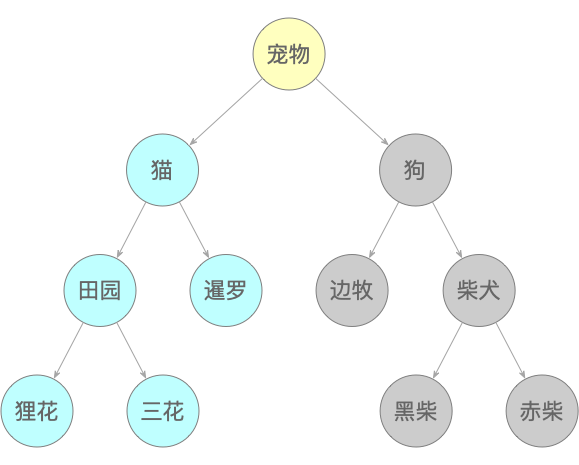

## 第2章 Java关键特性

Java诞生以来，二十多年长盛不衰，一直在TIOBE编程语言排行榜“数一数二”或者“不三不四”的位置徘徊。除了庞大的生态支持，也与它自身的语言特性有关。本章笔者结合自身研发经验，把Java的数据类型、抽象类与接口、泛型、注解、反射与代理这几个关键特性重点讲解一番。至于I/O、集合以及多线程等其他特性会在另外章节中单独讲述。

### 2.1 关于数据类型

“Java到底有几种数据类型”？当笔者每次对求职者和一些有开发经验的工程师提出这个问题时，得到的答案都不太一样。笔者极为粗略地统计了一下，在被问到的10个人里面，总会有那么1～2人搞不清楚有几种，大概有3～5人说有八种，还有说十几种的（但却不知道是哪十几种），也有说三种的。因此，作为一门编程语言最基础的特性，笔者认为这个问题有必要澄清一下。

#### 2.1.1 Java到底有几种数据类型

除了那些确实搞不清楚的摸鱼工，从不同的视角来看，说三种的、说八种的和说十几种的人其实都算对。这是因为下面几个原因：

1. Oracle官方给的Java文档，其“基本”数据类型确实就只有三大类，分别是数字型、字符型和布尔型，所以说三种的也大致正确。
2. Java的三大数据类型里，确实包含了八种基本数据类型，所以说八种的也算对，如表2-1所示。

> 表2-1 Java的八种基本数据类型

| 类型 | 位数 | 范围 | 类型信息 |
|:---:|:---:|:---:|:---:|
| byte | 8-bit | -128 ～ 127 | byte.class == Byte.TYPE |
| short | 16-bit | -32768 ～ 32767 | short.class == Short.TYPE |
| int | 32-bit | -2<sup>31</sup> ～ 2<sup>31</sup> - 1 | int.class == Integer.TYPE |
| long | 64-bit | -2<sup>63</sup> ～ 2<sup>63</sup> - 1 | long.class == Long.TYPE |
| float | 32-bit | 1.4E-45 ～ 3.40E+38 | float.class == Float.TYPE |
| double | 64-bit | 4.9E-324 ～ 1.8E+308 | double.class == Double.TYPE |
| char | 16-bit | 0 ～ 65535 | boolean.class == Boolean.TYPE |
| boolean | - | true / false | char.class == Character.TYPE |

3. 如果算上八种基本数据类型、八种包装类型，String类型，那么Java就有十七种数据类型里，所以说十几种的也算对。

但笔者认为，Java的数据类型应该有五大类二十二种，如图2-1所示。

> 图2-1 Java的数据类型


1. 基本数据类型，也就是Java定义的基本数据类型，有byte、short、int、long、float、double、char、boolean这八种；
2. 包装数据类型：由基本类型通过对象化的“包装”而得。对象化的数据间的比较，虽然有的仍然可以用“==”，但建议还是用equals()方法；
3. 字符串类型，这是一种非常特殊的类型，在Java中非常特殊；
4. 特殊类型：
  - Void，当方法没有返回值或者指定无值的泛型时就会用到Void，例如Future<Void>和Map<String, Void>，也可以用void.class == Void.TYPE验证；
  - null，它是任何引用类型的默认值，表示一个空地址。它的出现表示数据有缺失，故而其地址为空；
5. 引用类型：
  - class，包括所有的类和抽象类。枚举java.lang.Enum<E>也是一个抽象类，它的父类是java.lang.Object；
  - Java的接口虽然也是继承自Object，不过奇怪的是，在官方文档的继承结构中却并未体现出来，接口包括普通接口和注解接口这两类；
  - 最后，数组是一种引用类型，而且它的直接父类也是Object。

#### 2.1.2 屏蔽精度丢失问题

除了整数和字符串，Java还有两种用得比较多的数据类型，分别是长整型和浮点型，但这两种类型用不好会引起很多麻烦。先看看下面这行非常普通的代码。

```java
System.out.println(0.09 + 0.01);
```

之所以把这行简单的代码放在这里，是因为它的运行结果并不像大多数人期望的那样是0.1，而是`0.09999999999999999`。这是在MacBook Pro和Oracle JDK 12.0.2环境中运行的结果。笔者把这段代码换到Windows 10和Oracle JDK 11.10.13，结果还是一样。可能会有人说，是因为在计算机中0.09的二进制是`0.000101110000101000111101011100...`，0.01的二进制是`.000000101000111101...`，这两个二进制数的小数部分位数非常多，所以当它们相加之后由于运算的精度问题，丢失了最后几位，就导致结果不符合预期。这看起来确实是一个比较好的“解释”。但是，如果把加法变成减法，结果就正常了，正是预期的0.08。

```java
System.out.println(0.09 - 0.01);
```

完全一样的数0.09和0.01，仅仅从加法变成减法，精度就恢复了，这该怎么解释？显然，把问题完全归于二进制位数的说法显然站不住脚。但整数的小数转二进制的时候小数位太多也确实会影响结果。类似0.09和0.01的情况还有下面这几个：

```java
System.out.println(10.2 - 10.1);
System.out.println(19.98 + 20);
System.out.println(0.58 * 100);
```

上面的几组数字稍稍调整下，例如19.98换成1.98，100换成10，结果也是正常的——什么时候做加减法要看计算机的心情了？这就出现了一个看起来好像是互相矛盾的事实：

1. 有些情况下精度丢失和二进制小数位过多无关，仅仅只是操作符的不同；
2. 有些情况下小数位过多计算机会做截断或四舍五入操作，造成精度丢失。

这个问题过于先进，笔者不便解决，打算留给计算机科学家们。

不过这也从侧面说明了一个重要的事实：浮点数float或者double不适合做需要保证精度的运算。在可以查阅的诸多资料中，都是以BigDecimal作为解决方案的，但BigDecimal依然涉及到小数点和精度问题，可以说这个方案并不好。当开发的应用需要处理诸如交易、财会、税务、对账等对数字极其敏感的应用时，这种让人提心吊胆的精度问题是决不允许出现的。

那么除了BigDecimal之外，还有别的方案可以解决吗？有的！在笔者曾经工作的项目中有一个规定：当需要处理涉及到资金的数字计算时，必须用整数来代替小数。

以人民币举例，我国的人民币中目前通用的货币计量体系就是“分”、“角”、“元”。如果1分钱用整数“1”来表示的话，那么显然，1毛钱就是10分，1元就是100分——这正是某些第三方支付接口的处理方式。说到这里，想必聪明的读者应该知道如何处理金额的精度问题了吧。如果是跨境电商，那么汇率及其他国家的货币的处理也可以参照这种方式处理。

如果二进制精度会影响计算结果，那么整数的精度也会对结果有影响吗？答案是，同样会。但这种影响不是计算的影响，而是跨语言传输的影响。有些互联网应用会采用分布式ID生成算法，比如在电商、团购等业务中，随着数据量的猛增，把数据库表拆分后通过自增ID无法满足需求。此时就需要有一个能够生成在整个系统的数据库全局唯一ID的方法。这其中，非常著名的就有“雪花算法”（snowflake）。这种算法会产生一个20位长整型的数值，当把这个数值返回给前端页面的时候就会出现精度丢失现象。例如：由服务端算法生成的ID是长整型数值`1242735526042206228`，但前端得到的结果却是`1242735526042206200`，最后两位数明显被“吞”掉了，并且还很“贴心”地给补了“0”，如图2-2所示。

> 图2-2 长整型产生的精度丢失


这是因为Java长整型Long的返回值长度，超过了Javascript所允许的最大整数长度，造成“截断”现象。这种精度丢失，是在不同的架构层次，不同的编程语言之间产生的。如果前后端使用的是同一种语言就可以避免。但目前事实上的标准就是前端由Javascript主宰。所以在将数据传给前端时，只需要将这种长整型转换为字符串就可以解决精度丢失现象。

当然，也可以更换一种分布式ID生成算法，避免超长的长整型。

### 2.2 抽象类与接口

Java一直有一个让很多都人犯迷糊的存在：抽象类和接口到底有什么区别？父类实现接口而子类调用接口的方法时，会不会有什么问题？当接口和类都定义相同方法的时候，子类实习了接口，那运行时会调用父类的方法还是接口的方法？实现多个接口中的相同方法时，起作用的又是哪个方法呢？

#### 2.2.1 风格模板与行为约束

虽然语法上都写的明明白白，但是，什么时候该用抽象类，什么时候又该用接口，相信很多人看完表2-2之后依然是一头雾水。很多技术博客、书籍资料也写过它们的区别，不过大多数都是从语言本身的特性来解释——好像什么都说了，又好像什么都没说。

> 表2-2 抽象类和接口在Java语法上的差别

| 类型 | 位数 | 范围 |
|:---:|:---:|:---:|
| 继承 | 只能单一继承 | 可有多个实现 |
| 属性 | 和类一样有私有属性 | 可以有属性但必须是公共的 |
| 默认方法 | 无 | 不用实现默认方法 |
| 抽象方法 | 必须在子类中实现抽象方法 | 无 |
| 构造器 | 可以有 | 无 |
| 可见性 | 可以有protected | 隐式public |

笔者认为，之所以会出现这种状况，不是技术细节没讲清楚，恰恰相反，是细节讲的太多，反倒忽略了大的宏观应用场景上的差别。先看两张图，图2-3和图2-4。

> 图2-3 公共自来水管道


> 图2-4 新房装修布线


图2-3是公共自来水管道的施工图，而图2-4是新房装修的布线图。这两者有什么联系？笔者想说的不是它们都在施工，而是它们的作用，也就是应用场景。

作为公共管道，它的职责，也是唯一的职责（或者行为），就是“供水”。而家中的进出水管虽然也包括供水和下水，但是它还需要兼顾诸如美观、安全不漏水、排泄、（干湿）分区等诸多职责，最后达到如图2-5那样的效果。

> 图2-5 一种卫生间装修风格


虽然卫生间也有“供水”这样的行为，但“供水”已经不算不上主要职责，而“洗漱”、“排泄”、“干湿隔离”、“舒适”和“家庭附属功能区域”等则更被看重。按照种划分方式，卫生间可以用这些“模板”，演变出来无数个装修“风格”。因此，笔者认为，这也正是抽象类和接口的主要不同：

1. 抽象类作为“风格模板”，可以让子类随（风格）需要而变；
2. 接口作为“行为契约”，目的就是要强制实现它的对象遵守约定。

所以，显而易见，公共的供水管道是不需要什么“风格”或者“模板”的，它只管也只能按“供水”这种每家每户都需要的“契约”来行事；而具体到各家各户，在已经遵守了“契约”的前提下，就可以参照“模板”打造属于自己的独特“风格”了——这就是抽象类和接口的根本区别。

按照上面的理解，可以来看看Java是怎么处理这种职责划分的，如图2-6所示。

> 图2-6 Java部分集合类的继承结构图


图2-6是Java部分集合类的继承结构图。图中既有常见的具体类，也有抽象类和接口。而且还有不少的抽象类就是继承自接口。拿AbstractList和List举例，抽象类AbstractList的部分定义如下列代码片段所示。

```java
public abstract class AbstractList<E> extends AbstractCollection<E> implements List<E> {
    ......
    public abstract E get(int index);
    ......
}
```

而接口List的部分定义是：

```java
public interface List<E> extends Collection<E> {
    ......
    E get(int index);
    ......
}
```

抽象类和接口中都定义了E get(int index)这个方法（而且这个还是抽象类唯一的抽象方法），之所以如此，正是因为前面说过的职责不同：一个是“模板”，一个是“契约”。也就是说，List接口中的E get(int index)是一种获取列表元素的行为，所有的列表集合都要遵守这种约束。而不同类型的集合又需要有不同风格的方法，例如ArrayList和LinkedList，所有的风格都要参照同一种模板实现。由于模板不是具体的，所以它只能是抽象的。

当然，抽象类本身也可以没有任何抽象方法，就像样板间也可以没有样板，拿来直接出售一样。像AbstractList这种“抽象类 + 接口”的组合运用，Java源码中到处都是。只要明白二者之间不同的职责，就能领悟到那些前辈高人们这么做的精妙之处。

看到这里，有人可能会继续问，为什么ArrayList已经继承了AbstractList，还要再实现List接口呢？这不是多此一举吗？还真不是！

#### 2.2.2 显式实现与隐式实现

要回答上面那个“多此一举”的问题，就得先看看代码清单2-1。完整源代码请参看本书资源说明部分。

> 代码清单2-1 InterfaceType.java

```java
public class InterfaceType {
    ......

    public static class Class1 extends AbstractList implements List {
        @Override
        public void get() {
            System.out.println("Class1.get()");
        }
    }

    public static class Class2 extends AbstractList {
        @Override
        public void get() {
            System.out.println("Class2.get()");
        }
    }

    ......

    public static void main(String[] args) {
        // 都可以调用成功
        Class1 class1 = new Class1();
        class1.get();
        Class2 class2 = new Class2();
        class2.get();

        // Class1调用成功
        List list1 = invoke(new Class1());
        list1.get();
        // Class2抛异常
        List list2 = invoke(new Class2());
        list2.get();
    }
}
```

代码模拟了Java集合继承结构中的List、AbstractList及其实现类。Class1继承了AbstractList之后又显式实现了List接口，而Class2仅仅只是继承了AbstractList而已。当通过反射方式调用Class1和Class2的get()方法时，Class1可以正常执行而却Class2抛异常了——这就是为什么需要用implements以显式方式实现List接口的原因——如果想要获取子类的代理对象实例，那这个子类就必须显式地实现接口。

说直白点就是，没有显式地以implements实现接口的类，用接口做反射的时候要小心了。

#### 2.2.3 多重继承

刚才的Class1类既继承自AbstractList抽象类，又实现了List接口，那么它到底实现的是AbstractList的get()方法，还是List的get()方法呢？这就牵扯到Java中的多重继承问题。

这里的多重继承不是指的像等语言C++那样可以同时继承多个类，而是指的同时实现多个接口或既继承父类又实现接口的问题。比如有下面这几个条件：

1. 接口A和接口B拥有相同的方法；
2. 接口B继承接口A；
3. C是独立接口，有和A、B同样的方法；
4. 类D有和A、B、C相同的方法。

用代码来说明的话，接口A、B、C和类D就如下列代码清单所展示的那样。

> 代码清单2-2 A.java

```java
public interface A {
    default void hello() {
        System.out.println("Hello from A");
    }
}
```

> 代码清单2-3 B.java

```java
public interface B extends A {
    default void hello() {
        System.out.println("Hello from B");
    }
}
```

> 代码清单2-4 C.java

```java
public interface C {
    default void hello() {
        System.out.println("Hello from C");
    }
}
```

> 代码清单2-5 D.java

```java
public class D {
    public void hello() {
        System.out.println("Hello from D");
    }
}
```

那么问题来了：

1. 类E同时实现A、B，会调用A、B哪个接口的方法呢？
2. 类F继承D，又同时实现A、B，会调用A、B、D哪个的方法呢？
3. 当G同时实现A、B、C时，会调用A、B、C哪个接口的方法呢？
4. 当H同时实现A、B、C且继承自D时，会调用A、B、C、D哪个的方法呢？

笔者在此只解答第一个，后面三个留待读者验证。

第一个问题用代码实现，如代码清单2-6所示。

> 代码清单2-6 E.java

```java
public class E implements A, B {
    public static void main(String[] args) {
        new E().hello();
    }
}
```

可以看到，运行结果是：Hello from B。其实这就是Java的类继承原则。第一个问题遵循子类优先原则：当接口之间有继承关系时，子接口的优先级最高。加上后三个问题的答案，这就是Java多重继承的全部了。

### 2.3 泛型与K、T、V

泛型不仅是Java的特性之一，也是程序设计语言的一种风格或范式。它允许工程师在编写代码时使用一些在程序运行后才能确定的对象类型，并在实例化时将类型作为参数传递给类或方法。泛型虽然语法简单，仅仅是活跃在“<>”方寸之间的东西，但深究下去，内容着实不少，而且想要用好也不容易。

#### 2.3.1 泛型是什么

假设李星云写了下面的代码：

```java
List list = new ArrayList();
List.add(X);
```

可能除了他之外，别人根本就看不出list中保存的X是哪种数据类型。而当您接手这种代码时，既无人交接，又没有可用的文档，那就只能在所有可能的Java数据类型中一个个地去试错了。也就是说，最坏的情况下要做13次判断才能知道list里面保存的是什么。如果整个项目都是这样的代码，恐怕会把接手的人逼疯。

这种情况，也被Java的创造者们注意到了，毕竟这是他们自己遗留下来的“Bad Smell”。于是，在JDK 1.5中新增了一种称为“泛型”的特性，也就是说不仅数据可以作为参数传递给方法，数据类型也可以作为参数传递，目的就是要使代码能够自己“告诉”开发者“我保存的是什么类型”。如代码清单2-7所示的例子。

> 代码清单2-7 User.java

```java
public class User<K> {
    private K name;

    ......

    public static void main(String[] args) {
        List<String> list = new ArrayList<String>();

        User user1 = new User();
        user1.setName("java");
        System.out.println(user1.getName() instanceof String);

        User user2 = new User();
        user2.setName(123456);
        System.out.println(user2.getName() instanceof Integer);

        User user3 = new User();
        user3.setName(123.456);
        System.out.println(user3.getName() instanceof Double);

        User user4 = new User();
        System.out.println(user4.getName() instanceof Double);
    }
}
```

在main()方法中，由于每个setName()都在getName()之前执行，起了“先入为主”的作用，所以当判断设置的类型是否分别为字符串、整数和浮点时，user1、user2和user3的结果就自然会是true。而user4的name属性字段事先没有设置任何值，此时应为null，所以结果自然就是false。也就是说，通过泛型可以做到：

1. 完全不必担心事先不知道存储的是什么类型，因为只要看看“<>”里面包含的是什么就行了。例如List<String> list，一看就知道这个list保存的一定都是字符串，而且也只能是字符串，否则运行时会抛异常；

2. 减少类型转换的开销和次数，提升效率。例如，使用List和List<User>的差别如图2-7所示。

> 图2-7 泛型可提升程序效率


3. 可以在运行时再来确定参数的类型，就像上面的代码所展示的那样，可能事先并不知道User中的name属性需要保存什么类型的数据，所以留个占位符K，待运行时确定。
说了这么多，“泛型”到底长什么样呢？如图2-8所示。

> 图2-8 泛型的形式


或者如图2-9所示这样：

> 图2-9 泛型的形式


本质上，“K”、“T”、“V”，再加上“E”和“?”这五个符号没什么区别，只不过是编码时一种约定俗成的东西。比如T ，可以换成A-Z之间任何一个字母。通常情况下，它们“K”、“T”、“V”、“E”和“?”各自代表的意思是这样的：

1. K/V（key/value）分别代表键值对中的键和值；
2. T（type）表示具体的类型；
3. E（element）代表Element；
4. ?表示不确定的类型。

如果李星云给List加上泛型，那么您一看就知道他在list列表里存放的是哪种数据类型了，可以放心大胆地存取数据而绝不会报错——这个承诺由Java保证。

#### 2.3.2 返回标记

在调用JDK中的类或对象时，有的方法前面带有<T>、<K, V>之类的标记，而有的又不带，这是为什么呢？这可以用代码清单2-8来解释。完整代码在cn.javabook.chapter02.generics包。

> 代码清单2-8 GenericsClass.java

```java
public class GenericsClass<T extends Entity> {
    public void notSign(T t) {
        System.out.println("不带<T>标记  " + t.toString());
    }

    public <T> void hasSign(T e) {
        System.out.println("带<T>标记  " + e.toString());
    }

    public static void main(String[] args) {
        ......
        // 不能编译通过
        clazz.notSign(userDao);
        // 可以编译通过
        clazz.hasSign(userDao);
    }
}
```

不带返回<T>标记的时候代码无法编译通过，运行会抛异常。而有<T>标记的时候则可正常运行。这是因为在GenericsClass<T extends Entity>中已经限定了泛型T为Entity及其子类，所以不是Entity子类的UserDao肯定无法通过编译。而在hasSign()方法的返回值前面加上<T>标记之后，就等于告诉编译器：hasSign(T)方法中的参数T是重新指定的一个类型，跟GenericsClass<T extends Entity>中的Entity及其子类没有任何关系。或者说hasSign方法重新定义的泛型T，隐藏或者代替了GenericsClass<T>中的T，不再只接受Entity及其子类的限制。

所以，返回值前面的<T>的作用就是“重新定义泛型”，故而方法参数的类型可以不受对象泛型类型的限制。在Java的API中有大量这种带前缀的用法，例如在下面的源码文件中就有：

1. ArrayList.java：public <T> T[] toArray(T[] a)
2. Optional.java：public static <T> Optional<T> of(T value)
3. Collectors.java：public static <T> Collector<T, ?, List<T>> toList()

#### 2.3.3 “记忆”擦除

所谓“记忆”擦除如代码清单2-9所示。

> 代码清单2-9 GenericsErase.java

```java
class Product {}
class Shop<T> {}
class Particle<K, V> {}

public class GenericsErase {
    public static void main(String[] args) {
        Class<?> c1 = new ArrayList<String>().getClass();
        Class<?> c2 = new ArrayList<Integer>().getClass();
        System.out.println(c1 == c2);
        List<User> list = new ArrayList<>();
        Map<User, Product> map = new HashMap<>();
        Shop<User> shop = new Shop<>();
        Particle<Long, Double> particle = new Particle<>();
        System.out.println(Arrays.toString(list.getClass().getTypeParameters()));
        System.out.println(Arrays.toString(map.getClass().getTypeParameters()));
        System.out.println(Arrays.toString(shop.getClass().getTypeParameters()));
        System.out.println(Arrays.toString(particle.getClass().getTypeParameters()));
    }
}
```

c1和c2分别是字符串列表和整数列表，应该是不同的实例，但它们相比较的结果却是true。而且，list、map、shop和particle经过反射后，得到的类型参数应该就是它们声明时的那些，但运行结果却是一组毫无意义的占位符：

```java
[E]
[K, V]
[T]
[K, V]
```

这有点像一个植物人突然之间苏醒过来，但是却没有了记忆。这种情况被JDK称之为“泛型擦除”，变量声明时的信息经过反射后就完全丢失。

#### 2.3.4 神奇的“界符”

泛型除了“K”、“T”、“V”、“E”等字母符号，还有一个神奇的符号“？”。虽然通过泛型已经达到我们想要的效果了，但是，应用场景的需求总是在不断变化和增加的。
有一家寄养和出售猫狗的宠物店，如图2-10所示。

> 图2-10 宠物店的阿猫阿狗们


图2-10如代码清单2-10所示。完整代码在cn.javabook.chapter02.generics包。

> 代码清单2-10 PetStore.java

```java
class Pet {};

class Cat extends Pet {};
class TianYuanCat extends Cat {};
class LihuaCat extends TianYuanCat {};
class SanhuaCat extends TianYuanCat {};
class XianluoCat extends Cat {};

class Dog extends Pet {};
class BianmuDog extends Dog {};
class ChaiquanDog extends Dog {};

public class PetStore<T> {
    private T item;

    public PetStore(T item) {
        this.item = item;
    }

    ......
}
```

因为宠物店既可以养猫，也可以养狗，所以PetStore类就有了一个泛型参数T。现在，由于宠物店经营不善，被迫缩小经营范围，现在只寄养猫，狗都送人了。所以宠物店不再接收任何犬科的宠物，只接收猫科的宠物，也就是图2-11所示。

> 图2-11 宠物店只寄养猫科宠物



那么这种情况该如何用代码表示呢？这就是上界通配符<? extends T>存在的意义了。
所谓上界通配符（Upper Bounds Wildcards），它表示一个只能允许T及T的子类存在的地方。在宠物店的应用中就写成<? extends Cat>，表示只能寄养猫科宠物。所以代码片段如下：

```java
public static void main(String[] args) {
    PetStore<? extends Cat> petStore = new PetStore<>(new TianYuanCat());
    Object object = petStore.getItem();
    Pet pet = petStore.getItem();
    Cat cat = petStore.getItem();
    TianYuanCat tianYuanCat = (TianYuanCat) petStore.getItem();
    List<? extends Cat> list = new ArrayList<>();
    object = list.get(0);
    pet = list.get(0);
    cat = list.get(0);
    tianYuanCat = (TianYuanCat) list.get(0);
}
```

通过上界通配符<? extends Cat>，编译器只知道其中的对象类型是Cat及其子类，所以：

1. 当往里放新的元素时，编译器并不知道确切的类型，这种操作就被禁止了，换成List列表也一样；
2. 当往外拿已有元素时，可以肯定拿的都是Cat或者它的子类，所以就可以由Cat及其父类安全地接收，换成List列表也一样；
3. 上界通配符<? extends Cat>的缺陷在于：不能保存任何元素，且取出来的元素只能放在T及T的父类里。

现在，宠物店老板因为个人喜好，决定弃养田园猫，而走纯种暹罗猫的路线，如图2-12。

> 图2-12 宠物店只养暹罗这一个品种的猫


这种只顾及某个类（纯种暹罗猫）及其父类的情况和之前的刚好相反，所以就有了下界通配符<? super T>。所谓下界通配符（Lower Bounds Wildcards），它表示一个只能允许T及T的父类存在的地方。在宠物店的应用中就写成<? super XianluoCat>。完整代码在cn.javabook.chapter02.generics包。

通过下界通配符<? super XianluoCat>，编译器只知道其中的对象类型是XianluoCat及其父类，所以：

1. 当往里放新的元素时，编译器只知道是XianluoCat及其父类，所以根据类型向上兼容的特性，可以添加的元素是XianluoCat及其子类，换成List列表也一样；
2. 当往外拿已有元素时，编译器不确定拿的是XianluoCat或其父类中的哪一个，所以返回类型只能是Object，但可通过强制转型成需要的子类，换成List列表也一样；
3. 下界通配符<? super XianluoCat>的缺陷在于：不能方便地获取元素，且只能存放T及T的子类。

综合上、下界通配符的特性，在开发中就产生了一个“PECS”原则，也就是“Producer Extends，Consumer Super”：

1. 生产者producer一般用<? extends T>，因为外部应用只能读不能写，适合查询量大时使用；
2. 消费者consumer一般用<? super T>，因为外部应用只能写不能读，适合添加量大时使用。

这里生产者和消费者的概念并不完全等同于MQ中的生产者和消费者的概念，而是从“容器”和“外部应用”两者的关系来说的，如图2-13所示。

> 图2-13 “PECS”原则


泛型讲到这里，如果能够全部明白，就可以畅快地去“K、T、V”嗨一把了。而泛型其他的内容，比如泛型参数一致性、多重限定、基类劫持接口、自限定类型、循环泛型等乱七八糟的可以统统不必理会，因为在很多工程师有限的职业生涯中几乎都碰不到。

#### 2.3.5 出参泛型

有一类泛型在平常的应用开发中所见不多，但在与大数据相关的应用开发中却极为常见，这就是出参泛型。相对应的，前文中所说的泛型均为入参泛型。这种泛型的出现也和大数据息息相关，因为无论是Hadoop、Spark还是Flink大数据中间件，都会大量地用到函数式编程，而函数式编程的根基之一就是Lambda表达式。例如，对于映射型的预定义函数接口Function<T, R>，其对应的描述符是“(T) -> R”。它指明需要通过Lambda表达式将入参泛型T转换为出参泛型R。笔者并不想在此展开对函数式编程的讲述，而是希望将泛型的使用场景描述完整。在后面的章节中，会有函数式编程及其相关知识的详细阐述。

例如，在Flink与Kafka的连接器源码中，就有如下代码片段：

```java
public class KafkaSource<OUT> implements ResultTypeQueryable<OUT>, ...... {
    ......
    public static <OUT> KafkaSourceBuilder<OUT> builder() {
        return new KafkaSourceBuilder();
    }
    ......
}
```

方法builder()的返回值中规定了类定义时所需要的出参泛型。因此，在调用这个方法时，需要这样来用：

```java
KAFKA_SOURCE = KafkaSource.<KafkaMessagePOJO>builder()
                  .setBootstrapServers(brokers)
                  ......
                  .setDeserializer(KafkaRecordDeserializationSchema.of(......))
                  .build();
}
```

方法builder()前必须加上<KafkaMessagePOJO>出参泛型，否则会编译报错。这种方式读者目前不必深究，知道有这么一种泛型使用场景即可，因为在大数据开发时，会大量出现对这种出参泛型的应用，只需按照此套用就行了。

### 2.4 注解

和泛型一样，注解也是JDK 1.5新增加的特性，它就是Java语言编译器层面的“注释”，用来向JVM（Java虚拟机）解释说明类、对象、方法、属性、接口、抽象类等元素的信息。它是对数据的描述，是“描述数据的数据”。

#### 2.4.1 让代码更优雅

很多工程师不太爱写注释，结果任务一多，时间一长，需求一改，就完全不知道当初都干了些什么。好在多数高级编程语言都有注释功能，不至于时间长了忘掉。但注释只是给人看的，机器并不理会这些。

反过来，如果编程语言因为升级更新，导致某些功能特性无法使用，那有办法提醒那些不爱看文档的工程师知道吗？既然工程师可以给代码写注释，那也可以通过某种机制告诉编译器哪些地方要注意——这就是注解。比如，像刚才说的问题：如果某个Java类被废弃了，怎么让码农们知道呢？——使用@Deprecated注解的就可以办到，如图2-14所示。

> 图2-14 废弃的类


如果类的方法被废弃也是一样。Java中提供了一些预定义的注解，例如@Override、@SuppressWarnings、@FunctionalInterface等，而Java的Spring框架又在此之上，提供了@Autowired、@Service、@RestController等若干注解。

因为有了这些注解，码农的开发效率才得以大大提高。例如，如果没有使用注解，那么Spring将无法实现依赖注入功能，即使勉强做到，代码也会极为臃肿。如代码清单2-11所示。

> 代码清单2-11 UserController.java

```java
public class UserController {
    private UserService userService;

    public void login(User user) {
        userService = new UserServiceImpl();
        // TODO
    }
}
```

使用了注解之后如代码清单2-12所示。

> 代码清单2-12 UserController.java

```java
public class UserController {
    @Resource
    private UserService userService;

    public void login(User user) {
        // 直接调用UserServiceImpl实现类的各种对象和方法
        // TODO
    }
}
```

可以看到代码明显优雅了许多，代码量也得到了控制，也仅仅就是多了一行注解而已。

Java已经提供了五种标准的注解，也称元注解，就是可以用来创造其他注解的注解。比如，常见的密码有效性验证就可以用注解实现，如下面的代码清单所示。完整代码在cn.javabook.chapter02.annotate.base包。

> 代码清单2-13 UserCase.java

```java
@Target(ElementType.METHOD)
@Retention(RetentionPolicy.RUNTIME)
public @interface UseCase {
   int id() default -1;
   String description() default "";
}
```

> 代码清单2-14 PasswordUtils.java

```java
public class PasswordUtils {
   @UseCase(id = 1, description = "密码必须至少包含一位数字")
   public static boolean validate(String password) {
      return (password.matches("\\w*\\d\\w*"));
   }

   public static void main(String[] args) {
      System.out.println(PasswordUtils.validate("werrd"));
   }
}
```

这是注解最简单的运用，但它真正的用武之地就是类似Spring那种开源框架那样，搭建一个属于自己或组织的开发框架。接下来，笔者就来自己搭建一个。

#### 2.4.2 搭建自己的ORM

有一定开发经验的Java工程师都知道，在J2EE应用开发中有一类很重要的框架，就是ORM（Object Relational Mapping，对象关系映射）。它把Java中的类和数据库中的表关联起来，可以像操作对象那样操作数据表，十分方便，给工程师们节约了大量的工作时间用来摸鱼。它一点都不复杂，最核心的就是怎么实现对象和表之间的转换。

此处仅展示关键代码，其余相关代码请见cn.javabook.chapter02.annotate.orm包。

首先，建立一个能够将类映射成“数据库表”的工具，如代码清单2-15所示。

> 代码清单2-15 DBTable.java

```java
@Target(ElementType.TYPE)
@Retention(RetentionPolicy.RUNTIME)
public @interface DBTable {
   String name() default "";
}
```

然后，定义需要的数据库数据类型Type、字段类型ColumnType和字段信息ExtraInfo，同时明确字段约束Constraints，并把他们拼起来，成为完整的字段描述TableColumn。最后，创建实体类，在User类上应用刚才写好的这些注解，如代码清单2-16所示。

> 代码清单2-16 User.java

```java
@DBTable(name = "User")
public class User {
   @TableColumn(
         columntype = @ColumnType(Type.INTEGER),
         extrainfo = @ExtraInfo(name = "id", length = 4),
         constraints = @Constraints(primaryKey = true))
   private String id;
   ......
}
```

大功告成，现在可以看看ORM是怎么工作的，如代码清单2-17所示。

> 代码清单2-17 TableCreator.java

```java
public class TableCreator {
   ......
   private static void createTable(List<String> list) {
      for (String className : list) {
         Class<?> clazz;
         try {
            clazz = Class.forName(className);
            DBTable dbTable = clazz.getAnnotation(DBTable.class);
            if (dbTable == null) {
               continue;
            }
            String tableName = clazz.getSimpleName().toUpperCase();
            StringBuilder sql = new StringBuilder("CREATE TABLE " + tableName + "(");
            for (Field field : clazz.getDeclaredFields()) {
               Annotation[] anns = field.getDeclaredAnnotations();
               if (anns.length < 1) {
                  continue;
               }
               String columnInfo = "";
               if (anns[0] instanceof TableColumn) {
                  TableColumn column = (TableColumn) anns[0];
                  String type = getColumnType(column.columntype());
                  columnInfo = getExtraInfo(column.extrainfo());
                  columnInfo = columnInfo.replace("(", type + "(");
                  columnInfo += getConstraints(column.constraints());
               }
               sql.append("\n " + columnInfo + ",");
            }
            String tableCreate = sql.substring(0, sql.length() - 1) + "\n);";
            System.out.println(tableCreate);
         } catch (ClassNotFoundException e) {
            e.printStackTrace();
         }
      }
   }

   public static void main(String[] args) {
      Class<?> clazz = User.class;
      List<String> list = new ArrayList<>();
      list.add(clazz.getName());
      createTable(list);
   }
}
```

当然，运营于实际生产环境中的ORM框架的代码、功能和启动流程，可要比笔者这个小玩意多多了，但它的技术实现原理也不会比这更复杂了。

笔者在工作中曾经开发过一个内部的Elasticsearch连接器，它可以实现动态创建、修改、删除Elasticsearch的索引和文档，非常方便。这个小工具就是用注解实现的，完整代码在cn.javabook.chapter02.annotate.es包。

### 2.5 反射与代理

Java开发中大名鼎鼎的Spring框架，它最为核心的依赖注入功能就是通过反射和代理来实现的。不仅仅是Spring，在Hadoop、RockMQ等诸多有名的开源框架中也都有反射和代理的影子。所以，熟练掌握Java的反射机制，就能轻松阅读优秀开源框架的源码。

#### 2.5.1 静态代理

Java有一句著名的口号就是“Everything is Object”——Object是整个Java中所有类的父类。除了Object外，还有一个很重要的Class类，它是用来描述每个类的类型信息的，也就是给每个类建立了档案，如构造器、属性、方法、实现接口、继承结构等。就像户口本一样，姓名、性别、年龄、籍贯、家庭住址等全都登记在册。但Class类没有公共的构造方法，它是由ClassLoader加载、JVM自动构造的，无需工程师干预，也干预不了。一个类在JVM中就只有一个Class实例。类的实例化简约过程如图2-15所示。

> 图2-15 类的实例化过程


所以，反射的本质是：JVM得到编译过的.class文件后，加载到JVM中，通过Class解析到对象的各种信息，再根据这些信息创建所需的对象实例或变量的引用，如图2-16所示。

> 图2-16 类的实例化过程


在《侏罗纪公园》，科学家拿到了蚊子吸的恐龙血，然后就通过这些远古的血液样本，又让恐龙复活过来，这两者的过程非常相像。

C++中有RTTI（运行时类型识别）的概念，但Java是没有RTTI的，JSR规范里面也没有，Java只有反射的概念。所以如果有面试官问到Java中的RTTI时，就别往坑里跳了。

在经典的GoF设计模式中，有一种模式叫做代理模式。例如，很多北漂都找中介或者二房东租过房子，还有倒卖iPhone的黄牛党。对于房客和房东、消费者和苹果公司来说，这些中介或者黄牛，就是双的代理人，因为买家或卖家根本不关心谁在和自己交易，只要实现交易即可，而且也免去了一个个对接的麻烦。

这是最常见最普通的一种代理，也称为“静态”代理，也就是说代理各方的身份相对确定而不会变动。如代码清单2-18所示。完整代码在cn.javabook.chapter02.proxy包。

> 代码清单2-18 Renting.java

```java
public class RentingProxy implements Renting {
    ......
    @Override
    public void renthouse() {
        System.out.println("代理方法前置：租房前看房");
        renting.renthouse();
        System.out.println("代理方法后置：满意签合同");
    }
    public static void main(String[] args) {
        Consumer consumer = new Consumer();
        consumer.renthouse();
        Renting proxy = new RentingProxy(consumer);
        proxy.renthouse();
    }
}
```

这样就搞定了。

#### 2.5.2 动态代理

然而，现在国家下了一道政策文件，为了让租房市场更规范，看房前需要中介公司提供资质证明。这下麻烦了，因为之前代码实现的时候，没考虑到这些，把功能写死了。

现在为了改需求，比较直接的想法是，给每个类都写一个封装类，然后引用已有类，在代理对象的方法内调用被代理类的方法。具体来说，就是如代码清单2-19所示。

> 代码清单2-19 Proxy.java

```java
public class NewProxy {
    private RentingProxy target;

    public NewProxy(RentingProxy target) {
        this.target = target;
    }

    public void zizhi() {
        System.out.println("展示资质");
        target.renthouse();
    }

    public static void main(String[] args) {
        Consumer consumer = new Consumer();
        RentingProxy rentingProxy = new RentingProxy(consumer);
        NewProxy proxy = new NewProxy(rentingProxy);
        proxy.zizhi();
    }
}
```

这种方式有两个问题：

1. 实现起来比较别扭，不够优雅，而且非常丑陋，包了一层又一层；
2. 即使这么干行得通，当前公司的问题倒是解决了。但是如果市场上有10000家公司，是不是要改10000次代码呢？

显然是行不通的。

这个时候，就需要通过“动态代理”来实现了——这也是反射最有用的地方。更形象地说，动态代理好比一家万能中介公司，不管是租房。还是买票，它都可以实现，只是流程和服务不同而已。而具体的流程和服务，完全可以在有了具体业务对象后确定，而且服务还能动态地增加和减少。

而且这么做也非常“优雅”。具体来说，动态代理的实现思路是：

1. 从Class和ClassLoader着手，通过反射得到被代理类的Class对象；
2. 然后据此创建实例，从而调用该实例的方法，如图2-17所示。

> 图2-17 动态代理


动态代理的实现方式也有两种：

1. 通过JDK实现。这是Java原生支持的动态代理方式，实现起来比较简单；
2. 通过CGLIB实现，这是Spring框架底层使用的动态代理组件，效率更高。

先用Java 8的默认接口改造，然后用JDK的动态代理实现之前的功能，如代码清单2-20所示。完整代码在cn.javabook.chapter02.proxy包。

> 代码清单2-20 DynamicProxy.java

```java
public class DynamicProxy {
    private static Object getProxyObject(final Object target) {
        return Proxy.newProxyInstance(target.getClass().getClassLoader(),
                target.getClass().getInterfaces(), new InvocationHandler() {
                    @Override
                    public Object invoke(Object proxy, Method method, Object[] args) {
                        System.out.println("代理方法前置1：租房前看中介资质");
                        System.out.println("代理方法前置2：租房前看房");
                        if (null != args) {
                            for (Object arg : args) {
                                System.out.println(" - " + arg);
                            }
                        }
                        Object result = method.invoke(target, args);
                        System.out.println("代理方法后置：满意签合同");
                        return result;
                    }
                });
    }

    public static void main(String[] args) {
        Consumer consumer = new Consumer();
        consumer.renthouse();
        Renting renting = (Renting) getProxyObject(consumer);
        renting.renthouse();
    }
}
```

如果改用CGLIB实现，需要额外引入相关的jar包依赖asm-x.y.jar和cglib-x.y.z.jar（x、y、z代表版本号）。这个就作为练习留给读者了。

### 2.6 本章小节

那些回答Java有三种、八种数据或者数十多种数据类型的人，都是对的，因为角度稍有不同。不过，笔者认为Java的数据类型共分为五大类二十二种。除了基本类型及其包装类型，还有字符串类型、特殊类型Void和null，以及引用类型类、接口和数组。其实还有几个小小的不算数据类型的类型隐藏在Java语言中：非数字类型Float.NaN或Double.NaN，以及常量类型Math.PI和Math.E。

除非是科学计算需求，否则一般应用开发中，尤其是涉及到金额的应用中，最好不要用float、double这类浮点数，而且也不建议用BigDecimal类，因为完全可以避开它，用整数类型实现“浮点计算”。还要注意跨语言或平台之间的数据精度问题，避免精度丢失，造成功能异常。

抽象类和接口的不同主要在于职责上而非语义或语法上，一个是软性的“风格模板”，一个是硬性的“行为契约”。使用接口的时候，最好是显式实现，而非隐式实现，不然反射时会抛异常。当类和接口有相同方法，或者类实现多个接口中的相同方法时，可以用一些简单的原则来确定类实现的到底是哪个方法。

泛型通过将类型作为参数进行传递，保证了程序运行的健壮性和规范性，也保证了数据存取的安全性。除了“K”、“T”、“V”、“E”这几个常见的约定俗成的泛型符号，还有一个常用的符号“？”，叫做泛型通配符，意思就是可以匹配那些不知道的元素。为了摆脱泛型对方法的限制，让代码更灵活，在方法返回时可以带上一个标记<T>，表示重新定义泛型。当通过反射获取对象的类型参数时，会发现原有的泛型信息都被JVM“擦除”了。软件开发中关于泛型的实践有一个称为“PECS”的原则。

注解和注释所起的作用比较类似，前者是给编译器“看”的，而后者是给工程师看的。一些优秀的开源框架应用了大量的注解，例如Spring、Hadoop、RocketMQ等。开发中经常用到的@Resource、@Service、@Component等注解，既让代码更优雅，减少了不必要的代码量，也给工程师们节约了大通维护代码的时间。工程师也可以模仿优秀的开源框架，用注解来开发自己的ORM工具，实现类、对象和数据库表、搜索引擎索引之间的映射。

Java反射机制能够动态调用类对象的任意方法和属性。这种动态获取信息和调用对象方法的功能十分强大，以致于Spring框架最核心的依赖注入功能都靠它来完成，可以说，反射和注解这两大技术合力撑起了各大优秀开源框架的底层基座。在反射的基础之上，形成了两种“代理”模式：静态代理和动态代理。静态代理中各种角色所起的作用相对来说固定不变。而在动态代理中，各种对象所执行的功能可能会有所不同，无法在事前知道，只能在运行时通过被代理对象信息确定。

### 2.7 本章练习

1. 除了笔者所认为的22种数据类型，其实还有两个不那么引人注意的“小玩意”，一个是Float.NaN和Double.NaN，另一个是Math.PI和Math.E，可以用打印语句看看它们到底是什么。

2. 请尝试弄清多重继承，也就是2.2.3小节中的后三个问题，并指出它们所依据的原则。

3. 读者可以尝试结合返回标记<T>，来重新定义2.3.4节中PetStore对象的getter和setter方法，看看有了返回标记<T>，getter和setter方法是否可以破除上下界通配符对读取和写入的限制。

4. 读者可以尝试着完善及扩充2.4.2小节中的实践案例，研发自己或公司的ORM工具。

5. 请尝试用CGLIB方式实现租房案例的动态代理功能。
