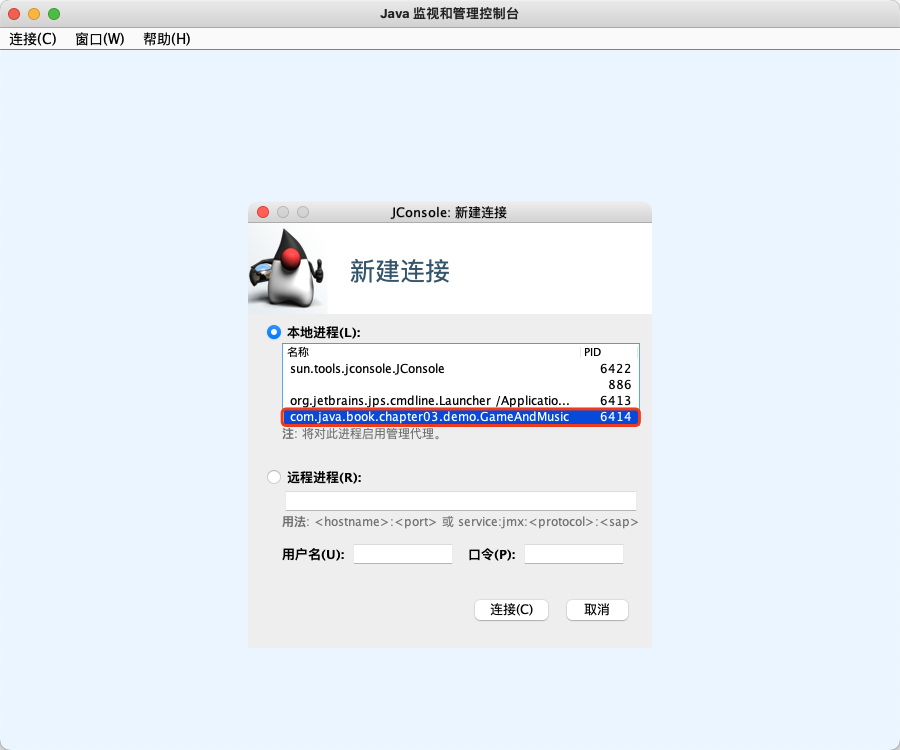
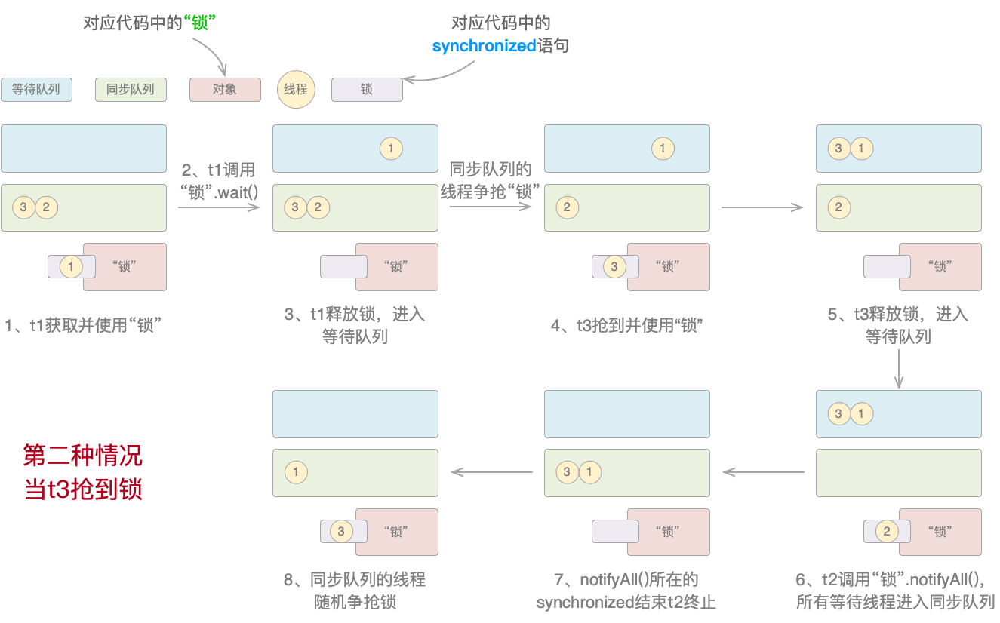

## 第3章 多线程

如果说在Java开发的相关职位面试中哪一类问题能排进TOP3的话，那么毫无疑问多线程必定霸榜。可以负责任地说，多线程的开发能力可以不用，但不能没有，因为它既是衡量Java工程师能力的主要标准之一，又是应用程序性能的托底保障。而且多线程唯一可以确定的就是它的运行结果无法确定，这也正是它最为有趣的地方。
本章结合笔者实际工作经验，讲解了Tread和Runnable的区别、常用Thread API、线程关键字、线程池、CAS原子操作、锁与AQS、并发工具包等内容。多线程的内容虽“多”，但基于“二八原则”，只需要吃透一些关键重难点，掌握一点好的实践经验，基本上就可以解决实际工作中的大部分问题了。

### 3.1 正确认识多线程

知道多线程的工程师不少，但真正了解它的却不多。笔者并非妄自菲薄认为自己懂得比别人多，而是从自身实际开发经验出发，与读者分享一些自身对多线程的认识，也同时发现自身的不足。

#### 3.1.1 混乱的生命周期

关于线程生命周期的问题，很多资料都不统一，比较乱。问题的焦点集中在线程生命周期的状态上。

1. 有说四种的：NEW、RUNNABLE（RUNNING、READY）、BOLCKED、TERMINATED；
2. 有说五种的：NEW、RUNNABLE、RUNNING、BOLCKED、DEAD；
3. 有说六种的：NEW、RUNNABLE（RUNNING、READY）、WAITING、TIMED_WAITING、BOLCKED、TERMINATED。

笔者认为，不管四种、五种还是六种，都只是“纸面”上的猜测。还是那句话：“Talk is cheap， show me the code”。通过代码来看看到底有几种才是最准确的，如代码清单3-1所示。

> 代码清单3-1 StandardThreadState.java

```java
public class StandardThreadState implements Runnable {
    ......

    public static void main(String[] args) {
        StandardThreadState state = new StandardThreadState();
        Thread thread1 = new Thread(state);
        Thread thread2 = new Thread(state);
        System.out.println(thread1.getState());// NEW
        thread1.start();
        System.out.println(thread1.getState());// RUNNABLE
        thread2.start();
        try {
            TimeUnit.MILLISECONDS.sleep(100);
            System.out.println(thread1.getState());// TIMED_WAITING
            System.out.println(thread2.getState());// BLOCKED
            TimeUnit.MILLISECONDS.sleep(2000);
            System.out.println(thread1.getState());// TERMINATED
        } catch (InterruptedException e) {
            throw new RuntimeException(e);
        }
    }
}
```

执行上述代码后，打印结果如下：

```java
NEW
RUNNABLE
TIMED_WAITING
BLOCKED
TERMINATED
```

结果显示有五种。把代码稍加改动，然后再运行试试。如代码清单3-2所示。

> 代码清单3-2 MoreThreadState.java

```java
public class MoreThreadState implements Runnable {
    private synchronized void sync() {
        try {
            TimeUnit.SECONDS.sleep(2);
            wait();
            ......
        }
    }
}
```

再次执行，打印结果如下：

```java
NEW
RUNNABLE
TIMED_WAITING
BLOCKED
WAITING
TIMED_WAITING
```

把两种结果合并一下，那么线程的生命周期准确来说应该是六种：NEW、RUNNABLE、TIMED_WAITING、BLOCKED、WAITING、TERMINATED。而且从实际的角度来看，也没有所谓的RUNNING、READY和DEAD这几种状态。

事实上，线程所有的状态都已在Thread类源码的State枚举中定义过了。但也由此可见：纸上得来终觉浅，根据代码运行结果得到的线程生命周期状态图，如图3-1所示。

> 图3-1 线程生命周期状态图


这个线程生命周期状态图就正确了吗？不一定。后续还会回过头来审视它，现在先继续前进。至于这些状态转换的原因，完整的代码注释已经给出了明确的说明。

#### 3.1.2 Thread与Runnable

为多线程镇守大门的哼哈二将就是Thread类和Runnable接口，很多Java工程师都比较熟悉它们。但对于一部分程序员来说它们还存在两个误区。

1. 误区一：“有两种创建线程的方式，或者继承Thread类并重写run()方法，或者实现Runnable接口”。在JDK的源码中，Thread是实现了Runnable接口的。但严格来说，只有Thread类才能真正创建并通过start()方法启动线程，Runnable接口是没有这个能力的。但指定线程所要执行的功能的run()方法却是有两种：
  - 继承并重写Thread的run()方法;
  - 实现Runnable接口的run()方法，并将它作为Thread或其子类的构造器参数。

不管哪种方式，最终还是要通过Thread的start()方法启动线程。将Thread和Runnable分离则是为了遵循单一职责原则：一个类或模块只负责完成一个职责（或功能），而不要存在多于一个导致变更的原因。

2. 误区二：“Thread类和Runnable接口的run()方法效果是一样的”。此误区的澄清可见如下代码清单。

> 代码清单3-3 SubThread.java

```java
public class SubThread extends Thread {
    private int i = 1;

    @Override
    public void run() {
        while (i <= 10) {
            System.out.println("当前线程: " + Thread.currentThread() + " - " + i++);
        }
    }

    public static void main(String[] args) {
        SubThread subThread1 = new SubThread();
        SubThread subThread2 = new SubThread();
        subThread1.start();
        subThread2.start();
    }
}
```

> 代码清单3-4 ExtractMethod.java

```java
public class ExtractMethodRunnable implements Runnable {
    private int i = 1;

    @Override
    public void run() {
        while (i <= 10) {
            System.out.println("当前线程: " + Thread.currentThread() + " - " + i++);
        }
    }

    public static void main(String[] args) {
        ExtractMethodRunnable extractMethod = new ExtractMethodRunnable();
        Thread thread1 = new Thread(extractMethod);
        Thread thread2 = new Thread(extractMethod);
        thread1.start();
        thread2.start();
    }
}
```

当运行代码清单3-3和代码清单3-4时，会发现明显不同：

1. 代码清单3-3中的两个子线程subThread1和subThread2分别单独从1打印到10，因为Thread类的run()方法是不能共享的，也就是说A线程不能把B线程的run()方法当作自己的执行单元；
2. 而代码清单3-4利用Runnable接口就很容易地实现了run()方法共享，让两个线程共同完成从1到10的打印。

通过这个小实验可以知道，Runnable是真正的多线程，用它封装多线程功能代码，比直接用Thread类更好——以Runnable封装功能，用Thread创建并启动线程。

#### 3.1.3 让它停下来

自Java 1.2之后，多线程的stop()方法就已经被废弃了，理由是不安全。还有另外两个方法一并被废弃：suspend()和resume()。虽已过去了十多年，但至今仍有很多资料在毫无意义地讨论它们。stop()方法会给数据造成不一致性，如代码清单3-5所示。完整代码在cn.javabook.chapter03.demo包。

> 代码清单3-5 StopService.java

```java
public class StopService {
    ......
    public static void main(String[] args) {
        try {
            StopService service = new StopService();
            StopThreadA threadA = new StopThreadA(service);
            threadA.start();
            TimeUnit.MILLISECONDS.sleep(100);
            StopThreadB threadB = new StopThreadB(service);
            threadB.start();
            TimeUnit.MILLISECONDS.sleep(3000);
            threadA.stop();
            System.out.println("stop()执行后username和password的结果为：");
        } catch (InterruptedException e) {
            e.printStackTrace();
        }
    }
}
```

执行StopService的main()方法后，打印结果如下：

```java
stop()执行后username和password的结果为：
username = StopThreadA
password = password
```

很明显，结果出乱子了。因为这里希望看到的结果要么是：

```java
username = StopThreadA
password = 123456
```

要么是：

```java
username = username
password = password
```

如果希望停止线程的执行，那么可以用interrupt()方法或抛出异常的方式来变相实现。使用抛出异常的方式，只需在main()方法做些改变即可，如下代码片段所示：

```java
public static void main(String[] args) {
    ......
    // threadA.stop();
    throw new RuntimeException();
}
```

执行上述代码后，打印结果如下：

```java
Exception in thread "main" java.lang.RuntimeException
	at cn.javabook.chapter03.demo.StopService.main(StopService.java:46)
```

可见虽抛出了异常，但也停止了继续打印。

#### 3.1.4 线程可视化

首先来一段可以“永不停歇”的行为：一边打游戏一边听音乐，如代码清单3-6所示。

> 代码清单3-6 GameAndMusic.java

```java
public class GameAndMusic {
    private static void playGame() {
        for (;;) {
            System.out.println("打游戏");
            try {
                TimeUnit.SECONDS.sleep(1);
            } catch (InterruptedException e) {
                throw new RuntimeException(e);
            }
        }
    }

    private static void listenMusic() {
        for (;;) {
            System.out.println("听音乐");
            try {
                TimeUnit.SECONDS.sleep(1);
            } catch (InterruptedException e) {
                throw new RuntimeException(e);
            }
        }
    }

    public static void main(String[] args) {
        new Thread(GameAndMusic::playGame, "打游戏听音乐").start();
        listenMusic();
    }
}
```

如果能直观地看到线程运行时的各种状态，无疑会对分析多线程有很大的助益。所以当在Windows或MacOS的命令行中输入“jconsole”命令时，就可以看到图3-2所示的内容。

> 图3-2 打开jconsole



可以看到在“本地进程”选项列表中出现了刚才运行的Java程序，选中后单击链接，如图3-3所示。

> 图3-3 程序运行状况概览


单击“线程”选项，就出现了刚才运行的代码清单3-6中GameAndMusic子线程的名称“打游戏听音乐”，可以查看关于它的更多信息。

除了jconsole之外，还有jvisualvm、jcmd这两款Java自带的强大工具和jmc这个独立的工具。不过工具不在多，只要能够用得趁手，就是神器。

### 3.2 常见的Thread API

线程生命周期中各种状态之间的互相转换，是通过一系列的方法来完成的，俗称Thread API。这些方法有的由Object类提供，有的由Thread类实现；有的是实例方法，有的是静态方法。

#### 3.2.1 等待（wait）与通知（notify / notifyAll）

Java从一开始就非常重视多线程并给其提供了良好的支持。这种重视反映在Object类的两个方法之上：wait(int)和notify() / notifyAll()。先看看代码清单3-7的执行结果。

> 代码清单3-7 WaitNotify.java

```java
public class WaitNotify {
    public static void main(String[] args) {
        Thread t1 = new Thread(() -> {
            System.out.println("t1 等待");
            synchronized ("锁") {
                System.out.println("t1 开始");
                try {
                    "锁".wait();// t1进入等待队列并释放锁
                } catch (InterruptedException e) {
                    e.printStackTrace();
                }
                System.out.println("t1 结束");
            }
        });
        Thread t2 = new Thread(() -> {
            System.out.println("t2 等待");
            synchronized ("锁") {
                System.out.println("t2 开始");
                try {
                    "锁".notifyAll();// 通知其他所有线程（t1和t3）进入同步队列
                } catch (Exception e) {
                    e.printStackTrace();
                }
                System.out.println("t2 结束");
            }
        });
        Thread t3 = new Thread(() -> {
            System.out.println("t3 等待");
            synchronized ("锁") {
                System.out.println("t3 开始");
                try {
                    TimeUnit.MILLISECONDS.sleep(100);
                    "锁".wait();// t3进入等待队列并释放锁
                } catch (InterruptedException e) {
                    throw new RuntimeException(e);
                }
                System.out.println("t3 结束");
            }
        });
        t1.start();
        t2.start();
        t3.start();
    }
}
```

反复执行代码清单3-7会发现这么一个规律：

1. 如果t2抢到锁并在t3之前执行，那么就一定会有线程处于等待状态，无法结束，如图3-4所示。

> 图3-4 当t2先抢到锁时


2. 如果t3抢到锁并在t2之前执行，那么所有线程就都可以结束，如图3-5所示。

> 图3-5 当t2先抢到锁时



这就涉及到两个概念：线程的等待队列和同步队列。

1. 线程等待队列：存放处于WAITING或TIMED_WAITING状态的线程，在其中排队等待被唤醒或自动醒来（醒来后才能进入同步队列）；
2. 线程同步队列：存放处于RUNNABLE可运行状态的线程，在其中排队等待执行（同步队列也就是AQS中的CLH队列，后面会讲到）。

在图3-4中，t2先抢到锁，因此在线程任务执行完成后立即调用notifyAll()方法。因为此时t1处于等待队列，而t3还未抢到锁，所以执行完notifyAll()方法后t1和t3共同处于同步队列。当t2终止时，t1和t3争抢锁，不管它们之中哪个抢到锁，t3都会进入等待队列，而t1一定会执行完。

在图3-5中，t3先抢到锁，因此在线程任务执行完成后立即调用wait()方法。故此时t1和t3都处于等待队列。当唯一一个处于同步队列的线程t2调用notifyAll()方法后，t1和t3全部进入同步队列并争抢锁，不管它们之中哪个先抢到，t1和t3都会执行完。

理解了代码清单3-7也就理解了wait()和notify() / notifyAll()的机制。不管再增加多少个线程，本质上都是一样。

顺便说一句wait(int)和wait()的区别：一个可自动醒来，一个要notify() / notifyAll()唤醒。

#### 3.2.2 插队（join）与谦让（yield）

join(int)和yield()都是Thread类的方法，只不过join(int)是实例方法，yield()是静态方法。

join(int)的意思如果用大白话说就是强行插队，如图3-6所示。

> 图3-6 执行join(int)方法的线程可以强行插队


上图显示，t1和t2同时启动，而当t2执行join(int)后，就会强行让其他线程等待自己执行完之后再开始执行。正如代码清单3-8所示。完整代码在cn.javabook.chapter03.threadapi包。

> 代码清单3-8 JoinThread.java

```java
public class JoinThread {
    public static void main(String[] args) {
        Thread t1 = new Thread(() -> {
            System.out.println("thread1");
        });
        Thread t2 = new Thread(() -> {
            ......
        });
t1.start();
        t2.start();
        try {
            t2.join(1000);
        } catch (InterruptedException e) {
            e.printStackTrace();
        }
    }
}
```

执行上述代码后，打印结果如下：

```java
thread2
thread1
flag =
```

为什么flag没有值呢？源码的详细注释中已有说明，但用图来解释就是如图3-7和图3-8所示那样。

> 图3-7 join(int)时间 < sleep()时间


> 图3-8 join(int)时间 > sleep()时间


1. 图3-7显示，当join(int)时间 <  sleep()时间，t2执行join(int)时间后main马上接着执行，不等待sleep()结束，相当于sleep()被截断了；
2. 图3-8显示，当join(int)时间 >  sleep()时间，t2执行时间以join(int)为准，之后main接着执行；
3. 当join(0)时，则main要无限期等待，直到t2执行结束。

在代码清单3-8中有一点务必要清楚：join()方法并不会使所有线程暂停，而是使调用join()方法的线程暂停，具体在这里来说就是main主线程调用了join()方法。因为main主线程被暂停，所以在它里面的t1线程的执行也就一并暂停了，而并不是t2让t1.start()暂停了。所以，上面所说的“其他线程”指的其实是main线程，所以这里的所谓t1其实只是个龙套而已，千万不要被表象蒙蔽了。

至于Thread.yield()，则是一种非强制式的方法，它会告诉线程调度器自愿放弃当前的CPU资源。但也仅仅只是“告诉”，执不执行就无法预知了，而它后续可能依然会参与对到CPU资源的争夺中，调用Thread.yield()方法的线程并不会释放锁。它的作用如代码清单3-9所示。

> 代码清单3-9 YieldThread.java

```java
public class YieldThread {
    public static void main(String[] args) {
        Thread t1 = new Thread(() -> {
            System.out.println("t1 开始执行");
            Thread.yield();
            System.out.println("t1 执行结束");
        });
        Thread t2 = new Thread(() -> {
            System.out.println("t2 开始执行");
            try {
                TimeUnit.MILLISECONDS.sleep(1000);
            } catch (InterruptedException e) {
                throw new RuntimeException(e);
            }
            System.out.println("t2 执行结束");
        });
        t1.start();
        t2.start();
    }
}
```

执行完成后，打印结果可能是下面几种中的任意一种：

```java
t1 开始执行		t1 开始执行			t2 开始执行			t2 开始执行
t2 开始执行		t1 执行结束			t1 开始执行			t2 执行结束
t1 执行结束		t2 开始执行			t1 执行结束			t1 开始执行
t2 执行结束 		t2 执行结束			t2 执行结束			t1 执行结束
```

从结果可以看出，Thread.yield()虽然口头上说“谦让”，但也只是“说说而已”。

#### 3.2.3 休眠（sleep）与打断（interrupt）

自JDK 1.5引入TimeUnit.[X].sleep()之后（[X]表示具体时间单位），Thread.sleep()就不再建议使用了。因为TimeUnit不但更加强大且更优雅。例如想休眠5天4小时3分2秒1毫秒，用Thread.sleep()该怎么办？——难办！但是用TimeUnit.[X].sleep()就很好解决。如下面的代码片段所示。

```java
TimeUnit.DAYS.sleep(5);
TimeUnit.HOURS.sleep(4);
TimeUnit.MINUTES.sleep(3);
TimeUnit.SECONDS.sleep(2);
TimeUnit.MILLISECONDS.sleep(1);
```

TimeUnit比Thread直观清晰得多。现在用interrupt()验证线程生命周期的状态转换。因为代码占用篇幅较多故作简略，完整代码在cn.javabook.chapter03.threadapi.SleepInterrupt。

SleepInterrupt执行后，打印结果如下所示：

```java
Thread-0 - 0
Thread-0 - 1
Exception in thread "Thread-0" ...: sleep interrupted
	...
Caused by: java.lang.InterruptedException: sleep interrupted
	at java.base/java.lang.Thread.sleep(Native Method)
	... 1 more
t1线程状态：TIMED_WAITING
t1打断状态：false
Exception in thread "Thread-1" ...: java.lang.InterruptedException
	...
Caused by: java.lang.InterruptedException
	at java.base/java.lang.Object.wait(Native Method)
	... 1 more
t2线程状态：WAITING
t2打断状态：false
t3线程状态：RUNNABLE
t3打断状态：true
```

可以清楚地看到t1、t2和t3的不同线程状态和打断状态。至于原因的分析，就留给读者吧。

#### 3.2.4 常用方法的比较

现在稍微总结一下前面已介绍过的Thread API，如表3-1所示。

> 表3-1 常见Thread API的比较

| 常见方法 | 作用 | 锁 | 方法类型 | 所属对象 |
|:---:|:---:|:---:|:---:|:---:|
| wait(int) | 等待指定时间或一直等待下去 | 立即释放 | 实例方法 | Object |
| notify() | 随机唤醒某个线程 | 立即释放 | 不立即释放 | Object |
| notifyAll() | 唤醒全部线程 | 立即释放 | 不立即释放 | Object |
| join(int) | 强制某个线程插队执行 | 不释放锁 | 实例方法 | Thread |
| yield() | 使当前线程让出CPU资源，但有可能会立即又抢回 | 不释放锁 | 静态方法 | Thread |
| sleep(int) | 是某个线程休眠指定的时间 | 不释放锁 | 静态方法 | Thread TimeUnit |
| interrupt() | 打断处于wait、sleep的线程或调用interrupt的线程 | 不立即释放 | 实例方法 | Thread |

在搞清楚了线程生命周期及其状态转换的方法之后，再回过头来重新审视一下图3-1。可以把它调整为图3-9所示的内容。

> 图3-9 调整后的线程生命周期状态图


图3-9去掉了图3-1中全部未验证过的内容，更加精简。限于篇幅、经验与时间，难免出现漏误。但只要能起到抛砖引玉的作用，那么它也还算有一点点价值了。

### 3.3 多线程关键字

Java用于修饰线程的关键字有两个：volatile和synchronized。相对于synchronized，volatile更加轻量。volatile用于修饰变量，而synchronized则主要用于修饰方法和代码块。

至于类和对象，每个类都有唯一的一个类锁，也叫Class对象，这个在前面讲过，是由JVM生成的。而每个对象有一个内置的监视器，也叫对象锁或内置锁。它主要用于保护对象中的数据和共享资源，确保程序可以通过它实现对访问权限的合理分配和调度。某种程度上，对象锁（内置锁）就等同于方法锁。通过volatile和synchronized，就可以让多线程覆盖整个Java类及对象的所有部分了。

#### 3.3.1 Java内存模型JMM

因为计算机的缓存结构直接决定了Java内存模型（Java Memory Model，JMM）及依附于其上的多线程机制，所以对计算机的内存结构、JMM机制和它们之间的关系稍做了解就很有必要，如图3-10和图3-11所示。

> 图3-10 计算机缓存结构和JMM的关系


从图3-10可以知道：

1. 由于CPU和RAM速度的严重不对等，因此在它们之间增加了高速缓存。目前多数的计算机都是三级缓存结构，最靠近CPU的缓存称为L1（其中L1又分为L1 instruction和L1 data），然后依次是L2，L3；
2. 缓存解决了速度不匹配的旧问题，但带来了数据可能不一致的新问题。例如在RAM中i=1，但由于CPU执行了i++的操作，因此到了Cache中i=2，这样就导致RAM和Cache的数据出现了不一致现象。针对这个问题有两种解决办法：总线加锁或缓存一致性协议，但总线加锁已被废弃，现在主流的解决方案就是缓存一致性协议；
3. JMM是用来解决JVM与不同计算机平台之间的协作问题的。它定义了线程、缓存和RAM之间的抽象关系。

> 图3-11 JMM机制概述


从图3-11可以知道：

1. JVM堆和栈的关系，有些类似于缓存和缓冲之间的关系。JVM堆中存放共享数据、对象实例和数组等引用类型；而栈中存放线程局部变量、操作数、动态链接等数据；
2. 很多资料中都会把JVM堆和方法区合起来称为主内存，把虚拟机栈、本地方法栈和程序计数器也合起来称为工作内存或本地内存，但意思都一样。当线程工作时，因为无法直接操作主内存及其他线程工作内存中的数据，所以会把主内存中的数据拷贝一份到工作内存中去。这样既提高了效率也保证了数据的安全性。之后再将操作完毕的数据刷新到主内存中。

> 图3-12 简化的JMM线程工作机制


通过图3-10、图3-11和图3-12，就把计算机缓存结构和JMM的关系，以及JMM中线程的工作机制大致讲清楚了。至于JMM的“happens-before原则”，只需要知道它们是一组“事有先后”的常识就行了。

#### 3.3.2 volatile：你是我的眼

正如数据库的CAP定理无法同时兼顾事务一致性、可用性和分区容错性三者一样，volatile也是三选二，即在并发编程的原子性、有序性、可见性中，只保证有序性和可见性，而不保证原子性。

所谓有序性，其实是对应CPU的指令重排。所谓指令重排，就是将int a = 0、int b = 1这类赋值语句编译成字节码时，a = 0，b = 1的顺序可能会因为编译器的优化而导致和书写时的顺序不一致。但如果有c = a + b，那么这行代码就必须在前两句的后面执行。

所谓可见性，如上图3-12所示。当主内存中存在共享变量i = 0时，线程1、线程2和线程3会分别将i拷贝到自己的工作内存中去执行操作。显然三个线程执行后i的结果完全不同。如果将变量i用volatile关键字修饰，那么当某个线程修改i的值后，其他的线程就立即可以知道i的最新值并在此基础上执行运算，这就是可见性的意义：共享变量值的变化对所有线程都“可见”。代码清单3-10很好地演示了这个特性。

> 代码清单3-10 VolatileVisibility.java

```java
public class VolatileVisibility {
    static int init = 0;
    public static void main(String[] args) {
        new Thread(() -> {
            int local = init;
            while (local < 5) {
                if (init != local) {
                    System.out.println("Reader线程读取init为：" + init);
                    local = init;
                }
            }
        }, "Reader").start();
        new Thread(() -> {
            int local = init;
            while (local < 5) {
                System.out.println("Writer线程将init赋值为：" + ++local);
                init = local;
                try {
                    TimeUnit.SECONDS.sleep(1);
                } catch (InterruptedException e) {
                    e.printStackTrace();
                }
            }
        }, "Writer").start();
    }
}
```

执行上述代码后，打印结果如下：

```java
Writer线程将init赋值为：1
Writer线程将init赋值为：2
Writer线程将init赋值为：3
Writer线程将init赋值为：4
Writer线程将init赋值为：5
```

结果显示，Reader完全没有反应，而且执行Writer线程终止以后，主线程依旧不能结束。这是因为Reader无法读取到init的变化而陷入了local < 5的死循环。

如果上面这一行代码以volatile关键字修饰，就可以让init变量对Reader线程和Writer线程都可见，实现预期的效果。

由于机器的硬件性能一直在不断改善，而且相对于早期的Java版本，目前synchronized关键字的性能也有了大幅提升，从某种程度上说，除了可见性还有一点用武之地外，synchronized基本上可以代替volatile了。但用volatile实现可见性的时候需要具备两个条件：

1. 对变量的写操作不依赖于当前值，就是不会出现x++或x = x + y这样的“自我赋值”语句；
2. 同一个语句中没有出现多个变量，就是不会出现 if(x > y) { // dosomething; } 这样的语句，因为这样的话，就不是线程安全的。

代码清单3-10中的变量init就具备了这两个条件。

#### 3.3.2 synchronized：幽灵捕手

synchronized关键字最经典的例子就是解决头疼的“超卖”、“吞票”和“幽灵票”现象。所谓“超卖”指的是售出数量超出原定总量；“吞票”就是不管售票数量是否正确，都会出现缺少某张票号的情况；而“幽灵票”则是出现了根本不存在或不应该出现的票号，且且这些问题一般都会同时出现。如代码清单3-11所示。

> 代码清单3-11 SynchronizedThread.java

```java
public class SynchronizedThread implements Runnable {
    private static int tickets = 10;

    @Override
    public void run() {
        while (true) {
            if(tickets > 0) {
                System.out.println(Thread.currentThread().getName() + " 正在出售 " + (--tickets) + " 号车票");
                try {
                    TimeUnit.MILLISECONDS.sleep(100);
                } catch (InterruptedException e) {
                    throw new RuntimeException(e);
                }
            } else {
                System.out.println(Thread.currentThread().getName() + " 车票已售完");
                break;
            }
        }
    }

    public static void main(String[] args) {
        SynchronizedThread window = new SynchronizedThread();
        Thread thread1 = new Thread(window, "一号窗口");
        Thread thread2 = new Thread(window, "二号窗口");
        Thread thread3 = new Thread(window, "三号窗口");
        thread1.start();
        thread2.start();
        thread3.start();
    }
}
```

执行上述代码后，打印结果如下（每次结果都可能会有所不同）：

```java
三号窗口 正在出售 7 号车票
一号窗口 正在出售 9 号车票
二号窗口 正在出售 8 号车票
三号窗口 正在出售 6 号车票
二号窗口 正在出售 6 号车票
一号窗口 正在出售 6 号车票
三号窗口 正在出售 4 号车票
二号窗口 正在出售 3 号车票
一号窗口 正在出售 3 号车票
一号窗口 正在出售 1 号车票
三号窗口 正在出售 2 号车票
二号窗口 正在出售 1 号车票
二号窗口 正在出售 0 号车票
一号窗口 正在出售 -1 号车票
三号窗口 正在出售 0 号车票
三号窗口 车票已售完
二号窗口 车票已售完
一号窗口 车票已售完
```

结果显示：

1. 出现了“超卖”：总共只有10张票但却卖了15张，而且0号车票、1号车票、3号车票、6号车票都被卖了多次；
2. 出现了“吞票”：5号车票一直没有出现，仿佛被吞噬掉一般；
3. 出现“幽灵票”：居然出现了不应该出现的-1号车票。

可以想像，如果这是高铁售票系统，会出什么样的乱子。

因为这并非某个变量的可见性问题，而是某个方法或者某段代码块被多个线程“共享”执行的问题，所以就轮到synchronized关键字大显身手了。将代码清单3-11稍加修改，让核心部分不被线程共享就行了。

```java
public class SynchronizedThread implements Runnable {
    ......
    @Override
    public void run() {
        synchronized ("锁") {
            while (true) {
                ......
            }
        }
    }
    ......
}
```

现在，无论这段代码再运行多少次都是正常的——“幽灵”再也不会肆意出现了。

最后，对volatile和synchronized的特性稍作总结，如表3-2所示。

> 表3-2 volatile和synchronized的比较

| 比较项 | volatile | synchronized |
|:---:|:---:|:---:|
| 作用范围 | 实例变量、静态变量 | 方法、代码块 |
| 并发特性保障 | 保障可见性、有序性 | 保障可见性、有序性、原子性 |
| 是否阻塞 | 不会造成阻塞 | 会造成阻塞 |
| 性能量级 | 轻量级，开销较小 | 重量级，需加锁、解锁额外操作，可能会影响效率 |
| 适用条件 | 适用于状态标记量的设置，且无其他变量参与 | 需要持有锁，和对象锁或类锁无关 |

### 3.4 线程池

老司机们都知道，对任何一部燃油机车来说，真正费油的并不是行驶旅程的长短，而是长期的怠速、频繁刹车和猛踩油门等动作。因为在换挡的过程中，发动机要额外多做一些工作，当然就要多费一些油。同样，Java线程完整的生命周期包括：

1. T1：创建（启动）；
2. T2：运行（行驶）；
3. T3：销毁（制动）。

如果不控制，那么T1 + T3的（耗油或耗时）开销是要远大于T2的。有鉴于此，Java推出了线程池技术。也就是通过合理的回收再利用，既能解决低效的频繁创建销毁，又能进一步提高响应速度，提升系统整体性能和稳定性。

线程池特别适合下面的应用场景：

1. 单个任务处理时间极短；
2. 总的任务数量十分巨大。

比如像手机、车载和安防传感器的数据采集程序就特别符合这种情况。

#### 3.4.1 快速了解线程池

线程池的继承结构如图3-13所示。

> 图3-13 线程池相关继承结构图


1. Executor是一个接口，是一个根据一组执行策略进行调度、执行和控制的异步任务框架，提供了一种将“任务提交”与“任务如何运行”分离开的机制；
2. Executors是一个工具类，提供了诸多用于线程池的静态方法。

Executor和Executors的关系，类似Java I/O中Collection和Collections的关系。

线程池的难点之一就是corePoolSize、workQueue、maximumPoolSize这些参数之间的关系，下面通过代码来了解它们。

假如一个工地有若干项目经理和工人，1个包工头和1个工人就组成1个工作小队（等同于线程），工地有很多个这样的工作小队，这些工作小队需要加入项目组（也就是线程池），才能有活干，长期不干活的就要清理出项目组。如代码清单3-12所示。完整代码在cn.javabook.chapter03.pool包。

> 代码清单3-12 ManagerGroup.java

```java
public class ManagerGroup {
    private static ExecutorService projectGroup = new ThreadPoolExecutor(
            5, // corePoolSize：核心小队数量
            20, // maximumPoolSize：最多能容纳多少个小队
            30, // keepAliveTime：多久没活干就请出项目组
            TimeUnit.SECONDS, // unit：时间单位
            new ArrayBlockingQueue<Runnable>(5),// workQueue：有多少包工头就不接收
            new ThreadPoolExecutor.CallerRunsPolicy() // handler：拒绝包加入时怎么处理
    );

    // 增加工作小队
    public static void addTask(Manager manager) {
        projectGroup.execute(manager);
    }

    public static void main(String[] args) {
        Manager manager = new Manager();
        Worker worker = new Worker();
        manager.setWorker(worker);
        ManagerGroup.addTask(manager);
    }
}
```

当workQueue使用的是有界阻塞队列ArrayBlockingQueue时，上面代码中各参数的关系如图3-14所示。

> 图3-14 线程池参数之间的关系


1. 当corePoolSize = 5，workQueue = 5，maximumPoolSize = 10时，先创建5个核心线程，核心线程数满了再把新线程丢进workQueue，等待队列满时会比较最大线程数maximumPoolSize，此时5 + 5 = 10 = 10，发现已不能继续创建线程，执行拒绝策略；
2. 当corePoolSize = 5，workQueue = 5，maximumPoolSize = 8时，先创建5个核心线程，核心线程数满了再把新线程丢进workQueue，等待队列满时会比较最大线程数maximumPoolSize，此时5 + 5 = 10 > 8，发现已不能继续创建线程，执行拒绝策略；
3. workQueue = 5，corePoolSize = 5，maximumPoolSize = 20时，先创建5个核心线程，核心线程数满了再把新线程丢进workQueue，等待队列满时会比较最大线程数maximumPoolSize，此时5 + 5 = 10 < 20，可以继续创建10个新的非核心线程执行任务，超过了20再执行拒绝策略；
4. keepAliveTime指的是corePoolSize < 当前线程数 < maximumPoolSize时，那些非核心线程空闲多久会被“优化”。

#### 3.4.2 池中的队列

线程池中用于缓存任务的workQueue阻塞队列有这么几种：同步队列SynchronousQueue、有界阻塞队列ArrayBlockingQueue、无界阻塞队列LinkedBlockingQueue和有优先级的无界阻塞队列PriorityBlockingQueue。它们之间的区别如图3-15所示。

> 图3-15 几种常用线程池之间的区别


从上图中可以看出：

1. SynchronousQueue中只能缓存一个元素，元素只能进一个然后出一个，反之亦然；
2. ArrayBlockingQueue相当于升级版的SynchronousQueue，数据量比SynchronousQueue多，但元素也只能进若干个再出若干个，反之亦然；
3. LinkedBlockingQueue则是来者不拒，其元素数量的唯一限制就是内存空间大小；
4. PriorityBlockingQueue和LinkedBlockingQueue类似，但是执行take()操作时，它的元素是有序的。

在实际开发中，因为SynchronousQueue、LinkedBlockingQueue和PriorityBlockingQueue这几种要么容量太小，要么容量又太大，倒是ArrayBlockingQueue有这种限且可以指定数量的队列应用较多，就以它为例子来说明。如代码清单3-13所示。

> 代码清单3-13 SichuanCuisine.java

```java
public class SichuanCuisine {
    public static BlockingQueue<String> queue = new ArrayBlockingQueue<>(5);

    static class Producer implements Runnable {
        @Override
        public void run() {
            try {
                queue.put("川菜");
                System.out.println("厨师做好" + Thread.currentThread().getName());
            } catch (InterruptedException e) {
                throw new RuntimeException(e);
            }
        }
    }

    static class Consumer implements Runnable {
        @Override
        public void run() {
            try {
                String food = queue.take();
                System.out.println("客人消费" + fThread.currentThread().getName() + ood);
            } catch (InterruptedException e) {
                throw new RuntimeException(e);
            }
        }
    }

    public static void main(String[] args) {
        for (int i = 0; i < 5; i++) {
            new Thread(new Consumer(), "第 " + i + " 道").start();
        }
        for (int i = 0; i < 5; i++) {
            new Thread(new Producer(), "第 " + i + " 道").start();
        }
    }
}
```

上述代码执行后的打印结果很清楚地说明了ArrayBlockingQueue的作用。

#### 3.4.3 线程池的“四大”

除了可以通过ThreadPoolExecutor自定义线程池外，为了进一步提升开发效率，JDK已经给广大Java程序员们预先内置了一些线程池。这些线程池可以直接拿来用，不必考虑用什么阻塞队列合适的问题。在Java 8之前，存在四大传统线程池：

1. newFixedThreadPool：定长线程池；
2. newCachedThreadPool：缓存线程池；
3. newSingleThreadExecutor：单线程线程池；
4. newScheduledThreadPool：任务调度线程池。

Java 8中新增了newWorkStealingPool抢占式线程池，但这个平常用的不多，在后面讲Java协程的时候会专门介绍它。在这“四大”之中，又以newFixedThreadPool出现的频率较高。它的结构如图3-16所示。

> 图3-16 newFixedThreadPool线程池的结构


newFixedThreadPool线程池使用的是LinkedBlockingQueue无界阻塞队列，而且corePoolSize = maximumPoolSize，数量在创建时指定。限于篇幅，“四大”的完整演示代码在cn.javabook.chapter03.pool包。

newCachedThreadPool不会限制线程池中的线程数量，可以无限往里增加，直到把机器拖垮为止。它在代码中创造了10亿个线程，计算机都照单全收。运行了很长时间都没有停下来的意思，所以笔者也只好强迫它休息了。

另外，定时任务不建议使用Timer，因为Timer里边的逻辑失败的话不会抛出任何异常，所以建议用ScheduledExecutorService替换Timer。如果想获取线程返回值，那么就需要实现Callable接口，但ScheduledExecutorService的scheduleAtFixedRate()方法只接收Runnable接口，有两种方式可以获取线程返回值：

1. 一是自定义线程池，这是某些一线大厂内部推荐的做法。因为newScheduledThreadPool内部调用的是ScheduledThreadPoolExecutor，而其的构造函数有ThreadFactory对象，继承这个对象进行自定义就可以了；
2. 二是ScheduledExecutorService的schedule()方法可以接收Callable，如下面的代码片段所示。

```java
ScheduledExecutorService service = Executors.newScheduledThreadPool(1);
ScheduledFuture<User> future = service.schedule(new Callable(), 10L, TimeUnit.SECONDS);
```

### 3.5 CAS原子操作

CAS是Compare And Swap（比较与交换）的缩写，它用于实现多线程同步，允许算法执行“读-修改-写”操作，而无需担心其他线程同时修改变量。用直白的话来说就是它的操作过程足够细，以至于细到线程都奈何不了它。

原子指令是指不会被线程调度机制打断的指令。这种操作一旦开始，就会一直运行到结束，中间没有任何线程可以打断或唤醒它，要么全部完成，要么全部失败。CAS可以保证Java实现我们想要的操作而无需担心会受到多线程的影响。

整个java.util.concurrent工具包都是建立在CAS之上的，尤其是Java中大多数锁的实现基类AbstractQueuedSynchronizer，也是以CAS为基础，提供了一系列的独占锁、共享锁、可重入锁、自旋锁、读写锁等线程控制手段。所以从某种程度上来说，CAS可以取代synchronized关键字。CAS操作都是通过sun包下Unsafe类完成的，而Unsafe类中的方法都是native方法，由本地实现，和操作系统、CPU都有关系。

CAS有一个比较通用的实现范式：

1. 首先声明变量为volatile；
2. 然后使用CAS的原子条件来更新；
3. 同时配合volatile实现线程之间的同步。

下面以AtomicInteger类为例来实现CAS，如代码清单3-14所示。

> 代码清单3-14 AtomicIntegerTest1.java

```java
public class AtomicIntegerTest1 {
    public static volatile AtomicInteger atomic = new AtomicInteger(0);
    public static void main(String[] args) throws InterruptedException {
        ExecutorService executor = Executors.newFixedThreadPool(3);
        for (int i = 0; i < 10; i++) {
            Runnable runnable = new Runnable() {
                @Override
                public void run() {
                    atomic.getAndIncrement();
                }
            };
            executor.submit(runnable);
        }
        TimeUnit.MILLISECONDS.sleep(100);
        executor.shutdown();
        System.out.println(atomic.get());
    }
}
```

虽然有3个线程轮流给变量atomic做累加，但执行后打印出来的结果就是10，atomic丝毫不受线程的影响。这就是CAS类的主要使用方式了，其他原子类的使用方式与此大同小异。

### 3.6 锁与AQS

在Java面试中，有一类高频出现的问题：Java有几种锁？每种锁的机制是什么？

这类问题笔者也曾发出过，但大部分求职者除了说出“死锁”之外，还有什么其他锁就不清楚了。实际上，Java总共有6大类14种锁，如图3-17所示。

> 图3-17 Java中主要的锁


当然，不同的人对锁的理解不同，可能分类和数量会不太一样，但这不影响本质。因为与锁及其底层实现技术AQS（AbstractQueueSynchronizer，抽象队列同步器）相关的内容十分庞大且复杂，要想把它们彻底讲清楚是本章无法做到的。笔者通过结合自身经验，尝试将复杂的部分用简单的话来讲述，希冀能给读者继续更深入地学习了解锁和AQS提供一种有益的参考。

#### 3.6.1 锁

与锁相关的类继承结构如图3-18所示。

> 图3-18 与锁相关的类继承结构


首先是第一大类：悲观锁与乐观锁。

1. 悲观锁：包括synchronized关键字和Lock类，它确保写操作必定会成功；
2. 乐观锁：包括CAS算法和原子类，适合读操作多的场景，而且容许数据偶有不一致的现象出现。

悲观锁与乐观锁的调用方式如代码清单3-15所示。

> 代码清单3-15 PessimisticAndOptimisticLock.java

```java
public class PessimisticAndOptimisticLock {
    public synchronized void callPessimisticLock() {
        // TODO 操作共享资源
    }
    private ReentrantLock lock = new ReentrantLock();
    public void operateResource() {
        lock.lock();
        // TODO 操作共享资源
        lock.unlock();
    }

    private AtomicInteger atomic = new AtomicInteger();
    public void optimistic() {
        atomic.getAndIncrement();
    }
}
```

接着是自旋锁和适应性自旋锁。

1. 自旋锁：是一种无需切换线程状态就能检查是否还能持有资源的锁。
2. 适应性自旋锁：也叫自适应自旋锁，它的自旋时间不再固定，而是由前一次在同一个锁上的自旋时间及锁的拥有者的状态来决定。

在代码层面，自旋锁其实就是经常出现的for(;;)语句。Java的另一种循环语句while...do底层调用的也是for(;;)。关于自旋锁的如下事实：

1. 如果锁被占用的时间很短，自旋锁的效果就较好，反之很差；
2. 自旋等待的时间如果超过了限定次数就会挂起；
3. 限定的默认自旋次数10次，可通过JVM参数-XX:PreBlockSpin更改；
4. 可通过JVM参数-XX:+UseSpinning开启是否使用自旋锁。

再就是无锁、偏向锁、轻量级锁和重量级锁。这四种锁是专门针对synchronized关键字的，他们都与Java对象头和监视器锁有关。synchronized依赖于监视器，而监视器则依赖于操作系统底层。这四种锁概念多于实用，知道就行。

然后是公平锁和非公平锁。

1. 公平锁：按照申请锁的顺序，在等待队列中规规矩矩排队获取锁。它注重公平但缺乏效率；
2. 非公平锁：通过插队直接尝试获取锁，插队失败再排队。

再接下来是可重入锁和非可重入锁。

1. 可重入锁：又叫递归锁，意思是同一个线程在外层方法获取到锁的时候，再进入到内层方法时就自动获取到锁（ReentrantLock和synchronized都是可重入锁）。
2. 非可重入锁：进入内层方法时，需要将外层锁释放，但由于线程已在方法中，无法释放，因此极有可能会造成死锁，如代码清单3-16所示。完整代码在cn.javabook.chapter03.lockaqs包。

> 代码清单3-16 ReentrantAndUnReentrantLock.java

```java
......
@Override
public void lock() {
    synchronized (this) {
        while (thread != null) {// 线程不为null时表示已持有锁
            try {
                wait();
            } catch (InterruptedException e) {
                throw new RuntimeException(e);
            }
        }
        this.thread = Thread.currentThread();
    }
}
......
@Override
public void unlock() {
    synchronized (this) {
        if (Thread.currentThread() != thread) {// 持有锁的线程不是当前线程时
            return;
        }
        this.thread = null;// 解绑线程并唤醒所有其他线程
        notifyAll();
    }
}
......
ReentrantAndUnReentrantLock lock = new ReentrantAndUnReentrantLock();
// 不可重入锁
lock.lock();
try {
    System.out.println("外层锁");
    lock.lock();
    try {
        System.out.println("内层锁");
    } finally {
        lock.unlock();
    }
} finally {
    lock.unlock();
}
```

执行结果显示，程序只打印了“外层锁”，就陷入了死循环状态。

最后是独享锁和共享锁。

1. 独享锁：也叫排他锁，只能被一个线程所持有，既能读又能写；
2. 共享锁：可被多个线程持有，但只能读不能写。

独享锁和共享锁是互斥的，通过ReentrantLock和ReentrantReadWriteLock实现。

开发中最常见的其实就是悲观锁、乐观锁和自旋锁（尤其在JDK源码中大量应用），理解清楚这几个，其他的都不难懂。

#### 3.6.2 AQS

AQS（AbstractQueuedSynchronizer，抽象队列同步器）是用来实现锁及其他同步功能组件的Java底层技术，java.util.concurrent包下大部分类的实现都离不开它。
通过继承AQS：

1. ReentrantLock和Semaphore类的内部类实现了公平锁和非公平锁；
2. CountDownLatch类的内部类实现了共享锁“发令枪”；
3. ReentrantReadWriteLock类的内部类实现了独享锁和共享锁。

AQS主要实现两大功能：独占（Exclusive，有时也叫排他）和共享（Share）。AQS在其内部维护一个FIFO（First In First Out，先进先出）的线程阻塞队列，以及一个用volatile关键字修饰的状态变量state。该FIFO队列有个独特的名称：CLH（它是三个作者名称的首字母，即Craig，Landin，Hagersten。有的技术文章也叫它CHL、LCH等，都一样）。

用一句简单的话来形容AQS就是：基于volatile变量、CAS和自旋这四种工具，来改变线程的状态，成功则获取锁，失败则进入CLH线程阻塞队列。

AQS已经实现了对CLH线程阻塞队列的维护，所以一般子类自定义实现AQS时，要么是独占，要么是共享。也就是要么实现tryAcquire()和tryRelease()等系列方法，要么实现tryAcquireShared()和tryReleaseShared()等系列方法。

CLH队列由多个node节点组成，而且大量使用“CAS自旋volatile变量”这种经典代码，如代码清单3-17所示。

> 代码清单3-17 AbstractQueuedSynchronizer.java部分源码和注释

```java
private Node enq(final Node node) {
   for (;;) {// 自旋
      Node t = tail;// 将队尾指针给当前节点
      if (t == null) {
         // 如果尾节点为null，说明队列还没有任何节点，那么头节点也就是尾节点
         if (compareAndSetHead(new Node())) {
            tail = head;
         }
      } else {
         node.prev = t;// 否则尾节点成为当前待加入节点的前继节点
         if (compareAndSetTail(t, node)) {// 将当前节点设置为尾节点
            // 尾节点的后续节点为当前节点
            t.next = node;
            return t;
         }
      }
   }
}
```

另外，在cn.javabook.chapter03.lockaqs源码包中有笔者给出关键注释的AQS类，感兴趣的读者可以阅读。

整个AQS的流程如图3-19所示。

> 图3-19 AQS流程图


1. 当某个线程争抢资源成功时，其他线程就被封装成Node节点，即AQS的内部类。通过FIFO方式进入CLH队列，并且不断“自旋”等待锁的释放，这里是自旋锁for(;;)所起的作用，如上图中第1步至第3步所展示的那样；
2. 当抢到资源的线程执行完毕，CLH队列头部的线程会尝试获取锁，这里采取的是是公平锁策略。同时头节点后的下一个节点成为新的头节点，如上图中第4步和第5步所展示的那样。

AQS的整个流程总体来说并不复杂，其核心就是acquire(int) / release(int)和tryAcquire(int) / tryRelease(int)这两组方法，而且它们总是成对出现：一个只管杀，一个只管埋。

#### 3.6.3 叫号器

学以致用，下面就来看一看AQS好玩的地方。假如李星云的餐厅需要开发一个排队就餐程序，当人多排队的时候每次只允许进去三张号（认号不认人），该怎么实现呢？可以这么想：叫号器的本质就是号码的资源共享，但是每次共享的数量有限。也就是说，叫号器是个可以指定数量的共享锁。而共享锁正是AQS主要实现的两大功能之一。

利用AQS实现共享锁，如代码清单3-18所示。完整代码在cn.javabook.chapter03.lockaqs包。

> 代码清单3-18 AqsShareLockTest.java

```java
public class AqsShareLockTest {
   public static void main(String[] args) throws InterruptedException {
      AqsShareLock.count = 3;
      final Lock lock = new AqsShareLock();

      for (int i = 0; i < 10; i++) {
         new Thread(new Runnable() {
            @Override
            public void run() {
               try {
                  lock.lock();
                  System.out.println("持有 " + Thread.currentThread().getName() + " 的客人可以进餐厅就餐");
                  TimeUnit.MILLISECONDS.sleep(2000);
               } catch (InterruptedException e) {
                  e.printStackTrace();
               } finally {
                  lock.unlock();
               }
            }
         }).start();
      }
   }
}
```

运行程序之后，可以看到每隔一段时就连续出现3个号，因为是10人进餐，所以最后1次就只有1个号码出现——这完全符合预期。

AQS是个很神奇也很好玩的东西，就像它的作者Doug·Lea（道格·利，整个Java多线程部分就是他的杰作）在AbstractQueuedSynchronizer的注释中所说：AQS只是一个框架。

但怎么玩得出彩，就看各人的本事了。

### 3.7 并发工具包

其实想用好多线程是可以取一些巧的，比如好多面试官喜欢问的JUC，就是一种很有效的取巧方式。因为许多可以应用AQS的场景相对来说是较为固定的，而如果每次都要自己从头来实现AQS，无疑效率太低了，这正是JUC存在的价值。JUC是java.util.concurrent的首字母缩写，也是Java各种并发工具类的统称。分为这么几类：

1. 同步器；
2. 线程安全的容器；
3. 阻塞队列；
4. 一些特殊的类。

JUC的类继承结构如图3-20所示。

> 图3-20 JUC的类继承结构图


在它们之中，应用较为广泛的当属同步器、阻塞队列和线程安全的容器。因为阻塞队列在线程池部分已有说明，故此下面就来盘一盘同步器和线程安全的容器这两类。

#### 3.7.1 四大同步器

所谓同步器，就像有事大家商量好了一起办一样：诸多线程统一在同一个容器之中，彼此速度虽有差别，但执行任务时却能步调一致，进退有序。主要的JUC同步器有四个：

1. CountDownLatch：字面意思是倒计时，如果开发的系统功能中有“倒计时”的需求，那么CountDownLatch是最合适的工具。它还有一个耳熟能详的别称：“发令枪”。比如，当裁判员喊开始或者火箭发射的时候，所有的人、设备、部门都会依次检查确认自己是否准备好，只有当全部都确认准备好了，也就是等到条件满足的时候（一般是倒计时结束），才开始执行预设动作；
2. Semaphore：字面意思是“信号量”，好比马路上的红绿灯，或者就餐排队时餐馆发的数字序号，一次有若干个人过马路或者就餐。这个在前面叫号器的例子里面已经演示过了。因为“信号量”这个名字过于专业，所以笔者更倾向于称它为“叫号器”；
3. CyclicBarrier：字面意思是“屏障”或者“栅栏”，与CountDownLatch比较像，但它更侧重于工作本身，即指定的若干个任务都满足考核标准（也就是屏障）之后，才能继续进行下面的工作，且可反复使用。这有点像一个研发团队，只有当所有人都确认完设计原型后，才能开始进入开发；只有全部开发完成之后，才能开始进行系统集成测试等；
4. Exchanger：字面意思就是“交换机”，用于线程之间交换数据。即当某个线程想与另一个线程交换数据时，就可以通过它来实现。

下面一个个地来演示它们的用法。

首先是CountDownLatch“发令枪”组件，它的功能如图3-21所示。

> 图3-21 CountDownLatch“发令枪”的功能结构图


T1～T5这5个线程依次确认就绪，全部准备好之后主线程才能继续执行。功能如代码清单3-19所演示的那样。

> 代码清单3-19 CountDownLatchTester.java

```java
public class CountDownLatchTester implements Runnable {
   static final CountDownLatch latch = new CountDownLatch(10);
   @Override
   public void run() {
      try {
         System.out.println(Thread.currentThread().getName() + " 检查完毕！");
      } catch (Exception e) {
         e.printStackTrace();
      } finally {
         latch.countDown();
      }
   }

   public static void main(String[] args) throws InterruptedException {
      ExecutorService executor = Executors.newFixedThreadPool(5);
      for (int i = 10; i > 0; i--) {
         Thread.sleep(1000);
         executor.submit(new CountDownLatchTester());
         System.out.println(i);
      }

      TimeUnit.MILLISECONDS.sleep(1000);
      latch.await();
      System.out.println();
      System.out.println("点火，发射！");
      executor.shutdown();
   }
}
```

执行上述代码后，打印结果显示的正是倒计时。

而Semaphore“信号量”或“叫号器”组件的功能则如图3-22所示。

> 图3-22 Semaphore“叫号器”的功能示意图


T1～T10这10个线程一起从Semaphore中通过，但一次只允许通过指定的个数。笔者之前用自定义AQS实现了叫号器，现在再用JUC中已经封装好的Semaphore叫号器实现它。如代码清单3-20所示。

> 代码清单3-20 SemaphoreTester.java源码

```java
public class SemaphoreTester implements Runnable {
   static final Semaphore semaphore = new Semaphore(3);

   @Override
   public void run() {
      try {
         semaphore.acquire();
         System.out.println(Thread.currentThread().getName() + " 开始进餐");
         TimeUnit.MILLISECONDS.sleep(1000);
      } catch (Exception e) {
         e.printStackTrace();
      }
      semaphore.release();
   }

   public static void main(String[] args) {
      ExecutorService excutor = Executors.newFixedThreadPool(10);
      for (int i = 0; i < 10; i++) {
         excutor.submit(new SemaphoreTester());
      }
      excutor.shutdown();
   }
}
```

执行后的结果正如之前的叫号器示例那样。

接下来是CyclicBarrier“栅栏”组件，它的效果如图3-23所示。

> 图3-23 CyclicBarrier“栅栏”的功能示意图


CyclicBarrier“栅栏”有点类似于接力赛：

1. 当最后一名选手拿过接力棒的时候，才算全部接力完成；
2. 每个选手拿一次接力棒，参赛人数就减1；
3. 接力赛的成败，由最后一名选手确定。

CyclicBarrier“栅栏”组件的功能如代码清单3-21所示。

> 代码清单3-21 CyclicBarrierTester.java

```java
public class CyclicBarrierTester implements Runnable {
   private final static CyclicBarrier barrier = new CyclicBarrier(3);

   @Override
   public void run() {
      try {
         TimeUnit.MILLISECONDS.sleep(1000);
         System.out.println(Thread.currentThread().getName() + " 已接棒，等待结果...");
         barrier.await();
         TimeUnit.MILLISECONDS.sleep(1000);
         System.out.println(Thread.currentThread().getName() + " 已成功拿下第一");
      } catch (Exception e) {
         e.printStackTrace();
      }
   }

   public static void main(String[] args) {
      ExecutorService executor = Executors.newFixedThreadPool(3);
      for (int i = 0; i < 3; i++) {
         executor.submit(new CyclicBarrierTester());
      }
      executor.shutdown();
   }
}
```

执行上述代码后，打印结果如下：

```java
pool-1-thread-3 已接棒，等待结果...
pool-1-thread-1 已接棒，等待结果...
pool-1-thread-2 已接棒，等待结果...
pool-1-thread-3 已成功拿下第一
pool-1-thread-2 已成功拿下第一
pool-1-thread-1 已成功拿下第一
```

最后是Exchanger“交换机”，其功能示意如图3-24所示。

> 图3-24 Exchanger“交换机”的功能示意图


Exchanger“交换机”的功能如代码清单3-22所示。

> 代码清单3-22 ExchangerTester.java

```java
public class ExchangerTester implements Runnable {
   Exchanger<Object> exchanger = null;
   Object object = null;

   public ExchangerTester(Exchanger<Object> exchanger, Object object) {
      this.exchanger = exchanger;
      this.object = object;
   }

   @Override
   public void run() {
      try {
         Object previous = this.object;
         this.object = this.exchanger.exchange(this.object);
         System.out.println(Thread.currentThread().getName() + " 用对象 " + previous + " 交换对象 " + this.object);
      } catch (InterruptedException e) {
         e.printStackTrace();
      }
   }

   public static void main(String[] args) {
      Exchanger<Object> exchanger = new Exchanger<Object>();
      new Thread(new ExchangerTester(exchanger, "A")).start();
      new Thread(new ExchangerTester(exchanger, "B")).start();
   }
}
```

执行上述代码后，打印结果如下：

```java
Thread-0 用对象 A 交换对象 B
Thread-1 用对象 B 交换对象 A
```

以上就是JUC的四大同步器，在实现锁接口并封装了AQS之后，使用起来也不难。

#### 3.7.2 安全的容器

线程安全容器的集合类继承结构如图3-25所示。

> 图3-25 线程安全容器的集合类继承结构


因为现在的Java应用基本上都升级到了JDK 1.8以上，有的甚至和官方保持同步，在JDK 1.7及以下版本会出现的问题，在新的版本中都修复了，而且性能越来越好。所以读者只需要记住一点：在并发量比较高的环境中尽量使用ConcurrentHashMap。

为了给各位读者直观的印象ConcurrentHashMap到底是怎么个线程安全法，这里笔者拿之前的项目代码做演示。电商里为了造一些刷单数据，需要模拟“真实用户”，而有些所谓的真实用户其实也是模拟出来的，如代码清单3-23所示。完整代码在cn.javabook.chapter03.juc包。

> 代码清单3-23 GenerateRandomInfo.java

```java
public class GenerateRandomInfo {
    public static void count(final String mapName, final List<String> list, final Map<String, Integer> map) {
        ......
        System.out.println(mapName + " 产生了 " + list.size() + " 个名字");
        for (int i = 0; i < 5; i++) {
            new Thread(() -> {
                list.stream().map(str -> str.substring(0, 1)).forEach(str -> {
                    Integer count = 1;
                    if (map.containsKey(str)) {
                        count = map.get(str);// 多线程时HashMap的get()可能为null
                        if (null == count) {
                            System.out.println("count == null");
                        }
                        ++count;
                    }
                    map.put(str, count);
                });
                System.out.println("总共 " + map.size() + " 个姓氏");
            }).start();
        }
        ......
    }

    public static void main(String[] args) throws IOException {
        List<String> list = new ArrayList<>();
        Map<String, Integer> map = new HashMap<>();
        count("HashMap", list, map);
        System.out.println("========================");
        list = new ArrayList<>();
        map = new ConcurrentHashMap<>();
        count("ConcurrentHashMap", list, map);
    }
}
```

执行后的结果打印如下：

```java
HashMap 产生了 10000000 个名字
count == null
执行时间：3321 毫秒
========================
Exception in thread "Thread-3" java.lang.NullPointerException
	......
总共 281 个姓氏
......
ConcurrentHashMap 产生了 10000000 个名字
执行时间：4181 毫秒
总共 271 个姓氏
......
```

从结果可以清楚地看到，ConcurrentHashMap执行正常而HashMap却出现了null，这在代码的注释中也明确指了出来。

JUC中一些其他的类，例如ForkJoinPool，可以把任务分解成更小的任务，被分解出来任务还会被继续分解成更小的任务，更形象地说法是“分形器”。它在后续Java协程部分的内容中会有专门介绍。算上阻塞队列中的ArrayBlockingQueue和LinkedBlockingQueue，整个JUC里面最重要的就是这3大部分7个Java类。掌握好它们，在多线程开发中就能如虎添翼。

另外，“结构化并发”作为一种新的编程风格在JEP 453中以预览版的身份被提出来（JEP 453: Structured Concurrency (Preview)），并连同JDK 21的另一项关键特性——“协程”，即虚拟线程——一同发布。简单来说，“结构化并发”指的是将分散在不同线程中运行的任务视为同一个工作单元，从而简化错误处理，提高可靠性和增强可观察性。如图3-26所示。

> 图3-26 结构化并发的简约模型


因为它目前仅作为预览版发布，并不成熟。而且未来还会有哪些特性也无法预判。故在此不做专门介绍。有兴趣的读者可自行了解。

### 3.8 本章小节

有很多资料、技术博客都在讨论Java多线程，笔者试图通过实际代码验证的方式，重新阐述线程周期的六种状态及其转换的方法。同时，让读者能够理解Thread和Runnable的区别，然后介绍了可以让线程停止和可视化的方法。

接着，笔者列举了六种多线程常用的API方法。虽然其中既有Thread 类的静态方法也有Object类的实例方法，熟练掌握这些方法是后续学习多线程的坚固基石。

多线程的两大关键字volatile和synchronized各司其职，一个负责变量，一个负责方法或代码块。volatile只保证有序性和可见性，但使用volatile是有条件限制的。synchronized作为重量级锁可以全面保证并发编程的三大特性，尤其是在硬件速度越来越快且synchronized在JDK中的性能作了大幅提升之后，某种程度上几乎可以替代volatile的了。

为了提升线程使用效率，Java推出了线程池，使线程资源得到合理的利用。对于线程池中阻塞队列的corePoolSize、maximumPoolSize和workQueue数量及其关系问题，笔者也给出了解释，帮助读者学习理解。最后，笔者通过一个通用的代码清单将四大线程池一并做了演示。

由于volatile不保证原子性，所以Java为了弥补这个缺陷，就采取了另类的补救方式：给Java增加一些原子类。它是JUC大多数工具类和AQS的实现基础。由于操作本身具有了原子性，所以它在某种程度上几乎可以替换synchronized关键字了。

Java一共有6大类14种锁，在开发中出现较多的是悲观锁和乐观锁、自旋锁、独占锁和共享锁。笔者通过代码展示了悲观锁、乐观锁、自旋锁等的不同。作为JUC工具类的实现基础，AQS是基于CLH线程阻塞队列，通过“volatile变量 + CAS + 自旋”的方式来改变线程状态的，最后以一个叫号器的例子演示了AQS的用法。

JUC为多线程提供了开箱即用的便利。它通过对AQS的封装，既涵盖了众多的应用场景，也免去了重复发明轮子的低效劳动。JUC包括同步器、线程安全的容器、阻塞队列以及一些特殊的类这几部分，尤其是同步器、线程安全的容器、阻塞队列这三部分出镜率最高。

### 3.9 本章练习

1. 除如果某个类既继承Thread类并重写了run()方法，且同时也实现了Runnable接口，请问它执行的是Thread类的run()方法还是Runnable接口的run()方法？

2. 如果将代码清单3-5中t2的notifyAll()改为notify()会发生什么？为什么？

3. 请运行代码cn.javabook.chapter03.threadapi.SleepInterrupt，然后解释t1、t2和t3为什么会是ture或false状态。

4. 请尝试完善图3-7中红色问号“？”的部分。但首先要明确：“？”是否能够存在。

5. 限于篇幅，本书并未讲述volatile的指令重排和多重检查机制，在熟练运用volatile可见性的前提下尝试去了解一下它们。

6. 根据图3-10以及对corePoolSize、workQueue、maximumPoolSize这几个参数的总结，请尝试调整它们。

7. 尝试用AQS自定义实现CountDownLatch“发令枪”。

8. 请尝试着解释并比较一下ThreadLocal与Exchanger之间的区别。
