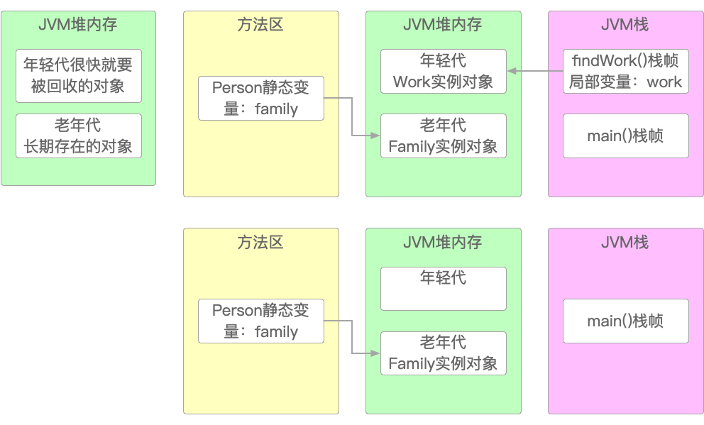
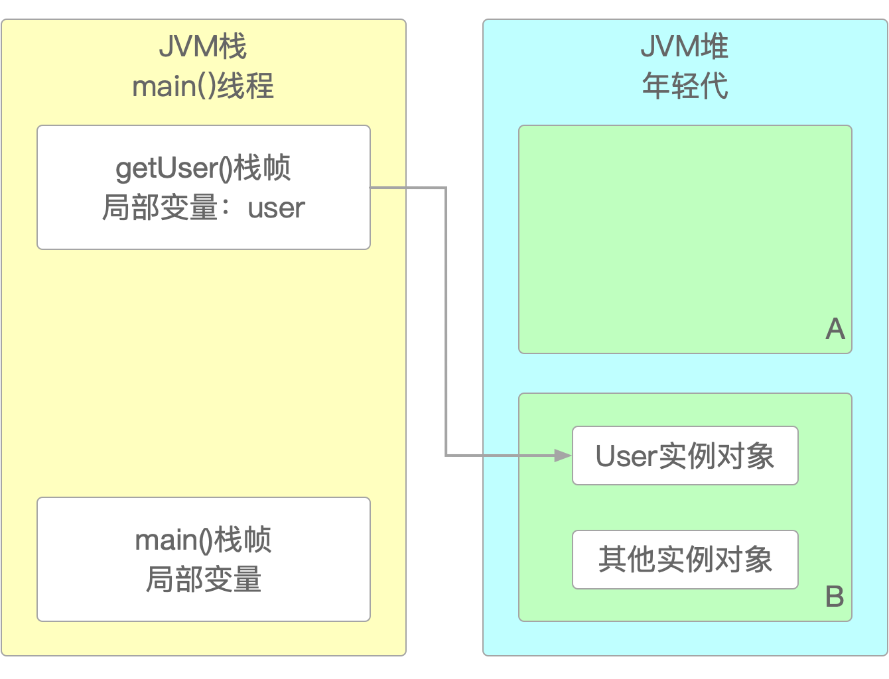
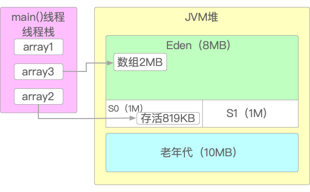

## 第4章 JVM GC

作为一门诞生之初就把跨平台作为特色之一的编程语言，可以说没有JVM（Java Virtual Machine，Java虚拟机）也就没有Java今日之繁荣。而对于广大的Java工程师来说，它既是一种历练，也是一份礼物。

本章从具体例子出发，讲解了GC分代模型、GC算法与策略、G1 GC、GC日志和可视化工具等内容，并以一步一图的方式层层剖析，力求以大白话和直观的方式，让读者理解JVM GC背后所遵循的策略思想和设计哲学。

### 4.1 JVM GC概览

JVM处于Java的核心地位，JMM（Java Memeory Model，Java内存模型）和Java多线程也是基于JVM之上的技术。

就像家里的柴、米、油、盐、酱、醋、茶分别放在不同的罐子里那样，当程序代码中的对象实例、成员变量、成员方法、方法内的局部变量、静态变量、常量等进入JVM时，也会分门别类地去到它们该去的地方，如图4-1所示。

> 图4-1 JVM类加载的大致流程


整个JVM类加载及GC垃圾回收机制的大致流程是：

1. 首先，JVM进程启动，类加载器通过双亲委派机制将需要使用的类的字节码加载到JVM中；
2. 然后程序执行main()方法，并在main线程中将main()方法压入JVM栈；
3. 如果需要创建实例对象或数组等引用对象，则在JVM堆中创建，再由JVM栈的局部变量引用JVM堆中实例对象的地址；
4. 由方法区中保存各个方法的对象、变量等数据，依次入栈再出栈；
5. 当内存资源不再被使用时，JVM会通过一个专门的线程将其回收再利用。

### 4.2 GC分代模型

垃圾回收（Garbage Collection，GC）一直都是JVM中最核心和最复杂的一块区域，前面讲过堆和栈的不同的作用，正是这种对数据的“区别对待”，才是让垃圾回收机制得以顺利进行的保证。

#### 4.2.1 “幼儿园”与“敬老院”

可以说在代码里创建的大多数对象，其存活周期都是极其短暂的，会被频繁创建与销毁，而只有少数对象能长期存活。因此，对这两种处于不同生存周期的对象，Java也将它们分别保存在两块不同的地方：一个叫做“年轻代”（类似于幼儿园），一个叫做“老年代”（类似于敬老院）。如图4-2所示。

> 图4-2 Java分代模型



在上图中，年轻代的Work实例对象用完后就立即被销毁，而老年代的Person静态变量family则没有。所以：

1. 年轻代存放的是创建和使用完之后马上就要回收的对象；
2. 老年代存放的是创建之后需要长期存在的对象。

不过在JDK 1.8之前，JVM中还存在着一种叫做“永久代”的内存区域，而JDK 1.8之后就被Metaspace（元空间）替换掉了。Metaspace中存放从方法区中转移过来的类信息、常量池、静态变量等数据。

按照正常的生存周期，大部分的对象都会先在年轻代中分配内存空间。当年轻代的空间无法再继续存放更多对象时，就会触发JVM的垃圾回收机制，这种针对年轻代的垃圾回收叫做Young GC或Minor GC，如图4-3所示。

> 图4-3 Young GC / Minor GC


而如果年轻代即使经过Minor GC后也无法容纳更多对象时，它们就会通过下面的这几种方式之一进入老年代：

1. 当某个对象在年轻代中逐渐成长，长到足够大时就会被转移到老年代。JVM对这种“成长”的定义是“躲过”一次垃圾回收或转移就算成长一次；
2. 或者，达到动态年龄判断标准时，也会进入老年代；
3. 或者，通过JVM参数直接指定如果对象大小超过预设阈值时，直接进入老年代；
4. 或者，Minor GC之后发现存活对象太多放不下时，也会将部分存活对象直接放入老年代。

但是即使是老年代的空间也是有限的。所以当老年代的空间渐满而无法容纳更多对象时，也会出发老年代的垃圾回收。这种针对老年代的垃圾回收叫做Old GC或Major GC，如图4-4所示。

> 图4-4 Old GC / Major GC


注意：有的地方把Major GC也叫做Full GC。因为标准不同，所以怎么叫都可以，这都只是“形”，不重要。为了说明方便，这里将老年代的GC统一称为Major GC，之所以如此，主要是考虑到一是和Minor GC对应，二是为了和Full GC相区分，仅此而已。

#### 4.2.2 JVM GC核心参数

Java程序运行时可以通过JVM的GC相关参数来调整年轻代和老年代的存储空间大小，GC相关参数设置的正确和有效与否，会对那些以年为单位持续运行的“三高”系统性能产生决定性影响。不过，在读者能独立做出正确且有效的GC参数设置之前，先要搞清楚以下“5W1H”式的问题：

1. JVM都有哪些GC核心参数（what）；
2. 怎么设置这些GC参数（how）；
3. 为什么这样设置GC参数（why）；
4. 何时设置GC参数（When）
5. 在哪设置GC参数（Where）；
6. 设置何种GC参数（Who）。

先来看看第一个与“What”相关的问题。JVM GC的核心参数如图4-5所示。

> 图4-5 JVM核心参数


这些参数表示的意义是：

1. -Xms和-Xmx：用于设置JVM堆内存大小和其最大值，这对参数通常会设置成一样大小，这样性能较好，其值通常从几百MB到几个GB不等；
2. -Xmn：用于设置年轻代大小，一般是JVM堆大小的50%～60%。老年代的大小就是JVM堆大小扣除年轻代后的值，也就是老年代 = Xms - Xmn。-Xms、-Xmx和-Xmn这三者的关系如图4-6所示；

> 图4-6 JVM核心参数


3. -XX:MetaspaceSize和-XX:MaxMetaspaceSize：用于设置元空间大小，大小通常为几百MB左右。在JDK1.8之后用它们取代了-XX:PermSize和-XX:MaxPermSize这两个参数。它们的关系类似于-Xms和-Xmx之间的关系；
4. -Xss：用于设置每个线程所能使用的栈内存大小，值通常不大，1MB就算很大了。

具体到Java程序，可以通过命令行、IDE当前环境设置和IDE全局设置三种方式实现运行时指定GC参数。

#### 4.2.3 支付系统案例

在正确且有效地设置GC参数前，有经验的工程师一般会先对系统做一个大致的估算，然后在此基础上根据压测结果做微调，才能最终得到适合业务系统的JVM参数设置。那么问题是，该怎么估算呢？这里以某个电商交易系统为例来说明这种初步估算的步骤和方法。电商支付的极简业务流程如图4-7所示。

> 图4-7 电商支付极简业务流程


如果公司的技术BOSS咨询下面的问题，那么架构师该如何回答呢。

1. 我们需要部署多少台机器才能满足需求？
2. 每台机器需要多大的内存空间？
3. 每台机器需要多大的JVM堆内存空间？
4. JVM需要分配多大内存空间才能保证不会崩溃？

要回答上面这些问题，就需要有一个明确的业务衡量标准。例如，每日订单量就是一个不错且当对准确的业务指标。这里笔者假设每天会产生100万笔有效的支付订单。有了业务目标，那么整个初步估算的过程如下。

一般来说，每种业务都会有高峰期和低谷期。这里假设每天的100万笔订单都集中在中午午休和晚餐之后的两个高峰期，每个高峰期各持续两1时，也就是说每天的这100万笔订单，其实是集中在2小时内完成的。那么：

1. 2小时 = 2 × 3600秒 = 7200秒；
2. 100万 ÷ 7200秒 = 138.9单/秒，将系统性能弄紧凑一些，按150单/秒算。

又假设支付系统部署了3台机器，且采取流量均分策略，那么：

1. 每台机器至少每秒需要处理50个订单；
2. 假设整个业务的流程为：支付订单请求 -> JVM创建支付订单对象 -> 写入数据库 -> 处理其他事务 -> 返回数据（不含网络请求时间损耗），理想状态下需要花费20毫秒时间；
3. 接收到50笔支付订单请求则相当于是在JVM年轻代中创建50个订单支付对象 -> 50 × 20毫秒 = 1秒处理完毕；
4. JVM将引用收回，这些订单支付对象就成了年轻代中的待回收垃圾对象，下一秒继续重复上述过程。

整个过程如图4-8所示。

> 图4-8 电商支付极简业务流程


接下来，生成每笔支付订单所需的内存空间，依据实例对象及变量类型粗略计算为：

1. 每个实例对象的Java基本类型所占据的空间 + 引用对象所占据的空间 ≈ 1KB；
2. 50笔支付订单 = 50K内存空间。

所以，可以预想，如果没有JVM 垃圾回收，当JVM中的对象不停创建且没有被消除时，那么：8 × 1024 × 1024KB = 8388608 / 50笔订单 = 167772 秒 / 3600 ≈ 46小时。也就是说如果每秒消耗50KB，一台存储空间为8G的机器，大概在46个小时之后会将空间耗尽。

但实际上，服务器肯定不会将全部内存给单一应用，最多20%至40%左右。而且整个电商系统也不止订单支付对象。再者业务高峰也许会有好几波，真实的订单数量可能比这多好几倍。所以，资源的实际耗时应该更短，至少要缩水10～20倍左右，即只能支撑2至4个小时左右，取个均值，也就是顶多3小时，系统就会因为内存耗尽而宕机。

以上过程，就是初步估算业务系统配置的方法和步骤。

所以，一般情况下，如果有条件的话只考虑4核8G及以上的计算机配置，针对单台计算机的JVM配置为：-Xms3072M -Xmx3072M -Xmn2048M。如果业务量更大，可以部署5台或10台计算机，甚至更多。

如果JVM GC参数设置不合理，那么当电商遇到促销，例如双十一、除夕夜等情况，访问量可能会提升好几个量级，部分请求出现超时、卡死，甚至应用直接闪退崩溃。而这部分特别慢且未被释放的请求，也极有可能会被GC误移入老年代，导致老年代里也出现越来越多的垃圾对象，由此产生恶性循环。

### 4.3 GC的算法与器

GC是JVM的核心，而垃圾回收算法又是GC的核心。这一节就来看看Java都有哪些垃圾回收算法以及它们是如何工作的。搞清楚这些垃圾回收算法的工作原理，就能更有针对性地选择合适的JDK版本和设置合理的JVM垃圾回收参数，让JVM调优适合业务系统的发展演化。

#### 4.3.1 GC Roots

垃圾回收，首先得区分出哪些东西是垃圾。就像很多人家里都有一个套着塑料袋的小桶那样，会把不要的东西往里扔。这等于是给“垃圾”下了一个定义，或者说“标记”了垃圾的“身份”：所有在垃圾桶里面的都是垃圾，装满了就可以扔。而那些不在垃圾桶里的，就是暂时要保留的了。

对于JVM GC来说也是一样，需要有一种能够“标记”哪些资源可以被“扔掉”（也就是被释放）的方法。所以，Java采用了一种叫做“可达性分析法”的垃圾识别方法。所谓可达性分析，就是判断哪些对象可以被回收释放，而哪些暂时还不能扔。可达性分析的原理如图4-9所示。

> 图4-9 可达性分析


这种存在于方法区、JVM栈、本地方法栈及其他类别的变量引用，统称为GC Roots，把它们作为起始点以链表的方式开始搜索，所搜索的路径称为引用链。当某些对象没有任何GC Roots与之相连时，就证明该对象不可达，也就是可以被回收释放了。所以，从上图可以知道：

1. 引用1、引用2和引用4都是GC Roots；
2. 引用1 引用了 对象实例1；
3. 引用2 引用了 对象实例2 又引用了 对象实例3；
4. 引用4 引用了 对象实例4；
5. 对象实例5虽然引用了对象实例6，但由于对象实例5本身没有任何GC Roots指向它，所以对象实例5和对象实例6都是可以被垃圾回收的对象。

但即使是GC Roots引用也有强弱之分，从强到弱分为四类。如图4-10所示。

> 图4-10 四种不同的引用


另外，在JDK 1.9之前，当一个对象没有引用的时候，其垃圾回收器会自动调用它的finalize()方法。但在JDK 1.9之后，该方法已被废弃。所以，随着JDK版本的不断升级，有些方法、类、策略机制等，就没有必要再花多余的时间去了解了。正如之前多线程中stop()、suspend()和resume()这几个被废弃的方法一样。

#### 4.3.2 年轻代GC算法

JVM堆被划分成年轻代和老年代后，新创建的对象会先保存在年轻代。但随着时间的推移，新创建的对象、已使用完的对象和待回收的对象越来越多，当空间不足时，就会引发Young GC或Minor GC。

不过问题在于，在发生Minor GC时，大量有用的和无用的对象全都混在一起，尤其是当回收掉垃圾对象后，会造成很多不连续的内存空白区域，这些空白区域大小不一，碎片化严重，不适合再分配给新对象使用。故而不仅成了极大的空间浪费，还给空间整理和分配工作带来了一定的困难。所以，这种在同一个地方既清除垃圾对象又保留存活对象的做法，实在是一种非常糟糕的方案。

有鉴于此，Java的创造者们在此基础上提出了一种改良的解决方案：

1. 将年轻代再分为大小相等的两块区域A和B；
2. 创建对象实例时先使用区域A，如图4-11所示；

> 图4-11 四种不同的引用


3. Minor GC前先在区域A中标记出要保留的存活对象，如图4-12所示；

> 图4-12 在区域A中保留存活对象


4. 再将存活对象转移（复制）到另一块空白区域B中，如图4-13所示；

> 图4-13 将存活对象转移（复制）到另一块空白区域B


5. Minor GC完成后将原区域A整体回收，一并释放，然后由区域B接替区域A的位置存放新创建的对象，如图4-14所示；

> 图4-14 将原区域A整体回收



6. A、B两块区域再按上述步骤循环往复使用。

上述的“标记”过程，其实也就是探查GC Roots的过程。这种方法的问题是整个年轻代的空间使用效率只有50%。所以Java的创造者们针对此又做了优化改进，如图4-15所示。

> 图4-15 将原区域A整体回收


从上图可以知道：

1. S0 + S1 = Sruvivor，占据年轻代总空间的20%，S0和S1各占10%。因为每次需要保留的存活对象和需要回收的对象相比，所需空间其实是很有限的；
2. 余下的80%由Eden区使用，因此S0、S1和Eden三部分默认的比例为1:1:8，可以通过JVM参数-XX:SurvivorRatio设置；
3. 一般情况下可以使用Eden区和Survivor其中的一块（比如S0或S1）。

-XX:SurvivorRatio和-XX:NewRatio这两个JVM参数的使用需要特别说明一下，比较容易犯迷糊，如图4-16所示。

> 图4-16 -XX:SurvivorRatio和-XX:NewRatio


1. -XX:SurvivorRatio=X的意思是将年轻代分成了X + 2份，其中Eden占X份，S0和S1各占1份；
2. -XX:NewRatio=X的意思是将-Xms分成了X+1份，其中老年代占X份，年轻代占1份。年轻代与老年代空间大小的比例默认为1:2，即默认情况下-XX:NewRatio=2。

经过这样改进后，空间利用率大大提高，做到了资源和效率的平衡。那么，之前在A、B区域的循环复用过程就变成了S0、S1和Eden这三个区之间的循环复用过程：

1. 首先新创建的对象实例优先被分配给Eden和Survivor其中之一（如S0）；
2. 当Eden区的空间快被用尽时，触发Minor GC。其中标记出来的存活对象会一次性转移到另一块空闲的Survivor中（比如S1）；
3. Eden和S0被清空，等待再次分配新对象，如图4-17所示；

> 图4-17 Minor GC后年轻代的状况


4. 如果Eden再满，再次触发Minor GC。

此过程在S0、S1和Eden中循环往复。

#### 4.3.3 如何成为JVM的“老人”

在前面提到过对象实例有几种从年轻代进入老年代的方式，在这里就把它们都明确讲述一遍。

1. 首先，第一条规则当对象每在年轻代“躲过”一次GC而被转移到Survivor其中之一时，对象的“年龄”就会增加“一岁”，也就是被标记一次。默认是被标记15次之后，会被转移到老年代。这个默认的标记次数可以通过JVM参数-XX:MaxTenuringThreshold设置；
2. 第二条规则是动态年龄判定规则：如果当前Survivor区中，年龄相同的一批对象总大小 ≥ Survivor × 50%，那么这批对象及比它们年龄更大的对象，就都直接进入老年代。例如将对象的年龄从小打到排序后，如果：“1岁的对象 + 2岁的对象 + ...... + n岁的对象 ≥ Survivor × 50%”，那么所有大于等于n岁的对象就都会进入老年代。这个50%的百分比可以通过JVM参数-XX:TargetSurvivorRatio指定。如图4-18所示。

> 图4-18 动态年龄判定规则


3. 按年龄排序：对象B + 对象A + 对象C + 对象D = 55MB ≥ 100MB× 50%。因此对象C和对象D进入了老年代。
4. 第三条规则是如果某个对象的大小超过设定的阈值，那么它根本不会进入到年轻代，而是直接进入老年代。这个阈值可以通过JVM参数-XX:PretenureSizeThreshold指定。如图4-19所示。

> 图4-19 大对象阈值规则


5. 最后一条规是如果经过Minor GC后发现剩余的存活对象太多，导致其大小总和超过某个Survivor区（S0或S1），那么就把这些对象转移到老年代。如图4-20所示。

> 图4-20 剩余对象阈值规则


上述这四种将年轻代对象转移到老年代的方式，通过表4-1可以很直观地看清楚。

> 表4-1 “年轻人”成长为“老年人”的四种方法

| 类型 | 阈值判断 | 参数 | 说明 |
|:---:|:---:|:---:|:---:|
| 对象年龄标记 | 默认15次 | -XX:MaxTenuringThreshold | 经过多次GC之后的存活对象 |
| 动态年龄标记 | 默认50% | -XX:TargetSurvivorRatio | 对象年龄从小到大排序，最终转移年龄最大及超过最大年龄的对象 |
| 外来对象大小 | 0 | -XX:PretenureSizeThreshold | GC之前要存储到年轻代的对象 |
| 存活对象大小 | 超过Survivor大小 |  | 单次GC之后存活的对象 |

#### 4.3.4 老年代空间分配担保

上面讲的是年轻代对象转移到老年代去的四种方法，但是在老年代的空间足够的前提下进行的。这当然是理想的情况。然而，现实并不总是如此。因为不出意外的话，总会有意外发生——如果这时候老年代的空间也不够了，该怎么办？

这时候JVM的“老年代空间分配担保机制”就会发挥作用。这个机制如果用文字叙述起来比较繁琐，直接看图则会清晰得多。如图4-21所示。

> 图4-21 老年代空间分配担保机制


之所以会有这个“老年代空间分配担保机制”，是因为JVM要想方设法地防止Full GC及其之后的OOM发生。因为这是系统即将或已经崩溃的征兆。

所谓Full GC，就是在整个JVM堆空间中执行垃圾回收，它会清理所有年轻代和老年代中的对象。而执行Full GC时，JVM会直接停止所有系统线程，不接受也不处理任何请求，直到执行完毕。这种现象就是通常所说的“Stop the World”（STW）。如果应用系统频繁出现STW，有些大厂会将之评判为重大事故，它说明JVM GC的性能调优工作存在严重失误。

#### 4.3.5 老年代GC算法

和年轻代一样，老年代如果空间不足时，也会触发垃圾回收机制。老年代垃圾回收的时机可能是在年轻代的Minor GC之前，因为要腾出空间留给年轻代；也可能是在年轻代的Minor GC之后，因为剩余的存活对象太多导致现有空间不足。

由于老年代中没有类似S0、S1和Eden这样的分区，所以它只能在一个单一的场所内既清除垃圾对象，又保留存活对象。这就导致其效率十分低下——它的GC速度只有年轻代的10%。

在G1 GC成为JDK 1.9及其后续版本的默认GC之前，老年代的Old GC或Major GC使用的是一种被称为“标记-清理”的GC算法。这种GC算法的设计思想极其简单，简单到只有两种操作：标记和清理。

1. 标记：先标记出老年代当前的存活对象；
2. 清理：再清理垃圾对象，避免出现碎片化。

但要实现它却不简单。因为清理时可能会造成过多的内存碎片，导致严重浪费空间，所以老年代的Major GC采取GC和正常的系统程序同时执行的方式，算法实现分为四个步骤。

1. 第一步：初始标记阶段。系统进入“Stop the World”状态，GC仅仅标记出所有被GC Roots直接引用的对象，并不会执行清理工作。如图4-22所示。

> 图4-22 初始标记阶段


2. 第二步：并发标记阶段。系统程序恢复运行，GC尽可能对全部老年代里已有对象进行GC Roots追踪，即弄清全部老年代里的对象是否被引用了。如图4-23所示。

> 图4-23 并发标记阶段


3. 第三步：重新标记阶段。系统程序再次被禁止运行，GC对在上一阶段程序运行时状态发生变更的对象进行标记。这一步相当于是GC和系统程序做同步微调工作。如图4-24所示。

> 图4-24 重新标记阶段


4. 第四步：并发清理阶段。系统程序再次恢复运行，GC线程清理掉之前标记为垃圾的对象。如图4-25所示。

> 图4-25 并发清理阶段


在老年代Major GC的第四个阶段，即并发清理阶段，会产生一些浮动垃圾，也就是系统程序在GC并发工作时产生的新垃圾。如图4-26所示。

> 图4-26 浮动垃圾


这些浮动垃圾要等到下一次GC时才会被清理掉。但如果浮动垃圾过多，可能会导致系统频繁发生“Stop the World”或Full GC。由浮动垃圾引起的GC问题称之为Concurrent Mode Failure（并发模式失败）。如果Major GC之后产生Concurrent Mode Failure问题，也就意味着当次GC执行不彻底，此时JVM会强行再次“Stop the World”，直到垃圾回收完成后再恢复系统线程。为了解决这个问题，JVM预设了一个阈值，当老年代可用空间大于这个阈值时就开始执行Major GC。参数-XX:CMSInitiatingOccupancyFraction可以调节这个阈值，它的默认值是92%，不过在JDK 1.8中该参数已不建议使用。

显然，如果这个阈值设置太小，会增加老年代Major GC频率，但如果设置过大，又会增加Concurrent Mode Failure发生的概率。与浮动垃圾同时产生的，还有无法完全避免的内存碎片问题。JVM也有两个参数来调节：-XX:UseCMSCompactAtFullCollection和-XX:CMSFullGCsBeforeCompaction。但它们在JDK 1.8中都已不建议使用。其中，-XX:UseCMSCompactAtFullCollection会默认打开，作用是Full GC之后再次进行“STW”清理碎片，而-XX:CMSFullGCsBeforeCompaction则表示执行多少次Full GC之后再进行碎片清理，默认值是0，意思是每次都清理。

这就是为什么JVM GC调优工作一定要结合实际业务系统的压测情况来完成的主要原因之一。因为类似这种需要具体情况具体分析解决的地方还有很多，如果不分青红皂白地胡乱用一套所谓通用的JVM参数模板，可能刚开始很正常，但随着系统运行时长和压力的不断增加，迟早会爆发出一堆“莫名其妙”的古怪问题。

#### 4.3.6 垃圾回收器

前面把两种垃圾回收算法都简要讲述了一遍，分别是年轻代Minor GC的“标记-复制”算法和老年代Major GC的“并发-清理”算法。但算法只是一种设计思想，真正完成JVM中垃圾回收工作的，还是要靠具体的垃圾回收器。这就好比发动机的原理并不能代替发动机来开车一样。

自从有了垃圾回收算法以来，先后出现过十几种垃圾回收器。有些是专用于年轻代的，例如Serial、ParNew和Paralle Scavenge等。有些是专用于老年代的，例如Serial Old、CMS和Paralle Old等。而有些则无视这种分代，年轻代和老年代都可以通用，例如G1和ZGC等，“标记-清理”算法就是专门针对老年代的CMS垃圾回收器。所有针对不同分代的垃圾回收器及其背后的垃圾回收算法，都可以统称为“分代回收器”和“分代回收算法”。

年轻代之所以以“复制”方式为主，是因为年轻代的每次垃圾回收都会有近99%的内存空间被释放，而“复制”方式只需要付出少量对象的复制成本就可以完成大量的垃圾回收。而老年代之所以选择“清理”方式，是因为老年代中对象的存活几率相对较高，而且没有额外的空间可以对它进行分配担保，所以只有通过“标记-清理”的方式进行垃圾回收。

图4-27所示是到目前为止Java较为主流的垃圾回收器。对它们的总结如表4-2所示。

> 图4-27 主流的垃圾回收器


> 表4-2 主流垃圾回收器比较

| 垃圾回收器 | 适用于 | GC算法 | 线程 | JVM控制参数 |
|:---:|:---:|:---:|:---:|:---:|
| Serial | 年轻代 | 标记-复制算法 | 单线程 | -XX:+UseSerialGC |
| ParNew | 年轻代 | 标记-复制算法 | 多线程 | -XX:+UseParNewGC |
| Paralle Scavenge | 年轻代 | 标记-复制算法 | 多线程 | -XX:+UseParallelGC |
| Serial Old | 老年代 | 标记-清理算法 | 单线程 | -XX:+UseSerialOldGC |
| CMS | 老年代 | 标记-清理算法 | 多线程 | -XX:+UseConcMarkSweepGC |
| Paralle Old | 老年代 | 标记-清理算法 | 多线程 | -XX:+UseParallelOldGC |
| G1 | 不分代 | 标记-清理算法 | 多线程 | -XX:+UseG1GC |
| ZGC | 不分代 | 改进的标记-复制算法 | 多线程 | -XX:+UseZGC |

#### 4.3.7 JVM调优案例

搞清楚了垃圾回收算法、垃圾回收器之后，就可以看看在实际的生产环境中该如何调整JVM参数了。

仍然以之前讲过的支付系统为例，假设年轻代指定的垃圾回收器为ParNew，老年代指定的垃圾回收器为CMS。目前的业务简化后的状况是：

1. 支付系统遇到节假日大促，DAU达到了500万，峰值订单量达到了1000笔/秒；
2. 现有3台计算机，平均每台至少需承接330笔/秒的订单量。以保守情况预估，按每台计算机每秒承接500笔订单的请求量来计算；
3. 计算机的配置为4核8GB内存，按JVM × 2 = 物理内存来计算，那么JVM应分配到4GB的内存空间；
4. JVM堆分配3GB内存空间，其余留给JVM中的方法区、栈、程序计数器、本地方法栈和其他部分；
5. 默认情况下，JVM年轻代和老年代的内存大小比例是1:2。但为了避免年轻代被很快填满，所以这里将年轻代和老年代的比例调整为1:1，也就是都设置为1.5GB；
6. 经预估，每笔订单信息输入的数据量大概在1KB左右，而连带的订单详情、优惠券、SKU、物流等信息，需要将订单对象的开销放大10～20倍，这里按20倍计算；
7. 除此之外，订单系统还会有很多相关的其他操作，比如查询、发消息，所以这些算起来，还要在上一步的基础上再扩大10倍的开销。

综合以上信息，整个订单系统的案例背景如图4-28所示。

> 图4-28 订单系统的案例背景


因此，初始的JVM GC参数就可以配置为：

1. -Xms3072M -Xmx3072M
2. -Xmn1536M -Xss1M
3. -XX:MetaspaceSize=256M -XX:MaxMetaspaceSize=256M

因为在JDK 1.6之后不再需要-XX:HandlePromotionFailure这个参数，所以就不加了。按图4-28所示的估算，订单系统每秒会生成100MB的数据填充年轻代。可以预见，照此速度，15秒之后，年轻代就会被填满。

如果JVM参数-XX:SurvivorRatio=8，那么Eden将只有1.2G，会不等到15秒而提前触发Minor GC。

增加-XX:SurvivorRatio后，JVM GC参数调整为：

1. -Xms3072M -Xmx3072M -Xmn1536M -Xss1M
2. -XX:MetaspaceSize=256M -XX:MaxMetaspaceSize=256M -XX:SurvivorRatio=8

增加这个参数的目标就是避免年轻代被填得连Minor GC的空间都没有了。但调整Survivor空间时，也要注意几个问题：

1. 有可能会出现Survivor空间不足而直接进入老年代的情况；
2. 动态年龄判定规则：全部对象大小之和超过Survivor空间50%会直接进入老年代；
3. 单次GC之后存活对象大小超过Survivor，则直接进入老年代。

因此，基于如上考虑，一方面可以适当调整年轻代的大小，因为普通业务系统的大部分对象生存周期都很短，根本不应该进入老年代，而是要尽量让它们留在年轻代里。另一方面，也可以增加Survivor空间，根据动态年龄判定规则，增加-XX:TargetSurvivorRatio参数，让可以长久存活的尽量早点进入老年代，给Survivor腾出空间处理新对象。如图4-29所示。

> 图4-29 调整年轻代大小


按照上图，JVM GC参数也需要相应调整为：

1. -Xms3072M -Xmx3072M -Xmn2048M -Xss1M
2. -XX:MetaspaceSize=256M -XX:MaxMetaspaceSize=256M
3. -XX:SurvivorRatio=8 -XX:TargetSurvivorRatio=30

同时，可以降低进入老年代的年龄门槛限制，给Survivor腾出更多空间。那么需要给JVM增加-XX:MaxTenuringThreshold参数了。

1. -Xms3072M -Xmx3072M -Xmn2048M -Xss1M
2. -XX:MetaspaceSize=256M -XX:MaxMetaspaceSize=256M
3. -XX:SurvivorRatio=8 -XX:TargetSurvivorRatio=30 -XX:MaxTenuringThreshold=5

而且可以指定某些超过指定大小的内存对象直接进入老年代，减轻Survivor存储压力，所以可以给JVM增加-XX:PretenureSizeThreshold参数。

1. -Xms3072M -Xmx3072M -Xmn2048M -Xss1M
2. -XX:MetaspaceSize=256M -XX:MaxMetaspaceSize=256M
3. -XX:SurvivorRatio=8 -XX:TargetSurvivorRatio=30
4. -XX:MaxTenuringThreshold=5 -XX:PretenureSizeThreshold=10MB

之前提过Concurrent Mode Failure的问题，但这种概率极小，不需要为极小概率事件调整JVM参数设置。也没有必要修改执行多少次Full GC之后进行碎片清理，因为经过优化后， Full GC执行次数大大降低了。而且即使是在大促期间，真正的系统压力峰值时间也是有限的，比如持续2小时可能就结束了。如果JVM能做到500单/秒，大约1小时才触发一次Full GC，那么峰值过后，JVM的压力就会小很多，就不会再触发Full GC了。

最后，要记得给年轻代和老年代指定所要使用的垃圾回收器：

1. -Xms3072M -Xmx3072M -Xmn2048M -Xss1M
2. -XX:MetaspaceSize=256M -XX:MaxMetaspaceSize=256M
3. -XX:SurvivorRatio=8 -XX:MaxTenuringThreshold=5
4. -XX:TargetSurvivorRatio=30 -XX:PretenureSizeThreshold=10MB
5. -XX:+UseParNewGC -XX:+UseConcMarkSweepGC

以上的JVM GC参数设置，就是根据压测或大促期间的订单系统表现而逐步调整出来的。当然，它还需要经过实践的检验，还需要在业务运行期间不断根据实际需要而进行调整。

### 4.4 G1 GC

自从出现了专门用于年轻代GC的ParNew和只针对老年代GC的CMS垃圾回收器后，一方面，它们始终无法彻底解决“STW”的问题。另一方面，多核处理器和超大容量内存的出现，也对JVM提出了更苛刻的要求：在尽量降低GC停顿时间的同时也要有更高的吞吐量。在以上种种背景条件之下，G1垃圾回收器诞生了。

#### 4.4.1 “垃圾优先”

从JDK 1.9开始，G1就代替了传统的垃圾回收器，成了JVM的默认GC算法（JEP 248: Make G1 the Default Garbage Collector）。G1全称Garbage-First Garbage Collector，即“垃圾优先垃圾回收器”，意思就是如果有垃圾就优先清理垃圾。它和之前的Serial、ParNew、CMS等基于分代回收理论的垃圾回收器不同，G1 GC淡化了分代的概念，将整个JVM堆看作一个整体并将它们从逻辑上拆分为多个大小固定的内存块，也称为Region。如图4-30所示。

> 图4-30 G1的5种Region


G1五种不同的Region分别是：

1. Survivor Region：年轻代Survivor区的Region；
2. Eden Region：年轻代Eden区的Region；
3. Old Region：老年代的Region；
4. Humongous Region：巨型Region，如果待存储的对象大小 ≥ 单个Region × 50%，那么就会被判断为大对象。如果单个Region存不下，将使用连续的多个Region存放，并将这些Region都标记为巨型Region；
5. Free Region：暂时未使用的空闲Region。

G1最多可以有2048个Region，而Region的大小又可以是1MB、2MB、4MB、8MB、16MB和32MB这六种中的一种。因此G1最多可以管理32MB × 2048 = 64GB的JVM堆空间。或者反过来说，如果不知道该给Region设置多大合适，那么Region大小 = 堆内存 / 2048。例如，当堆内存为8192GB时，那么Region大小就应该设置为8192GB / 2048 = 4MB。

由于G1的Region都是大小固定的内存块，而且最多2048个，所以借助于多核CPU和多线程技术，它完全可以同时控制多个Region的垃圾回收动作，以达到精准控制GC的停顿时间和区位分布的目的，而这也是G1最主要的设计目标：将无法避免的“Stop the World”问题变为可预期且可配置的。G1默认的期望最大停顿时间为200毫秒，只不过它不是硬性条件，而是期望值。

G1之所以可以控制预期的GC时间，是由于其设计思路的缘故。简单来说就是：垃圾是永远也清不完的，与其花费太多时间把一段时间内的垃圾全都清完，倒不如多清理几次，每次清理一点。这样既不降低业务系统的执行速度，也能整体提升垃圾回收效率。G1就是这种在“全部清理完”Vs.“每次清一点”之间取得了良好平衡的GC算法。而且G1会追踪堆中的每个Region，如果之前的GC已经造成了系统卡顿，当又要进行GC的时候，就会评估回收哪个Region中的垃圾更合理，做到在尽可能短的时间内回收尽可能多的垃圾。例如，每个Region都有多少垃圾？需要花费多少时间回收？很明显，花费1秒回收10MB垃圾和花费200毫秒回收20MB垃圾，当然是后者的性价比更高——这就是所谓的“回收价值”——它是G1通过估算预期卡顿时间与已卡顿时间之间的差值得来的。

而且，G1中年轻代，也就是Survivor Region和Eden Region占全部JVM内存的比例默认为5%，最多不高于60%。它们由-XX:G1NewSizePercent=5和-XX:G1MaxNewSizePercent=60这两个参数决定。且Survivor Region和Eden Region的默认比例也仍然是1:1:8，它由参数-XX:SurvivorRatio=8决定。也就是说，如果年轻代有100个Region，那么S0 Region和S1 Region各占10个，Eden Region占80个。如图4-31所示。

> 图4-31 Servivor Region和Eden Region的默认比例


当某个Survivor Region被回收之后，它后续可能会变成Eden Region或者Old Region，所以每个Region的“身份”都不是一成不变的。这样的话，内存管理就会很灵活，既能动态满足年轻代和老年代的空间需求，又最大限度地提升了空间利用率。

#### 4.4.2 G1那些事儿

G1将JVM重新划分为若干个Region之后，还同时准备了若干辅助“道具”以便它们能更好地发挥自身特长。下面就来一一介绍。

在JVM运行过程中，内存分配是一个极其频繁的动作，尤其是还有大量线程同时申请，如果不加以控制，势必会拉低系统整体性能。所以G1 GC中引入了一个叫TLAB的组件，它的全称是Thread Local Allocation Buffer，即“线程本地分配缓冲”。它让每个线程都单独拥有一个Buffer，如果需要分配内存，就在先自己的Buffer上分配而不用向JVM申请，当Buffer不够用的时候，再重新向Eden区申请一个，这样就可以大大提升系统效率。如图4-32所示。

> 图4-32 TLAB


需要注意的是，TLAB的内存分配指针是线程私有的，但其中的数据是可以给所有线程访问的，而非只能自己使用。

由于G1 GC并未完全抛弃分代回收模型，所以它一般是先回收年轻代，不行的话就开始混合回收，最后实在不行再执行Full GC。由于年轻代和老年代是不同的，如果用GC Roots可达性分析，就会把老年代也一并收集一遍，这就比较浪费时间。而且年轻代也可能会有老年代引用，反过来也一样。所以，为了解决这种跨代分析和引用问题，G1使用了一种叫做Remember Set的东西，也叫记忆集。它用一组KV键值对，记录了跨代引用关系，在垃圾回收的时候，就可以快速搞定跨代引用的可达对象分析问题，如图4-33所示。

> 图4-33 RSet


RSet专门用来存储所有跨代引用的对象，因为同代引用已经有GC Roots了。而且RSet是存在于Region维度的，也就是每个Region都有一个自己的RSet。之所以如此，是因为每次GC之后Region都会不断地变化，如果粒度太粗，就完全起不到它应有的作用。

G1为了在并发阶段描述内存的使用状态，创造了一个叫做BitMap位图的组件。所谓位图，其实就是一组由0和1组成的字符串，0代表某块内存未使用，而1代表已使用，如图4-34所示。

> 图4-34 BitMap


除了位图，还有一个和它比较类似的东西，叫做CardTable卡表，也是用一段数据去记录内存的使用情况。但卡表和位图的不同在于：位图要么是0，要么是1。也就是它只能记录使用或未使用这两种状态，而卡表有8位，用一个字节byte来描述内存的使用状况，所以它就能够承载多达2的8次方，即256种不同的状态信息，例如是否使用、内存的引用关系等，如图4-35所示。

> 图4-35 CardTable


上图中第1位表示是否使用，而后7位可以表示其他相关信息。位图和卡表一样，在G1中都是全局性的，也就是整个G1就这么独一份。

在G1的每次垃圾回收时，都会释放一部分Region。如果这些Region一个一个地处理，显然比较浪费时间。因此G1用了一个叫做CSet的组件，它将每次垃圾回收期间需要释放的Region都集中在一起处理。CSet中的Region既可以是年轻代的Survivor Region和Eden Region，也可以是老年代的Old Region，或者Humongous Region。而G1会将CSet中存活的对象拷贝到新的Region，然后释放CSet中的这些Region，如图4-36所示。

> 图4-36 CSet


最后，由于GC和应用程序是并发执行的，可能某个对象刚被GC标记之后，应用程序就立即对它进行改动，从而造成对象的漏标或误标问题。误标影响不大，但漏标就有点严重了：如果某个本应存活的对象未被标记存活，反而被垃圾回收给销毁了，其影响可能会非常严重，甚至会造成应用程序的闪退或崩溃。为了解决这个问题，G1采用了一种称为SATB（Snapshot-At-The-Beginning）的技术，也就是“初始快照”。它在GC开始时的并发标记阶段，给所有通过GC Roots得到的存活对象一个“快照”。同时将对象按标记状态分成三种“颜色”，如图4-37所示：

> 图4-37 对象的三色标记


上图中的“黑”、“白”、“灰”三种颜色分别表示：

1. 黑色：自身及可达对象都被标记，所以不会再对它进行扫描；
2. 灰色：自身被标记，但可达对象未标记；
3. 白色：完全未被标记。

显然，白色就是漏标的对象。造成这种情况的可能原因是在并发标记阶段，GC标记之后，要么业务线程紧接着给某个黑色对象的成员变量赋值了白色对象；要么业务线程紧接着“不小心”删除了某个灰色对象到白色对象的引用。为了解决这个问题，SATB用到了两个位图，这两个位图都存储在每个Region中，用来记录上一次完成标记的位置preTAMS和当前标记的位置nextTAMS。通过这两个位图、pre-write barrier和post-write barrier技术，SATB可以保证对象不会被漏标，但却无法消除浮动垃圾。

以上两小节就是G1的“通用知识”。所谓“通用知识”指的是这些内容从JDK 8开始直到JDK 21中都是适用的，基本没有什么改变。之所以选择JDK 21，是因为它是第一个发布了Java协程，也叫“虚拟线程”（JEP 444: Virtual Threads）的稳定版本，也是第一个发布了分代ZGC（JEP 439: Generational ZGC）的版本。而这两者刚好都对G1有影响，这可能预示着G1 GC也即将发生一些变化。

另外，JDK 21也是Oracle官方路线图明确标识出的LTS版，即Long Time Support长期支持版。所以JDK 21可能会是一个分水岭。如果有必要的话，可以尝试把项目迁移到JDK 21上，除了需要做一些JVM参数的调整之外，代码层面基本上不会有什么变化。

笔者也建议直接采用ZGC，因为官方文档明确表示它最大支持16TB内存，STW的停顿时间小于10毫秒，GC期间对吞吐量的影响比G1要小15%。所以综合比较下来，它的效率又比G1 GC要高出一截。

#### 4.4.3 同一个Java，不同的G1

对G1有了大致的了解之后，就可以来看看在不同的JDK中它的算法执行过程会有什么不同了。在JDK 8中，G1有三种GC类型，它们分别是：

1. Young GC：年轻代GC，回收所有Survivor Region和Eden Region；
2. Mixed GC：混合GC，回收所有Survivor Region、Eden Region和部分Old Region；
3. Full GC：回收全部JVM堆中的Region。

JDK 8的Young GC和之前讲过的年轻代GC算法比较类似，当所有年轻代Region的空间之和 ≥ -XX:G1MaxNewSizePercent所设置的值时，就会触发G1的Young GC，这个值默认是60%。而且对象从“年轻代”进入“老年代”的第一条年龄规则和第二条动态年龄判断规则对G1也同样适用。Young GC过程可参考之前的内容，这里就不再重复讲述。

Mixed GC也类似于老年代的CMS GC过程，当全部Old Region ≥ JVM堆内存大小 × 45%时，就触发混合回收。这个45%是通过JVM参数-XX:InitiatingHeapOccupancyPercent设置的。也就是说，如果JVM有2048个Region，那么当Old Region = 2048 × 45% ≈ 922 个时，就会触发Mixed GC。Mixed GC分为五步。

1. 第一步是Initial Mark初始标记阶段：这一步会引起“Stop the World”，使用单线程快速标记GC Roots可以直连的对象。该阶段是在Young GC的基础上进行的；
2. 第二步是Root region Scanning GC Roots区域扫描阶段：它扫描前一步剩余的区域，查找部分老年代的引用并标记它，并修改TAMS指针的值。此阶段系统程序恢复运行，它必须在下一个Young GC前完成；
3. 第三步是Concurrent Marking并发标记阶段：此时发生“Stop the World”，系统程序停止运行，GC在整个JVM堆中开始进行可达性分析，标记要回收的对象，扫描完成后重新处理STAB记录下的在并发时有引用变动的对象；
4. 第四步是Remark备注阶段：也叫最终标记。系统会再次“Stop the World”，纠正并发标记阶段因程序操作而导致的错标、误标、漏标对象；
5. 最后一步是Cleanup清理阶段：该阶段会统计和清理RSet，识别完全空闲的区域和Mixed GC的候选对象，从而引发“Stop the World”。在此阶段，GC不仅回收Survivor Region、Eden Region和部分Old Region，也会回收Humongous Region，并将它们放回空闲区域列表。在满足性能的前提下，即在允许GC卡顿的时间内，GC对各个Region区的回收价值和成本进行排序，找出“回收价值最大”的Region优先回收。

至于Full GC，当Mixed GC没有回收掉或来不及回收垃圾对象，也就是回收失败时，它就被触发执行。Full GC会回收整个JVM堆全部的Region。它会执行下面的一系列动作：

1. 停止系统运行；
2. 采用单线程或多CPU并行方式进行整个JVM的标记、清理、压缩和整理；
3. 回收垃圾，空闲出一批Region；
4. 恢复混合回收过程。

其总体流程如图4-38所示。

> 图4-38 JDK 8中G1 Full GC整体流程


在JDK 21中的G1突出了Young GC的重要性。毕竟在JVM堆空间得到极大扩展后，大部分对象都是在年轻代中处理的。JDK 21把G1 GC分成了两个不断循环往复的阶段，它们共同组成了G1 GC的垃圾回收周期，如图4-39所示。

> 图4-39 JDK 21中G1 GC两大阶段


从图中可以看到，当老年代的占有率超过参数-XX:InitiatingHeapOccupancyPercent=45设定的值时，就引发Young-Only GC。其中每个圆圈都代表一次GC停顿：

1. 左边的蓝色圆圈表示Young-Only GC引起的停顿；
2. 右边的橙色圆圈表示标记过程中的停顿；
3. 下方的红色圆圈表示Mixed混合回收过程中的停顿。

“Young-Only”阶段又细分为三个小阶段：

1. Concurrent Start（并发开始）阶段：它启动并发标记，确定并保留在老年代中当前所有的可达对象，即存活对象。此阶段结束时会有两个导致“Stop the World”的阶段出现，分别是“备注阶段”和“清理阶段”。但这个阶段也有可能不会标记，也就没有了后续的阶段；
2. Remark（备注）阶段：此时停止标记，处理一些弱引用和无用的对象，回收完全空闲的区域并清理内部数据结构，在下一阶段到来前搜集老年代中的可回收空间；
3. Cleanup（清理）阶段：这个阶段决定是否执行下一个阶段，即“Space Reclamation”。如果是的话，将进入混合回收阶段。

“Space Reclamation”阶段类似于之前的Mixed GC，它包括多次混合回收，整个阶段都是“Stop the World”。而且除了所有年轻代的Region，它也会根据并发标记阶段得出的回收价值数据对老年代进行回收。此阶段之后，整个G1 GC的垃圾回收周期就结束了，然后又开始进入下一个“Young-Only”阶段，如此循环往复。

如果G1 GC如果出现“Evacuation Failure”，那么意味着大概率即将执行Full GC。其过程就不再赘述。总的来说，从JDK 8到JDK 21，G1 GC虽然在技术上没有大的改变，但它在向Young GC倾斜，更紧凑且更聚焦了。表4-3对比了G1 GC在JDK 8和JDK 21官方文档中的一些不同。

> 表4-3 JDK 8 G1和JDK 21 G1的简单比较

| 对比项 | JDK 8 G1 | JDK 21 G1 |
|:---:|:---:|:---:|
| 可用的垃圾回收器 | -XX:+UseSerialGC<br>-XX:+UseParNewGC<br>-XX:+UseParallelGC<br>-XX:+UseSerialOldGC<br>-XX:+UseConcMarkSweepGC<br>-XX:+UseParallelOldGC<br>-XX:+UseG1GC | -XX:+UseSerialGC<br>-XX:+UseParallelGC<br>-XX:+UseG1GC-XX:+UseZGC<br>-XX:+UseZGC<br>-XX:+ZGenerational |
| 垃圾回收类型 | 1. Young GC<br>2. Mixed GC<br>3. Full GC | 1. Young-Only<br>2. Space-Reclamation<br>3. Full GC |
| 具体执行阶段 | 1. Initial marking phase<br>2. Root region scanning phase<br>3. Concurrent marking phase<br>4. Remark phase<br>5. Cleanup phase | 1. Concurrent Start<br>2. Remark<br>3. Cleanup |

#### 4.4.4 实践案例

虽然电商对系统有“三高”（高并发、高性能、高可用）的要求，但也有一些不那么引人注意的行业，其“三高”的标准一点也不比电商低。例如前几年特别活跃的某K12行业教育公司，拥有千万级注册用户，DAU用户约为300万，但选课、排课、课程详情等页面的浏览频率都较低，反而上课页面和APP界面使用频次最高。尤其是99%的流量都集中在每天18:00～21:00的上课时间段，因为期间会有大量的游戏互动、作业点评、课后问答等环节，即大量的点击事件、请求发送和结果返回数据。

假设DAU的300万用户都集中在18:00～21:00的这3小时内，那么粗略估计：

1. 平均每小时系统就要承载100万用户的访问量；
2. 每1分钟互动（包括点击、提问、发送和回复消息等）1次，那么1小时1个用户互动60次；
3. 1小时所有用户就有6000万次互动，平均每1秒16667次互动，按17000计算；
4. 需要34台4C8G机器，平均每1台每1秒扛500次互动请求；
5. 1次请求大概创建10KB对象，500次就是大约5MB数据。

按照上述业务背景，采取类似支付系统案例的分析步骤，可以知道JVM分配物理内存的一半，也就是4GB内存，使用G1垃圾收集器，栈内存1MB，元空间256MB，年轻代Region默认占用5%JVM空间，最大60%。就此得到JVM的GC参数为：

1. -Xms4096M -Xmx4096M -Xss1M
2. -XX:MetaspaceSize=256M -XX:MaxMetaspaceSize=256M
3. -XX:+UseG1GC

从上面的设置还可以知道：

1. 单个Region大小 = 4096MB / 2048 = 2MB；
2. 年轻代Region的5% = 2048 × 0.05 ≈ 100 × 2MB ≈ 200MB；
3. 年轻代Region的60% = 2048 × 0.6 ≈ 1228 × 2MB ≈ 2456MB；
4. 200BM / 5MB/秒 = 40秒，2456MB / 5MB/秒 = 491秒。

假设G1回收200个Region（≈400MB）需要200毫秒，那么年轻代Region初始占用的5%内存空间，不到1分钟（5MB × 60秒 = 300MB）就会被请求填满。因此就会出现：每不到1分钟Minor GC就被触发1次，虽然只有200毫秒左右的短暂停顿。

所以，与其让GC在200MB的年轻代空间里被频繁触发，不如在更大的空间里，例如400个Region，以减少GC触发的频率。如果此时400个Region都被占满，GC回收一次大概200毫秒，那么这个性价比显然比回收100个Region高出4倍。如图4-40所示。

> 图4-40 调整年轻代Region大小


上述配置只是依据G1的运行原理和业务估算来配置的初始JVM参数。至于G1分配多少Region给年轻代、G1多久触发一次GC、G1每次GC耗费多长时间等问题，还需要通过工具在压测环境中观察、分析和不断调整得到。

另外，Old Region的空间在JVM占比 ≥ 45%就会触发，所以也应该尽最大可能避免对象进入（或过快地进入）Old Region。

限于篇幅，本章不可能将包括最新的ZGC所有的垃圾回收器全部讲完。但在涉及到GC的原理思路、方法剖析和案例展示等方面，笔者认为已经讲述得足够完整了。至少在理解这些机制和案例分析的方法、步骤之后，读者就已经完全可以尝试着拿过往项目练手了。

### 4.5 GC日志

工程师可以通过了解GC运行机制和配置简单的JVM参数来设定Java应用的初始性能，但这种性能的深层次优化需要在了解GC运行状况的前提下才能进行。而了解GC运行状况除了观察系统运行表现之外，日志就是最重要，也几乎是唯一的手段了。这一节的目标就是给读者展示如何查看GC日志，以及如何在掌握日志所透露出的信息的前提下，通过实验手段优化JVM性能。只有掌握到这些分析方法和步骤，才能在不断更新迭代的JVM GC技术中得心应手。

特别声明，为了尽可能让GC的输出纯粹且不受影响，下面所有的代码都以Java命令行的方式执行，本节内容也都是基于如下JVM基础参数（以下简称“JVM基础参数”）所生成的日志做的分析：

1. -Xms20M -Xmx20M -Xmn10M
2. -XX:SurvivorRatio=8 -XX:PretenureSizeThreshold=10M
3. -XX:+UseParNewGC -XX:+UseConcMarkSweepGC

同时增加GC日志参数：-XX:+PrintGCDetails -XX:+PrintGCDateStamps -Xloggc:[日志目录]/gc.log。实验代码的运行环境为：

1. Windows 10专业版 22H2-19045.2364（虚拟机）
2. Oracle JDK1.8.0_391
3. Windows PowerShell

#### 4.5.1 年轻代GC日志

实验代码如代码清单4-1所示。

> 代码清单4-1 ExperimentObjectA.java

```java
public class ExperimentObjectA {
    public static void main(String[] args) {
        byte[] array1 = new byte[2 * 1024 * 1024];
        array1 = new byte[2 * 1024 * 1024];
        array1 = new byte[2 * 1024 * 1024];
        array1 = null;
        byte[] array2 = new byte[4 * 1024 * 1024];
    }
}
```

以命令行的方式，加入JVM基础参数后执行，具体命令可参考源码注释内容。上面这段代码就是在故意制造垃圾，当array1变量执行完后，年轻代已满是垃圾，如图4-41所示。

> 图4-41 array1变量执行完后JVM的状况


紧接着继续给array2变量分配4M的数组引用对象，在已有3 × 2M垃圾对象情况下，这会让Eden区空间不足，直接触发Young GC，也就是Minor GC。在JVM GC参数配置中找到GC日志文件所在的目录，日志内容如图4-42所示。

> 图4-42 GC日志文件内容


从图中可以看到整个日志文件用红色方框标记出了三个部分：

最上面的部分显示的是JVM、Java运行环境、内存分配的一些信息，以及JVM参数回显。例如将输入的JVM参数-Xms20M和-Xmx20M分别改成了-XX:InitialHeapSize=20971520和-XX:MaxHeapSize=20971520这种更为“本地化”的显示方式。

中间部分正是想要得到的GC日志输出。内容并不多，可以分为如下几段逐一解释：

1. [GC (Allocation Failure) 2023-11-10T21:17:19.711+0800: 0.114: 这一段的意思是说在系统运行0.114秒之后由于空间分配失败（Allocation Failure）而发生了一次GC。GC前的JVM内存状态如图4-43所示；

> 图4-43 GC前JVM内存状况


2. [ParNew: 7299K->635K(9216K), 0.0025319 secs] ：这一段说明此次GC使用的是ParNew垃圾回收器，很显然是一次年轻代Minor GC。GC前使用了7299KB，GC后还有635KB对象存活，GC后年轻代可用空间9216KB，耗时0.0025319秒；
3. 7299K->635K(19456K), 0.0030111 secs] ：该段说明整个JVM堆内存目前可用空间是19456KB，GC前整个JVM堆使用了7299KB，GC后还存活了635KB；
4. [Times: user=0.00 sys=0.00, real=0.00 secs] ：最后这一段说的是GC用户态耗时、内核耗时和总耗时，单位为毫秒。除非大得离谱，否则这几个数据都不用看。

最下面的部分是给array2分配内存空间后JVM堆中内存的使用状况。可以非常清楚地看到年轻代已使用4974KB，这正是分配给array2的4MB空间和被其他对象占据的空间。其中Eden占8MB空间，使用了52%；Survivor区的S0占1MB空间，未知对象使用了62%；而S1和老年代均未被任何变量或类使用。这种状况如图4-44所示。

> 图4-44 给array2分配内存空间后JVM堆中内存的使用状况


#### 4.5.2 “未满15禁止入内”

年轻代的GC过程相对来说比较简单明了，容易分析。接下来就验证一下存活对象从年轻代进入老年代的时候，动态年龄判定的规则是否真如前文所说的那样在起作用。

首先，在前述“JVM基础参数”中增加一个参数：-XX:MaxTenuringThreshold=15。意思是当年轻代“长大”到15岁之后，就可以进入老年群体了，否则还是在一边凉快去。此为“JVM对象年龄参数”，实验如代码清单4-2所示。

> 代码清单4-2 ExperimentObjectB.java

```java
public class ExperimentObjectB {
    public static void main(String[] args) {
        byte[] array1 = new byte[2 * 1024 * 1024];
        array1 = new byte[2 * 1024 * 1024];
        array1 = new byte[2 * 1024 * 1024];
        array1 = null;
        byte[] array2 = new byte[128 * 1024];
        byte[] array3 = new byte[2 * 1024 * 1024]; // 第一次给array3分配空间
        array3 = new byte[2 * 1024 * 1024];
        array3 = new byte[2 * 1024 * 1024];
        array3 = new byte[128 * 1024];
        array3 = null;
        byte[] array4 = new byte[2 * 1024 * 1024]; // 给array4分配空间
    }
}
```

当上述代码执行到第一次给array3分配空间时，会触发和前一小节一样的GC。其分析过程就不再重复。此时的GC状况和GC后JVM堆内存的使用状况一定是如图4-45和图4-46所示那样。数据可能不完全相同，但一定近似。感兴趣的读者可以进行验证。

> 图4-45 array3第一次分配空间并执行GC后的S0和Eden


> 图4-46 第一次给array3分配空间并执行GC后的S0和Eden



从图4-45可知，此时S0已使用其80%的空间 = 1024KB × 80% = 819KB，存活对象大小 ≥ Survivor空间大小 × 50%，存活对象的年龄 = 1。

当给array4分配内存空间时，触发了两次Minor GC。其日志内容如图4-47所示。

> 图4-47 给array4分配完内存空间后触发两次Minor GC


1. 第一次GC：ParNew: 7299K->764K(9216K), 0.0040484 secs：在给array3第一次分配内存空间并执行GC之后，年轻代Survivor区保存的是array2及其他存活对象，共819KB，当给array4分配内存空间时，Eden区已有6MB + 128KB的数据，无法再存储2M数组对象，因此触发本次GC。GC后Survivor区存活对象从819KB减少到764KB，但array2引用的128KB数组对象在Survivor区仍然是存在的，且此时的Eden区空间保存的是给array4分配的2MB数组对象；
2. 第二次GC：ParNew: 7068K->0K(9216K), 0.0037374 secs：因为此时S0存活对象大小764KB ≥ Survivor × 50%，故而触发动态年龄判定规则（即如果当前Survivor区中，年龄相同的一批对象总大小 ≥ Survivor × 50%，那么这批对象及比它们年龄更大的对象，就都直接进入老年代）。结果就是Survivor区满足条件的存活对象都被转移到老年代，GC日志的最终内容也验证了这个结果，如图4-48所示；

> 图4-48 第二次Minor GC执行后


从上图可以清楚地看到GC后JVM堆内存的使用状况，Eden区保存的是array4的2MB数组引用对象，而Survivor区已经从之前的764KB变为0，因为它里面的存活对象都转移到了老年代，使得老年代被占用了757KB。

#### 4.5.3 长大意味着离开

为了验证对象年龄规则，也就是存活对象默认15岁之后，被转移到老年代的规则，可运行代码清单4-3。

> 代码清单4-3 ExperimentObjectC.java

```java
public static void main(String[] args) {
    byte[] array1 = new byte[128 * 1024];
    for (int i = 0; i < 20; i++) {
        byte[] array2 = new byte[4 * 1024 * 1024];
        array2 = new byte[4 * 1024 * 1024];
        array2 = new byte[3 * 1024 * 1024];
        array2 = null;
    }
}
```

在前述“JVM对象年龄参数”的基础上，将其中的“-Xms20M -Xmx20M -Xmn10M -XX:SurvivorRatio=8”改为“-Xms100M -Xmx100M -Xmn20M -XX:SurvivorRatio=6”。运行后，GC日志精简如图4-49和图4-50所示。

> 图4-49 触发对象年龄规则后的年轻代GC


> 图4-50 对象年龄规则并完成GC后的JVM堆内存状态


从图4-49和图4-50可知，在第15次Minor GC时，年轻代还有存活对象，但从第16次开始时，年轻代中已没有任何存活对象。因为此时的存活对象已达到年龄上限，被全部转移到了老年代，大小固定为757K。读者可自行完成其分析过程，笔者不再重复进行。

#### 4.5.4 直接去“养老”

如果新创建的对象超过预设的阈值大小，是否会如规则所说那样直接进入老年代呢？下面来验证一下。此处在前述“JVM基础参数”中将“-XX:PretenureSizeThreshold=10M”改为“-XX:PretenureSizeThreshold=1M”。代码清单如4-4所示。

> 代码清单4-4 ExperimentObjectD.java

```java
public static void main(String[] args) {
    byte[] array1 = new byte[2 * 1024 * 1024];
    array1 = new byte[2 * 1024 * 1024];
    array1 = new byte[2 * 1024 * 1024];
    byte[] array2 = new byte[128 * 1024];
    array2 = null;
    byte[] array3 = new byte[2 * 1024 * 1024];
}
```

执行完代码后从GC日志如图4-51所示。

> 图4-51 大对象GC日志


上图清楚地表明，新创建的大对象连Minor GC都没有触发，就直接进入了老年代。前后一共创建了4 × 2MB的数组 = 8192KB，年轻代的Eden区只使用了16%，Survivor区则是完全没有用到，而老年代不多不少，正好是8192KB。

#### 4.5.5 Full GC

之前已经讨论过几种情况下的GC日志，不过都属于“年轻人”的小打小闹。下面就来玩点大的，弄出个Full GC看看。

还是老规矩，在前述“JVM基础参数”中将“-XX:PretenureSizeThreshold=10M”改为“-XX:PretenureSizeThreshold=3M”。如代码清单4-5所示。

> 代码清单4-5 ExperimentObjectE.java

```java
public class ExperimentObjectE {
    public static void main(String[] args) {
        byte[] array1 = new byte[4 * 1024 * 1024];
        array1 = null;
        byte[] array2 = new byte[2 * 1024 * 1024];
        byte[] array3 = new byte[2 * 1024 * 1024];
        byte[] array4 = new byte[2 * 1024 * 1024];
        byte[] array5 = new byte[128 * 1024];
        byte[] array6 = new byte[2 * 1024 * 1024];
    }
}
```

因为array1的大小超过了JVM参数-XX:PretenureSizeThreshold规定的大小，所以就被直接分配到了老年代，如图4-52所示。

> 图4-52 array1被分配到老年代


接着分配内存给array2、array3、array4和array5，然后再给array6分配空间，此时Eden区空间不足，触发Minro GC。GC日志精简后如图4-53所示。

> 图4-53 因给array6分配空间不足触发的Minor GC


1. ParNew (promotion failed): 7299K->8065K(9216K)：表示回收失败，因为array2、array3、array4、array5、array6都是强引用，一个都回收不掉。而当尝试往老年代中存放时，老年代也放不下，因为已有一个弱引用array1，故进而触发老年代的Major GC；
2. [CMS: 8194K->6897K(10240K), ......]：表明老年代空间从GC前的8MB变为GC后的6MB，同时触发元空间的GC（Metaspace GC）。从8MB变为6MB的过程为：
  - 先将array3和array4放入老年代，如图4-54所示；

> 图4-54 先将array3和array4放入老年代


  - 触发CMS的Full GC，回收掉无用的数组array1，如图4-55所示；

> 图4-55 用CMS垃圾回收器回收掉无用的数组array1


  - 将array2和arrya5再放进去，因此老年代的大小就是array2 + array3 + array4 + array5 = 3 × 2M + 128K，如图4-56所示；

> 图4-56 再将array2和arrya5放到老年代


  - 再将array6放到Eden区，如图4-57所示。

> 图4-57 再将array6放到Eden区


此时的JVM内存分配状态正如图4-53所显示的那样：Eden区的28%被array6填充，而老年代的6897KB，正是被array2、array3、array4、array5及其他存活对象霸占。

最后，因为G1 GC的原理、数据结构、GC过程在前面已经讲的较多，而且其日志格式也不复杂，所以限于篇幅，笔者就不再单独论述它了。读者如果有兴趣，可以将代码清单4-1至代码清单4-5的相关JVM配置稍加修改，替换成G1的，再来看看它输出的日志内容是什么。

### 4.6 可视化工具

之前在讲述多线程的时候提到过线程可视化工具，通过jconsole命令，不仅可以让工程师看到线程运行信息，而且也能看到一些关于JVM GC的信息。除此之外，还有几个比jconsole相对更专业的工具，可以获得更多与GC相关的信息。

#### 4.6.1 jstat

想使用jstat要具备两个条件：

1. 通过jps得到正在运行的Java进程的PID；
2. 通过命令选项告诉jstat想得到什么结果（命令选项列表可以用jstat -options得到）。

至于jstat的命令参数和-options中各个选项的意义就不在这里浪费纸张了，毕竟搜索引擎可以讲解的更详细，这里只说说jstat指令的使用技巧。

“jstat -gc [PID]”命令用于查看JVM内存使用和GC概要信息。它包括：

1. S0C/S1C：From/To Servivor区，也就是S0/S1的大小；
2. S0U/S1U：From/To Servivor区，也就是S0/S1已使用的内存大小；
3. EC/EU：Eden区大小及其当前使用的内存大小；
4. OC/OU：老年代及其当前使用的内存大小；
5. MC/MU：元空间及其当前使用的内存大小；
6. CCSC/CCSU：类空间及其当前使用的内存大小；
7. YGC：运行到目前为止Young GC的次数；
8. YGCT：Young GC的耗时；
9. FGC：运行到目前为止Full GC的次数；
10. FGCT：Full GC的耗时；
11. GCT：所有GC的总耗时。

“-gcutil”所列出的信息和这类似，只不过更粗略而已。

笔者常用“jsta -gc [PID] [更新频率（毫秒）] [更新次数]”命令来获得以下信息：

1. 查看年轻代对象增长速率；
2. 推算Minor GC的触发频率和耗时；
3. 推算Minor GC后多少对象存活；
4. 推算Minor GC后有多少对象进入老年代；
5. 查看老年代对象的增长速率；
6. 推算Full GC的触发频率和耗时。

例如，“jstat -gc 644 1000 3”表示查看GC情况，每秒更新，共3次。如图4-58所示。

> 图4-58 jstat命令


因为界面宽度的关系，内容被折成了2行显示。

#### 4.6.2 jmap和jhat

如果发现JVM内存占用量特别大，想知道是哪个对象实例搞的鬼，那么就要轮到jmap出场了。通过“jmap -heap [PID]”命令，可以知道到底是哪些对象占据了那么多的内存。它显示的信息和GC日志中JVM堆内存状况的数据有些类似。使用jmap也可以了解系统运行时的对象分布，例如“jmap -histo [PID]”命令将结果按照各种对象占用内存空间的大小降序排列，占用内存最多的在最上，如图4-59所示。

> 图4-59 jmap命令


而jhat命令可以通过浏览器的方式看到生成的堆内存快照，不过它需要jmap配合。

1. 先用jmap生成堆内存快照：jmap -dump:live,format=b,file=[指定文件所在目录]\dump.hprof [PID]；
2. 再用jhat读取这个快照文件：jhat [文件所在目录]\dump.hprof。

这两步过程如图4-60所示。

> 图4-60 jmap和jhat命令配合使用


jhat默认的访问端口是7000，在浏览器中打开如下地址即可：http://localhost:7000。

另外，自从JDK 7中引入jcmd后，就其易用性和友好性来说，其实有些地方完全可以替代掉jstat和jmap。但不管什么工具，其输出的堆栈信息总是大同小异的。重要的不在于工具，而在于对堆栈信息的了解和掌握。如果不了解堆栈输出的日志，哪怕是神器也没用。这也是笔者为什么没有再继续介绍jcmd、jmc或其他工具的原因。

#### 4.6.3 案例实践

有一个企业内部的自研报表系统，它的JVM配置除了将：

“-Xms20M -Xmx20M -Xmn10M -XX:PretenureSizeThreshold=10M”
改为：

“-Xms200M -Xmx200M -Xmn100M -XX:PretenureSizeThreshold=3M”

以外，其运行环境、其他JVM参数配置和4.5节的“特别声明”保持一致。

这个自研报表系统的核心代码如代码清单4-6所示。

> 代码清单4-6 ToolsPracticeA.java

```java
public class ToolsPracticeA {
    private static void loadData() throws Exception {
        byte[] data = null;
        for (int i = 0; i < 50; i++) {
            data = new byte[100 * 1024];
        }
        data = null;
        TimeUnit.MILLISECONDS.sleep(1000);
    }

    public static void main(String[] args) throws Exception {
        TimeUnit.MILLISECONDS.sleep(30000);
        while (true) {
            loadData();
        }
    }
}
```

从JVM参数可以知道：

1. 整个JVM堆内存大小200MB；
2. 年轻代100MB，其中Eden区80MB，S0和S1各10MB；
3. 老年代100MB；
4. 使用ParNew + CMS垃圾回收算法；
5. 分配的对象大小 ＞ 3M时直接进入老年代；
6. 年轻代对象年龄 ＞ 15时进入老年代。

启动程序运行，通过jps命令得到PID，然后使用：“jstat -gc [PID]”或者“jstat -gc [PID] 1000 1000”，结果如图4-61所示。

> 图4-61 使用jstat命令查看GC情况


从上图可以看出，Eden区的使用空间从第1秒的7577.5，经过15秒之后逐步升至77588.4，当第16秒再分配对象时，发现已经超过Eden区空间的大小时，触发第1次YGC（也就是Minor GC），此时S1也从0上升至 796.8。

程序继续执行，当经过17次之后，Eden区空间大小又从1805.5飙升至81920.0，于是当第18次再分配对象时，触发第2次YGC，导致S0从0上升至 951.2，而S1则从796.8降至0，Eden区则降至5243.7。如图4-62所示。

> 图4-62 使用jstat命令查看GC情况


持续观察观察一段时间，会发现每隔10多次，就会触发一次YGC，而年轻代的S0、S1和Eden这三个地方的内存空间，像变魔术一样倒腾来倒腾去，如此循环交替。到第16次GC时，老年代使用空间OU变为655.7，并且一直稳定在这一数字上下，之后不管再有多少次YGC，其变化也可忽略不计。而且随着YGC次数的增多，除了Eden区不停变化外，S0U和S1U也趋向于0。这一数据变化趋势，通过图4-63、图4-64和图4-65可以很清楚地看出来。这种稳定的数据变化也几乎不会引起Full GC。

> 图4-63 持续观察GC情况


> 图4-64 持续观察GC情况


> 图4-65 持续观察GC情况


#### 4.7 本章小节

Java通过JVM的双亲委派机制完成类的加载，从父类到子类依次是启动类加载器、扩展类加载器、应用程序类加载器和自定义类加载器。通过这种机制既保护了程序运行不会出现“同名”错误，也保证了Java核心API的安全性和稳定性。同时，Java将JVM划分为不同的用途的“区”，包括JVM堆、JVM栈、程序计数器、方法区、线程栈帧、元空间（Metaspace），方便管理，统一调度。

JVM仿效线程生命周期机制，将“存活时间”不同的变量、对象按“代”分为“年轻代”和“老年代”，这种将“老幼”或“快慢”区别对待的方法，有利于提高程序运行的效率。工程师可以通过JVM提供的参数来调整年轻代、老年代不同的属性和行为。

迄今为止，保证垃圾回收机制能够顺利进行的垃圾回收算法并不多，例如“标记-复制”算法和“标记-清理”算法。但这些算法却产生了十多种垃圾回收器，包括单线程的Serial系列和多线程的ParNew、CMS、G1、ZGC等。垃圾回收总是从GC Roots开始的，如果年轻代中Eden区的空间不足，就会触发Young GC。当年轻代对象进入老年代时，需要经过一系列的空间担保机制才能实现，这种机制最大的作用就是尽量减少触发Full GC的概率。老年代同样有专属的垃圾回收器，但在G1出现以前，老年代和年轻代的垃圾回收效率相差10倍左右。通过一个JVM调优案例，给出了较为完整的JVM参数调配过程。

G1 GC是一款淡化而并非抛弃了分代思维的垃圾回收器，它将那种“一次回收完”的思维，转换为了“每次清一点”的策略，其性能有了质的提升。

GC日志是作为直接观察、分析GC表现及其特性的第一手资料。尤其要知道GC日志中每一段输出、每一行数据背后的意义。规则的触发都不会直接在日志中言明，而是通过观察数据之间的关系、数据出现的次数、GC的时机，和分析对象的“去向”才能得到，最后笔者故意制造了一个Full GC来做实验。

Java给工程师们准备了一些能够在程序运行时，动态分析系统GC状况的工具。如jstat、jmap和jhat。

掌握GC和掌握GC中每个技术细节是不同的概念。有些工程师把类似卡表、染色指针、STAB等各种GC技术细节弄的门清，但遇到性能调优时还是无从下手。这是因为忽略了GC特性和JVM的特性，对GC日志的解读不到位造成的。

#### 4.7 本章练习

1. JVM栈需要垃圾回收吗？什么时候被回收？为什么？

2. 在您手头正在开发的系统中，有哪些是短期生存对象，哪些是长期生存对象？试着将之前做过的系统进行JVM参数设置前的合理估算。

3. 当系统访问量暴增1000倍的时候，JVM可能会出现哪些问题？该如何调整？

4. 尝试估算一下当前正在开发的系统：每秒会使用多少内存空间？多长时间触发一次垃圾回收？垃圾回收之后会有多少对象存活？存活对象会占多少空间？

5. 已上线的系统什么时候会触发Minor GC？每次Minor GC耗时多久？对现有系统是否有影响？Minor GC前如何检查老年代？步骤和条件是什么？什么时候在Minor GC前会触发Full GC？Minor GC后可能有哪几种情况？哪些情况Minor GC后对象会进入老年代？

6. 单线程GC和多线程GC，各自有什么优缺点？分别适用于哪种场景？

7. 假如年轻代采用ParNew，老年代采用CMS，如何保证只做Minor GC？相应的JVM参数该如何配置？

8. 当前正在开发的系统有出现过Full GC吗？如果有，多久触发一次？该如何通过JVM参数优化的方式消除它？

9. 那些场景不适合使用G1？G1还有哪些地方可以优化？什么时候可能会频繁地触发G1的混合回收？如何尽量减少混合回收的频率？

10. 尝试通过代码和JVM参数，制造出下面两种场景，然后观察GC日志输出。
  - 触发YGC前，老年代空间小于历次YGC后升入老年代的对象的平均大小；
  - 老年代被使用率达到92%的阈值。
