## 第5章 函数式编程

诸多资料都对函数式编程有过介绍，有些甚至从数学的λ演算角度来介绍。就笔者所知，很多新手学习函数式编程的卡点在于搞不清楚Lambda表达式是从何而来的，不习惯它的语法风格，所以就谈不上能不能把它用好了。笔者尝试着从代码演变的角度来解读Lambda，帮助读者更平滑地学习和掌握基于Lambda表达式的函数式编程和流式编程。
需要强调的是，函数式编程范式并非Java所独有。作为一种面向过程的编程范式，这一理念被应用于诸多编程语言之中。

### 5.1 Lambda表达式

虽然Java有着面向对象、I/O、多线程、泛型、抽象类、注解、反射等一堆高大上的东西，但大部分都是框架在“用”，工程师自己真正用得多的恐怕非集合莫属。毕竟数据就是业务的血肉，而对数据的读取、存储、传输等操作，就是让业务规则得以实现的基本保障。像单纯数字列表的筛选、排序、去重，对于JDK 7及其以下的版本来说会稍显麻烦。因为即便像[1, 3, 7, 2, 10, 13, 11, 9, 22]这样简单的列表，用冒泡排序完成也需要至少一个嵌套循环，那就更别说业务中那些异常“变态”的排序、查找需求了，它们往往还包含着复杂的嵌套对象。

#### 5.1.1 开发中的“小麻烦”

假如在一个水果电商的应用中，顾客想在不同重量、颜色和价格的水果中挑选出自己需要的水果，该怎么做呢？如果是在Java 8之前，可能的实现方式之一是如代码清单5-1所示那样。

> 代码清单5-1 Fruit.java

```java
public static void main(String[] args) {
    List<Fruit> fruits = Arrays.asList(
            new Fruit(15, "green", 30),
            new Fruit(21, "red", 8),
            new Fruit(25, "blue", 20)
    );

    List<Fruit> heavyFruits = new ArrayList<>();
    for (Fruit fruit : fruits) {
        if (fruit.getWeight() > 20) {
            heavyFruits.add(fruit);
        }
    }

    List<Fruit> cheapFruits = new ArrayList<>();
    for (Fruit fruit : fruits) {
        if (fruit.getPrice() < 10) {
            cheapFruits.add(fruit);
        }
    }
}
```

OK，问题解决了。但这种代码却充斥着“Bed Smell”——散乱，且用面向对象的语言写出了面向过程的代码。如果按照设计模式的方式，把它给“模式化”一下，会不会好些呢？如代码清单5-2所示。

> 代码清单5-2 用设计模式来挑选水果

```java
public class FruitWeightCondition {
   public boolean select(Fruit fruit) {
      return fruit.getWeight() > 20;
   }
}

public class FruitPriceCondition {
   public boolean select(Fruit fruit) {
      return fruit.getPrice() < 10;
   }
}

......

FruitWeightCondition fruitWeight = new FruitWeightCondition();
heavyFruits = new ArrayList<>();
for (Fruit fruit : fruits) {
    if (fruitWeight.select(fruit)) {
        heavyFruits.add(fruit);
    }
}

FruitPriceCondition fruitPrice = new FruitPriceCondition();
cheapFruits = new ArrayList<>();
for (Fruit fruit : fruits) {
    if (fruitPrice.select(fruit)) {
        cheapFruits.add(fruit);
    }
}
```

不管是从代码的优雅程度上，还是从得到的结果上来看，不但“Bed Smell”并未消失，反而还搞出了更多的非业务代码，得不偿失，而这还只是针对简单业务对象的处理。

如果业务系统中含有复杂嵌套对象的列表，那么针对查询、排序、筛选等需求，使用目前的Java集合类库实现起来会更麻烦。例如，假设现在让不同互联网大厂的员工举行联谊，同时解决单身问题。那么可能会需要先将信息登记在一个列表上，然后筛选出大厂的未婚员工，且将全部的员工按年龄从小到大排序，这又该怎么做呢？这其实就是一个列表数据筛选的问题，也就是对类似List<Company<Employee>>这样的集合数据进行排序、筛选、汇总等操作，其核心代码如代码清单5-3所示。

> 代码清单5-3 OldMethod.java核心代码

```java
......
List<Employee> unMarriedEmployee = new ArrayList<>();
for (Company<Employee> company : list) {
   if (company.getType() == Company.Type.BIG) {
      List<Employee> emps = company.getEmployees();
      for (Employee tempEmployee : emps) {
         if (!tempEmployee.isMarried()) {
            unMarriedEmployee .add(tempEmployee);
         }
      }
   }
}
System.out.println("unMarriedEmployee -> " + unMarriedEmployee );
```

业务对象越复杂，实现起来就越麻烦。号称纯面向对象编程语言的Java，在解决这种问题时简直就是一种讽刺。

#### 5.1.2 “清奇”的思路

既然Java有了这种“跌份”的问题，那就一定要解决掉它，不然以后Java的coder们怎么敢出去说“Java是世界上最好的编程语言”呢？高手就是不一样，他们解决这个问题的办法不在于怎么做得更好，而是另辟蹊径。

Java Swing组件虽然现在已经被淘汰了，但当年Java还在驱使Swing做一些小组件的时候，那些Java语言的维护者们就注意到了一个现象，如图5-1所示。

> 图5-1 Java Swing组件

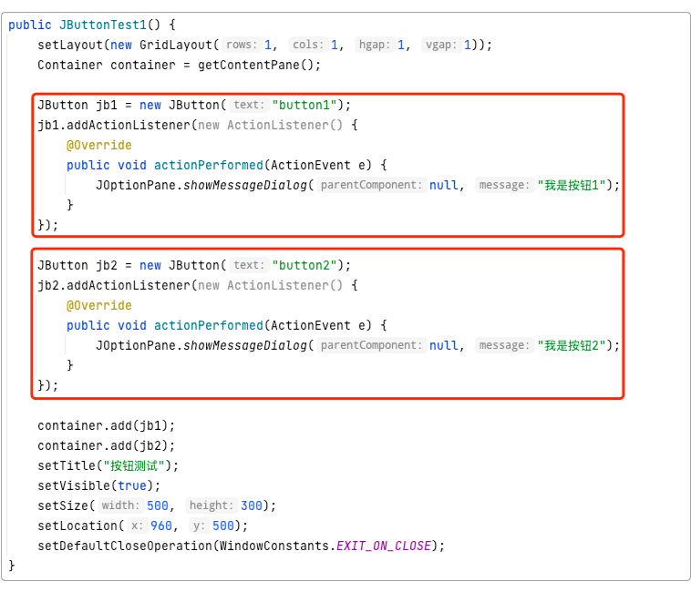

可以看到，红色框部分的代码几乎没有差别，除了数字“1”和“2”这一点点的细微不同之外，其他代码都是一模一样的。而且：

```java
ActionListener listener = new ActionListener() {
    @Override
    public void actionPerformed(ActionEvent e) {
        JOptionPane.showMessageDialog(null, "我是按钮");
    }
};
```

上面这种代码块，在Java中随处可见。它们被称为匿名内部类，或者内隐类。这种代码的本质，其实就是将某段代码“赋值”给了一个变量，用于保存行为。那么既然JButton1、JButton2，......，JButtonN这些按钮所需要的“行为”都差不多，那是不是可以以此为切入点，精简它们呢？所以，一切都从“将代码赋值给变量”开始。

优化过程就此展开。

1. 首先，因为ActionListener是以匿名类的方式实现的，既然都已经“匿名”了，也就不必再以声明的方式出现；
2. 其次，因为button的addActionListener里面已经要求了ActionListener作为参数，所以编译器应该能够通过“上下文”推断出来需要什么，而不用再重复声明一次；
3. 其实coder们写代码，是只需要两个东西的，即数据和结果。所以最外层的匿名类完全可以去掉。优化之后的结果应该是如图5-2所示那样的。

> 图5-2 将匿名类优化掉

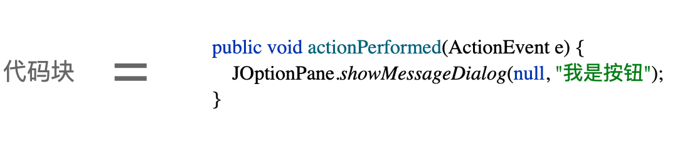

继续优化。

1. 接下来，public是多余的，因为如果只是作为参数，有没有public并没区别；
2. 然后，void也是多余的，编译器可以推断出来有没有返回值，以及它的返回值是啥；
3. 再接下来，方法名actionPerformed也是多余的，因为这段代码已经被“赋值”给变量了，所以它也可以没有名字。优化之后的结果应该是如图5-3所示那样的。

> 图5-3 修饰符等优化掉

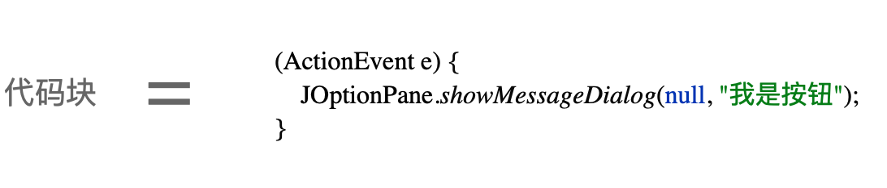

精简到这一步，和返回类型一样，需要什么类型的数据，编译器也应该是能够通过上下文推断出来的。所以，括号里那个ActionEvent也可以省略。并且，代码已经可以放在一行显示了，如图5-4所示那样。

> 图5-4 将代码放在一行


但这样看起来不太美观，最终它成了这个样子，如图5-5所示。

> 图5-5 优化的最终结果


至此，匿名内部类所拥有的“行为”就被“完美”地“赋值”到了代码块中去了。而这个被保留下来的代码块，则被Java称之为“Lambda表达式”。正如我们所看到的，Lambda表达式精简掉了大部分多余代码，只把最关键的行为和参数保留了下来。

#### 5.1.3 过渡到Lambda表达式

从演变过程可以知道，Lambda表达式其实是对匿名内部类的简化，它去掉了多余的语法修饰，只保留了最核心的代码行为。在Java中类似这种场景非常多，比如Runnable接口，就是典型的可以运用Lambda表达式的地方，如图5-6所示。

> 图5-6 Runnable接口优化过程

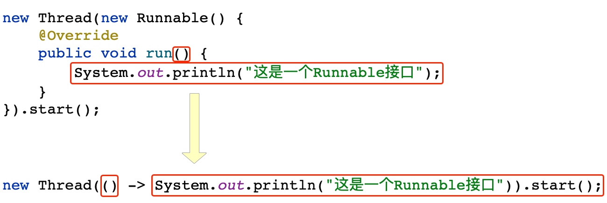

用不够严谨但却直白的话来表述就是：能够用Lambda表达式替代的接口，就是函数式接口。Lambda表达式的特点在于：

1. 匿名：像匿名函数一样，没有名字，只有代码块；
2. 函数：基于接口函数执行，而不是类；
3. 行为：传递行为，而非封装代码。

很多刚开始学习Lambda表达式的新手之所以觉得难于适应，是因为没有弄明白完整的匿名函数是如何进行简化的这个过程。笔者个人的学习经验是，只要在开发时谨记：Lambda是对匿名函数的简化，这样子就会相对容易理解一些了。

Java 8除了将匿名内部类改造成了Lambda表达式之外，还提供了一个专门的注解，叫做@FunctionalInterface。它专门用来自定义需要的函数式接口。可能有的读者还记得，之前在代码清单1-2中使用的正是这样一个接口。函数式接口的用法如代码清单5-4所示。

> 代码清单5-4 FruitInterface.java

```java
@FunctionalInterface
public interface FruitInterface<T> {
   void select(T t);
}
......
FruitInterface face = (t) -> System.out.println("自定义的函数式接口");
```

所以，对于那些不熟悉函数式编程，或者不习惯函数式编程语法的新手，如果想尽快学会并使用函数式编程，那么笔者对于过渡到Lambda表达式的建议如图5-7所示。

> 图5-7 Runnable接口优化过程

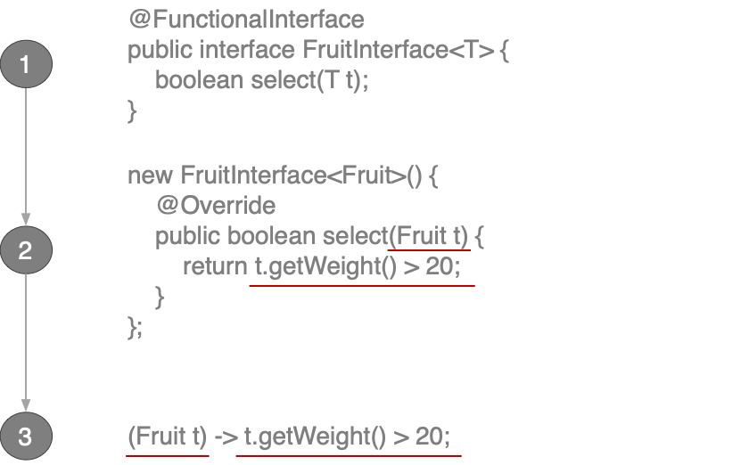

从上图可以看出，先定义一个函数式接口，然后只使用它的参数和业务行为就行了。

除此以外，为了方便coder们开发，Java也预定义好了一些可以拿来就用的函数式接口，如表5-1所示。

> 表5-1 常用的预定义函数式接口

| 预定义接口 | 方法名 | 描述符 | 分类 | 用途说明 |
|:---:|:---:|:---:|:---:|:---:|
| Supplier<T> | T get() | () -> T | 供给型 | 提供一个结果 |
| Consumer<T> | void accept(T) | (T) -> void | 消费型 | 消费一个输入 |
| BiConsumer<T, U> | void accept(T, U) | (T, U) -> void | 消费型 | 消费两个输入 |
| Function<T, R> | R apply(T) | (T) -> R | 映射型 | 完成类型转换 |
| BiFunction<T, U, R> | R apply(T, U) | (T, U) -> R | 映射型 | 同Function，接收两个入参 |
| UnaryOperator<T> | T apply(T) | (T) -> T | 映射型 | 同Function，入参和出参类型一致 |
| BinaryOperator<T> | T apply(T, U) | (T, T) -> T | 映射型 | 同BiFunction，参数类型一致 |
| Predicate<T> | boolean test(T) | (T) -> boolean | 预测型 | 判断输入是否符合预期 |
| BiPredicate<T, U> | boolean test(T, U) | (T, U) -> boolean | 预测型 | 同Predicate，接收两个入参 |

所谓“供给型”的意思就是没有“消费”任何参数却能输出数据。例如Runnable接口就是一个典型的供给型接口，供给型接口可以简化成下列代码段所示那样：

```java
new Thread(() -> System.out.println("这是run()方法里面的打印语句")).start();
```

再比如预测型，可能是：

```java
Predicate<Integer> predicate = (Integer count) -> {return count > 10; };
```

所以，先把Java预定义的函数式接口用熟也是一个不错的开始。笔者之所以用这么多篇幅来说明Lambda表达式和函数式接口，是因为它们的学习曲线确实比较陡，对一些刚入门的新手来说尤其如此。至于方法引用和构造器引用，只要把Lambda表达式和函数式编程的演化过程彻底搞懂了，也就顺其自然能够理解了。

#### 5.1.4 不同的方法引用方式

所谓方法引用，有很多种资料都对它进行了解释，有的说是语法糖，有的说是方法签名和接口恰好一致，还有的说是替换静态方法等诸如此类的。为此，笔者专门针对性地做了一个总结。因为名词术语说得再多也不如实际用上一次来的直观。其实用一个图就可以把方法引用讲得清清楚楚，如图5-8所示。

> 图5-8 方法引用的四种类型

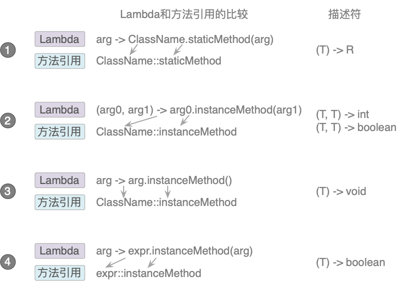

除了第一种静态方法引用外，其他几种都是实例方法引用。

对于第一种静态方法引用，下面两行代码的效果是一样的。

```java
Function<String, Integer> stringToInteger1 = (String s) -> Integer.parseInt(s);
Function<String, Integer> stringToInteger2 = Integer::parseInt;
```

上面这段代码的意思是直接引用Integer的静态方法parseInt()，实现从字符串到数字的映射。这也可以通过它的预定义接口Function和描述符(T) -> R看出来。

而第二种方法引用则是通过实例方法比较两个数字的大小。它的预定义接口BiPredicate<T, U>和描述符(T, U) -> boolean也指明了这一点，如下列代码段所示。

```java
1  Comparator<String> comparator1 = (s1, s2) -> s1.compareToIgnoreCase(s2);
2  BiPredicate<List<String>, String> contains1 = (list, e) -> list.contains(e);
// 和第一行效果一样
3  Comparator<String> comparator2 = String::compareToIgnoreCase;
// 和第二行效果一样
4  BiPredicate<List<String>, String> contains2 = List::contains;
```

在上面的四行代码中，除去注释所占的行数外，第一行和第三行的效果是一样的，而第二行和第四行的效果是一样的。

第三种方法引用和前面类似，通过预定义接口和描述符就知道它在干什么。如下列代码段所示。

```java
1  Consumer<Fruit> consumer1 = (s) -> System.out.println();
2  Function<List<Track>, Stream<? extends Track>> func1 = ele -> ele.stream();
// 和第一行效果一样
3  Consumer<Fruit> consumer2 = System.out::println;
// 和第二行效果一样
4  Function<List<Track>, Stream<? extends Track>> func2 = Collection::stream;
```

最后一种方法引用，如下列代码段所示。

```java
Predicate<Fruit> predicate1 = fruit -> list.add(fruit);
Predicate<Fruit> predicate2 = list::add;
```

这四种方法引用通过预定义接口和描述符，并不难理解。而且在很多情况下，IDEA编辑器还会给出转换提示。至于构造器引用，依据不同的描述符，可以使用不同的构造器引用，如下列代码段所示。

```java
Supplier<Fruit> supplier = () -> new Fruit();
// 等价于
Supplier<Fruit> supplier = Fruit::new;

Function<Integer, Fruit> func = Fruit::new;
// 等价于
Function<Integer, Fruit> func = weight -> new Fruit(weight);
```

很明显，Supplier属于供给型，而Function则为映射型。

#### 5.1.5 回到初始

在学会了Lambda表达式和函数式编程后，刚开始的那个“小麻烦”还是问题吗？先尝试着将代码清单5-4改造一下，如代码清单5-5所示。

> 代码清单5-5 FruitInterface.java

```java
@FunctionalInterface
public interface FruitInterface<T> {
   boolean select(T t);
   ......
}
```

改变了函数式接口FruitInterface原有的select方法返回值，并给它新增加了几个方法。然后让FruitWeightCondition和FruitPriceCondition都实现它，如代码清单5-6和代码清单5-7所示。

> 代码清单5-6 FruitWeightCondition.java

```java
public class FruitWeightCondition implements FruitInterface<Fruit> {
   @Override
   public boolean select(Fruit fruit) {
      return fruit.getWeight() > 20;
   }
}
```

> 代码清单5-7 FruitPriceCondition.java

```java
public class FruitPriceConditionimplements FruitInterface<Fruit> {
   @Override
   public boolean select(Fruit fruit) {
      return fruit.getPrice() < 10;
   }
}
```

再在Furit类中增加一个静态方法filter()，如代码清单5-8所示。

> 代码清单5-8 Fruit.java

```java
public class Fruit {
    ......
    public static List<Fruit> filter(List<Fruit> fruits, FruitInterface<Fruit> fi) {
        List<Fruit> list = new ArrayList<>();
        for(Fruit fruit : fruits) {
            if (fi.select(fruit)) {
                list.add(fruit);
            }
        }
        return list;
    }

    public static void main(String[] args) {
        ......
        heavyFruits = filter(fruits, new FruitInterface<Fruit>() {
            @Override
            public boolean select(Fruit fruit) {
                return fruit.getWeight() > 20;
            }
        });

        List<Fruit> weight = filter(fruits, fruit -> fruit.getWeight() > 20);
        List<Fruit> price = filter(fruits, fruit -> fruit.getPrice() < 10);
    }
}
```

虽然借助Lambda表达式看起来好了点，但还是需要调用filter()方法才能看起来像那么回事。如果剥离filter()的外壳，整个实现仍然臃肿不堪，并没有什么实质性的改变。Lambda表达式真的只能止步于此了吗？并不是，因为还差一步。

### 5.2 流式计算

不管是排序、查找。还是去重等各种业务逻辑，它们都不会是单独存在的，而经常是连贯在一起的。比如查找之前就要先排好序，找到几个相同的数据就要去重，等诸如此类。把这些连贯的步骤拼接起来，就是一个完整的工作流水线，而数据就是流水线上待处理的对象。Lambda表达式只是一种接口的行为方式，并非专用于处理集合。真正让Lambda发挥出巨大威力的，就是这种连接在一起的“流式”计算方法。

#### 5.2.1 什么是“流”

所谓“流”，就是类似工厂流水线那样，让原材料不断从一道工序流转到下一道工序，直到生产出合格的产品。如果把数据处理的方式比作流水线，那么Hadoop、Spark、Storm和Flink就是目前市面上比较大的几家数据处理工厂。它们有各种各样的数据装配间，也就是各种处理数据的算子，将数据按照所需加工成型。所以，如果不懂流式计算，根本做不了大数据开发，如图5-9所示。

> 图5-9 流式计算

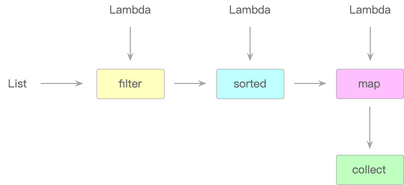

在代码清单5-3中，如果想在List<Employee>中筛选出28岁以下的员工，并且按年龄排序，那么用传统办法或者Lambda表达式的话只能如代码清单5-9所示那样做。

> 代码清单5-9 OldMethod.java核心源码

```java
public class OldMethod {
   ......
   public static void main(String[] args) {
      List<Employee> employees = Arrays.asList(
         new Employee("张三", "男", 28, true, Employee.Type.MANAGER),
         ......
      );
      ......

      // 用传统方法实现员工年龄筛选并排序
      List<Employee> list1 = new ArrayList<>();
      for(Employee employee : employees) {
         if (employee.getAge() < 28) {
            list1.add(employee);
         }
      }
      list1.sort(new Comparator<Employee>() {
         @Override
         public int compare(Employee o1, Employee o2) {
            return o1.getAge().compareTo(o2.getAge());
         }
      });

      // 用lambda方式实现（filter方法同样有大量辅助性代码）
      List<Employee> list2 = filter(employees, employee -> employee.getAge() <= 28);
   }
}
```

可以看到，传统办法要写大量的辅助性代码，而Lambda表达式也差不多，这两种方式完全谈不上简便快速，更别说优雅。而且这还只是处理比较简单的List<Employee>列表对象，如果需要处理List<Company<Employee>>这种嵌套对象的列表，那么无疑代码的复杂度将更高，更显臃肿。如果上述需求用“Lambda表达式 + 流式计算”的话，那么其过程则如代码清单5-10所示。

> 代码清单5-10 OldMethod.java核心源码

```java
......
List<Employee> list3 = employees
                        // 生成"流"
                        .stream()
                        // 条件过滤
                        .filter(emp -> emp.getAge() <= 28)
                        // 按年龄排序
                        .sorted((o1, o2) -> o1.getAge().compareTo(o2.getAge()))
                        // 生成新的结果集合
                        .collect(Collectors.toList());
```

这简直不要太优雅。仅仅一行代码就搞定了，完全没有之前那种“傻、大、黑、粗”的感觉。这里之所以换成几行显示，只是为了注释方便而已。

#### 5.2.2 各种流操作

如果将代码清单5-10的工作原理用图来表示的话，就如图5-10所示那样。

> 图5-10 流的工作原理

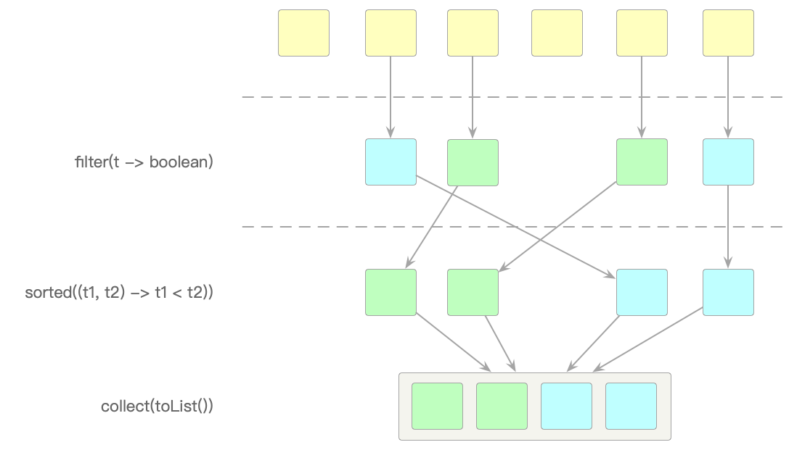

可以看到员工数据集合List<Employee>在经过filter(t -> boolean)算子的工序后，只将符合年龄条件的员工留了下来。接着，筛选出来的数据进入sorted()算子进行排序，最后将排序完成的数据重新放到collect()算子中组成新的员工数据集合。而这一切都是在Java“流”中完成的，无需再写大量的辅助代码，无需声明额外的函数式接口，也没有复杂的一系列步骤——Java把这些苦活累活全都干了。

所有的流式计算可以分为两大类：中间操作和终端操作。

1. 中间操作：只作为中间操作返回另一个流而不是结果，包括filter、map、flatMap等算子；
2. 终端操作：从流水线中生成最终结果，如collect、count、reduce、forEach等算子。

而按照操作方式来划分，流操作的算子又可以分为筛选、切片、映射、查找、匹配和归约等几类。所有的流操作无外乎都是从下列四种方式之一开始的：

1. 数值创建：Stream<String> = Stream.of(“1”, “2”, “3”);
2. 数组创建：int[] numbers = {1, 2, 3, 4}; 或 int sum = Arrays.stream(numbers).sum();
3. 文件生成：Stream<String> s = Files.lines(Path.get(/data.txt), Charset.defaultCharset());
4. 函数生成（无限流）：Stream.iterate(0, n -> n + 2); 或 Stream.generate(Math::random)。

下面把一些常见的不同类别的流操作做简单介绍。

在流操作中一个比较难理解的就是map和flatMap的区别。就笔者的经验，很多新手都搞不清它俩到底有什么不同。先看下面的代码段。

```java
// map：映射，把一种数据类型转换成另外一种数据类型
List<String> list2 = employees.stream()
                       .map(Employee::toString)
                       .collect(Collectors.toList());
// flatMap：扁平化映射
list2.add("hello world");
list2.add("hello china");
list2.stream().map(t -> t.split(" "))
           .flatMap(Arrays::stream)
           .distinct()
           .forEach(System.out::println);
```

在map()算子中，将员工对象Employee转换成了一串人名列表，map()算子的过程可以用图5-11表示。

> 图5-11 map()算子的工作机制

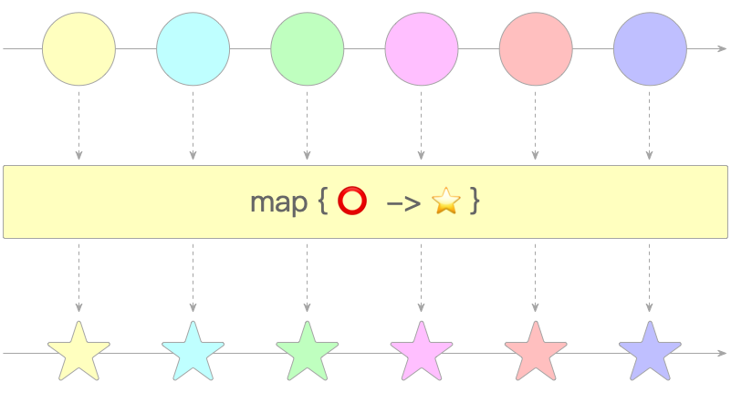

相信读者们都能很容易地理解这种“映射”关系：将一种类型转换为另一种类型。而flatMap()算子所谓的“扁平化”映射就不那么好理解了。flatMap()算子的执行过程可以用图5-12表示。

> 图5-12 flatMap()算子的工作机制

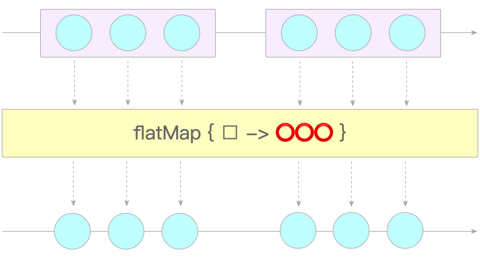

用一种比较形象的方式来描述它就是：flatMap()算子是把禁锢数据的外层给“压”平了，然后再执行映射。

流操作中另一个比较难于理解的就是归约reduce()算子。如下列代码段所示。

```java
List<Integer> list3 = Arrays.asList(9, 7, 1, 5, 8, 10, 6).stream().reduce(0, Integer::sum);
```

上面的代码将一组整数汇总求和，其过程如图5-13所示。

> 图5-13 reduce()算子的工作机制

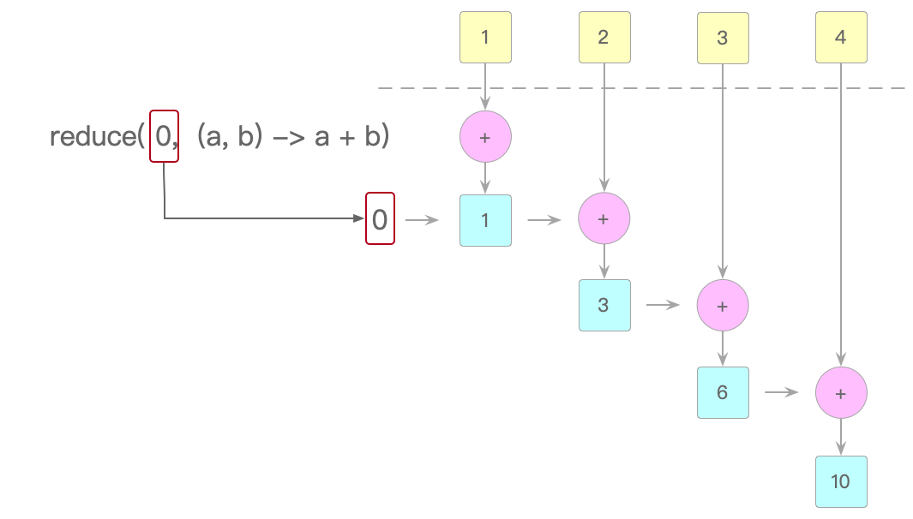

reduce()可以传入一个初始值，并在此数值的基础上累加，上面代码中传入的是0。

除了这些基础的流计算之外，更多流式计算的示例代码都放到了cn.javabook.chapter05.stream包的StreamClient类中，例如分组和分区，感兴趣的读者可以参考。Lambda表达式、函数式接口和流式计算结合在一起，就是函数式编程的全部内容了。Java 8虽然还更新了一些其他的新特性，比如组合异步编程、日期时间API、Optional等，但与函数式编程相比，就相对没那么重要了。

### 5.3 本章小节

在Java 8之前，处理业务逻辑中复杂的数据结构时，Java集合类显得力不从心。不仅仅是因为需求的繁复多变，更多的其实是面向过程的功能与面向对象的编程语言之间编程范式的冲突。Java注意到了这一点，并在Java 8版本中推出了函数式编程这一全新特性。

在通过匿名内部类实现某些功能时，除了参数和业务行为的不同，在代码层面，重复度极高。针对这个问题，Java 8通过Lambda表达式对此进行了优化。Lambda表达式是一种保存业务行为的代码块。通过编译器的推导，只保留了参数和真正执行业务行为的部分代码，并且Lambda表达式最终被函数式接口变量所引用，成为函数式编程的核心内容之一。刚开始接触函数式编程的新手不易掌握。本章通过详细介绍Lambda表达式的演变、Java 8中预定义的函数式接口种类及相关描述符，力图最大程度平滑这种学习曲线。

虽然Lambda表达式已经使Java在面向过程的编程风格上有了巨大的改进，但在实际开发工作中仍然有不少问题。如果开发中遇到稍微复杂一些的对象嵌套式列表数据，就会不得不额外编写很多冗长的辅助性代码。此时，流式计算上场了。流式计算将数据看作流水线上待处理的原材料，从一道工序转到下一道工序，所有的处理过程都是透明的，极大地提升了开发效率。

### 5.4 本章练习

1. 既然已经找到了函数式编程这个宝藏。那么再回到最初的问题：当要实现若干家大厂，如某宝、某东和某哈哈的员工联谊并解决单身问题时，有更好的办法吗？可不可以只用一行代码搞定？

2. 能用flatMap()算子将分属不同部门的员工合并到一起呢？部门员工如下面代码清单所示：

```java
List<Employee> dept1 = Arrays.asList(
      new Employee("王林", "男", 20, false, Employee.Type.MANAGER),
      new Employee("石昊", "女", 25, false, Employee.Type.MANAGER),
      new Employee("小伦", "男", 18, false, Employee.Type.SELLER)
);
List<Employee> dept2 = Arrays.asList(
      new Employee("李慕婉", "女", 20, false, Employee.Type.OFFICER),
      new Employee("柳神", "女", 10000, false, Employee.Type.OFFICER),
      new Employee("彦", "女", 7000, false, Employee.Type.OFFICER)
);
```
