## 第6章 反应式编程

在软件开发领域，继面向过程的函数式编程范式之后，另一种称为反应式编程 (Reactive Programming) 的范式慢慢流行起来，它又叫响应式编程。反应式编程是一种关注数据流（Data Stream）和变化传播（Propagation of Change）的声明式（Declarative）的编程范式。用大白话来说就是，它通过异步数据流和事件驱动的方式来实时处理静态或动态数据，而且保证这些数据可以得到稳定和即时的更新。

本章讲解了反应式编程的发展过程，以及三种不同的反应式编程框架Vert.x、Reactor和Spring WebFlux。

### 6.1 “一切皆是流”

正如面向对象的编程语言Java号称“一切皆是对象”那样，在反应式编程范式中，“一切皆是流”。大部分碳基生物，时时刻刻都要吸入和呼出氧气，也就是气流；除了呼吸，还需要通过吃东西来补充能量，这是食物流；我们平常看到的风景、人物、短视频之类的，都属于视觉流。还包括语音流等。

事实上，“流”具有如下的属性：

1. 流基本上都是持续且源源不断的，有的流无法主动终止，如噪音污染；
2. 各个流之间基本上都是异步进行的；
3. 流与流之间有明显的“边界”；
4. 各种流的“速度”是不一样的，有的流速度快，有的流速度慢；
5. 流可以被“订阅”，例如短视频。可以不看它，不再接收发过来的内容；
6. 多个流可以被合并，一个或多个流也可以用作另一个流的输入，例如语音流既可以独立流动，也可以作为视频流的一部分；
7. 只要流输入发生变化，流的输出会相应自动变化，这种变化是“传递”的。

而对于计算机程序来说，各种外部事件，例如用户点击页面按钮、发送聊天消息、键盘敲击、蓝牙耳机不断接收音乐数据等，它们也具有流的属性，程序需要及时对这些流做出响应，或者反应。

#### 6.1.1 Reactive eXtensions

最早的反应式编程的实现是ReactiveX，它是Reactive eXtensions的缩写，一般简写为Rx。在2009年它被微软用DotNet编程语言的方式实现。其发展历程如图6-1所示。

> 图6-1 Rx发展历程

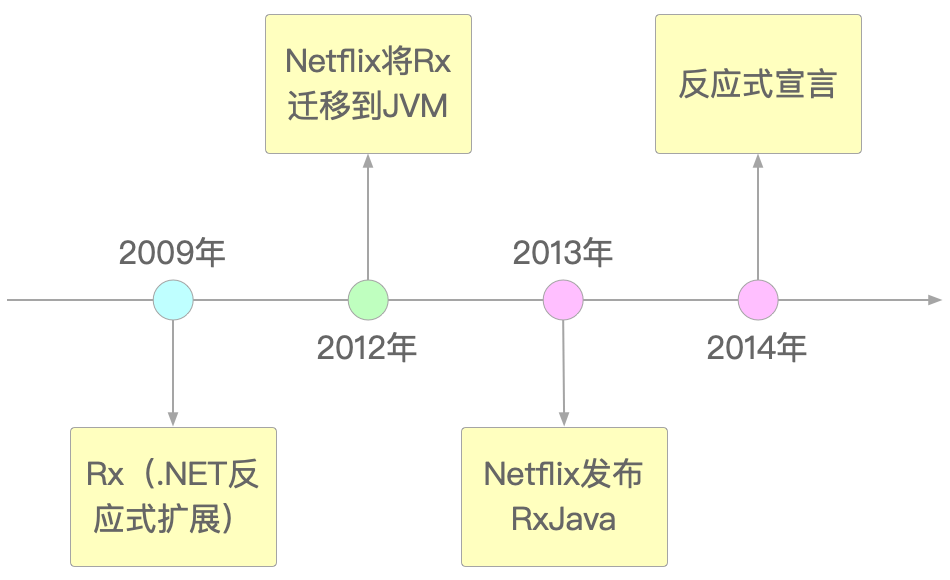

Rx融合了设计模式中的观察者模式、迭代器模式，以及函数式编程范式。它以一种简单的方式了一个创建异步的，且基于事件驱动的编程范式，并用它来实现创建、订阅、组合、过滤和映射数据流的诸多功能，这种范式被以“反应式宣言”的形式发表。

这份宣言也同时“规定”了所有反应式系统所必须具备的四大特性，它主要使用“消息（或事件）驱动”作为手段来构建系统，在形式上达到所谓的“弹性”和“回弹性”，最后产生“即时响应性”的价值。

“宣言”对这四个特性的解释也很简单直白，即：

1. 即时响应性：为了用户体验，哪怕系统再繁忙，只要还在运行，就应该及时地响应用户请求；
2. 回弹性：就算系统出现异常或错误也要保持即时响应，而不是不闻不问；
3. 弹性：系统性能可以做到伸缩自如，也就是说在业务高峰期能及时调集资源保证系统运行平稳，而在业务低谷期也能及时释放资源以节约成本；
4. 消息（或事件）驱动：不同组件之间的互相调用通过异步的消息传递来实现。这样既明确了组件的职责边界，又达到了解耦的目的。

在第四个特性中特别提到了Backpressure问题，也就是“背压”（或“回压”）。所谓Backpressure，其意思就等同于是“防洪措施”——当上游生产速度大于下游消费速度的时候，可能会把系统给“冲垮”。Backpressure的出现和Buffer的大小有关。只有当Buffer设置不合理的时候才会出现Backpressure。

从反应式宣言来看，Rx适用于从前端、移动端再到服务端的任何应用场景。在前端页面上，它通过消息驱动的方式处理Web UI事件和API应答；在移动端APP中，实现基于事件流的链式网络请求；而在服务端中，通过异步调用和简单的并发处理，实现松耦合的系统架构。但如果只是做一个简单且无需升级的单体应用，就没有必要用Rx了。

到目前为止，已经有十几种编程语言支持Rx，也出现了诸多流行的Rx框架，例如RxJava、RxKotlin、Rx.NET、Vert.x、Spring WebFlux和BaconJS。由于它们标准不一，且相互之间缺乏互操作性，因此给开发者造成了一些不必要的麻烦和选择困难。

为了解决这个问题，Reactive Streams规范出现了。

#### 6.1.2 Reactive Streams

Reactive Streams是一种针对运行时环境和网络协议的非阻塞式背压异步流处理规范。

这么说有点绕口，翻译成大白话就是：为了统一不规范的反应式编程范式，Reactive Streams推出了一组标准规范，只要是遵循这些规范的框架和编程语言，不仅能够满足对反应式编程开发的需求，它们之间还能实现互操作。

Reactive Streams声明其主要目标是处理跨边界的流数据的交换，也就是处理不同异步线程或线程池之间的数据交换，同时确保接收方不会出现Backpressure问题。同时，Reactive Streams只涉及在不同的API组件之间调用数据流，并在其开发过程中，确保Reactive Streams规范可以涵盖所有流调用的基本方式，但不包括对流操作进行精确的控制，如转换、合并、拆分等。总之，Reactive Streams规范是一种基于异步流处理的标准，旨在使流处理更加可靠、高效和响应式，如图6-2所示。

> 图6-2 Reactive Streams规范


2015年首次创建的Reactive Streams API包含了4个接口：

1.Publisher：发布者，它定义了生产元素并将其发送给订阅者的方法。它也可能是一个有无限数量有序元素的提供者，并将这些数据发布给订阅者；
2.Subscriber：订阅者，它定义了接收元素并进行处理的方法。它也是一个流观察者，从发布者那里接收并处理数据流；
3.Subscription：订阅行为，定义了订阅者和发布者之间的协议，包括请求数据和取消订阅等操作。
4.Processor：处理器，定义了同时实现Publisher和Subscriber接口的中间件，它可以对数据进行转换、合并、过滤或映射等操作。

Reactive Streams在Java中以JDK 9的java.util.concurrent.Flow接口形式出现。Flow接口与Reactive Streams完全等价，如代码清单6-1所示的Flow源码。

> 代码清单6-1 Flow.java

```java
public final class Flow {
    private Flow() {}

    @FunctionalInterface
    public static interface Publisher<T> {
        public void subscribe(Subscriber<? super T> subscriber);
    }

    public static interface Subscriber<T> {
        public void onSubscribe(Subscription subscription);
        public void onNext(T item);
        public void onError(Throwable throwable);
        public void onComplete();
    }

    public static interface Subscription {
        public void request(long n);
        public void cancel();
    }

    public static interface Processor<T,R> extends Subscriber<T>, Publisher<R> {
    }
    ......
}
```

Flow虽然遵守了Reactive Streams的标准规范，但它本身并没有具体实现，而是通过RxJava、Reactor、Akka Streams等其他框架实现的。可以通过一个具体的RxJava例子来说明，如代码清单6-2所示。

> 代码清单6-2 RxJavaDemo.java

```java
public class RxJavaDemo {
    public static void main(String[] args) {
        // 第一种：RxJava 1.x不支持背压
        Observable.create(new ObservableOnSubscribe<String>() {
            @Override
            public void subscribe(@NonNull ObservableEmitter<String> emitter) {
                ......
            }
        }).subscribe(
            new Observer<String>() {
                @Override
                public void onSubscribe(@NonNull Disposable disposable) {
                    System.out.println("Disposable: " + disposable.toString());
                }
                ......
        });
        // 第二种：RxJava 2.x及以上支持背压
        Flowable.create(new FlowableOnSubscribe<String>() {
            @Override
            public void subscribe(@NonNull FlowableEmitter<String> emitter) {
                ......
            }
        }, BackpressureStrategy.ERROR)// 背压策略
                .subscribe(
                    new Subscriber<String>() {
                        @Override
                        public void onSubscribe(@NonNull Subscription subscription) {
                            subscription.request(2);
                            System.out.println("Subscription: " + subscription.toString());
                        }
                        ......
                    }
        );
    }
}
```

在代码清单6-2中，通过两种方式实现了发布-订阅。Observable和Flowable都作为被观察对象，它们扮演的是都发布者Publisher的角色。而匿名内部类Observer和Subscriber则作为观察者，扮演的是订阅者Subscriber的角色，通过Publisher.subscribe()方法实现内容的订阅。之后，Subscriber调用onSubscribe()方法接收订阅数据，通过onNext()方法处理数据，当所有的处理完成后，调用onComplete()方法结束。唯一不同的是，Observable不支持背压，而Flowable支持。这一点从代码中就能够看出来。只有明确设置了接收事件的数量，才能收到Publisher发送的事件，也就是如下列代码段所示：

```java
......

subscription.request(n);

......
```

不设置它，作为Flowable的观察者Subscriber是永远也响应不了事件的。Observable和Flowable的区别如图6-3所示。

> 图6-3 Observable和Flowable的区别

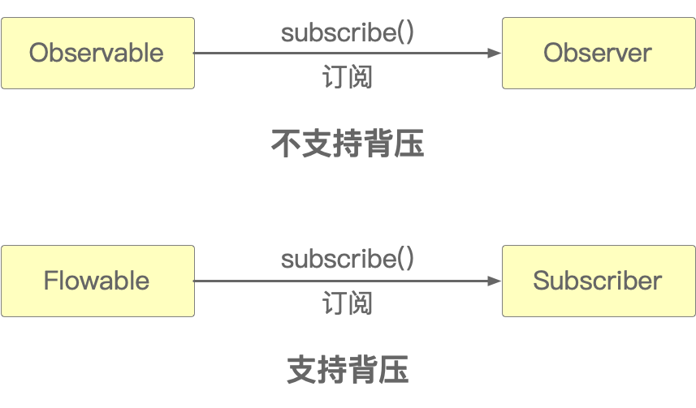

Reactive Streams包括五个特性：变动传递、数据流、声明式、背压和异步边界。

首先，“变动传递”其实就是事件驱动，当发布者Publisher生产一个数据后，就把它放入到组件中。之后数据就会在组件中不断传递，直至抵达终点。就像Excel电子表格那样，只要某个单元格中的数值发生变化，那么其后所有的公式结果都会发生变化，这就是基于事件驱动的变动传递，这也是反应式编程之所以称为“反应”的原因之一。

其次，变动传递是基于“数据流”进行的，而数据流则是按时间顺序排列的即将发生的事件的序列，这个序列上包含事件的创建、处理、异常和结束。如图6-4所示。

> 图6-4 数据流

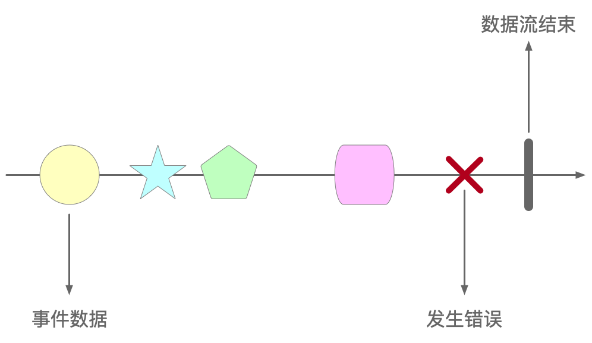

当产用户输入URL网址，然后再输入用户名密码并单击提交按钮时，一系列的事件就会被触发，并随之触发其他更多的功能，这一系列的过程连贯起来就是数据流。

第三，“声明式”的意思是说程序保存的不再是结果，而是逻辑。例如下列代码段：

```java
m = 1;
n = 2;
k = m + n;
```

在传统命令式编程中，k仅保存当次计算的结果，即3。如果m和/或n 的值发生变化，那么需要重新执行一遍赋值语句才能改变k的值。但在反应式编程中，k保存的是m + n的计算逻辑，只要当m和/或n的值发生任何变化，那么k的值也一定会随之发生变化，而不需要重新再次执行赋值语句。

第四，“背压”的意思之前说过，是为了防止上游冲垮下游，如图6-5所示。

> 图6-5 背压

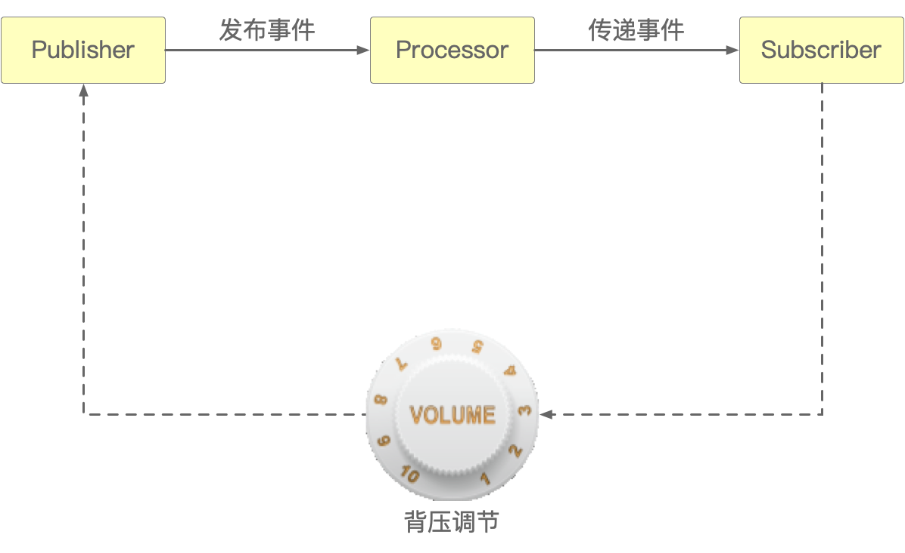

背压就是一种保护机制，比如音量太大了耳朵受不了，就会把音量调小一点。它同时也是一种组件之间协调速度的方法，可以让Subscriber向Publisher反馈其消费能力。

最后，“异步边界”指的是数据以异步的方式在流之中传递，强制它不能阻塞发布者，尤其是线程之间是被不同的组件或算子所隔离的。

#### 6.1.3 观察者模式

Reactive Streams API的四个接口定义了发布者和订阅者，而这种发布-订阅关系还有另外一个名称：观察者模式。如图6-6所示。

> 图6-6 观察者模式示意图

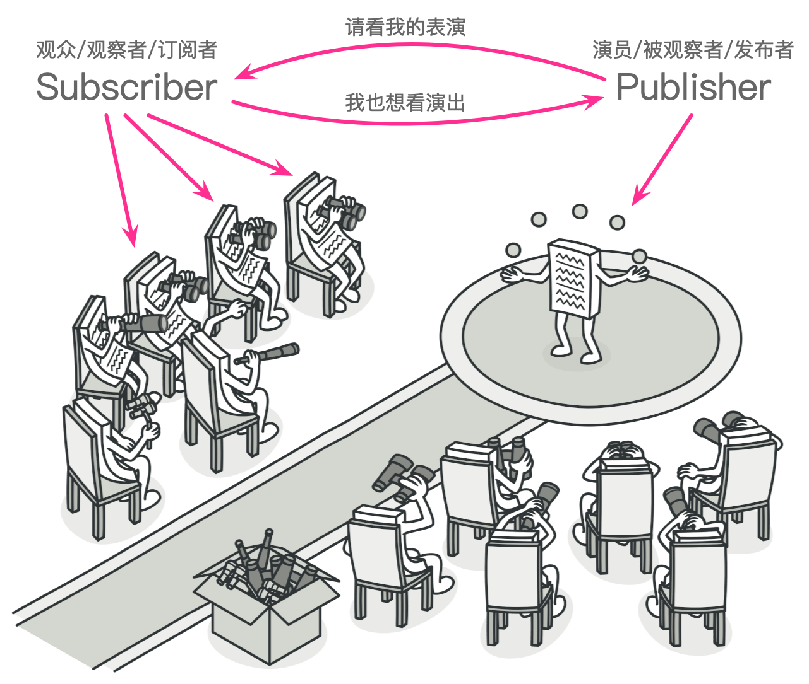

可以用代码来实现这种剧院和观众的观察者模式，如代码清单6-3所示。

> 代码清单6-3 Theatre.java

```java
public class Theatre {
    @FunctionalInterface
    interface Viewer {
        public void watch();
    }

    static class ConcreteViewer implements Viewer {
        @Override
        public void watch() {
            System.out.println("正在看表演");
        }
    }

    static class Actor {
        private final List<Viewer> viewers = new ArrayList<>();
        public void sell(Viewer viewer) {
            viewers.add(viewer);
        }
        public void play() {
            for (Viewer viewer : viewers) {
                viewer.watch();
            }
        }
    }

    public static void main(String[] args) {
        ConcreteViewer concreteViewer1 = new ConcreteViewer();
        ConcreteViewer concreteViewer2 = new ConcreteViewer();
        Actor actor = new Actor();
        actor.sell(concreteViewer1);
        actor.sell(concreteViewer2);
        actor.sell(() -> System.out.println("正在包厢看表演"));
        actor.play();
    }
}
```

所以，反应式编程本质上就是Lambda表达式、流式计算和观察者模式的结合，如图6-7所示。

> 图6-7 反应式 = 算式 + 流式 + 模式

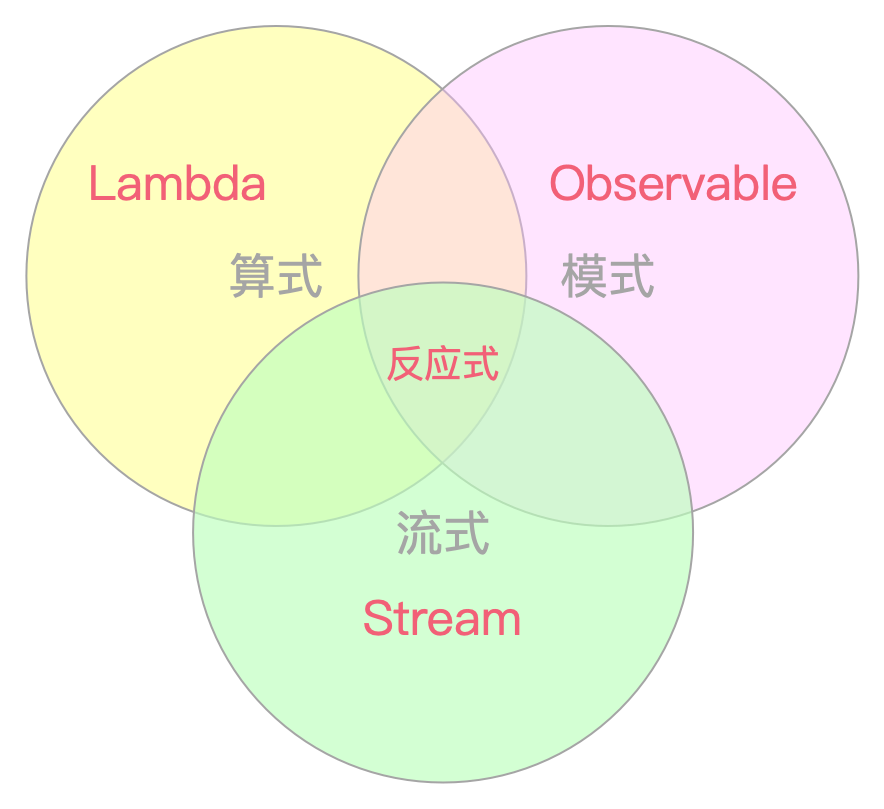

### 6.2 Vert.x

Vert.x诞生于2011年，比RxJava还要早。可以说是目前最古老的反应式编程框架之一。当时叫做node.x，但之后改为了现在的名字。Vert.x是Eclipse软件基金会顶级Java开源项目之一，截止本书出版前，Vert.x已经发展到了4.5.x版。

官方介绍说Vert.x是一个运行于JVM平台之上的轻量级、高性能的异步无阻塞Java Web开发框架，Vert.x依靠全异步的事件驱动框架Netty，支持多种编程语言，非常适用于移动端后台、互联网及企业应用架构。总之，Vert.x的作者对它用一句话给出了概括：JVM之上的反应式编程套件。

#### 6.2.1 Vert.x特性

Vert.x的特性较多，例如异步驱动已经可以支持PostgresSQL、MySQL、MongoDB、Redis等常用中间件，支持Java、JavaScript、Ruby、Python、Groovy、Clojure、Ceylon等多种编程语言，可以非常方便的和Spring Boot，Spring Cloud，Nodejs等框架结合起来进行开发等。

Vert.x是基于事件驱动的编程模型，使用Vert.x开发时，工程师们只需要编写事件处理器event handler即可。例如，当使用Vert.x编写TCP Socket应用时，如果Socket有数据输入或输出时，event handler会立即被创建并调用。

Vert.x用作业务处理时，基本上就对应于传统MVC中的Service层，但又不一样。因为Vert.x是全异步的，而传统的Service业务逻辑基本上都是按照顺序“同步”执行的，如果用Vert.x的方式用全异步来实现Service，会导致业务逻辑看起来极其紊乱，根本没法读懂代码。所以Vert.x不适合融入到类似电商购物、交易对账这种流程冗长、逻辑严谨的业务中，反倒是非常适合于构建网络连接、消息传递这种天然就具备异步工作属性的业务服务。所以在Vert.x的概念中，没有MVC，没有三层架构，没有AOP，没有ORM这种传统开发范式中才有的概念，它颠覆了很多东西。

在动手开之前，需要先重点说明或澄清一下Vert.x中几个比较重要的东西。

1. Verticle：它是Vert.x中可被部署运行的最小化的业务处理引擎，可以把一个Verticle当成是一个Service实例。一个应用程序可以是由单个Verticle或由EventBus连接起来的多个Verticles构成；
2. Module：一个Vert.x应用由一个或多个Module组成，Module几乎就等同于Maven多模块项目中的Module，或者一个jar包；
3. EventBus：它是Vert.x的核心，负责实现不同Verticle之间的通信；
4. Shared Data：官方给出的文档说它是一种在各个不同应用之间安全地共享数据的方式，它保存共享数据的形式是Map集合。

由Verticle、Module、EventBus和Shared Data所组成的Vert.x的框架，如图6-8所示。

> 图6-8 Vert.x框架

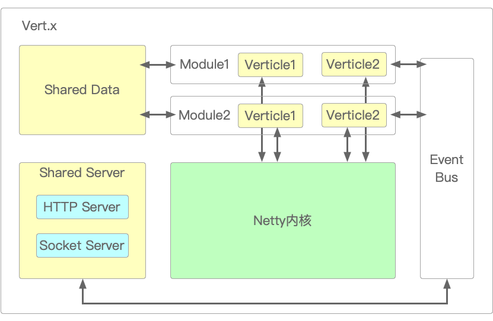

#### 6.2.2 运行Vert.x项目

Vert.x非常容易上手，习惯于使用Spring框架的程序员，只要掌握了函数式编程范式，就能很快学会用Vert.x做开发。通过访问vertx.io网站，按照提示一步步地执行，可以用脚手架搭建一个最简单的Demo，如图6-9所示。

> 图6-9 脚手架“App generator”

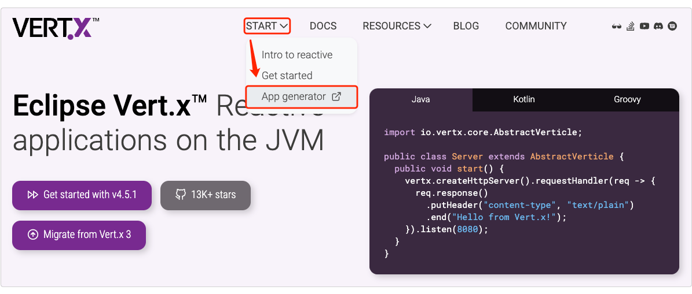

点击“App generator”之后，就可以创建Vert.x项目了，如图6-18所示。接下来，通过点击页面上的 “Show dependencies panel”就出现了各种可供选择的依赖包。其中列出了诸如Web、Data Access、IoT、Testing之类的。

在一般的互联网应用中，Web和数据库这两个依赖组件几乎是必选的，而使用Vert.x访问MySQL数据库无需依赖JDBC。选择好依赖包之后就可以点击“Generate Project alt + ⏎”了。它会生成并下载一个starter.zip压缩包，解压后导入到IDEA当中，如图6-10所示。

> 图6-10 导入Vert.x项目

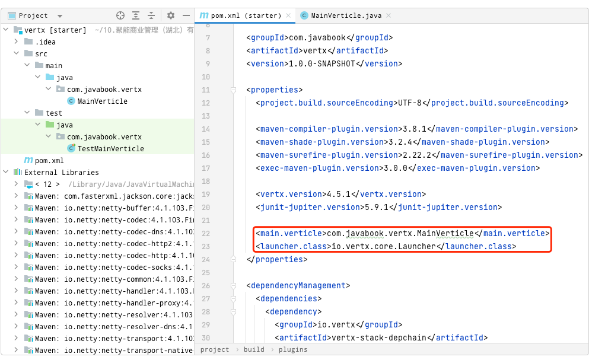

因为Vert.x项目的运行，既不同于普通的Java项目那样直接运行main()方法启动，也不同于Spring Boot项目那样用注解指定应用入口SpringBootApplication，而是需要工程师自行手动设置的。

想把Vert.x项目跑起来，先要将图6-10中红色框部分的内容拷贝下来，也就是如下列代码段所示的内容。

```java
<main.verticle>cn.javabook.chapter06.MainVerticle</main.verticle>
<launcher.class>io.vertx.core.Launcher</launcher.class>
```

然后在IDEA的右上角点击“Edit Configuration”，弹出增加配置界面，增加一个新的Application配置，并在“Name”框中输入一个应用名称。在“Main Class”输入框中填写<launcher.class>标签里的内容，而在“Program arguments”中则写上“run”和<main.verticle>标签里的内容。输入完后点击“Apply”或“OK”保存，如图6-11所示。

> 图6-11 配置Vert.x项目

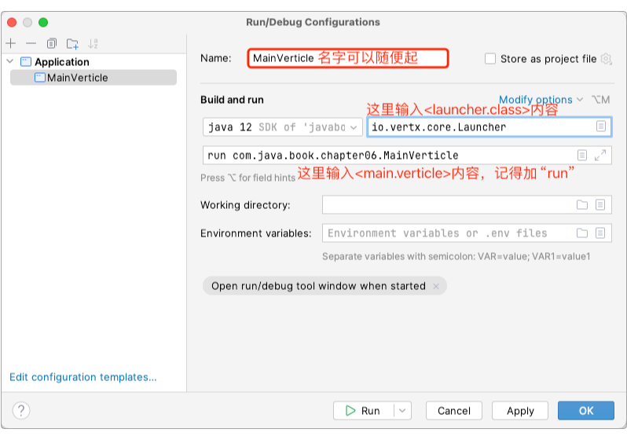

这里要记得输入时不要忘了在<main.verticle>标签内容的前面加上“run”。配置完成后，就可以通过点击IDEA右上角的绿色三角形运行程序了。

因为Vert.x项目默认在8888端口启动，所以在浏览器中访问http://localhost:8888，就能看到网页上出现的默认内容“Hello from Vert.x!”。

#### 6.2.3 创建GET或POST接口

因为刚才的代码只是启动了一个HTTP服务，但并未为这个HTTP服务创建任何的可访问接口。所以，接下来就来实现它。

对于任何Web应用来说，跟在端口后面的路径，本质上都是路由。不同的路由就决定了不同的访问地址和访问方法。例如“localhost:8888/getUser?username=admin”和“localhost:8888/getUser”，虽然接口很类似，但其实是两个不同的路由。因此如果需要创建能够让外部应用访问的接口，那么首先就要创建一个路由。如代码清单6-4所示。

> 代码清单6-4 MainVerticle.java部分源码

```java
public class MainVerticle extends AbstractVerticle {
  @Override
  public void start(Promise<Void> startPromise) {
    Router router = Router.router(vertx);
    ......
  }
}
```

代码中的成员变量vertx，是MainVerticle的父类AbstractVerticle已有的成员变量，它是整个Vert.x极为核心的一个类，它的作用类似于Spring的BeanFactory，负责创建I/O服务，管理定时器，获取对事件总线API的引用等，它是整个Vert.x应用的入口类。所有继承自AbstractVerticle的子类都可以直接使用它，而Router类则是专用于接收http请求并将其分发到对应的路径中去。刚接触Vert.x的新手，如果不熟悉这些类的用法也没关系，官网已经提供了非常详细的指导，可以访问官网的文档，找到对应的Vert.x Web部分。点击进去之后，就能在左边找到“Routing by HTTP method”项，然后再点击它，就能看到官网上对此的详细示范了，如图6-12所示。

> 图6-12 Routing by HTTP method

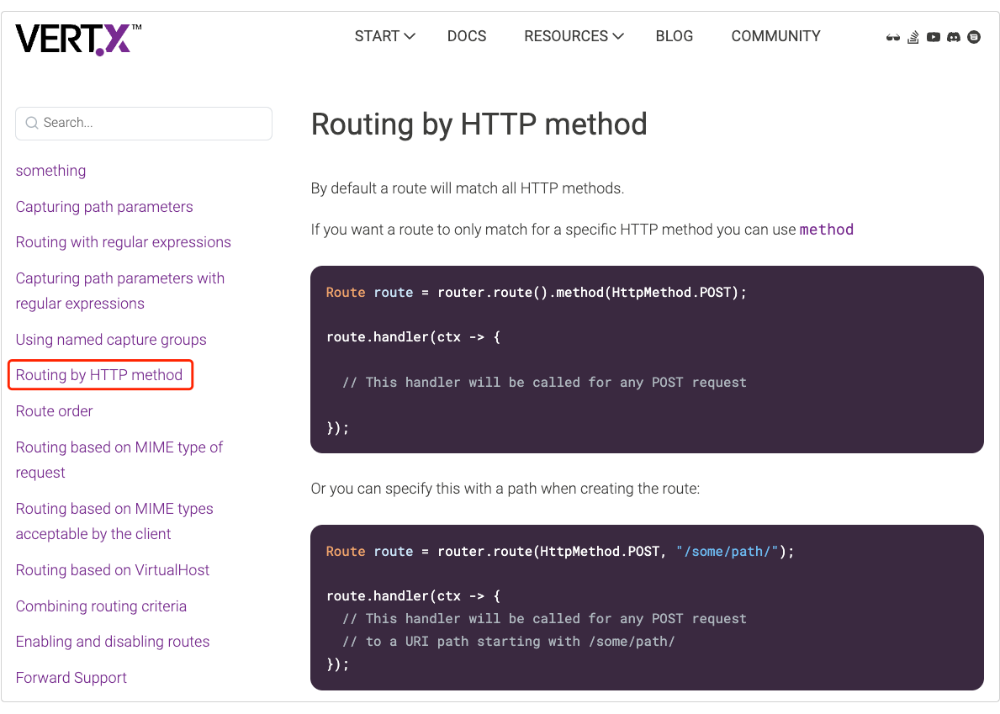

接下来，就可以参照官方的指引开发http接口。完整的代码如代码清单6-5所示。

> 代码清单6-5 MainVerticle.java部分源码

```java
public class MainVerticle extends AbstractVerticle {
  @Override
  public void start(Promise<Void> startPromise) {
    Router router = Router.router(vertx);
        ......
    router.route(HttpMethod.GET, "/vertx/get")
      .handler(context -> {
          MultiMap queryParams = context.queryParams();
          ......
      });

    router.route(HttpMethod.POST, "/vertx/api/:id/:username/")
      .handler(context -> {
          ......
      });

    vertx.createHttpServer().requestHandler(router).listen(8888, http -> {
      if (http.succeeded()) {
        startPromise.complete();
        System.out.println("HTTP server started on port 8888");
      } else {
        startPromise.fail(http.cause());
      }
    });
  }
}
```

编写完代码之后启动服务，通过Postman以GET方法访问http://localhost:8888/vertx/get接口，以POST方法访问http://localhost:8888/vertx/api/{id}/{username}/接口，访问结果均正常。注意POST方法后面要带上“/”，因为代码中的URI字符串就是"/vertx/api/:id/:username/"，如果不加上“/”则会出现“Resource not found”错误。

#### 6.2.4 访问MySQL

如果仅仅只是访问一下接口，那肯定是无法满足一般Web应用的需求的，它至少要能访问与操作数据。所以，现在就来给Vert.x加上操作MySQL数据库的功能。还是和之前的方式一样，如果读者觉得无从下手，仍然可以从官方的示例文档开始，如图6-13所示。

> 图6-13 Connecting to MySQL

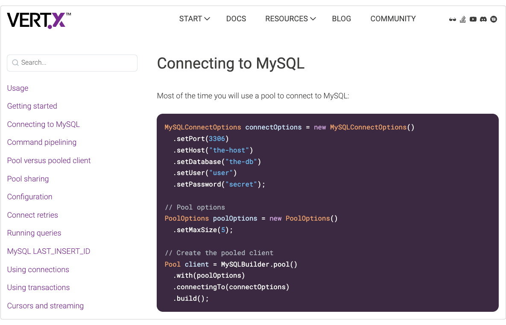

可以直接拷贝官方示例文档中的代码。但需要注意的是，直接使用示例代码会出错，如图6-14所示。

> 图6-14 直接套用代码报错

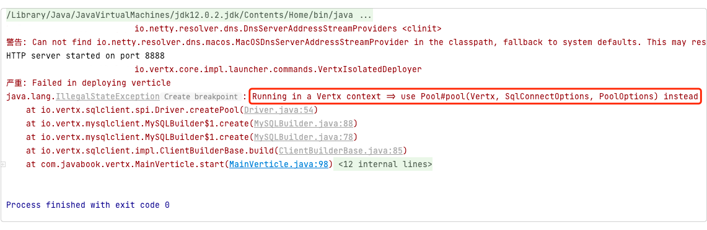

抛出的异常内容是“Running in a Vertx context => use Pool#pool(Vertx, SqlConnectOptions, PoolOptions) instead”，意思是数据库连接池没有使用vertx上下文。也就是需要在连接池中加上AbstractVerticle的成员变量vertx，让它成为上下文。因此这段官方给出的代码需要在创建连接池时增加一个using(vertx)方法。如下列代码段所示：

```java
SqlClient client = MySQLBuilder
          .client()
          .with(poolOptions)
          .using(vertx)// 这里要记得加上vertx上下文，否则抛异常
          .connectingTo(connectOptions)
          .build();
```

不知道官方的示例源码为什么会有一个如此明显的漏洞，截止本章完成时此漏洞仍存在。访问MySQL的代内容如代码清单6-6所示。

> 代码清单6-6 MainVerticle.java部分源码

```java
public class MainVerticle extends AbstractVerticle {
  @Override
  public void start(Promise<Void> startPromise) {
    ......
    MySQLConnectOptions connectOptions = new MySQLConnectOptions()......;
    PoolOptions poolOptions = new PoolOptions().setMaxSize(5);
    SqlClient client = MySQLBuilder
              .client()
              ......;

    client.query("SELECT * FROM test")
          .execute()
          .onComplete(ar -> {
              if (ar.succeeded()) {
                  RowSet<Row> result = ar.result();
                  System.out.println("获取到了 " + result.size() + " 行数据");
                  for (Row row : result) {
                      System.out.println("id = " + row.getString("id"));
                  }
              } else {
                  System.out.println("Failure: " + ar.cause().getMessage());
              }
              client.close();
          });
  }
}
```

启动服务，可以直接在控制台看见访问数据库的数据。前提是数据库和表都必须存在，这里的test表的表结构可以随意创建，只要能看到数据就行。

也可以把这段代码放到接口中去，或者抽象出来做成Service服务。这样就可以形成较为完整的功能应用了。

### 6.3 Reactor

Reactor是第四代反应式库，它围绕Reactive Streams标准，在JVM之上构建出一组非阻塞、事件驱动风格的API。Reactor直接和Java函数式编程整合，例如组合异步组件CompletableFuture和流Stream。Reactor目前由projectreactor.io维护，其主要核心库是reactor-core，它是基于事件回调实现反应式编程，从命令时编程转化为响应式编程有一定的学习成本，Java工程师一开始可能不太习惯这种编程模式。所以对于学习Reactor，笔者的建议是：

1. 掌握异步的概念，理解为什么需要异步。这一点在第1章已有详细论述；
2. 掌握函数式编程范式。这一点在第5章中已有专门论述；
3. 掌握观察者模式。这一点在后续章节“支付系统设计模式”中有专门论述；
4. 理解Reactive Streams规范，掌握观察者模式；
5. 多参考projectreactor.io的官方文档。

Reactor提供了两个异步组件：Flux和Mono。它们都实现了Reactive Streams规范的Publisher接口。Flux表示可以发出0个或者N个元素的反应式序列，并根据实际情况结束处理或触发错误。而Mono则表示可以发出0个或1个事件，所以它常用于在异步任务完成时发出通知。为了满足开发需求，也为了减少工程师的工作量，Flux和Mono都已集成了大量生成数据的方法和操作符。

#### 6.3.1 Flux

对Reactor有了一个大致的概念之后，就可以先试一试了。代码清单6-7展示了几个使用Flux的小例子，如下所示。完整代码在cn.javabook.chapter06.FluxDemo类。

> 代码清单6-7 FluxDemo.java部分源码

```java
public class FluxDemo {
    public static void main(String[] args) throws InterruptedException {
        // 一：两段代码完成一样的功能：一段命令式编程，一段反应式编程
        int[] array = new int[] {1, 2, 3};
        for (int i : array) {
            int result = i * i;
            if (result > 3) {
                System.out.println(result);
            }
        }
        // 反应式编程
        Flux.just(1, 2, 3).log()
            .map(i -> {
                return i * i;
            }).log()
            .filter(i -> i > 3).log()
            .subscribe(System.out::println);
        ......
        // 二：定期生成一个自增数
        Flux.interval(Duration.ofMillis(300)).log()
            .map(output -> {
                if (output < 5) {
                    return " output " + output;
                }
                throw new RuntimeException("good game！");
            }).log()
            .retry(1).log()
            .elapsed().log()
            .subscribe(System.out::println, System.err::println);
        TimeUnit.MILLISECONDS.sleep(3000);
    }
}
```

这几个小例子分别代表了几种不同的应用场景，比较有代表性。在上述代码中：

1. 除了subscribe()方法之外，每个Flux操作符或算子后面都跟了一个.log()方法，它可以打印出每个算子的执行过程；
2. subscribe()算子的作用等同于函数式编程中的终端操作符，例如forEach()。也就是说，除非调用subscribe()算子，否则流不会对其中的数据进行任何处理，也不会产生任何数据，它什么都不会做。

当不存在任何中间算子时，代码中的Publisher、Subscriber和Subscription之间的调用关系如图6-15所示。

> 图6-15 Publisher、Subscriber和Subscription之间的调用关系

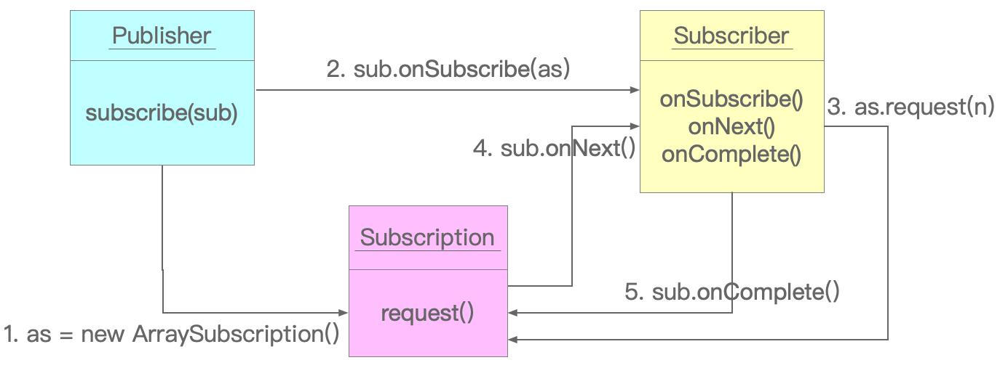

在subscribe()算子执行后发生如下动作：

1. 发布者Publisher新建了ArraySubscription变量as；
2. 通过订阅者Subscriber的回调onSubscribe()算子，将as传递给sub；
3. 订阅者sub通过as发起request(n)请求。因为代码中没有明确指定发起多少次请求，故而会显示request(unbounded)，但默认为1；
4. 发布者通过as发起sub.onNext()调用；
5. 如果发布者的序列结束或出错，则通过订阅者的onComplete或onError传递信息。

以上过程完全是以同步的方式执行的，但反应式的标准规范Reactive Streams是提倡异步执行的。如果希望异步执行，那么只需要加上“publishOn(Schedulers.boundedElastic())”即可，如下列代码段所示：

```java
Flux.just(1, 2, 3).log()
    .publishOn(Schedulers.boundedElastic()).log()
    ......
    .subscribe(System.out::println);
```

开启异步后的执行结果如下所示：

```java
[main]INFOreactor.Flux.Array.1-|onSubscribe([SynchronousFuseable] FluxArray.ArraySubscription)
......
[boundedElastic-1] INFO reactor.Flux.MapFuseable.3 - | onNext(4)
[boundedElastic-1] INFO reactor.Flux.FilterFuseable.4 - | onNext(4)
4
[main] INFO reactor.Flux.Array.1 - | onComplete()		// 主线程到此就已经结束了
[boundedElastic-1] INFO reactor.Flux.PublishOn.2 - | onNext(3)
[boundedElastic-1] INFO reactor.Flux.MapFuseable.3 - | onNext(9)
[boundedElastic-1] INFO reactor.Flux.FilterFuseable.4 - | onNext(9)
9
[boundedElastic-1] INFO reactor.Flux.PublishOn.2 - | onComplete()
[boundedElastic-1] INFO reactor.Flux.MapFuseable.3 - | onComplete()
```

可以看到，主线程在执行到“[main] INFO reactor.Flux.Array.1 - | onComplete()”这一行的时候就已经结束了，但之后仍然有onNext()事件流出，这就是典型的异步执行。

#### 6.3.2 Mono

如果说Flux可以发出0个或者N个元素的话，那么Mono就只能发出0个或最多1个元素，从它们相同操作符或算子的不同签名就能看出来：Flux.just(T...data)和Mono.just(T data)。对于工程师来说，没有必要记住什么时候应该使用Flux，什么时候应该使用Mono。因为在诸多框架中，早已给出了明确的反馈，如图6-16所示。

> 图6-16 框架给出的提示

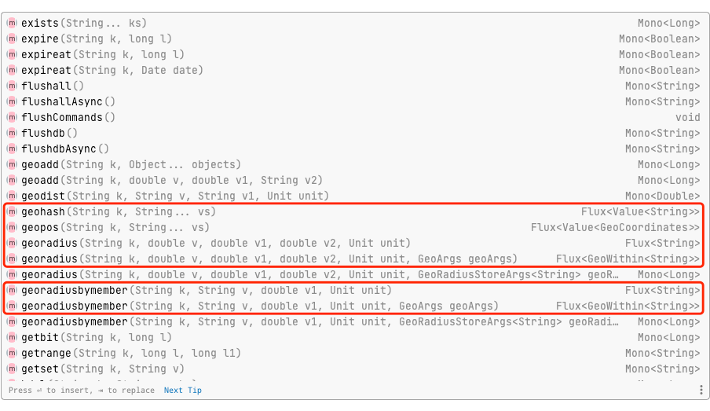

从图6-35中可以看到，IDEA等编辑器会给出非常明确的提示，告知开发者方法返回的对象是Flux还是Mono。即时一开始并不知道是用Flux还是Mono也没关系，因为它们二者之间也能相互转化。所以，某种程度上可以说，开发者们再也不必为哪种场景下该用Flux，哪种场景下该用Mono而操心了。代码清单6-8给出了Mono操作Redis的典型应用案例。

> 代码清单6-8 MonoDemo.java部分源码

```java
public class MonoDemo {
    private static final RedisURI redisUri = RedisURI.builder()
                                        .withHost("172.16.185.166")
                                        ......
                                        .build();
    ......

    // 用命令式编程范式同步读取redis数据
    public static void getMonoBySync() {
        System.out.println(conn.sync().get("cart"));
    }

    // 介于传统与反应式之间的异步方式读取redis数据
    public static Mono<String> getMonoByAsync() {
        return Mono.create(sink -> {
            conn.async().get("cart").thenAccept(sink::success);
        });
    }

    // 用反应式编程范式读取redis数据
    public static Mono<String> getMonoByReactive() {
        return conn.reactive().get("cart");
    }

    public static void main(String[] args) {
        Executor pool = Executors.newFixedThreadPool(10);
        // 各种操作耗时比较
        long startTime = System.currentTimeMillis();
        for (int i = 0; i < 100; i++) {
            pool.execute(MonoDemo::getMonoBySync);
       }
       long endTime = System.currentTimeMillis();
       System.out.println("同步耗时：" + (endTime - startTime));
       ......
    }
}
```

代码清单6-8通过三种不同编程范式读取Redis中存储的String数据。从代码中可以非常清楚看到，当线程池中有10个线程，并且出现100并发请求时，异步或反应式的操作耗时远远小于同步方式。

可能有些读者会觉得，既然反应式编程范式这么优秀，为什么至今没有彻底取代传统编程范式呢？笔者认为有如下几种原因：

1. 由一种编程范式转换为另一种编程范式，不仅开发者的习惯会陡然变化，而且所有相关的外围生态和依赖全部要跟着变，这个代价有点大；
2. 在CPU速度越来越快，网络速度越来越快的情况下，反应式异步线程切换的时间开销已经慢慢和它所带来的速度提升相互抵消了，“好处”已经越来越少；
3. 在代码调试的时候，显然传统的同步阻塞式代码更易操作、更易阅读理解。如果要调试反应式代码，且不说至今尚未出现可以完全实现自动进行异步调试的IDE，就算有，这种不断在不同代码间跳来跳去的风格，能不能为工程师所接受，恐怕都还不好说；
4. 反应式编程范式的最底层需要依靠NIO技术，目前大多数的数据库并不是技术上无法支持，而是因为JDBC作为一种BIO已经存在了20年，要改变它影响太过巨大；并且NIO再怎么多路复用，都无法凭空变出更多的数据库连接数；而且现实世界仍有大量传统的分析型或批处理型事务在运行着，这种操作反应式是一点忙都帮不上的，搞不好还会添乱。

因此，只有在确切了解反应式编程能够提升性能且易维护的情况下，才应该考虑使用它。例如专门消费MQ消息的程序、专门读写大量NoSQL的程序，或者专门执行I/O密集型操作的程序。

如果说代码清单6-8手动操作Redis，那么在cn.javabook.chapter06.ReactorUserController类中，则提供了以Spring注入的方式以反应式编程操作Redis，此处就不占用篇幅赘述了。

### 6.4 Spring WebFlux

Spring WebFlux是一款专用于Web服务端的反应式编程框架。WebFlux在Spring Framework 5.0中引入。从名字中带“Flux”就能看出来，它的底层正是通过Reactor来实现Reactive Streams规范的。

需要注意的是：Spring WebFlux在官网中非常明确地不推荐盲目使用反应式编程，如图6-17所示。

> 图6-17 决定使用Spring WebFlux前应该考虑的点

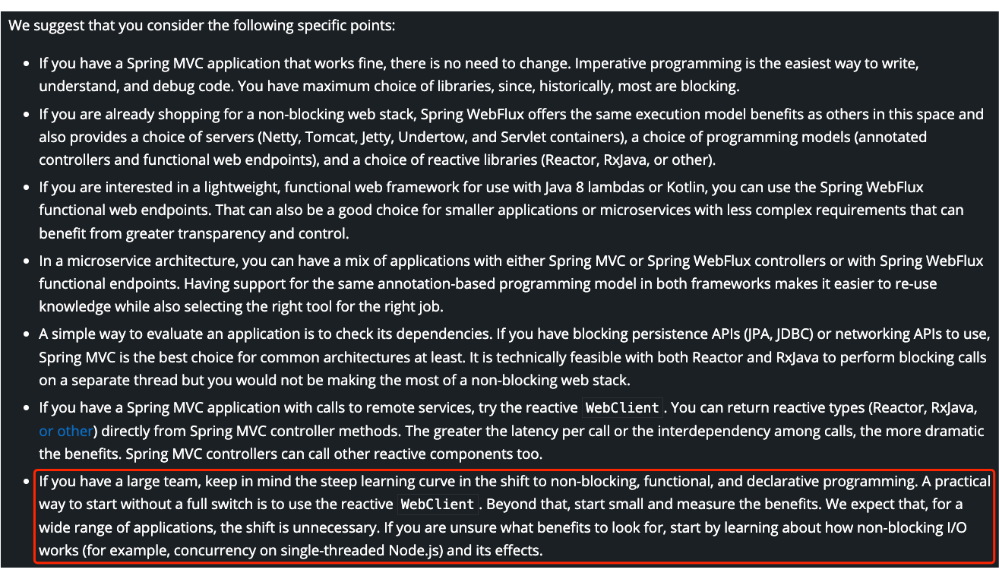

红框中的内容指出：“如果您有一个庞大的团队，那么请记住，在向非阻塞、函数式和声明式编程的转变中，学习曲线是陡峭的。在没有完全准备好的情况下，一种实用的切换方式是使用反应式WebClient。除此之外，从小处着手衡量收益。我们预计，对于大范围的应用来说，这种转变是不必要的。如果您不确定要寻找什么好处，请首先了解非阻塞I/O是如何工作的（例如，单线程Node.js上的并发）及其影响”。

因为Spring WebFlux本身并不会加快程序执行速度，但却在可以高并发情况下借助NIO提升性能，规避I/O阻塞带来的线程堆积。所以本质上，用Spring WebFlux开发和用Spring Boot没什么不同。笔者在javabook-base项目中已经集成了相关依赖。不过在使用Spring WebFlux时，需要将Vert.x、RxJava和Reactor相关依赖注释掉，否则运行会出错。笔者在源码的pom.xml文件中已经给出了说明，如下列代码段所示：

```java
<!-- 运行Spring WebFlux时需将此部分注释掉：Begin -->
......
<!-- 运行Spring WebFlux时需将此部分注释掉：End -->
```

只需要在pom.xml文件中将“Begin”和“End”之间的部分注释掉即可。同时也先备份并删除掉引用依赖的MainVerticle和RxJavaDemo这两个类，不然无法启动应用。另外，有些读者习惯于使用yaml类型的配置文件，但是当Spring WebFlux连接MongoDB时，可能会莫名其妙地抛出非法字符的异常，如图6-18所示。

> 图6-18 MongoDB使用yaml类型的配置文件时报错

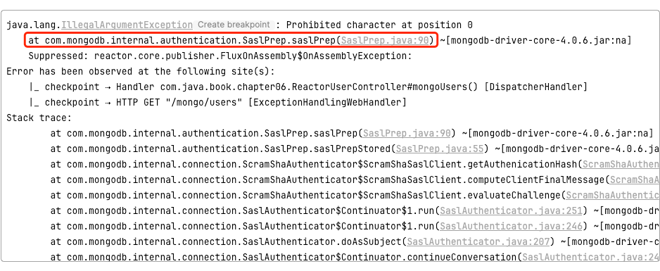

看起来好像是因为认证失败。但如果仔细检查后确认配置无误，那就只有一个原因：Spring WebFlux框架无法读取yaml类型的配置文件。所以，此时就只能使用properties类型的配置文件了。不过如果有些读者没有出现这样的问题，可以直接忽略。

在Spring WebFlux的实例代码中，笔者集成了“MMR”，也就是MySQL、MongoDB和Redis这数据存储“三剑客”，基本上90%以上的开发需求都可以满足了。整个项目的核心部分就是UserService类，如代码清单6-9所示。

> 代码清单6-9 UserService.java部分源码

```java
@Service
public class UserService {
    private final UserRepository userRepository;

    @Resource
    private ReactiveMongoTemplate reactiveMongoTemplate;

    @Resource
    private ReactiveStringRedisTemplate reactiveStringRedisTemplate;

    public UserService(UserRepository userRepository) {
       this.userRepository = userRepository;
    }

    public Flux<User> getUsers() {
       return userRepository.findAll();
    }

    ......

    public Flux<User> getMongoUsers() {
       return reactiveMongoTemplate.findAll(User.class);
    }

    ......
    public Mono<String> redisGet(String key) {
       return reactiveStringRedisTemplate.opsForValue().get(key);
    }

    ......
}
```

这可以作为一个微服务架构的核心代码。它分别在MySQL、MongoDB和Redis中做了两种操作：get()和set()。为了去掉MongoDB保存数据时多出来的那个讨厌的_class字段，不得不额外增加了MongoConfiguration类。整个UserService类其实就是一个小得不能再小的迷你框架，读者可在此基础上集成并加入更多的业务功能，把它变成自己的反应式编程利器。

### 6.5 本章小节

在流式编程日益收到推崇的情况下，一种以流为基础的，关注变化传播的声明式的编程范式逐渐兴起。它诸多的特性让它和以往的编程模式大不相同，例如变化传递、声明式、背压、异步边界等。

自从微软的.NET实现首个ReactiveX以来，出现了诸多的框架和语言实现，为此Reactive Streams不得不制定出相应的规范指南，明确反应式编程范式所应具备的特性，它们包括变化传递、声明式、背压和异步边界等。最终，在2014年发表的反应式编程宣言中，也把反应式系统所应该遵守的特性给明确了下来。

Vert.x是一个古老的反应式编程框架，它底层依赖Netty，运行在JVM之上，目前已经支持了十多种编程语言。Vert.x天生就是异步的，没有三层结构、没有AOP、也没有ORM和祖传代码的按部就班，它根本不以“一步一个脚印的方式”执行代码，而是依赖事件驱动。通过官网提供的代码样例，笔者实现了MySQL数据的读取。

Reactor是另一种实现Reactive Streams的标准，据说是第四代反应式库。它也实现了Reactive Streams规范中制定的发布-订阅模式，并将之区分为Flux和Mono两种不同的风格。其中Flux表示一次可以发布0条或多条数据，而Mono要么就只能发布1条，要么就什么也不发布。它们的区别不用死记硬背，因为IDE已经把各类方法的签名和返回值处理得很好了。只要熟悉流式编程，那么就会发现，其实Flux和Mono所使用的各类算子和流式编程的范式完全一样。

在Reactor基础上，Spring将之整合成为WebFlux，这是一款专用于Web服务端的反应式编程框架。但官网却不推荐立即应用它来做开发，除非能够明确地知道非阻塞式编程的特性及其影响。笔者在提供的项目代码中整合了MySQL、MongoDB和Redis，读者在充分熟悉流式编程、非阻塞的特性，并且清楚能够给系统带来怎样的提升之后，可以据此将之扩充为自己的开发利器。
