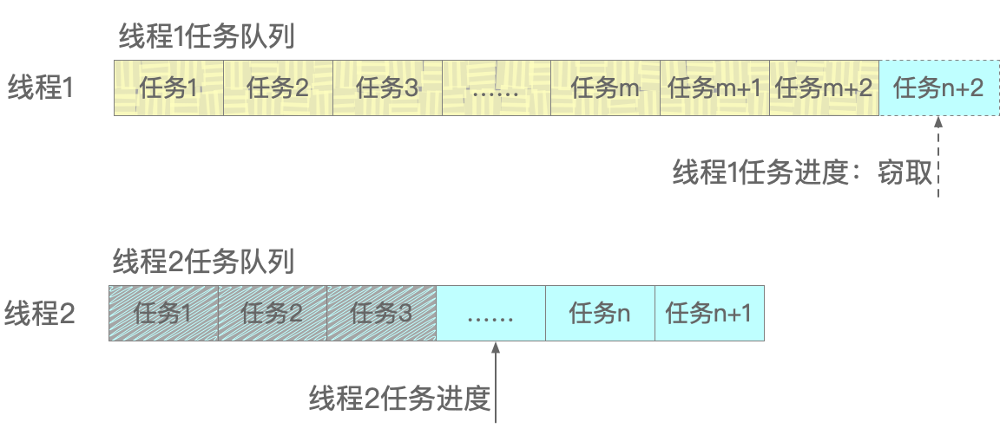

## 第7章 Java协程

很多语言中都有协程（Coroutine）技术，例如Python和Ruby。在Java中它被称为虚拟线程，即“Virtual Threads”。不管叫协程还是虚拟线程，它是更为轻量级的线程，其目的是为了提高并发能力和吞吐量。

虚拟线程技术自JEP 425: Virtual Threads (Preview)草案开始，在JDK 19中引入，并在JDK 20中成为JEP 436: Virtual Threads (Second Preview)。最终以JEP 444: Virtual Threads的形式在JDK 21中固定下来。本章从协程的起源开始，讲述了协程的创建和运行，调度、观察和与GC相关的问题，最后给出了使用协程的一点建议。

特别说明：本章的所有代码都是基于Oracle JDK 21.0.1版本之上运行的。

### 7.1 协程起源

与协程，即虚拟线程相对的，是所谓的平台线程，也就是之前讲过的普通Java线程，它们都是java.lang.Thread类的实例。多年以来，Java对多线程的支持日益完善，本书第3章对此已有详细介绍。本质上，Java的每个方法的每个语句其实都是在线程中执行完成的。多个线程同时发生，每个都独立于其他线程，都有自己的栈空间和上下文。也就是说，每个线程都有一个属于自己的“王国”或“领地”，其“地盘”大小也随着需要处理的任务量大小而变化。

但不管CPU和内存的配置如何豪华，Java可用的线程数量始终是有限的。因为它终究还是对底层操作系统原生线程的包装，而操作系统要应付可不止Java应用这一路诸侯，而是还需要处理文件、存储、进程、作业、内存、接口等多种任务。即便是有了“池”技术的加持，也不可能凭空多增加哪怕一个可用的操作系统线程。所以在CPU和内存成为系统瓶颈前，Java程序的实际可用线程数量往往会先成为瓶颈。

#### 7.1.1 “虚拟化”技术

Linux操作系统为了扩大存储空间和提升内存管理效率，使用了一种称为虚拟内存的技术。这种技术把内存和磁盘看作一个整体，通过虚拟存储器统一管理，这对运行于操作系统之上其他应用来说是透明的，程序并不知道自己的某一部分到底是运行在内存里，还是运行在磁盘里，如图7-1所示。

> 图7-1 虚拟内存技术


通过这种“软件”调度方式，让硬件性能得到了很大的改善和提升。在此之后，虚拟化技术应用广泛，诸如虚拟机和Docker都属于应用虚拟化技术的典范。

在Java的早期版本中，其线程是基于一种称为“Green Threads”的机制实现的，多个Java绿色线程共享一个操作系统线程，这称之为“M:1调度”。所谓调度，就是分配线程到CPU中去执行运算任务。在Java越来越成熟后，平台线程实现了对操作系统线程的“1:1调度”，也就是每一个java.lang.Thread线程类的实例都对应于一个操作系统线程。虚拟线程虽是“虚拟”的，但最终还是要以线程为载体，所以它也是java.lang.Thread类的实例。不过它并不与操作系统线程具备对应关系，而是借助虚拟化技术，实现了操作系统线程和虚拟线程的“M:N调度”，也就是将大量的虚拟线程映射到少量的操作系统或平台线程上，如图7-2所示。

> 图7-2 “1:1调度”和“M:N调度”


这种通过软件“映射”出来的虚拟线程可以是无限的，而且销毁也很简单，不涉及到诸如地址分配、上下文切换之类的开销，所以虚拟线程也谈不上所谓的“池”化：它完全不需要线程池。代码清单7-1很好地演示了这一点。

> 代码清单7-1 VirtualThreadPerformance.java

```java
public class VirtualThreadPerformance {
    public static void main(String[] args) {
        AtomicInteger atomic = new AtomicInteger();
        long startTime = System.currentTimeMillis();
        ExecutorService service1 = Executors.newVirtualThreadPerTaskExecutor();
        try {
            IntStream.range(0, 1_0000_0000).forEach(i -> {
                service1.submit(atomic::incrementAndGet);
            });
        } catch (Exception e) {
            throw new RuntimeException(e);
        }
        long endTime = System.currentTimeMillis();
        System.out.println("虚拟线程耗时：" + (endTime - startTime));
        startTime = System.currentTimeMillis();
        ExecutorService service2 = Executors.newCachedThreadPool();
        try {
            IntStream.range(0, 1_0000_0000).forEach(i -> {
                service2.submit(atomic::incrementAndGet);
            });
        } catch (Exception e) {
            throw new RuntimeException(e);
        }
        service2.shutdown();
        endTime = System.currentTimeMillis();
        System.out.println("平台线程耗时：" + (endTime - startTime));
    }
}
```

代码的执行效率从表7-1的统计中就能看出来，如下所示。

> 表7-1 虚拟线程和平台线程之间性能的比较

| 创建的线程数量 | 虚拟线程耗时（毫秒） | 平台线程耗时（毫秒） |
|:---:|:---:|:---:|
| 10,000（一万） | 56 | 101 |
| 100,000（十万） | 215 | 482 |
| 1,000,000（百万） | 750 | 4374 |
| 10,000,000（千万） | 5717 | 43767 |
| 100,000,000（一亿） | 65792 | 442673 |

实际上，虚拟线程并不是运行得更快的线程。因为它们本身就是基于真实平台线程之上的一种映射，所以它们运行代码的速度不可能比平台线程更快。它们的存在只是为了提高并行度和吞吐量，而且由于没有什么切换开销，所以看起来好像是速度更快了，但其实并不是。

代码中的newVirtualThreadPerTaskExecutor()方法并非是使用的所谓“池”技术，而且创建虚拟线程的方式也不止这一种。

#### 7.1.2 两种并发风格

之前在讲述多线程相关的内容时，并未讨论什么叫“并发风格”，因为对于传统的Java应用来说，默认的就是一种叫做“thread-per-request style”的风格，翻译过来意思就是“一个线程对应一个请求”。例如用户访问网络应用，那么在下单付款请求执行期间，始终都由一个线程来处理用户的确认付款过程，中间不会有别的线程跳出来修改金额之类的。这种风格易于理解、开发、调试和维护，线程栈异常的追踪也比较容易。但其缺点也显而易见，至始至终都没有机会去处理其他请求，即时当前请求出现阻塞也只能等着，因为销毁重来的代价大于等待的代价。

另一种并发风格就是自函数式编程兴起之后的异步风格，称为“asynchronous style”。这是一种资源共享思想，它不是从头到尾只处理一个线程上的请求，而是可以在阻塞期间再去响应其他线程的请求，等到真正需要执行计算时，再回过头来处理。这种非常细粒度的并发风格就是通过函数式编程来实现的，确切地说是通过Lambda表达式和流式计算来实现的，如下列代码段所示：

```java
List<String> list = Arrays.asList("1", "2", "3").map(......).flatMap(......).collect(......);
```

从上面的代码可以看到，各个操作被Lambda表达式和流式计算切分成一小段一小段的，直到终端算子collect()被执行之前，所有的其他算子哪怕全被阻塞也不会影响这段代码真正的执行结果和效率。这两种并发风格也可以通过代码清单7-2清晰地看到。

> 代码清单7-2 TwoConcurrencyStyle.java

```java
public class TwoConcurrencyStyle {
    public static void main(String[] args) throws InterruptedException {
        Runnable runnable = new Runnable() {
            @Override
            public void run() {
                System.out.println("Hello Virtual Thread");
                System.out.println(Thread.currentThread().getName());
            }
        };

        Thread thread1 = Thread.ofPlatform().daemon().start(runnable);
        Thread thread2 = Thread.ofPlatform().name("duke").unstarted(runnable);
        thread2.start();
        // 创建平台线程：增加前缀并且指定标志位
        ThreadFactory factory1 = Thread.ofPlatform().daemon().name("worker-", 1).factory();
        Thread thread3 = factory1.newThread(runnable);
        thread3.start();
        // 创建一个虚拟线程
        Thread thread4 = Thread.ofVirtual().unstarted(() -> {
            System.out.println("Hello Virtual Thread4");
            System.out.println(Thread.currentThread().getName());
        });
        thread4.start();
        // 先命名虚拟线程再运行
        Thread thread5 = Thread.ofVirtual().name("thread5").unstarted(runnable);
        thread5.start();
        // 通过虚拟线程工厂创建虚拟线程
        ThreadFactory factory2 = Thread.ofVirtual().factory();
        Thread thread6 = factory2.newThread(runnable);
        thread6.setName("Thread6");
        thread6.start();
        // 通过虚拟线程工厂创建虚拟线程
        ThreadFactory factory3 = Thread.ofVirtual().factory();
        factory3.newThread(() -> {
            System.out.println("Thread7");
        }).start();
        // 通过startVirtualThread()创建虚拟线程，与Thread.ofVirtual().start(runnable)等价
        Thread thread8 = Thread.startVirtualThread(runnable);
        thread8.setName("thread8");
        TimeUnit.MILLISECONDS.sleep(1000);
    }
}
```

在上面的代码中，从Thread1到Thread3是通过ofPlatform()方法创造的平台线程，而从Thread4至Thread8则是通过ofVirtual()方法创造的虚拟线程。把代码多运行几次，就可以发现一个明显的事实，如图7-3所示。

> 图7-3 平台线程和虚拟线程的执行结果


从Thread4开始直到Thread7，其结果出现的顺序完全是随机的，这从侧面印证了代码清单7-1中虚拟线程所表现出来的压倒性的性能优势，部分也是因为它的异步特性。这两种风格的对比如表7-2所示。

> 表7-2 虚拟线程和平台线程之间性能的比较

| 并发风格 | 优点 | 不足 |
|:---:|:---:|:---:|
| 一线程一请求 | 易于理解、开发、调试和维护 | 可用线程数量有限，代价较高 |
| 异步 | 允许大量并发操作，提高伸缩性 | 不易调试与维护，与传统编程范式不一致 |

确切地说，虚拟线程以它近乎无限数量的线程和异步的执行方式，克服了“thread-per-request style”的缺点，且吸收了“asynchronous style”的优点。换句话说，整个任务执行期间，都是由无数个虚拟线程“小弟”在安排筹措、端茶送水、台前幕后，只有在真正万事俱备时，才由平台线程这个“大哥”出手，一招制敌。

### 7.2 创建和运行

在代码清单7-1和代码清单7-2中分别以两种不同的方式创建了虚拟线程，一种是可以批量创建虚拟线程的Executors.newVirtualThreadPerTaskExecutor()方法，一种是创建单个虚拟线程的Thread API。但要注意，Executors.newVirtualThreadPerTaskExecutor()并非虚拟线程池，而是“用完就扔，阅后即焚”式的一次性消费行为。

#### 7.2.1 创建虚拟线程

代码清单7-1和代码清单7-2完整地展示了所有可以创建虚拟线程的方式。需要注意的是平台线程和虚拟线程的API之间的主要区别：

1. 公共线程构造函数无法创建虚拟线程，即new Thread()不能用于创建虚拟线程；
2. 虚拟线程总是守护线程，并且Thread.setDaemon(boolean)方法也不能将它更改为非守护线程；
3. 虚拟线程的优先级被固定为Thread.NORM_PRIORITY。截止到JDK21这个版本，Thread.setPriority(int) 方法对虚拟线程没有影响（其实对平台线程也没多大影响）；
4. 虚拟线程不像平台线程那样有默认的名字，例如Thread-0、Thread-1之类的。除非明确设置它；
5. 虚拟线程不是线程组的活动成员。在虚拟线程上调用Thread.getThreadGroup()时，会返回名为“VirtualThreads”的占位线程组。Thread.Builder API没有定义将虚拟线程设置成线程组的方法。其实ThreadGroup在Java 1.2之后ThreadGroup已经被废弃了，所以这个特性有没有都毫无意义；
6. stop()、suspend()、resume()这三个被废弃的方法不管在平台线程和虚拟线程中都不被支持，如果在虚拟线程上调用这些方法会引发异常。不过这一点完全无需额外指出，因为在编辑器层面就已经不让使用这些方法了。

#### 7.2.2 运行虚拟线程

既然虚拟线程是异步的，那么它必定非常适用于作为消息服务器来传递各类消息。所以在代码清单7-3和代码清单7-4中虚拟线程作为媒介，实现ChatServer和ChatClient之间的通讯。

> 代码清单7-3 ChatServer.java部分源码

```java
public class ChatServer {
    public static void main(String[] args) {
        try (ServerSocket server = new ServerSocket(9527)) {
            while (true) {
                try {
                    Socket client = server.accept();
                    ......
                    Thread.ofVirtual().start(() -> {
                        try (writer; reader) {
                            String input;
                            while ((input = reader.readLine()) != null) {
                                System.out.println(input);
                                writer.println(input);
                            }
                            ......
                        }
                    });
                }
            }
        }
    }
}
```

> 代码清单7-4 ChatClient.java部分源码

```java
public class ChatClient {
    public static void main(String[] args) throws IOException {
        Socket socket = new Socket("localhost", 9527);
        ......
        try (socket; writer) {
            String input;
            while ((input = reader.readLine()) != null) {
                writer.println(input);
                if (input.equalsIgnoreCase("3166")) {
                    break;
                }
                ......
            }
        }
    }
}
```

代码清单7-3中ChatServer通过虚拟线程启动服务，其效果和真实的线程完全一样。另外，在笔者过去的开发工作中，CompletableFuture类属于是用的比较多的异步工具之一，它是随同Java 8一起发布的一个工具类，其主要作用就是修复Future类存在的问题，让开发更“丝滑”。之前在前面讲解多线程的时候，提到过一个“叫号器”，也就是Semaphore类。

现在有这样一个需求：某市大剧院可同时容纳5000名观众，但由于剧院的装修扩建，所以现在每场只能允许1000名观众入场。如果现在某个剧团要售出1万张门票，那么他们需要演10场才能把票卖完。如果用代码来演示的话，该怎么实现呢？如代码清单7-5所示。

> 代码清单7-5 GrandTheatre.java

```java
public class GrandTheatre {
    static final Semaphore semaphore = new Semaphore(1000);
    public static void main(String[] args) {
        long start = System.currentTimeMillis();
        ExecutorService service = Executors.newFixedThreadPool(5000);
        List<CompletableFuture<Void>> futures = new ArrayList<>();
        start = System.currentTimeMillis();
        IntStream.range(0, 10000).forEach(i -> {
            CompletableFuture<Void> future = CompletableFuture.runAsync(() -> {
                try {
                    semaphore.acquire();
                    TimeUnit.MILLISECONDS.sleep(1000);
                } catch (Exception e) {
                    System.err.println(e.getMessage());
                }
                semaphore.release();
            }, service);
            futures.add(future);
        });
        CompletableFuture.allOf(futures.toArray(new CompletableFuture[0])).join();
        service.shutdown();
        System.out.println("总共出演：" + (System.currentTimeMillis() - start) / 1000 + " 场");
    }
}
```

运行代码清单7-5后，结果显示就是10场。

那么它的原理是什么呢？初始定长线程池中有5000个线程可用，但因为叫号机的关系，每次都只能用1000个，而执行10000次计算要循环10次，每次耗时1秒，所以总共耗时10秒——一点也不复杂，不是吗？

如果CompletableFuture的异步方法runAsync()不指定自定义的线程池service，那么结果可能无法预料。如果将平台线程换成虚拟线程，需要改动什么吗？什么也不需要改动，除了一行代码，如下列代码段所示：

```java
ExecutorService service = Executors.newVirtualThreadPerTaskExecutor();
```

改动后再次运行，记得runAsync()要指定自定义的线程池service，结果仍然是10场。这说明，不管是平台线程还是虚拟线程，所受到的并发限制是一样的。感兴趣的读者可以尝试将信号量Semaphore去掉，看看结果是演几场。所以，完全可以在今后的实际开发工作中，用廉价且高吞吐量的虚拟线程逐渐取代平台线程。

### 7.3 调度、观察和其他

由于虚拟线程是由JDK实现的，并且不与任何特定的操作系统线程相捆绑，所以操作系统是无法感知到它们的存在的，自然也就无从调度。对于平台线程，JDK需要借助操作系统才能完成调度，但对于虚拟线程则无需如此，因为JDK自己就可以“调度”它。

JDK的调度程序将虚拟线程分配给平台线程，然后再由操作系统来决定平台线程何时到CPU中去执行，而不是直接将虚拟线程分配给处理器。这个在其上分配或挂载虚拟线程的平台线程，称为“载体”线程Carrier Thread。而这些Carrier Thread的“池”，就是ForkJoinPool。如图7-4所示。

> 图7-4 载体线程所在的ForkJoinPool


#### 7.3.1 调度

在讲解多线程的JUC时，有提到过这个ForkJoinPool工具类，它号称“分形器”。ForkJoinPool其实是“Fork”、“Join”和“Pool”这三者的组合，如图7-5和图7-6所示。

> 图7-5 Fork分解任务，Join合并结果


> 图7-6 “Fork”和“Join”都在“Pool”中执行


在图7-5中，大任务被很多个“Fork”线程递归分解成足够细小的任务，然后再由很多个“Join”线程将小任务的计算结果合并。在图7-6中，众多的“Fork”和“Join”都在“Pool”这样一个池中运行着，这个池一般被称为CommonPool。

ForkJoinPool之所以会被JDK用来调度虚拟线程，主要是因为它采用了一种称为“工作窃取”（Work-Stealing）的算法。如果用传统的线程池，那么当任务很多且执行时间较短时，就会造成线程之间频繁的切换、竞争以及同步锁问题，影响性能。

所谓“工作窃取”，指的是每个线程都有自己的任务队列，当某个线程处理完自己队列中的任务后，就从其他线程队列的队尾“窃取”还未执行的任务。通过这种方式，充分利用空闲线程的资源，提高效率。如图7-7和图7-8所示。

> 图7-7 线程1和线程2各自的任务执行情况


> 图7-8 线程1“窃取”线程2队尾的任务



从图7-7中可以看出，线程1的任务已经执行完成，所以它就开始将图7-8中线程2队尾还未执行的任务给“偷”过去自己执行了。通过代码清单7-6也能看出这两者在执行效率上的差异。

> 代码清单7-6 WorkStealing.java

```java
public class WorkStealing {
    public static void main(String[] args) throws InterruptedException {
        AtomicInteger atomic = new AtomicInteger();
        long startTime = System.currentTimeMillis();
        ExecutorService normal = Executors.newFixedThreadPool(100);
        ExecutorService forkjoin = Executors.newWorkStealingPool();
        IntStream.range(0, 1_000_0000).forEach(i -> normal.submit(atomic::incrementAndGet));
        normal.shutdown();
        System.out.println("定长线程池耗时：" + (System.currentTimeMillis() - startTime));
        startTime = System.currentTimeMillis();
        IntStream.range(0, 1_000_0000).forEach(i -> forkjoin.submit(atomic::incrementAndGet));
        forkjoin.shutdown();
        System.out.println("工作窃取耗时：" + (System.currentTimeMillis() - startTime));
    }
}
```

代码清单7-6的执行结果显示，当执行1000万次计算时，工作窃取WorkStealingPool的耗时明显少于定长线程池FixedThreadPool。

ForkJoinPool默认的调度参数，也就是parallelism并行度等于计算机可用的处理器核数，即Runtime.getRuntime().availableProcessors()。包括maxPoolSize、minRunnable等参数，都可以通过运行时参数来修改，例如：-Djdk.virtualThreadScheduler.parallelism=8。

一般情况下，当发生阻塞或任务运行结束时，虚拟线程会从载体线程上“卸载”。但有时候虚拟线程是不能从它所在的载体线程被卸载的，这种情况称之为“固化”Pinning。在两种情况下会发生“固化”：

1. 虚拟线程在synchronized同步块中运行代码时；
2. 虚拟线程运行本地方法（native method）或外部函数（foreign function）时。

#### 7.3.2 观察

虚拟线程虽然是虚拟的，但仍然是一种具有载体的线程，现有的Debug调试器可以像普通的平台线程那样对它们进行步进式的逐行跟踪调试。JMC提供的Java Flight Recorder（JFR）和JDK提供的jcmd这两个工具可以帮助观察应用程序中的虚拟线程。

JFR可采集的与虚拟线程相关的事件有四个，分别是jdk.VirtualThreadStart、jdk.VirtualThreadEnd、jdk.VirtualThreadPinned和jdk.VirtualThreadSubmitFailed。要打印出这些事件，可以用jfr的print命令，例如：

```java
jfr print --events 'jdk.VirtualThreadStart' record.jfr
```

或者把这四个一起打出来，用“,”隔开：

```java
jfr print --events 'jdk.VirtualThreadStart, ... , ... , ...' record.jfr
```

另外一种工具是jcmd，它可以创建JSON格式的线程堆栈信息，命令格式为：

```java
jcmd <PID> Thread.dump_to_file -format=json <file>
```

其实开发的时候用到这些命令的机会并不多，因为大多数时候可以直接从结果和抛出的异常得到解决问题的办法，实在不行，Debug也可以慢慢调试。掌握这些命令只是为了有备无患，多一重保障而已。

#### 7.3.3 其他

虚拟线程的堆栈也作为堆栈对象存储在Java的垃圾收集中，而且两种并发风格，即“thread-per-request style”和“asynchronous style”对堆栈内存的消耗和引发的GC活动大致相同。但由于异步代码通常需要跨I/O操作数据，而且这些数据常常需要在不同线程间共享，所以它们对堆空间的消耗更大。

与平台线程不同的是，虚拟线程没有所谓的GC Roots，所以在堆上执行并发扫描的GC，例如G1，不会在“Stop the World”期间遍历虚拟线程所持有的引用。这也就是说，如果一个虚拟线程理论上不会被中断执行，那么当它真被阻塞时，例如被BlockingQueue.take()方法阻塞或者被synchronized同步锁阻塞，并且没有其他线程可以获得对它的引用时，该虚拟线程就会被GC收集到。这也意味着，一个运行着的虚拟线程基本上是不会被GC收集到的。

由于G1 GC中限制大对象（Humongous Object）的大小不能超过Region大小的50%，所以在发布JEP 444的JDK 21版本中，虚拟线程也遵守这个限制：它的堆栈块数据大小如果超过G1 Region的50%，会直接抛出内存溢出的StackOverflowError异常。

对于ThreadLocal，官方的建议是“慎用”。虽然虚拟线程可以像平台线程一样支持ThreadLocal和InheritableThreadLocal，即可继承的ThreadLocal，让它们能够运行线程本地的代码。但是，由于虚拟线程的数量可能非常之多（例如上亿级别），所以，请务必在仔细考虑并知晓可能的结果后使用ThreadLocal和InheritableThreadLocal。尤其是，虚拟线程永远不应该被“池”化，因为它只为某个单一且具体的任务而存在。官方在JDK 21版本中删除了很多关于ThreadLocal的应用，目的就是为了虚拟线程作准备，以减少代码在数百万，甚至数千万虚拟线程中运行时的内存占用——总之，“天下武功，唯快不破”。

java.util.concurrent.LockSupport现在支持虚拟线程了：挂起虚拟线程会释放底层的平台线程来做其他工作，而取消挂起则会安排它继续任务的执行。对LockSupport的这次更改并不影响所有依赖它的API，例如锁、信号量、阻塞队列等在调用虚拟线程时的正常挂起。

java.net和java.nio.channels包中的API现在可通过虚拟线程实现操作，例如，建立网络连接、从Socket读取数据或释放平台线程来做其他工作。为了允许中断和取消，被java.net.Socket、ServerSocket和DatagramSocket定义的阻塞式I/O方法，当在虚拟线程中调用它们时可中断：中断在Socket上被阻塞的虚拟线程将取消挂起线程并关闭Socket。当从InterruptbleChannel获得时，对这些类型的Socket的阻塞式I/O操作始终是可中断的。因此，JDK 21的这些更改，会将网络相关API在调用构造函数时的行为与其从通道channel获取时的行为保持一致。

java.io包中字节流和字符流的API实现是高度同步化的，当在虚拟线程中运行它们时，需要进行更改以避免被长期Pinning固化在某个载体线程上。除了固化之外，这些类中的同步也是有问题和不一致的。例如，InputStreamReader和OutputStreamWriter使用的流编码解码器是在流对象上，而不是在被锁定的对象上同步。而且，现在BufferedOutputStream、BufferedWriter和OutputStreamWriter这几个类的流编码器的初始缓冲区更小，以便在堆中减少内存的使用。因为如果有上百万个虚拟线程，而每个虚拟线程在其Socket连接上都保持缓冲流的话，那会非常恐怖。

另外，虚拟线程应该避免长时间地在载体线程上固化，因为这可能会导致一个宝贵的平台线程被无谓阻塞住。如下代码段就是一个极有可能将平台线程长时间固化的操作：

```java
synchronized("锁") {
    longTimeOperator();
}
```

但如果将其替换为下面的形式，就会好得多：

```java
lock.lock();
try {
    longTimeOperator();
} finally {
    lock.unlock();
}
```

### 7.4 使用建议

虚拟线程是由JDK实现的，工程师们可以非常廉价地在程序中运行大量的虚拟线程，甚至数百上千万个。这既赋予了它们强大的功能，也可以更有效地编写服务器应用程序，从而提升系统的吞吐量和硬件的利用效率。

由于虚拟线程是java.lang.Thread的实例，并且遵循自Java 1.0以来就在一直存在着的规则，因此工程师们不需要额外学习使用它们的新概念。然而，由于“不能创建过多的平台线程”这一概念持续多年，在它的影响下，产生了相应的旨在应对其高成本的做法。而将这些实践应用于虚拟线程时会适得其反。

#### 7.4.1 以同步代替异步

从前面讲述的内容知道，虚拟线程能够显著提高以“thread-per-request style”风格编写的应用程序的吞吐量（而非速度）。在这种风格中，应用程序可以用一个专门的线程来处理每个传入请求。阻塞平台线程的代价很高，因为它占用了相对稀缺的操作系统线程，却并未做有意义的工作。而虚拟线程因为数量巨大，所以阻塞它们的成本可以忽略不计，且应该得到提倡。因此，使用虚拟线程时应该以同步的风格编写代码，并使用阻塞式I/O。如下列代码段所示：

```java
new Thread.ofVirtual().unstarted(() -> {
    try {
        User user = getUserInfo(id, username, ......);
        String imageUrl = getImageUrl(appkey, region, bucketName, ......);
        user.setAvatar(imageUrl);
        processOnNext(user);
        ......
    } catch (Exception e) {}
}).start();
```

而类似下面这样的非阻塞式、异步风格的代码则不会从虚拟线程中获得很多好处：

```java
CompletableFuture.runAsync(user::getUserInfo, executor)
    .thenCompose(url -> getImageUrl(appkey, region, bucketName, ......))
    .thenApply(user::setAvatar)
    .thenAccept(this::processOnNext)
......;
```

相比较起来，同步代码也更易跟踪、调试，并且转储到文件中分析。不过如果没有为每个任务专门指定一个线程这样的前提条件，就不应该指望从虚拟线程中获得好处，而应该避免将同步和异步代码混在一起。

#### 7.4.2 不要妄图“池”化它

虽然虚拟线程具有与平台线程相同的行为，但它们是不同的程概念。如表7-3所示，对比了它们之间的不同。

> 表7-3 虚拟线程和平台线程之间特性的比较

| 特性 | 虚拟线程 | 平台线程 |
|:---:|:---:|:---:|
| 使用成本 | 可以忽略不计 | 较高 |
| 稀缺性 | 无限 | 有限 |
| 调用栈 | 浅 | 深 |
| 生命周期 | 短 | 长 |
| 与操作系统线程对应 | 否 | 是 |
| 实现者 | JDK | 操作系统 |
| 调度方式 | M:N | M:1或1:1 |

所以，在使用虚拟线程开发时，需要考虑的不是将m个平台线程转换为n个虚拟线程的问题，而是应该考虑如何转换任务，让虚拟线程的数量大于或等于程序中并发任务的数量。下面这种使用线程池的做法是不妥的：

```java
ExecutorService service = Executors.newFixedThreadPool();
Future<Result1> result1 = service.submit(task1);
Future<Result2> result2 = service.submit(task2);
......
```

相反地，应该这样使用虚拟线程，如下例代码段所示：

```java
try (var executor = Executors.newVirtualThreadPerTaskExecutor()) {
    Future<Result1> result1 = executor.submit(task1);
    Future<Result2> result2 = executor.submit(task2);
    ......
}
```

从Executors.newVirtualThreadPerTaskExecutor() 返回的对象并没有“池”化任何线程，相反，它只是为每个提交的任务创建了一个新的虚拟线程而已。

下面的代码段是官方给出的实例，这是一种fanout广播模式的经典应用场景，如下列代码段所示：

```java
void handle(Request request, Response response) {
    var url1 = ...
    var url2 = ...
    try (var executor = Executors.newVirtualThreadPerTaskExecutor()) {
        var future1 = executor.submit(() -> fetchURL(url1));
        var future2 = executor.submit(() -> fetchURL(url2));
        response.send(future1.get() + future2.get());
    } catch (ExecutionException | InterruptedException e) {
        response.fail(e);
    }
}
String fetchURL(URL url) throws IOException {
    try (var in = url.openStream()) {
        return new String(in.readAllBytes(), StandardCharsets.UTF_8);
    }
}
```

在fanout场景中，既可以向多个消费者发出消息，也可以向多个不同的服务发出调用请求，只要它们和生产者绑定就行。类似这样的服务器程序代码，具有简单的阻塞特性，可以很好地扩展，即使是小型的、短暂的并发任务也是应该如此，因为它可以使用大量廉价的虚拟线程。所以，为了应用程序有更好的可观察性和可靠性，应该多使用结构化并发风格。

#### 7.4.3 尽量用不可变对象

在开发中经常会用到某些工具类，例如SimpleDateFormat就是其中之一。它常常被用来格式化从数据库中获取的日期时间。但它的实例创建不仅代价较高，而且还不是线程安全的。有些开发者还会将它缓存在ThreadLocal中，如下列代码段所示：

```java
ThreadLocal<SimpleDateFormat> formatter = ThreadLocal.withInitial(SimpleDateFormat::new);
void getUserInfo() {
    ......
    formatter.get().format(...);
    ......
}
```

虽然虚拟线程和平台线程都支持ThreadLocal，但效果却完全不同。平台线程由于有线程池，所以即使是被有限数量的线程多实例化几次影响也不大，而虚拟线程是没有“池”的。所以如果有一千万个虚拟线程，那么它就会被实例化恐怖的一千万次。而且对于ThreadLocal，不仅官方建议慎用，而且某些大厂也禁止使用它。但对于这类昂贵且非线程安全对象的处理，没有一个普遍的解决方案，只能具体问题具体分析。一个好的做法就是尽量使用Java的不可变对象Immutable Object，例如用DateTimeFormatter代替SimpleDateFormat。

### 7.5 本章小节

很多编程语言都实现了协程功能，Java中的协程称之为虚拟线程，它是一种非常轻量级的线程，轻量到几乎可以创造出上千万，甚至上亿个。相对于虚拟线程，传统的Java线程称之为平台线程，它是和底层操作系统的原生线程1:1对应的，而虚拟线程则是由JDK创造的，和操作系统无关。虚拟线程也需要依托平台线程才能真正执行运算，装载了虚拟线程的平台线程称之为载体线程。虚拟线程和平台线程之间的映射关系为M:N。虚拟线程融合了两种不同的并发编程风格，分别是“thread-per-request style”和“asynchronous style”，也就是“一个线程对应一个请求风格”和“异步风格”。虚拟线程以它近乎无限数量的线程和异步的执行方式，克服了“thread-per-request style”的缺点，且吸收了“asynchronous style”的优点。

创建虚拟线程十分简单，除了常用的Executors.newVirtualThreadPerTaskExecutor()方法，还有新增加的java.lang.Thread.Builder API，代码清单7-2演示了所有可以创建虚拟线程的方法。通过几个小例子，展示了虚拟线程可以和平台线程无缝替换，而且它和平台线程一样都受到规则的限制。但有一点要当心：虚拟线程是没有“池”化一说的，否则会起到和预期完全相反的效果。因为它的廉价和极强的针对性，“池”化反而会拖累性能。

JDK使用ForJoinPool类完成虚拟线程的调度，主要是因为该工具类的“工作窃取”（Work-Stealing）算法相较于其他工具更高效。通过JMC提供的Java Flight Recorder（JFR）和JDK提供的jcmd这两个工具，可以帮助观察虚拟线程的运行状况，以及打印出与它相关的事件。JDK 21将虚拟线程正式发布后，有一系列的组件都受到它的影响，它们包括但可能不限于：

1. java.net和java.nio.channels包的网络相关API；
2. java.io相关API；
3. ThreadLocal和InheritableThreadLocal；
4. GC；
5. java.util.concurrent.LockSupport；
6. Java Native Interface (JNI)；
7. Debugging (JVM TI, JDWP, and JDI)；
8. JDK Flight Recorder (JFR)；
9. Java Management Extensions (JMX)；
10. java.lang.ThreadGroup。

如果要在实际开发工作用使用虚拟线程，笔者有如下几个建议：

1. 为每个重要的任务专门指定一个虚拟线程，并以同步风格编写代码；
2. 不要用“池”化思想来看待虚拟线程，可以尝试JDK新发布的结构化并发编程风格；
3. 慎用ThreadLocal来缓存线程本地数据，尤其是虚拟线程，更不应该如此。使用虚拟线程时尽量以不可变对象来代替可变对象。

### 7.6 本章练习

1. 代码清单7-2中的虚拟线程都是异步执行的。如果想让它们同步执行，输出的结果也能按顺序显示，该怎么做呢？

2. 代码清单7-3中ChatServer只能接收ChatClient发来的消息却不能主动给它发送消息。怎么能够让ChatServer也发送消息呢？

3. 请尝试将代码清单7-5中的newFixedThreadPool改为newVirtualThreadPerTaskExecutor后再将信号量semaphore去掉，看看需要表演几场。

4. 请尝试用虚拟线程实现第3章提到的“超卖”问题（效果会一样吗？）
