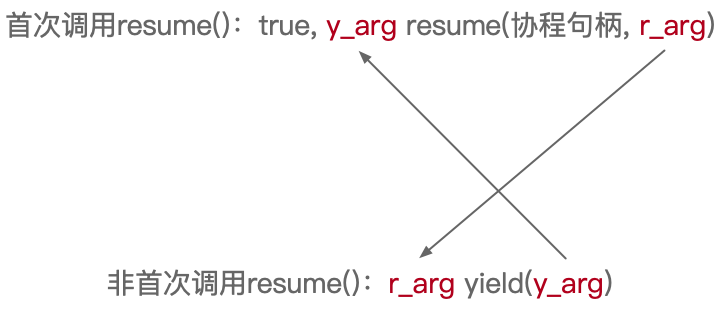
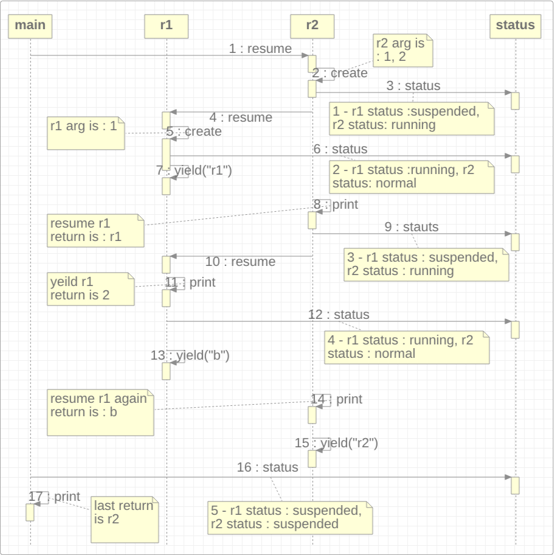

## 第13章 Nginx与OpenResty

Nginx诞生于2002年，由俄罗斯程序员Igor Sysoev开发。它最初是为了解决C10K问题而创建。之后，诞生了一种称之为LUA的嵌入式脚本语言。它是一种语法简单、易于学习、易于嵌入到其他程序中，并且运行速度非常快的轻量级脚本语言。虽然Nginx和LUA更多属于运维工作的范畴，但它们作为互联网应用开发中多级缓存架构中的一员，以及在微服务和API网关中所发挥的重要作用，作为开发工程师，还是有必要了解它们的。

本章讲解了服务器与容器的区别，也介绍了Nginx的三个拿手绝活，最后演示了如何将Nginx和OpenResty结合起来实现更为强大的功能。

本章所有Nginx配置和LUA脚本均在javabook-nginxlua子模块的src/main/resources目录中。

### 13.1 服务器、容器与代理

为了更好地了解和学习Nginx，有三个与之相关的概念需要先明确澄清，那就是服务器、容器与代理。另外，这里所说的服务器是特指的软件，而非硬件。

#### 13.1.1 服务器

HTTP（超文本传输协议）服务器是一种软件应用程序或服务，它用于接收HTTP客户端的请求并返回相应的内容，例如在网页上发送登录请求之后，如果成功就会返回首页，如果失败则返回错误页面。HTTP服务器只是Web服务器的一种，专门处理和分发基于HTTP协议之上的Web网页、图像、视频、文件等资源。因为除了HTTP服务器之外，Web服务器还包括Socket、Telnet、FTP、SMTP等服务器。HTTP服务器通过监听指定的端口（通常是80端口），等待客户端的连接请求，并根据请求的内容返回相应的数据或执行相应的操作。这里的HTTP客户端通常指的就是浏览器，例如IE、Chrome、FireFox等。在一般情况下，如无特别说明，本章中出现的Web服务器指的就是HTTP服务器。

不过，在专用的Web服务器诞生之前的很长一段时间，网络应用程序的功能都是由CGI来完成的。CGI的英文全称是“Common Gateway Interface”，即“公共网关接口”，它是一种用于在Web服务器和外部应用程序之间传递数据的标准协议。CGI之所以诞生，其初衷就是为了能够让Web服务器调用外部应用程序，从而实现动态网页的生成，因为在那个时候，HTML页面基本上都是静态的，没法动态地生成网页内容，如图13-1所示。

> 图13-1 HTTP服务器的组成


#### 13.1.2 容器

一般来说，C#服务端用到的IIS，PHP服务端用到的Apache和Java服务端用到的Tomcat，它们都属于一种Web服务器，因为它们都可以通过浏览器发出请求，然后收到由服务端返回来的响应内容。但它们又和单纯的Web服务器有所不同。因为纯粹的Web服务器仅仅只是接收HTTP请求，然后根据协议处理请求内容，并返回结果，而Web容器则在此基础之上更进一步。以Java中的Tomcat为例，除了要履行Web服务器的那部分功能之外，还需要完成维护Servlet组件生命周期、解释/执行JSP页面标签、静态资源管理等诸多任务。从用户访问`http://localhost:8080/index.jsp`开始，Tomcat中就发生了如下事件：

1. 用户请求被发送到Tomcat，该请求被监听8080端口并处理HTTP协议的Connector连接器捕获；
2. Connector连接器把请求交给它所在的Service服务的Engine引擎来处理，并等待Engine引擎的回应；
3. Engine引擎获得请求localhost/index.jsp的路径，匹配所有的虚拟主机Host；
4. Engine引擎匹配到名为localhost的Host虚拟主机来处理/index.jsp请求（即使匹配 不到会请求交给默认 Host 处理），Host会根据“/”匹配它所拥有的全部Context上下文；
5. 匹配到的Context上下文获得请求/index.jsp；
6. 构造HttpServletRequest对象和HttpServletResponse对象，作为参数调用Servlet的doGet()或doPost()方法来执行业务逻辑、数据存储等程序；
7. Context把执行完之后的结果通过HttpServletResponse对象返回给Host对象；
8. Host把HttpServletResponse返回给Engine引擎；
9. Engine把HttpServletResponse对象返回Connector连接器；
10. Connector把HttpServletResponse对象返回给客户浏览器。

整个过程如图13-2所示。

> 图13-2 Tomcat容器


其他的Web容器与Tomcat类似，都需要维护其中组件的生命周期及相关语法标签的解析，这正是Web容器与Web容器最主要的不同之处。

另外，如果在Web容器的基础之上，再融合加入更多的应用功能或服务，例如事务管理、数据库连接（池）、Bean注入等，则被称之为“Web应用服务器”，JBoss、WebLogic和WebSphere就属于是这种重量级Web应用服务器的典型代表。所以，从应用范畴的角度来看：

`Web（或HTTP）服务器 < Web容器 < Web应用服务器（“<”表示小于...的范畴）`。

#### 13.1.3 代理

这里所说的代理，不完全等同于前述“反射与代理”中的“代理”。这里的代理，指的是一个位于客户端和目标服务器之间的中间服务，客户端通过它从目标服务器上获取内容。在这个意义上，前述的中介就是一种租客和房东之间的代理。再比如通过VPN技术实现对不同网络的访问，也是一种代理。只不过这里所说的代理，是一种正向的代理，也就是为了客户端而屏蔽了目标服务器的访问复杂性，让客户端能自由获取所需的数据与服务。

除了正向代理之外，还有一种反向代理，其访问过程与正向代理相同，但它和正向代理的区别是：正向代理时，客户端知道访问的是代理服务器，而反向代理时，客户端是无感的，用户并不知道自己访问是代理服务器，还是真正提供服务的服务器，正向代理和反向代理的区别如图13-3所示。

> 图13-3 正向代理与反向代理


图13-3已经清楚地展示了正向代理和反向代理的区别。作为反向代理的搜素引擎，可以让用户不必记住并在浏览器的地址栏上输入每种提供服务的网站网址，而只需要在搜索出来的结果上轻点鼠标，即可访问网站服务，这正是典型的反向代理服务。

### 13.2 Nginx的“三宝”

Nginx作为一个高性能且高可用的HTTP服务器，反向代理、负载均衡和流量管控是它最拿手的三样本领。

#### 13.2.1 反向代理

Nginx最拿手的就是提供反向代理服务。以Java应用为例，一般都是以8080端口为入口，但如果想改为80端口，就可以用Nginx来“代理”，修改nginx.conf文件，如代码清单13-1所示。

> 代码清单13-1 nginx.conf

```yml
server {
    listen        80;
    server_name  localhost;
    location / {
        proxy_pass http://localhost:9529;
        proxy_set_header Host $host:$server_port;
    }
}
```

然后再编写一个简单的Java Web应用，用于测试验证配置Nginx之后的反向代理服务，如代码清单13-2所示。

> 代码清单13-2 NginxReverseProxy.java

```java
@RestController
public class NginxReverseProxy {
    @GetMapping("/")
    public String index() {
        return "Hello Nginx";
    }
}
```

这个应用可以使用带端口的Tomcat地址访问（http://localhost:9529/），或者也可以使用默认80端口的Nginx地址（http://localhost/），均能访问成功。

#### 13.2.2 负载均衡

除了最基本的反向代理，Nginx还可以提供负载均衡服务，它可以将海量请求分摊到多个服务器上分别执行，从而减轻单台服务器的访问压力，这一能力也使得Nginx成为互联网应用的标准配置。而负载均衡一般都需要同时配置反向代理，通过反向代理来跳转到指定的服务器上。

Nginx目前支持自带三种负载均衡策略，分别是默认的轮询访问策略、权重分配策略和iphash约束策略。它们的区别如下：

1. 轮询访问策略：这是Nginx默认的负载均衡策略。在这种策略下，每个请求按顺序轮流地分配到不同的后端服务器，如果某些后端服务器宕机或离线，Nginx也能自动剔除它；
2. 权重分配策略：在这种负载均衡策略下，每个请求按指定轮询几率访问后端服务，权重Weight和访问比率成正比，这种策略常用于后端服务器性能不均的情况，如有些服务器配置高，那么访问权重就可以相应高一些。而配置较低的服务器则访问权重也就相应低一点。它同样也能自动剔除宕机或离线的后端服务器；
3. iphash约束策略：轮询和权重的方式只能满足无状态的或者幂等的业务应用，但有时业务需要满足某些客户从头到尾只能访问某个指定服务器的条件约束。因此，这种情况就需要采用iphash方式来分配后端服务器了。

为了通过代码观察Nginx的负载均衡效果，读者可以准备好2～3台虚拟机，在每台虚拟机中安装好JDK环境，再编写一个最简单的SpringBoot应用。该SpringBoot应用只需让访问者知道Nginx将路由分配到了哪一台服务上即可，如代码清单13-3和代码清单13-4所示。

> 代码清单13-3 NginxLoadBalance.java

```java
@RestController
public class NginxLoadBalance {
    @GetMapping("/test")
    public String test(final String username) {
        return "hello, " + username + " from server01";
    }
}
```

> 代码清单13-4 NginxLoadBalance.java

```java
@RestController
public class NginxLoadBalance {
    @GetMapping("/test")
    public String test(final String username) {
        return "hello, " + username + " from server02";
    }
}
```

这两段代码分别在两个SpringBoot项目中，它们唯一的区别就是server编号不同。

将代码清单13-3和代码清单13-4的接口服务打包成jar文件后，分别部署到其中的两台虚拟机上。再利用其中一台服务器安装Nginx，作为负载均衡服务。

或者读者也可以直接使用笔者在docker-server/server01和docker-server/server02这两个文件夹中提供的docker容器，这两个docker容器都已经准备好了JDK环境和相应的jar包。读者只需cd到各自目录下分别执行docker-compose命令即可。另外，如果不知道容器启动后的服务地址，可通过docker inspect [Container ID]命令查看。

实现Nginx默认的轮询策略，只需要稍稍修改nginx.conf配置文件即可，如代码清单13-5所示。

> 代码清单13-5 nginx.conf

```yml
upstream test {
    server [ip]:8080
    server [ip]:9090
}
server {
    listen        80;
    server_name  localhost;
    location / {
        proxy_pass http://test;
        proxy_set_header Host $host:$server_port;
    }
}
```

重启Nginx，然后反复访问“http://nginx的服务地址/test?username=test”，结果显示：

1. 第n次访问会返回“server01”；
2. 第n+1次访问会返回“server02”。

这说明轮询访问策略已经生效。

权重分配策略只需要在配置中加入权重关键字weight即可，如代码清单13-6所示。

> 代码清单13-6 nginx.conf

```yml
upstream test {
    server [ip]:8080 weight=7
    server [ip]:9090 weight=3
}
```

重启Nginx后，在10次访问中，第一个服务会被访问7次，而第二个服务则会被访问3次。配置iphash策略则更为简单，只需在upstream中增加一个“ip_hash”关键字即可，如代码清单13-7所示。

> 代码清单13-7 nginx.conf

```yml
upstream test {
    ip_hash
    server [ip]:8080
    server [ip]:9090
}
```

除了Nginx自带的三种负载均衡策略外，还有另外两种常用的第三方策略，分别是fair策略和一致性hash策略。它们可以在github上下载并安装。它们的作用是：

1. fair策略是按后端服务器的响应时间来分配请求的，响应时间短的优先分配，有利于服务端的资源利用；
2. 一致性hash策略可以根据参数的不同将请求均匀映射到后端服务器。

它们的配置也和iphash策略类似，此处就不再赘述，感兴趣的读者可自行在github上查阅安装配置说明。

#### 13.2.3 流量管控

在互联网应用中，很多场景中都会涉及到海量的高并发请求，例如秒杀。而如果不对这些请求做限制，那么服务器将很快会被冲垮。就像在12306买票一样，如果全国人民都一窝蜂去抢票，那服务器是无论如何也扛不住这种瞬时压力的。这是每一个有着巨大流量的互联网应用都必须要面对并解决的问题。

用于限制流量的算法通常有两类：令牌桶和漏桶。

所谓令牌桶，其算法思想是：

1. 令牌以固定速率产生，并缓存到令牌桶；
2. 令牌桶放满时，多余的令牌将被直接丢弃；
3. 请求进来时，先进入待处理的请求队列；
4. 处理请求时需要从桶里拿到相应数量的令牌作为处理“凭证”；
5. 当桶里没有令牌时，请求处理被拒绝。

其过程如图13-4所示。

> 图13-4 令牌桶的算法思想


令牌桶是一种常用于网络流量整形和速率限制的算法。只有持有令牌的请求才会被处理，这也是令牌桶名称的由来。而由于令牌桶算法允许突发流量的存在，所以它更适合流量突发的应用场景，例如秒杀。

相比于令牌桶，漏桶限流的核心算法思想是“缓存请求、匀速处理、多余丢弃”。正如其名，漏桶不管外部水量是否突然增加或减少，其底部始终保持着匀速的出水量，这正是漏桶算法名称的由来，如图13-5所示。

> 图13-5 漏桶的算法思想


从上图中可以看到，水（也就是请求）从上方进入漏桶，从下方流出（被处理）。来不及流出的流量会被缓存在桶中，以固定速率流出，桶满后多余的水（流量）则会溢出（被丢弃）。因此，漏桶算法可以屏蔽流量的陡然变化，所以它更适合需要平滑流量的场景。

Nginx限流模块使用的正是漏桶算法。它有两种实现限流的方式：

1. 限制访问频率，就是限制指定时间内每个用户的访问次数；
2. 限制并发连接数，就是限制某段时间内访问资源的用户数。

为了测试Nginx的限流效果，可以安装apache的ab压测工具。在CentOS中执行以下命令即可。

```bash
yum -y install httpd-tools
cd /usr/bin
ab -V
```

ab的使用也很简单，例如：“./ab -n1000 -c100 -t1 -s5 http://localhost/test?username=test”。这条命令表示：执行1000次，每次有100个并发请求到指定服务，并在1秒之内完成请求，超时时间5秒。

压测工具准备好之后，再来修改Nginx的配置，如代码清单13-8所示。

> 代码清单13-8 nginx.conf

```yml
limit_req_zone $binary_remote_addr zone=case1:10m rate=10r/s;
server {
    listen       80;
    server_name  localhost;
    location / {
        limit_req_zone=case1;
    }
}
```

执行下面的两条命令：

```bash
./ab -n1000 -c10 -t1 -s5 http://localhost/test?username=test
./ab -n1000 -c10 -t2 -s5 http://localhost/test?username=test
```

ab压测输出的结果显示：“Complete requests：30397；Failed requests：30387”。

从结果来看，请求了30397次，但失败了30387次，仅10次并发请求成功。这完全符合Nginx设置的要求。

既然Nginx可以限制流量，那是不是也可以拓展流量呢？答案是肯定的，这就是其流量拷贝功能。其实对于流量拷贝的需求场景还是比较多的，例如，为了确保开发出来的应用能够立即应用到生产环境，就需要将生产环境的数据和流量拷贝到开发环境，这样做的好处显而易见：

1. 可以验证功能是否正常，以及服务的性能；
2. 用真实有效的流量请求去验证，又不用造数据，不影响线上正常访问；
3. 可以用来排查线上问题，同时，这也是一种测试方式。

这可以理解为给流量“拉分支”。修改Nginx配置，如代码清单13-9所示。

> 代码清单13-9 nginx.conf部分源码

```yml
server {
    listen 8080;
    access_log /home/work/logs/nginx/8080.log;
}
server {
    listen 9090;
    access_log /home/work/logs/nginx/9090.log;
}
server {
    listen        80;
    server_name  localhost;
    location / {
        mirror /mirror1;
        mirror /mirror2;
        proxy_pass http://test;
    }
    ......
}
```

停止并重新启动Nginx服务后，可以打开两个终端窗口，然后分别执行下面不同的tail命令并查看端口日志输出：

```bash
tail -f /home/work/logs/nginx/8080.log
tail -f /home/work/logs/nginx/9090.log
```

在浏览器中访问`http://nginx服务地址/test?username=test`，并观察服务器端口日志输出的变化。

### 13.3 OpenResty与LUA

Nginx是业务直接和外部交流的接入点，而且对二次开发和动态变化有着一些定制化的需求，因此LUA这种嵌入式的脚本语言就应运而生了，它能揉和以及处理各种不同的Nginx上游输出（proxy、log等）。在Nginx和LUA结合的基础之上诞生了一个高性能的可扩展的Web平台：OpenResty。它在其内部集成了大量的LUA库、第三方模块以及依赖，它可以随心所欲地做出复杂的访问控制、业务处理和安全检测。基于OpenResty，工程师可以轻松构建出处理10000以上并发请求的超高性能Web应用，可以随意操控、分发、复制、限制、缓存响应头、Cookie及外部存储中的数据信息。总之，有了OpenResty的加持，Nginx不再是一个简单的HTTP服务器，而是摇身一变成为全功能的Web应用服务器了。

#### 13.3.1 运行OpenResty

在CentOS虚拟机中，OpenResty可通过yum的方式安装，过程非常简单，此处就不再演示。通过下面的脚本即可启动OpenResty，如脚本清单13-10所示。

> 代码清单13-10 OpenResty启动脚本

```bash
/usr/local/nginx/sbin/nginx -s stop
vi /etc/rc.local
# 用“/usr/local/openresty/nginx/sbin/nginx”替换“/usr/local/nginx/sbin/nginx”
/usr/local/openresty/nginx/sbin/nginx
/usr/local/openresty/nginx/sbin/nginx -s reload
/usr/local/openresty/nginx/sbin/nginx -s stop
```

启动OpenResty后在浏览器中访问地址：“http://CentOS虚拟机IP”，如出“Welcome to OpenResty！”字样则表示安装成功。

在安装好OpenResty后，它使用的是自带的conf配置文件，如果希望之前Nginx中的各项功能都能继续正常运行，那么就需要将`/usr/local/nginx/conf/nginx.conf`中的内容复制到`/usr/local/openresty/nginx/conf/nginx.conf`中才行。复制之后，通过tail命令打开8080和9090的端口日志，并且再次在浏览器中访问地址`http://CentOS虚拟机IP/test?username=test`，发现之前的流量复制功能也能正常工作，这说明OpenResty已经完全替代了原生的Nginx。

#### 13.3.2 第一个LUA脚本

在/usr/local/openresty/nginx/conf目录下创建一个lua.conf文件，其内容如代码清单13-11所示。

> 代码清单13-11 lua.conf

```yml
server {
    listen 80;
    server_name _;
    location /lua {
        default_type 'text/html';
        content_by_lua 'ngx.say("Hello World from OpenResty")';
    }
}
```

然后编辑OpenResty的nginx.conf文件，在其中的“http”部分添加如下配置：

```yml
http {
lua_package_path "/usr/local/openresty/lualib/?.lua;;";
lua_package_cpath "/usr/local/openresty/lualib/?.so;;";
    include    lua.conf
```

重启OpenResty，在浏览器中访问地址：“http://CentOS虚拟机IP/lua”，就能看到网页上看到打印出来的“Hello World from OpenResty”了。

但是这么做会有一个问题，因为如果将lua代码都放在nginx中，那它会随着代码的变更导致越来越难以维护。因此，推荐的做法是把lua代码单独转移到外部文件中，就像如图13-6所示那样。

> 图13-6 nginx.conf ⊂ lua.conf ⊂ code.lua


所以，本着这种思路，在/usr/local/openresty/nginx/conf目录下创建一个单独保存lua代码的目录，然后在lua目录中创建一个名为helloworld.lua的文件，其内容如代码清单13-12所示。

> 代码清单13-12 helloworld.lua

```bash
ngx.say("Hello World from OpenResty")
```

再修改代码清单13-11中的内容，如代码清单13-13所示。

> 代码清单13-13 lua.conf

```yml
server {
    listen 80;
    server_name _;
    location /lua {
        default_type 'text/html';
        content_by_lua_file conf/lua/helloworld.lua;
        lua_code_cache on;
    }
}
```

重启OpenResty，再次用浏览器访问地址`http://CentOS虚拟机IP/lua`，如果依然能看到网页上打印出来的`Hello World from OpenResty`，就说明内容修改后，OpenResty能够正常执行。

#### 13.3.3 LUA API

每个HTTP请求都需要由Web服务器接收、处理，然后再输出响应，每个请求包含请求参数、请求头、消息体等信息。服务器通过对请求的处理，输出客户端需要的内容，响应内容包含响应状态码、响应头和响应内容体，而这些内容都可以通过LUA API解析出来。

首先修改之前的lua.conf文件内容，如代码清单13-14所示。

> 代码清单13-14 lua.conf部分源码

```yml
server {
    listen       80;
    server_name  _;
    location /request {
        default_type 'text/html';
        lua_code_cache on;
        set $a $host;
        content_by_lua_file conf/lua/request.lua;
        echo_after_body "ngx.var.a = $a";
    }
    ......
}
```

在/usr/local/openresty/nginx/conf/lua目录中创建一个名为request.lua的代码文件，其内容如代码清单13-15所示。

> 代码清单13-15 request.lua部分源码

```yml
local var = ngx.var
ngx.say("ngx.var.a : ", var.a)
var.a = 2;
local headers = ngx.req.get_headers()
ngx.say("=== headers begin ===")
ngx.say("Host : ", headers["Host"])
ngx.say("user-agent : ", headers["user-agent"])
ngx.say("user-agent : ", headers.user_agent)
for k, v in pairs(headers) do
  ngx.say(k, ": ", v)
end
......
```

重启OpenResty，在虚拟机中执行如下curl命令：

```bash
curl -XPOST 'http://127.0.0.1/request?a=1&b=2' -d 'c=3&d=4'
```

结果如图13-7所示。

> 图13-7 lua api


然后在浏览器中访问如下地址`http://虚拟机IP地址/response`，就能看到LUA输出的响应。由于OpenResty集成了大量的LUA库和第三方库，因此如果需要开发更加复杂的应用，那么可以参考借鉴其他语言的开发模式，例如Java，将代码按项目进行分层分包管理。

### 13.4 用LUA操作数据

OpenResty已经为开发者提供了众多成熟且开箱即用的模块，例如cjson、redis客户端、mysql客户端等。因为在高性能高并发的互联网应用中，Nginx往往会成为服务端多级缓存架构中最开始的那一层，如图13-8所示。

> 图13-8 多级缓存架构


而且，在大型电商、团购等互联网平台中，OpenResty一般都会主动读取Redis等缓存中间件中保存的商品、订单、交易或其他热点数据，OpenResty或同步这些数据，或拦截上游的查询请求以缓解下游系统的压力。另外，读者可以cd到docker-data文件夹，然后通过执行docker-compose命令来启动MySQL和Redis服务，后续将会用到。

#### 13.4.1 访问Redis缓存

“lua-resty-redis”模块是LUA为操作redis提供的客户端，默认安装OpenResty时已经自带了该模块，也可以在github中搜索“lua-resty-redis”找到它。

首先，在/usr/local/openresty/nginx/conf/lua文件夹中创建一个名为redis.lua的文件，并在其中加入代码清单13-16中所示内容。

> 代码清单13-16 redis.lua部分源码

```lua
local redis = require("resty.redis")
local red = redis:new()
red:set_timeout(1000)
local ok, err = red:connect("127.0.0.1", 6379)
......
if resp == ngx.null then
    resp = ''
end
ngx.say("hello: ", resp)
```

再修改`/usr/local/openresty/nginx/conf/lua.conf`配置文件，在其中增加如下部分内容：

```yml
location /redis {
    default_type 'text/html';
    lua_code_cache on;
    content_by_lua_file conf/lua/redis.lua;
}
```

重启OpenResty，在浏览器中访问如下地址`http://虚拟机IP地址/redis`，即可查询到对应数据。

#### 13.4.2 操作MySQL数据库

如同Redis那样，OpenResty也封装好了操作mysql的模块，“lua-resty-mysql”即是LUA为操作MySQL提供的客户端，默认安装OpenResty时已经自带了该模块，通过搜索“lua-resty-mysql”，也可以在github中找到它。

和操作Redis一样，在`/usr/local/openresty/nginx/conf/lua`文件夹中创建一个名为mysql.lua的文件，并在其中加入代码清单13-17中所示内容。

> 代码清单13-17 mysql.lua部分源码

```yml
local mysql = require("resty.mysql")
local db, err = mysql:new()
if not db then
    ngx.say("new  mysql error:", err)
    return
end
db:set_timeout(5000)
local props = {
    host = "127.0.0.1",
    port = 3306,
    database = "sys",
    user = "root",
    password = "123456"
}
......
```

接着修改`/usr/local/openresty/nginx/conf/lua.conf`配置文件，在其中增加如下部分内容：

```yml
location /mysql {
    default_type 'text/html';
    lua_code_cache on;
    content_by_lua_file conf/lua/mysql.lua;
}
```

可以看出，增加的这部分内容和Redis基本没区别。重启OpenResty后在浏览器中访问如下地址`http://虚拟机IP地址/mysql`，即可查询到对应数据。

### 13.5 OpenResty的协程

在之前讲述Java协程时说过，进程一般是应用程序的启动实例，进程拥有代码、打开的文件、需处理的数据、独立的内存空间等资源，例如，独立部署的jar包、运行的redis、mongodb程序等，它们都是独立运行的进程，它相当于一个大管家。而线程从属于进程，是应用程序的实际执行者，它相当于是做具体工作的家丁或者仆役。一个进程至少包含一个主线程，或者包含多个子线程，线程拥有自己的栈空间。协程是一种比线程更加轻量级的存在，是“线程中的线程”，协程也拥有独立的堆栈，独立的局部变量，独立的指令指针，同时又与其它协程共享全局变量和其它内容，如图13-9所示。

> 图13-9 协程


和线程由CPU调度不同，协程不被操作系统管理，而是完全由线程内部控制，由程序显式的进行，需要多个程序彼此协作才能实现功能，这就是协程名字的由来。协程是通过特殊的函数来实现的——这个特殊的函数可以在某个地方“挂起”，之后可以重新在其他地方继续运行。一个线程之内可有多个这样特殊的函数，也就是可以有多个协程同时运行，但多个协程的运行只能是“串行”的——一个协程运行时，其他协程必须要挂起。同时还需要明确的一点是：协程也是有切换的，但它的切换不是像进程或线程那样由操作系统完成，而是由用户完成的。或者可以打一个这样的比方：协程类似于正在同步中的多线程，而在等待同一个线程锁的几个线程也类似于协程。协程是LUA中引入的概念，由于OpenResty是对LUA的封装，因此也自然就具备了协程特性。

#### 13.5.1 Coroutine库

resume()和yeild()这两个方法是LUA协程的核心，它们都是由coroutine提供的方法。

1. coroutine.create(function)：表示传入一个函数作为参数来创建协程，返回coroutine，当遇到resume()时就唤醒函数调用；
2. coroutine.resume(coroutine [v1, v2, ...])：它是协程的核心函数，用来启动或再次启动一个协程，使其由挂起状态变成运行状态，该函数相当于在执行协程中的方法，“v1, v2, ...”是执行协程时传递给它的参数：
  - 首次执行协程coroutine时，参数v1...会传递给协程的函数；
  - 再次执行协程coroutine时，参数v1...会作为协程yeild()的返回值；
  - resume()返回值有三种情况：
    - 如果协程的函数执行完毕，协程正常终止，就返回true和函数的返回值；
    - 如果协程的函数在执行时，协程调用了yeild()方法，那么resume返回true和传入函数的第一个参数；
    - 如果协程在执行过程中发生错误，那么resume返回false与错误消息。
3. coroutine.yield()：使正在执行的函数挂起，传递给yeild的参数会作为resume的额外返回值。

也就是说，首次调用时，resume()的参数会直接传递给协程函数；而非首次调用时，resume()的另一个参数会成为yield()的返回值，而yield()的参数，也会成为resume()额外的返回值。这么说有点绕，画张图就明白了，如图13-10所示。

> 图13-10 首次调用和非首次调用时resume()和yield()的参数关系



为了验证coroutine.create()和coroutine.resume()方法，在/usr/local/openresty/nginx/conf文件夹中创建一个名为xiecheng.conf的文件，并在其中加入代码清单13-18所示内容。

> 代码清单13-18 xiecheng.conf

```yml
server {
    listen 80;
    server_name _;
    location /xiecheng {
        default_type 'text/html';
        content_by_lua '
            co = coroutine.create(function (a, b)
            ngx.print("resume args : "..a..", "..b.." - ")
            yreturn = coroutine.yield()
            ngx.print ("yreturn : "..yreturn.." - ")
        end)
        ngx.print(coroutine.resume(co, 1, 2), "<br/>")
        ngx.print(coroutine.resume(co, 3, 4), "<br/>")
        ngx.print(coroutine.resume(co, 5, 6))';
     }
}
```

随后修改`/usr/local/openresty/nginx/conf/nginx.conf`，找到“include lua.conf”这一行，并将其内容改为“include xiecheng.conf”。

重启OpenResty，在浏览器中访问如下地址`http://虚拟机IP地址/xiecheng`，可以看到三次调用coroutine.resume()方法的结果都不同，而这正是resume()返回值的三种情况，如图13-11所示。

> 图13-11 coroutine.resume()方法返回值的三种情况


另一个比较重要的方法是coroutine.wrap(function)，wrap()返回的是一个函数，每次调用这个函数就相当于在调用coroutine.resume()。调用这个函数时传入的参数，就相当于在调用resume()时传入除协程句柄外的其他参数。但跟resume()不同的是，它并不是在保护模式下执行的，若执行崩溃会直接向外抛出异常。

修改xiecheng.conf文件，在其中加入代码清单13-19所示内容。

> 代码清单13-19 xiecheng.conf

```yml
location /xiecheng2 {
    default_type 'text/html';
    content_by_lua '
        co = coroutine.wrap(function (a, b)
            ngx.print("resume args : "..a..", "..b.." - ")
            yreturn = coroutine.yield()
            ngx.print ("yreturn : "..yreturn.." - ")
        end)
        ngx.print("co type is : "..ngx.print(type(co)), "<br/>")
        ngx.print(ngx.print(co(1, 2)), "<br/>")
        ngx.print(ngx.print(co(3, 4)))';
}
```

完成修改后重启OpenResty，在浏览器中访问如下地址：“http://虚拟机IP地址/xiecheng2”，结果这说明warp()方法和调用coroutine.resume(co, a, b)的结果是等效的。

coroutine库中其他与协程相关的方法包括有：

1. isyieldable()：表示如果正在运行的协程可以挂起，则返回true（只有主协程（线程）和C函数是无法让出的）；
2. running()：用来判断当前执行的协程是不是主线程，如果是就返回true；
3. status(function)：返回表示协程状态的字符串：
  - running：正在执行中的协程；
  - suspended：还未结束却被挂起（调用了yeild或还没开始运行）的协程；
  - normal：协程A resume协程B时，协程A所处的状态就是normal；
  - dead：发生错误或正常终止的协程，如果这时候对它调用resume，将返回false和错误消息，就像刚才展示的那样。

验证这些方法的代码笔者已经写在了xiecheng.conf文件的xiecheng3方法中，感兴趣的读者可自行验证，此处不再赘述。协程调用的时序图如图13-12所示。

> 图13-12 协程调用时序图



从上图及代码，可以稍微总结一下关于OpenResty协程的知识点了：

1. 所有的协程都是通过resume()和yield()这两个方法来完成协作的，这是协程的核心所在，可以说没有resume()和yield()，就没有协程；
2. resume()和yield()都是由开发者控制的，除此之外，不会有任何其他外部干预，但线程就不一样；
3. 函数从哪里挂起，恢复时就从哪里开始执行。关于这一点，可以尝试在r1中的coroutine.yield("b")前后各加上一行ngx.print()语句来验证。

#### 13.5.2 关于并行调度

无论有多少个方法，如果不加干预，在LUA中它们会始终以“串行”的方式来执行。为了验证这一特性，修改`/usr/local/openresty/nginx/conf/lua.conf`文件，在其中增加如代码清单13-20中所示的内容。

> 代码清单13-20 lua.conf

```yml
location /test1 {
	 default_type 'text/html';
	 echo_sleep 2;
	 echo test1 : $arg_test;
}
location /test2 {
	 default_type 'text/html';
	 echo_sleep 2;
	 echo test2 : $arg_test;
}
```

将之前修改过的`/usr/local/openresty/nginx/conf/nginx.conf`，再改回“include lua.conf”。在浏览器中访问：“http://虚拟机IP地址/test1?test=1”或者`http://虚拟机IP地址/test2?test=1`，结果显示test1或test2都是在经过2秒之后浏览器才给出响应。

在lua.conf中再增加一个接口，让它顺序地访问/test1和/test2这两个接口，如代码清单13-21所示。

> 代码清单13-21 lua.conf

```yml
location /allexecute {
   default_type 'text/html';
   content_by_lua '
     local t1 = ngx.now()
     local r1 = ngx.location.capture("/test1", {args = ngx.req.get_uri_args()})
     local r2 = ngx.location.capture("/test2", {args = ngx.req.get_uri_args()})
     local t2 = ngx.now()
     ngx.print(r1.body, "<br/>", r2.body, "<br/>", tostring(t2 - t1))';
}
```

重启OpenResty，在浏览器中访问如下地址`http://虚拟机IP地址/allexecute?test=1`，结果显示/test1和/test2确实是串行执行的。

但这种串行方式，可以通过capture_multi改变，实现并行执行。在lua.conf中再增加一个接口，让它通过capture_multi并行地执行/test1和/test2接口，如代码清单13-22所示。

> 代码清单13-22 lua.conf

```yml
location /concurrency {
  default_type 'text/html';
  content_by_lua '
     local t1 = ngx.now()
     local r1, r2 = ngx.location.capture_multi({
          {"/test1", {args = ngx.req.get_uri_args()}},
          {"/test2", {args = ngx.req.get_uri_args()}}
        })
     local t2 = ngx.now()
     ngx.print(r1.body, "<br/>", r2.body, "<br/>", tostring(t2 - t1))';
}
```

重启OpenResty，在浏览器中访问如下地址`http://虚拟机IP地址/concurrency?test=1`，可以看到结果如图13-13所示，这次/test1和/test2已经并行执行了。

> 图13-13 concurrency接口执行后的结果


### 13.6 本章小节

Nginx是一个高性能的开源Web服务器，也可以作为反向代理、负载均衡和流量管控的工具使用。但是在了解Nginx之前，需要对几个比较容易混淆的概念做一下澄清，那就是Web服务器、Web容器和Web代理。

所谓的Web服务器，其实就是融合了传统的CGI公共网关接口和HTTP协议解析的一个Web服务，它接受客户端发出的请求，然后给出静态或动态的内容响应。而Web容器则在Web服务器的基础上加入了组件生命周期管理、语法标签解析、静态资源管理等诸多功能，它是基于某种特定编程语言环境的。如果在Web容器的基础上，再加入事务管理、数据库连接（池）、Bean注入等更多功能，则被称之为Web应用服务器。Web代理分为正向代理和反向代理，通过反向代理，客户端无需知道具体的服务地址，只需要使用所获的服务即可。

Nginx最拿手的三样本领就是反向代理、负载均衡和流量管控。通过负载均衡，能够避将海量请求分摊到多台服务器上，既能避免单台服务器所造成的系统性能瓶颈，也能避免服务被流量冲垮。而通过不同的负载均衡策略，Nginx能够很好地平衡各种不同的服务器性能配置，让配置好的服务器多分担一些系统访问压力。同时，为了避免流量过大而造成系统崩溃，Nginx也通过漏桶算法对流量进行了限制，这特别适合于流量突发的情况，例如电商网站中的秒杀应用。除了限制流量，Nginx还能给流量“拉分支”。

OpenResty是基于Nignx和LUA之上的一种组件生态，它充分利用并结合了LUA库、Nginx模块及众多第三方依赖，使得开发者可以随心所欲地对Nginx进行非常灵活地操控，将Nginx扩充为一个卓越的Web应用服务器。

由于在LUA中引入了协程的概念，OpenResty也就自然获得了这一能力。OpenResty针对协程的操作，最重要的两个方法分别是Coroutine库的resume()和yield()方法。它们都是由开发者控制的，除此之外，不会有任何其他外部干预。而且协程函数从哪里挂起，恢复时就从哪里开始执行。
