# 第三篇 工程实践篇

现在的互联网大厂和过去的软件小作坊之间，最大的区别并非人数变得更多了，业务变得更复杂了，而是其日益流程化、规范化和系统化的软件开发方式，这种流程化、规范化和系统化的方式，通常也被称之为“软件工程（化）”。就像盖房子时的脚手架一样，虽然钢筋混凝土很坚固，但它从浇筑到凝固也是需要一个过程的，如果没有这些脚手架的干预，那么“质变”过程绝不会凭空出现。对于软件项目来说也是一样，软件工程就相当于开发过程中的脚手架，它不仅能够帮助工程师们快速启动项目，减少枯燥的重复性工作，提升开发效率，而且它提供了一套标准化的开发过程。所谓“功夫在诗外”——掌握这些软件开发能力之外的能力，不仅能够统一软件开发团队的想法和做法，也能提高软件产品的质量，让软件变得更容易使用和维护，进而提高软件研发团队整体的开发水准。

本篇包括如何以图表强化软件协同，如何开发和调试出性能卓越的接口，如何以流水线的方式部署应用服务，如何合理地运用开发过程提升软件质量，以及如何做好开源软件。本篇内容是一次对软件工程实践的系统性回顾，全部以实践为主，取其精华，扔其鸡肋，详细阐述了笔者多年来的软件工程实践经验和心得体会。

希望本篇内容能够将广大读者从“西绪福斯的苦役”中解脱出来。

## 第14章 字不如表不如图

俗话说“字不如表，表不如图”。不管是什么行业什么岗位，做什么工作，工程师也好，设计师也罢，哪怕是办公室的Office Lady或外卖小哥，在日常和人沟通之时，总会有比划几下，或者画个图让对方明白自己意思的时候。因为相比于说一大堆话，用一张图显然可以让对方更快地明白自己所要表达的意思。软件开发中也是如此，不同的工程师，不同的团队，不同的部门之间在合作时，总会有大量的正式或非正式的文档、会议、IM消息，如果将之归类的话，那么它们无非分为：UML图、ER图、架构图以及项目相关图表，本章就来将它们一一盘点。

### 14.1 UML建模语言

UML是“Unified Modeling Language”的英文缩写，称为“统一建模语言”，其诞生历史可以追溯到20世纪80年代末和90年代初。当时软件开发领域面临着快速发展和复杂化的挑战，为了更好地描述、设计和理解软件系统，人们意识到需要一种标准的用于彼此协作和沟通的“语言”，以便更好地描述、设计和理解软件系统。为此，UML提供了一套图形化的符号和规则，用于描述软件系统的结构、行为、交互等方面，帮助工程师们更好地分析、设计和沟通软件系统。这套图形化的符号和规则，就如同工程建筑行业中起着至关重要作用的蓝图一样，是众多工程师们用于设计、施工和沟通的“语言”。

UML包括了多种不同类型的设计图，按照分类，它们包括：

1. 结构图：用于描述系统的静态结构，包括类图（Class Diagram）、对象图（Object Diagram）、组件图（Component Diagram）、部署图（Deployment Diagram）；
2. 行为图：用于描述系统的动态行为，包括用例图（Use Case Diagram）、活动图（Activity Diagram，也叫流程图）、状态图（State Diagram）、时序图（Sequence Diagram）、通信图（Communication Diagram）；
3. 交互图：描述系统中对象之间的交互关系，包括时序图（Sequence Diagram）和协作图（Collaboration Diagram）。

但出现频率最高的几种分别是用例图、类或对象图、流程图、状态图和时序图。如果按软件项目的开发阶段来分，它们的作用如图14-1所示。

> 图14-1 不同阶段可用的UML设计图

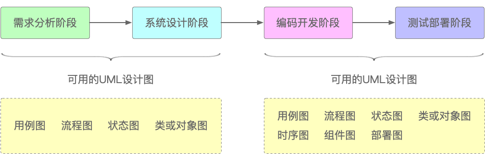

可以画图的工具很多，但能完整遵循标准UML语法的工具很少，笔者经常使用的只有两种：一是IBM的Rational Rose，可惜直到2010年发布Rose 7.0.0.4 iFix001版本之后就再也没有更新过，目前已经不可用了。二是StarUML，它很好地继承了Rational Rose大部分功能，且至今仍在更新，而且风格上也是一脉相承，如图14-2所示。

> 图14-2 StarUML界面

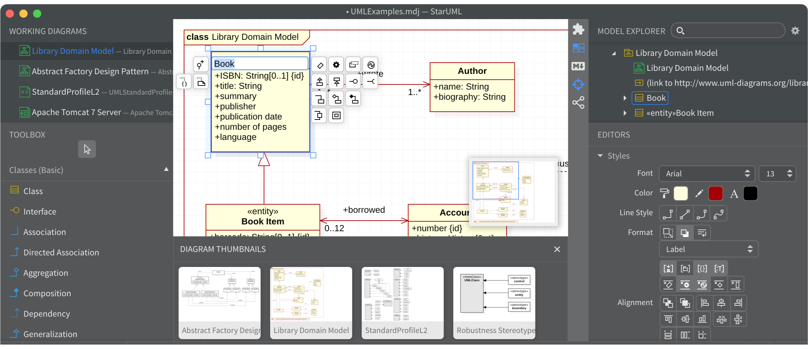

本章的内容均以StatUML 3.2.2版本作为UML工具来展开讲解。当然，也许有些读者更习惯使用其他的软件，例如VISIO、ProcessOn等。

工具并不重要，重要的是设计思想和沟通方式。

#### 14.1.1 用例图

所谓“用例（Use Case）”，可以把它简单地理解为一个独立且完整的用户功能需求，它用来描述用户与系统应用之间的交互，同时也展现了用户、系统、需求这三者之间，以及它们自身之间的关联关系。通过用例，工程师可以知道：

1. 系统为谁服务？谁是最终用户（而非中间用户）？
2. 最终用户希望系统提供什么样的服务？又希望得到什么样的输出？
3. 最终用户能为系统提供什么样的输入？有哪些约束条件？

额外说明一点：在用例中务必明确谁才是最终用户。例如开发一个项目管理系统PMS时，可能会由一些业务方的主管、经理们提出具体的需求。他们虽然也睡这个系统的用户，但不一定是最终用户，因为最终用户一定是那些每天都要接触并使用PMS的人：他们需要每天在PMS中提交工作日志，记录项目问题，汇报项目进度等，他们对于系统的需求和体验直接决定PMS开发的成败。

用例图主要有四个组成部分：

1. 参与者（Actor）：参与者并非具体的人，而是指存在于外部并直接与系统交互的人、其他系统、子系统或对象。它在UML中用一个“小人”表示，如图14-3所示。

> 图14-3 参与者Actor

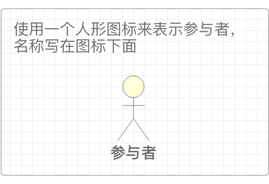

2. 用例（Use Case）：用来描述需要给参与者提供的功能或服务。它必须由参与者来执行，获取参与者的输入，并将输出结果反馈给参与者或系统，如图14-4所示。

> 图14-4 用例Use Case

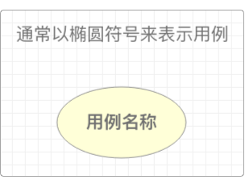

3. 关系（Association）：表示参与者和用例之间的联系，它也可以用来表示参与者和参与者、用例和用例之间的关系。常见的关系如表14-1所示。

> 表14-1 用例图中常见的关系

| 关系类型 | 描述 |
|:---:|:---:|
| 关联 | 参与者之间或用例之间的关系 |
| 包含 | 用例之间的关系 |
| 扩展 | 用例之间的关系 |
| 泛化 | 参与者之间或用例之间的关系 |

  - “包含”关系类似于将公共方法抽象出来单独放在一个方法里，由其他方法引用。例如“添加用户”和“修改用户”最终都会涉及到“保存用户”的操作，那么它们都“包含”“保存用户”，如图14-5所示。

> 图14-5 用例之间的“包含”关系

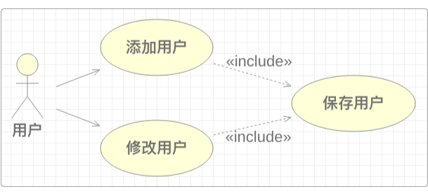

  - “扩展”关系是把新的功能加入到已有用例中。例如在用例“验证码登录”中，默认使用的是短信验证码，但是也可以通过语音验证码完成登录，那么用例“语音验证码”就是用例“验证码登录”的扩展用例，如图14-6或图14-7所示。

> 图14-6 用例之间的“扩展”关系

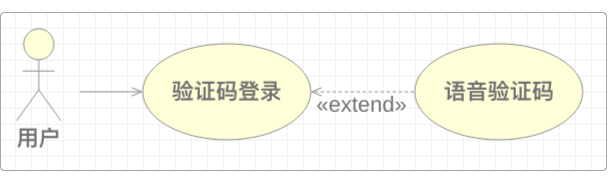

> 图14-7 用例之间的“扩展”关系（箭头方向相反）

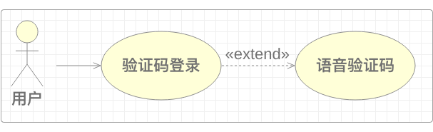

  有的用例图中扩展关系的箭头方向为图14-6那样，而有的又是图14-7那样，哪一种都可以，只要内部统一就好，“包含”关系也一样。

  - “泛化”等同于对象间的继承关系。例如参与者中可分为“普通用户”和“管理员用户”，那么“管理员用户”就可以从“普通用户”继承而来；而“账户登录”和“扫码登录”也可以从“登录”用例继承，如图14-8所示。

> 图14-8 “泛化”关系

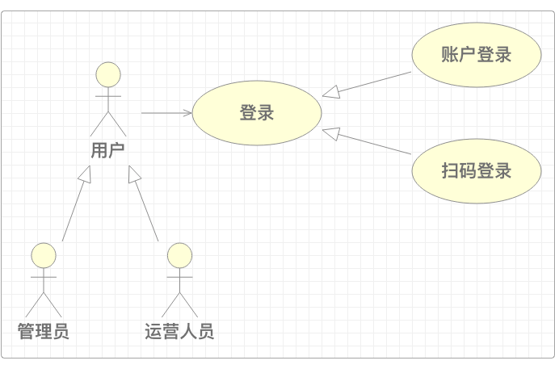

4. 系统（System）：是用例需要描述的对象，它可以是一个软件平台或者一个硬件设备，或者是一次促销活动，也可以是一个更大的系统的一部分。它有自己的边界，由参与者、用例和关系共同组成。

想画出完整的用例图，掌握以上内容就已经足够了。

另外，在用例文档中切忌啰嗦，一般都是非常简洁的“名词 + 动词”形式来描述业务主流程，至于分支流程和边界条件等详细描述，可以在需求说明书中给出。例如，一个良好的用例文档就像这样：

1. 用户打开登录界面；
2. 用户输入用户名和密码；
3. 系统确认用户名和密码；
4. 用户登录成功；
5. ......

而比较啰嗦的反面典型则可能会是这样：

1. 用户打开浏览器，然后在地址栏中输入浏览器地址......，浏览器确认Cookie......；
2. 页面显示出登录界面，用户单击页面输入框，然后输入用户名和密码；
3. 输入用户名密码时弹出人机确认对话框，用户确认身份，系统读取用户输入的登录名称和密码；
4. 后台先验证用户名是否存在，核对用户密码是否正确。如果用户存在且密码匹配则用户登录成，否则登录失败，给出页面提示；
5. ......

在画用例图时，只考虑需要实现什么功能即可，至于如何实现，暂时不必关心。下图是笔者依据较为典型的登录场景绘制的用例图，如图14-9所示。

> 图14-9 登录用例

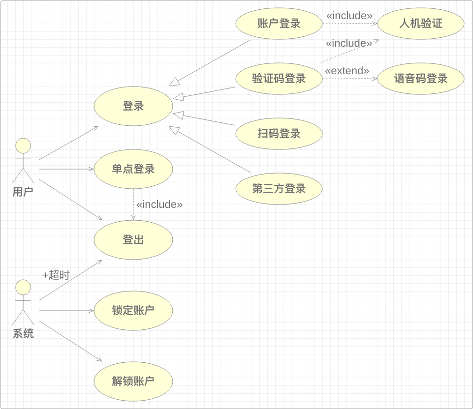

#### 14.1.2 类图

用例图用来描述需求的结构及其关系，而类图则反应系统中类或对象之间的结构与关联关系。这是一种静态的建模方法，是对现实世界的抽象。例如在之前讲述Java关键知识点和多线程等内容时，就出现过JDK中类继承结构图。类图分为两大部分：一是类的基本属性，包括类名、类的属性和类的方法，如图14-10所示。

> 图14-10 用户类的类图

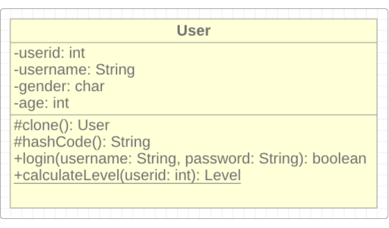

在图14-10的类图中，用户类User中的各种符号分别说明如下：

1. +：表示public，公共成员变量或方法；
2. -：表示private，私有成员变量或方法；
3. #：表示protected，受保护成员变量或方法；
4. ~：表示package，只对同一包中的其他类可见；
5. 下划线：表示这是一个static静态成员变量或方法；
6. 斜体：表示抽象方法。也可以用两个尖括号表示抽象类，比如：<<抽象类>>。

类图的另外一部分就是类与类之间的关系。在UML类图中，类之间共有六种关系：

1. 首先是关联关系，这是一种“拥有”的关系，它使一个类可以引用另一个类的属性和方法，如图14-11所示。

> 图14-11 类的关联关系

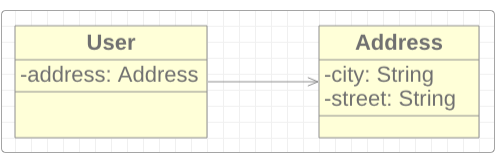

这种关联关系用代码来表示就如代码清单14-1所示。

> 代码清单14-1 类的关联关系

```java
public class User {
    private Address address;
}
public class Address {
    private String city;
    private String street;
}
```

代码清单14-1展示的是一种单向依赖关系，如果类A关联类B，且类B也关联了类A，那么它们就是一种双向关联关系。但这种关系是不推荐的，因为可能会引发循环依赖的问题。

2. 其次是聚合关系，这是一种特殊的关联关系，是一种比较强的关联。它描述的是整体和部分的关系，而整体和部分是可以分开的。例如计算机的组成部分包括CPU和显示器，但离开了计算机CPU和显示器依然能够独立存在，如图14-12所示。

> 图14-12 类的聚合关系

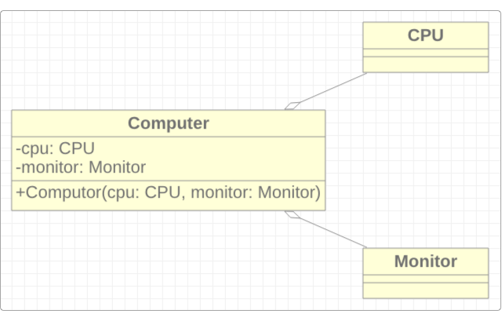

这种聚合关系用代码来表示就如代码清单14-2所示。

> 代码清单14-2 类的聚合关系

```java
public class Computer {
    private CPU cpu;
    private Monitor monitor;
    public Computer(CPU cpu, Monitor monitor) {
        this.cpu = cpu;
        this.monitor = monitor;
    }
}
public class CPU {
}
public class Monitor {
}
```

3. 第三是组合关系，它和聚合关系类似，但比聚合关系更进一步，因为它规定了整体和部分不能分开。例如用户可以有积分和等级，但积分和等级离开了用户就没有单独存在的意义了，如图14-13所示。

> 图14-13 类的组合关系

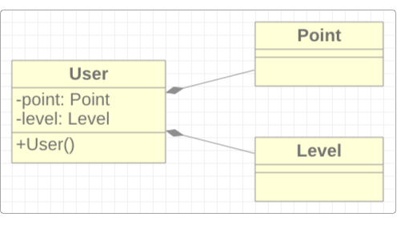

这种组合关系用代码来表示就如代码清单14-3所示。

> 代码清单14-3 类的组合关系

```java
public class User {
    private Point point;
    private Level level;
    public User() {
        this.point = new Point();
        this.level = new Level();
    }
}
public class Point {
}
public class Level {
}
```

4. 再就是实现关系，其实它就是类实现某个接口，如图14-14所示。

> 图14-14 类的实现关系

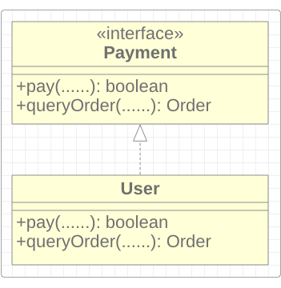

因为这种实现关系极为常见，因此就不再单独列举代码示例了。

5. 既然有了接口的实现，那么肯定也会有类的继承关系，这就是UML类图中的第五种关系：泛化关系，如图14-15所示。

> 图14-15 类的泛化关系

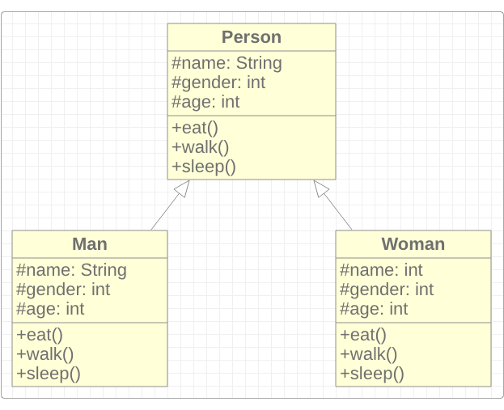

6. 最后是一种是依赖关系，这种关系和关联有些类似，但比关联关系更宽泛，如图14-16所示。

> 图14-16 类的依赖关系

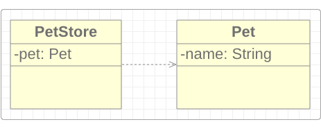

只要类B满足下面条件中的任意一个，就说类A依赖类B：

1. 类A中有成员变量的类型是类B；
2. 类B是类A方法的返回类型；
3. 类B是类A方法的参数类型；
4. 类A的方法中用到了类B。

#### 14.1.3 流程图

用例图和类图相对来说复杂一些，而其他的UML图和它们相比就简单多了。例如流程图就是将业务流程的各个环节和触发条件按照事件发生发展的顺序展现出来。以用户账号密码登录流程为例，其流程图如图14-17所示。

> 图14-17 带泳道的账号密码登录流程

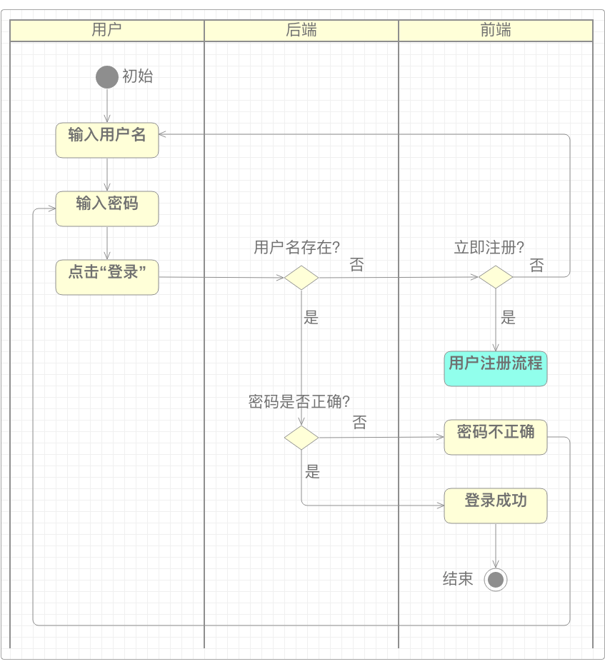

在上图中，用黑色实心圆“●”来表示流程初始，而用“☉”来表示流程结束。有三个竖长的矩形，分别是“用户”、“后端”和“前端”，这在流程图中称为“泳道”，就像泳池中的泳道一样，所以流程图有时候也叫“泳道图”。这些泳道代表一个个驱动业务开展的对象，它们都是事件或者条件的触发者。但有的流程图并没有这些泳道，效果也是一样的，如图14-18所示。

> 图14-18 无泳道的账号密码登录流程

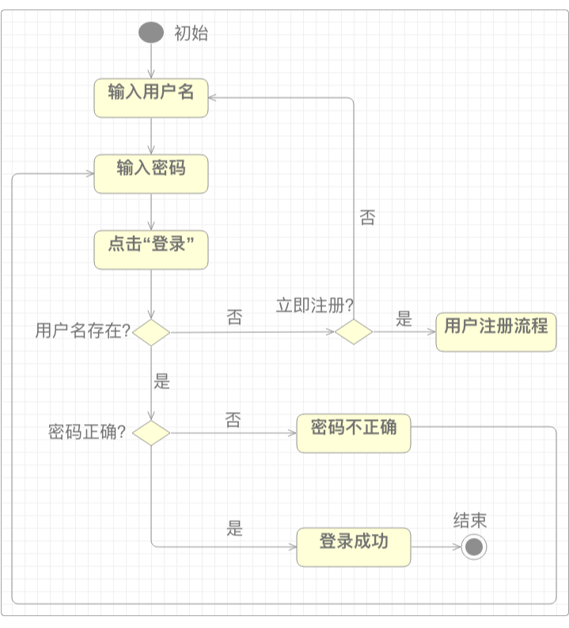

比较上面两幅图，除了一个有泳道，一个没有泳道外，它们之间没有任何本质区别。流程图是各类需求说明文档和系统设计文档中的主要组成部分之一，只要业务逻辑完整，各种分支条件清晰，相信任何人都可以轻松地画出它。

#### 14.1.4 状态图

状态图和流程图有些类似，但它关注的不是业务流程的推进，而是某些业务领域在事件发生时的状态变化，例如订单状态。有些UML图中将状态图弄的很复杂，包括诸如组合状态、历史状态、状态机等概念。一般稍微复杂一点的状态图会类似图14-19所示那样。

> 图14-19 状态图的“模板”

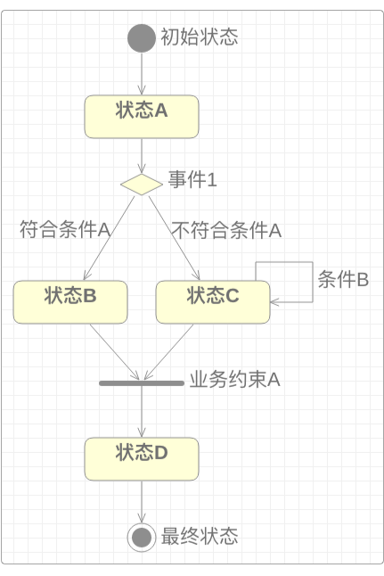

和流程图类似，在状态图中也用黑色实心圆“●”来表示初态，意思是还没有产生任何状态的时候。用“☉”来表示终态，也就是所有状态均已全部出现且再无新的状态出现之时。当状态A经过事件1时，如果符合条件A，就转换到状态B，否则就转换到状态C。状态C可以通过条件B完成自身状态的不断循环检查，例如已创建的订单如果未付款，那么它是否还在付款超时时间之内等这样的循环检查条件。只有当状态B和状态C同时满足业务约束A时，业务才能继续转换到状态D并进而完成。

其实大多数的状态图都没有这么复杂，而且也基本不需要复合状态、历史状态，甚至状态机，因为如果搞得太复杂有可能不但达不到沟通的目的，反而会适得其反。以终端用户视角的订单履约状态流转为例，其状态图如图14-20所示。

> 图14-20 终端用户视角的订单履约状态图

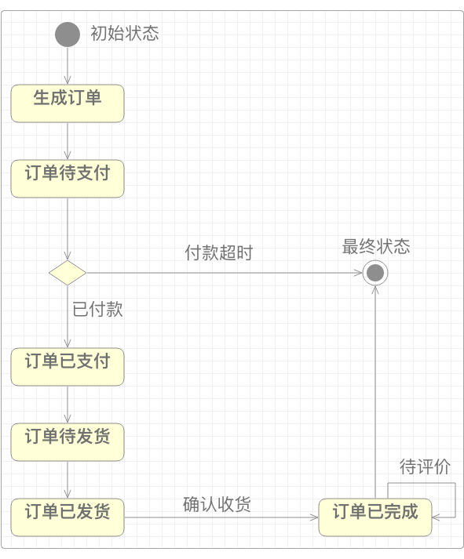

#### 14.1.5 时序图

时序图又被称为序列图（Sequence Diagram），它通过对象之间互相调用方法以及发送消息的时间顺序，来显示多个对象之间的动态协作过程。例如在之前讲述权限相关知识的时候，就用一个时序图来展现出了第三方授权登录的OAuth 2.0流程。

时序图是一种将类图和流程图结合到一起的一种UML交互图，它既有对象的方法调用，也有调用时的流程展现。相对于其他UML图，时序图更强调交互的时间顺序，同时也能很直观地描述并发过程。时序图的组成部分也比较多，但和状态图一样，在画图时真正需要用到的并不多。一个最简单的时序图一定会包括这四类组件：对象、生命线、关联消息和控制焦点，如图14-21所示。

> 图14-21 时序图的组成部分

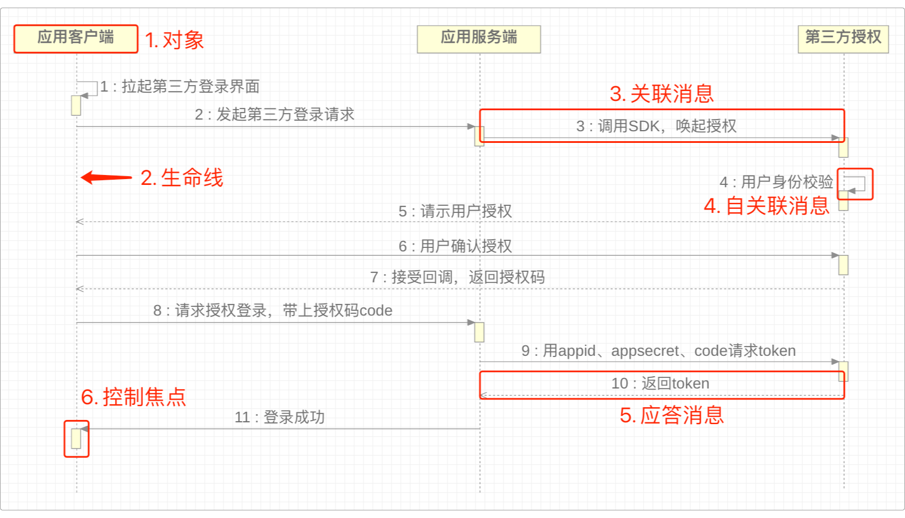

自关联消息和应答消息则不一定会有。对象可以有三种命名方式：

1. 第一种是将对象名和类名都显示出来，例如，“Chrome浏览器 : 客户端”，它的形式是“对象 : 类”；
2. 第二种方式是只显示类名，例如“客户端”；
3. 第三种方式是只显示对象名，例如“Chrome浏览器”。

这三种方式哪一种都可以，喜欢哪种就用哪种。

生命线在时序图中表示为从对象图标向下延伸的一条虚线，表示对象存在的时间。当对象A调用对象B的方法时，就从对象A拉出一根实线箭头到对象B，这就是关联消息，可以写上过程描述，也可以直接写上调用方法，例如上图中的第2步中的内容就可以换成是“2: login()”。如果对象A是调用自身的方法，那么就有一个指向自身的箭头，表示自关联消息。而所谓应答消息则类似于方法调用后的返回值。控制焦点又称为激活期，用来表示当前时间段内对象将要执行的操作，用一个竖长方条表示。搞清楚了时序图的结构后，就不难用它来画出与业务相关的对象方法调用过程了。例如，如果用时序图来画出用户在电商网站的购物过程，那么将会类似于图14-22所示内容。

> 图14-22 电商网站购物时序图

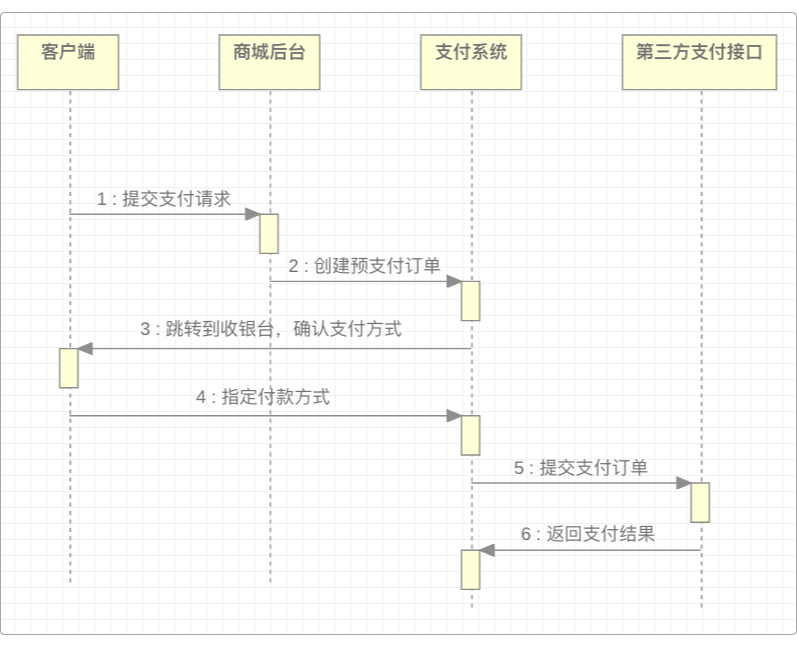

### 14.2 ER图

ER图是英文“Entity-Relationship Diagram”的翻译，称为“实体-关系图”，它是一种用于描述数据模型的图形化工具。ER图主要用于表示数据实体Entity（通常对应于数据表）、属性Attribute（通常对应于数据表中的字段）和实体之间的关系Relationship（即数据表之间的关联），它是数据库设计中最为常用的工具，没有之一。通过ER图，可以清晰地展示出数据模型中各个实体之间的关系，有助于数据库设计人员理解需求和设计出合理的数据（库）模型。

#### 14.2.1 逻辑模型

ER图从概念上分为逻辑模型与物理模型，这两类模型其实本质上是同一个，只是详细程度不同。逻辑模型描述了数据之间的逻辑关系，它独立于具体的数据库管理系统DBMS或存储结构。逻辑模型通常更侧重于抽象的逻辑概念，而不涉及具体的物理存储细节。ER图由三要素组成：

1. 实体Entity：可以是现实世界的业务对象，例如书籍、作者、读者等；也可以是一些系统中的逻辑对象。比如消息、子系统、接口等。在ER图中，实体使用矩形框来表示；
2. 属性Attribute：用来描述组成实体的要素，也就是某个实体所拥有的属性，可以把它理解为数据表字段或类的成员变量；
3. 关系Relationship：即实体与实体之间的联系，而且还能通过数字表示实体之间的数量对照关系。例如，一个出版社可以出版多本书籍，而一本书籍可以有多名读者，这就是简单的一对多关系。

大多数架构师们应该会比较熟悉PowerDesigner，它是一款由Sybase公司开发的建模工具，能够同时支持UML建模语言和ER图。只不过它有个缺点，就是只能在Windows环境下运行，如果想在其他操作系统，例如MacOS或Linux中使用会较为麻烦，需要安装一些辅助工具才行。其实常用的数据库客户端管理工具Navicat就完全可以胜任用ER图建模的工作，如图14-23所示。

> 图14-23 Navicat的建模功能

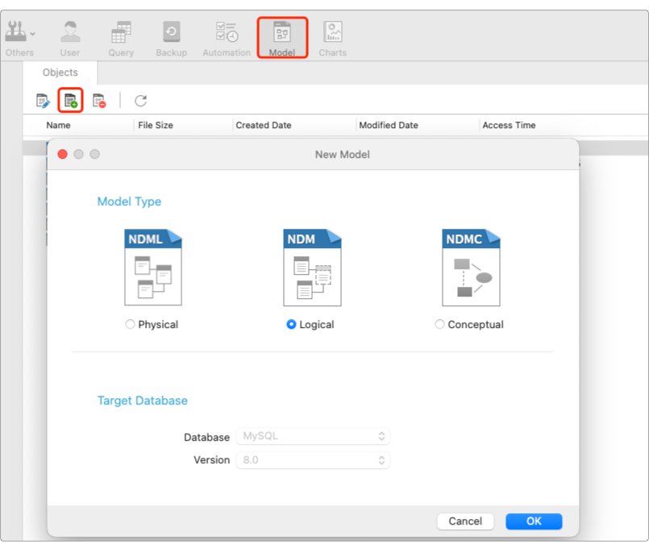

Navicat可以支持概念数据模型、逻辑数据模型和物理数据模型。所谓概念数据模型比逻辑数据模型更抽象，它只有实体及实体间的关系，而去除了属性，如图14-24所示。

> 图14-24 Navicat的概念数据模型

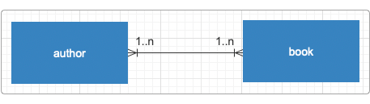

上图展示了两个简单的实体，即作者和书籍之间的对应关系：一个作者可以出版至少一本，也可以出版多本书籍。而一本书籍至少要有一个作者，也可以有多个作者。可以看到，Navicat中的概念模型是如此的简单，所以这种模型一般可以用逻辑模型来替代它，如图14-25所示。

> 图14-25 Navicat逻辑数据模型

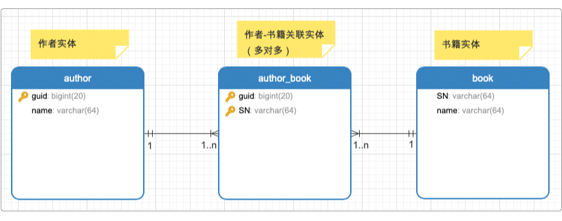

由于涉及到属性字段，因此相比于概念模型，逻辑模型多了所谓的“中间表”实体，也就是“作者-图书关联”实体，它是一种多对多的关系。在Navicat中有六种实体间的映射关系，这六种关系分别是：

1. None：表示没有任何对应的实体。Navicat用一根直线来表示这种关系，如图14-26所示。

> 图14-26 “None”映射关系


2. One and Only One：表示有且仅有1个对应的实体，如果双方都是这种关系，那就是基本的一对一映射关系。例如，学生和学籍之间就是如此。Navicat用图14-27来表示这种关系。

> 图14-27 “One and Only One”映射关系

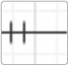

3. Many：有多个对应的实体。例如，1个班级有多个学生。Navicat用图14-28来表示这种关系。

> 图14-28 “Many”映射关系

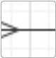

4. One or Many：有至少1个，也可以有多个对应的实体。例如，1本书籍至少要有1个作者。Navicat用图14-29来表示这种关系。

> 图14-29 “One or Many”映射关系

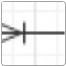

5. Zero or One：有0个或1个对应的实体，也就是要么有1个，要么没有。例如，公民和身份证之间的关系。每个人在未成年之前都可以没有身份证，但成年之后最多只有1个身份证。Navicat用图14-30来表示这种关系。

> 图14-30 “Zero or One”映射关系

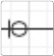

6. Zero or Many：有0个或多个对应的实体，例如用户和聊天群的关系就属于这种，某个用户可以没有加入任何聊天群，也可以在多个聊天群中。Navicat用图14-31来表示这种关系。

> 图14-31 “Zero or Many”映射关系

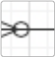

至于实体间的关系到底应该是哪一种，这需要根据具体的业务规则而定。例如，对于现实世界的书籍来说，至少要有1个作者与之对应，也可以有多个作者共同完成一本书。

#### 14.2.2 物理模型

在搞清楚逻辑模型之后，物理模型就很容易明白了，除了要添加更详细的字段属性值之外，它和逻辑模型基本没什么区别，而且从模型设计图的外观上也可不出什么不同，如图14-32所示。

> 图14-32 Navicat物理数据模型

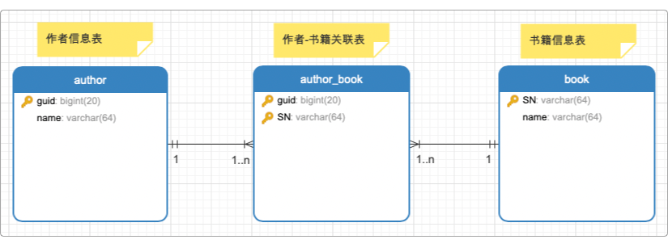

上图的物理数据模型和图14-25的逻辑数据模型之间看不出任何差异，但它们确实是两种不同的模型。在PowerDesigner中，物理模型是可以直接转换为SQL脚本的，所以不同的软件工具使用时，也会有不同的功能与便利。

数据字典，是一种存储元数据信息的集合，通常以表格的形式呈现，用于描述数据库中各个数据元素（data element）的定义、结构和属性。数据字典记录了数据表的数据项、数据结构、数据类型、取值范围、关系以及数据之间的约束等信息。

在数据字典中，常见的信息包括：

1. 数据项（Data Item）：描述数据库中的数据元素，即字段；
2. 数据类型（Data Type）：指定数据项的类型，如整数、字符、日期等；
3. 数据长度（Data Length）：指定数据项可以存储的最大长度和精度；
4. 取值范围（Value Range）：指定数据项允许的取值范围，这个一般不需要；
5. 数据关系（Data Relationship）：描述数据项之间的关系，如主键-外键关系等；
6. 约束条件（Constraint）：描述对数据项的约束条件，如唯一性约束、非空约束等。

通过数据字典，用户可以更好地理解数据库中的数据结构和含义，从而更有效地进行数据库设计、开发和管理工作。

以图14-32的物理数据模型为例，其数据字典的示例如表14-2所示。

> 表14-2 数据字典示例

<table>
	<tr>
		<th colspan="2">数据表</td>
    <th colspan="3">default.author信息表</td>
    <th colspan="2">表引擎</td>
    <th colspan="3">MyISAM</td>
	</tr>
  <tr>
		<th colspan="2">唯一索引</td>
    <th colspan="3">无</td>
    <th colspan="2">字符集</td>
    <th colspan="3">utf8mb4 / utf8mb4_general_ci</td>
	</tr>
	<tr>
		<th>字段</td>
		<th>类型</td>
    <th>长度</td>
    <th>精度</td>
    <th>默认值</td>
    <th>非空</td>
    <th>外键</td>
    <th>主键</td>
    <th>字符集</td>
    <th>注释</td>
	</tr>
  <tr>
		<td>guid</td>
		<td>bigint</td>
    <td>20</td>
    <td>0</td>
    <td></td>
    <td></td>
    <td></td>
    <td>非自增</td>
    <td></td>
    <td>全局唯一ID</td>
	</tr>
  <tr>
		<td>name</td>
		<td>varchar</td>
    <td>64</td>
    <td>0</td>
    <td>''</td>
    <td>是</td>
    <td></td>
    <td></td>
    <td>utf8mb4</td>
    <td>作者名称</td>
	</tr>
</table>

另外，在互联网应用中，由于数据表之间已经去掉了外键、级联操作等各种束缚，因此过去那种数据库设计第三范式的约束力，虽然在逻辑结构上仍具备效力，但在物理数据表上已经不复存在了。

### 14.3 架构图

相信读者们经常可以在一些需求文档、技术博客中看到比较漂亮的架构图形，例如图14-33和图14-34所示。

> 图14-33 Spring Cloud微服务分布式系统架构图

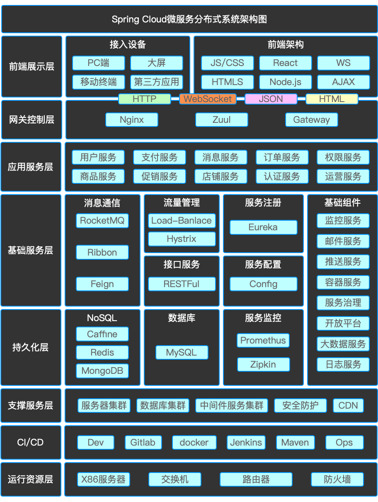

> 图14-34 大数据系统架构图

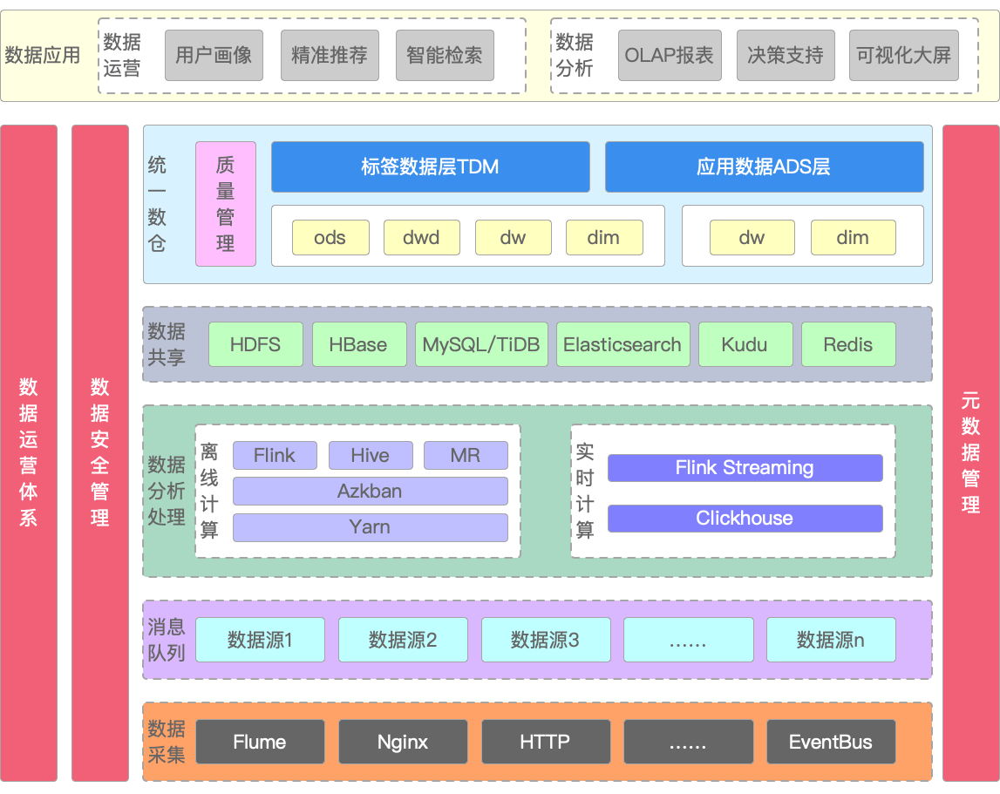

本节的所有图形笔者都是通过`OmniGraffle/7.22.5/GM-v205.43.4`绘制，下面就来看看这些图是怎么画出来的。

#### 14.3.1 架构思维

所谓的架构思维，其实是抽象思维、解构思维、集成思维、分层思维、发散思维、结构化思维、迭代思维、系统思维和模式匹配等诸多思维模式的一个有机融合。架构的核心作用在于将现实世界和抽象的IT实现之间连接起来，因此它最关键的一点就是要深刻理解业务，并由业务来驱动技术，使技术最终为业务服务，达到抽象和具体、需求和实现、业务和技术、成本和收益等多方面的平衡，如图14-35所示。

> 图14-35 架构思维

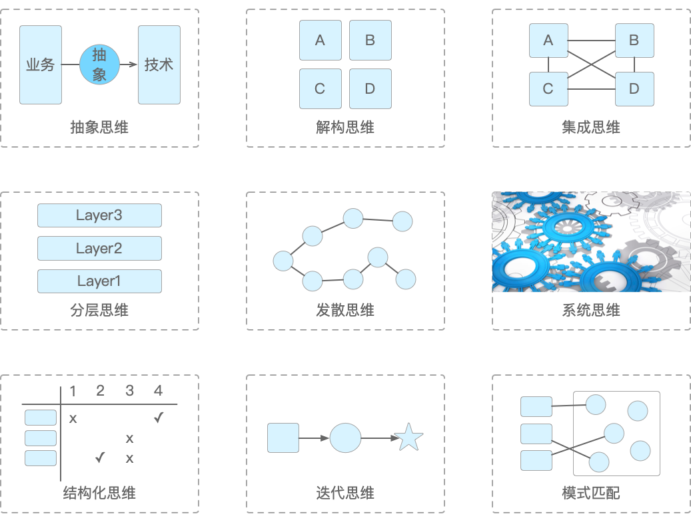

虽然有这么多的思维模式，但好的架构设计都是通过“先抽象性解构，再系统性集成”而来的。抽象和解构是基础，能够对复杂的问题抽丝剥茧，再分而治之，本身就是一项非常彪悍的能力。同时，将分解后的各种部件按照“高内聚，低耦合”的原则，再拼系统化地集成为一个有机的整体，这又是另一项了不起的能力。“抽象”、“解构”、“系统”与“集成”这几种思维模式一旦完美融合，就会产生如图14-36中所展示的那种“美”。

> 图14-36 中国建筑中的榫卯结构


因此，“抽象”、“解构”、“系统”与“集成”可以说是架构设计中最基础的四种思维方式。将复杂的业务逐步分解完成后，一个庞大的系统就已经被拆分成了很多个子系统，一个子系统本身又可以分为多个实现步骤或阶段，将这些零散的节点汇集和归纳起来之后，仿照类似组织结构那样的层级，将它们的功能职责划分为不同的层次后再组织起来，这就是分层思维。
分层思维在软件开发中得到了最为普遍的应用，从当初的C/S架构，到后来的B/S架构，再到目前的MVC和云服务三层架构，分层可以说是无处不在。以云计算的标准三层架构模式为例：

1. IaaS（Infrastructure as a Service）层：负责实现IT基础设施和提供各种虚拟（化）服务，它将服务器、操作系统、网络、存储、容器、计算、中间件等各类资源打包，然后在此基础上提供开箱即用、运维管控、流量计费等相关服务。它是继水、电、煤、气之后的又一种工业化基础服务，这种服务在互联网时代，称之为“算力”；
2. PaaS（Software as a Service）层：它依托IaaS，将其提供的各种服务再二次构建为“能力”。它类似于操作系统，将复杂的硬件和网络操作封装起来成为API接口，再提供给各类应用软件调用。没有它的存在，那么各类软件将不得不独自开发所有需要操作硬件和网络的功能，这将是对资源的巨大浪费；
3. SaaS（Infrastructure as a Service）层：它们就类似于计算中的各种各样的软件，有画图的，有写代码的，有听音乐的，还有上网看视频的。它与众多的开发者和海量的终端用户直接打交道，让他们能够直接享受到系统或平台服务带来的便利。

而对于Java工程师们来说，他们接触更多的则是三层架构或者MVC架构，如图14-37所示。

> 图14-37 传统的三层架构图

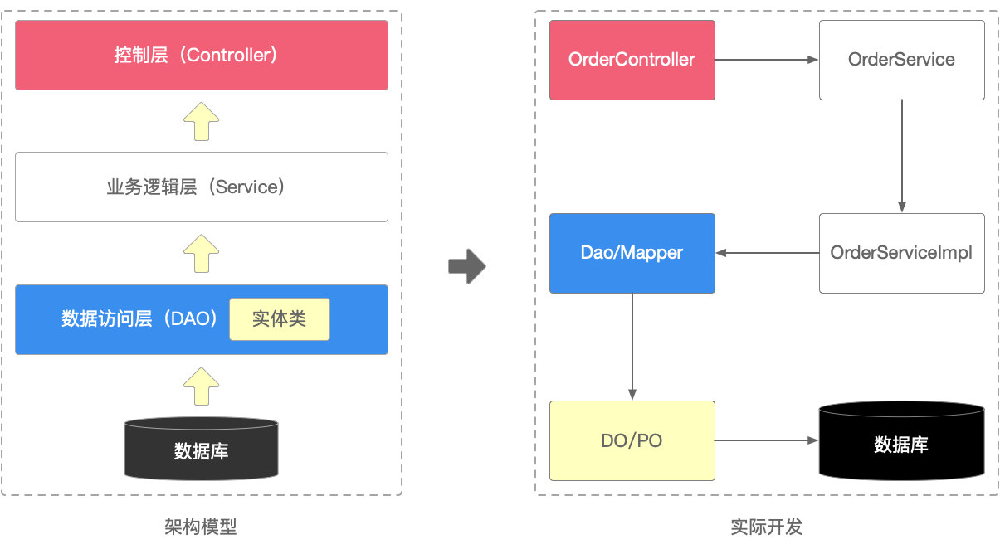

但是，在以DDD为代表的微服务兴起之后，传统的三层架构又被更优雅的四层架构逐步取代，如图14-38所示。

> 图14-38 基于DDD的微服务架构图

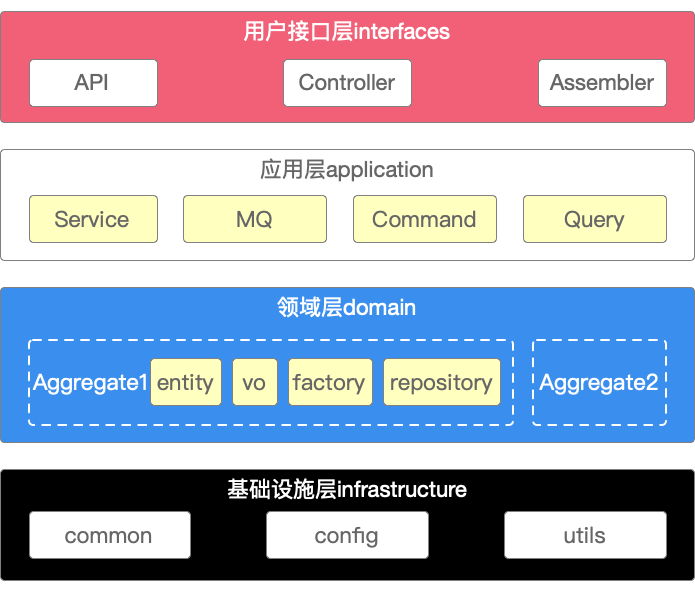

变的是架构，但架构思维一直都没有变，那就是更加面向业务、更加适应复杂且频繁变化的业务。但不管哪种架构，不管哪种模式，合适的才是最好的。笔者经历过盲目追求先进导致项目拉胯的，也经历过用破烂的祖传架构开发出性能优异的产品的。所以，再次强调：不管什么思维，什么架构，什么模式，没有好坏之分，只有适用之别。

#### 14.3.2 架构图模板

虽然学习架构思维需要时间的浸润和经验的积累，但却可以通过直接使用模板的方式达到快速画出架构图的目的。就笔者的经验而言，常用的架构图包括但不限于如下几类：

1. 规范辅助型模板：它将一个完整的架构图模板拆分为“左中右”式布局，两边小中间大。中间部分放的内容主体，如业务模块、技术栈等，而两边则是放一些具体的标准、规范和辅助工具，例如认证授权、技术标准、开发规范等。另外，两边的标准和规范部分也不是非要覆盖整个内容的主体不可，而是可以依据实际情况，让它覆盖到其中的某些层级或仅覆盖某一层级，如图14-39所示。

> 图14-39 规范辅助型架构图模板

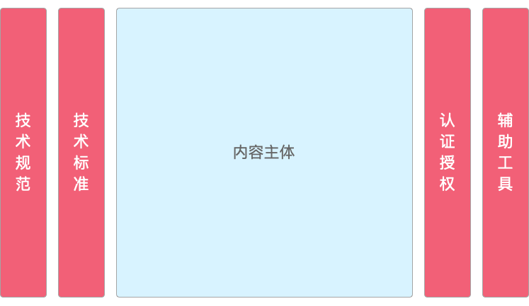

2. 上下分层型模板：它在规范辅助型模板之上，将中间的内容主体按照分层思维划分成了不同的层级，层级的划分可以参照云服务的标准架构，也可以按照具体业务需求和技术规约进行，如图14-40所示。

> 图14-40 上下分层型架构图模板

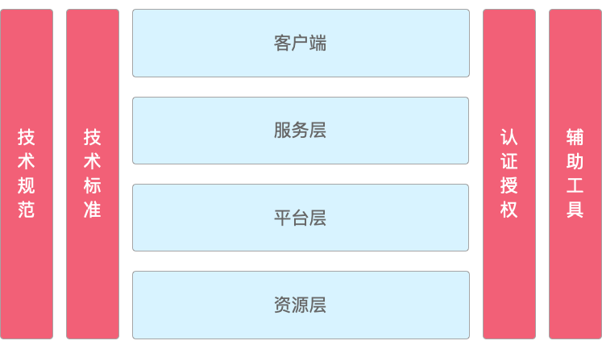

3. 组件切分型模板：这一种类型的架构图模板，是在纵向分层之后，再进行横向切分，将某一层或某几层切分为更细小的组件、服务或模块，这样看起来不仅内容细节更加丰富充实，而且也能更好地让对方知道一些关键部分和核心点在哪里，如图14-41所示。

> 图14-41 组件切分型架构图模板

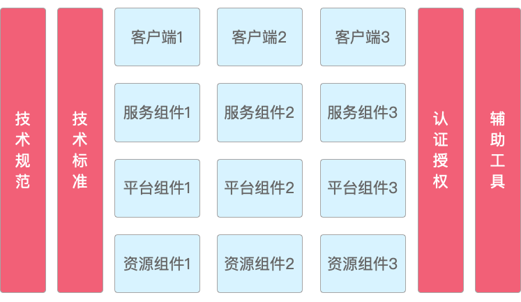

4. 融合复用型模板：这种架构图模板是在组件切分之后，将其中某些重复部分或者共性部分提取出来作为可复用的公共组件，并融合与之相关的其他业务板块，演变成为架构中台，如图14-42所示。

> 图14-42 融合复用型架构图模板

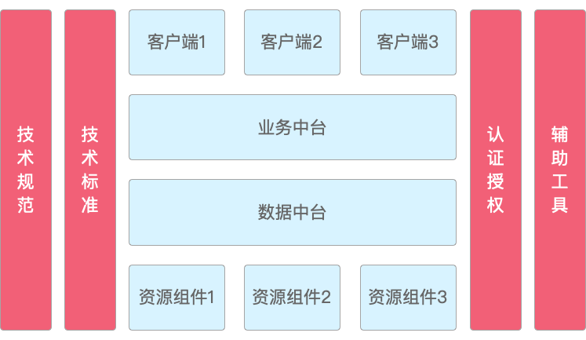

5. 纵横交错型模板：这种架构图并不是融合复用型模板的延续，它在一般的互联网和企业应用中比较少见，主要用于一些系统集成型的应用中，它体现的是集成的各个子系统中的关键部件，及子系统之间的连接关系。它把UML组件图和数据流图给结合到了一起，如图14-43所示。

> 图14-43 纵横交错型架构图模板

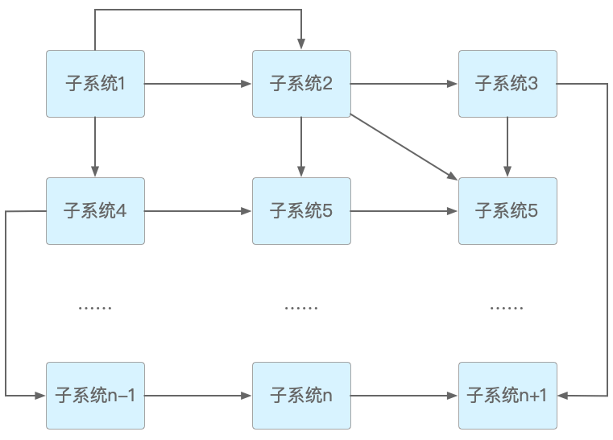

6. 网络拓扑型模板：在涉及到网络和硬件的应用中这种架构图模板属于标配，纯软件项目中根本看不到，但是出于架构图模板的完整性考虑，笔者还是将它在此归为一类，如图14-44所示。

> 图14-44 网络拓扑型架构图

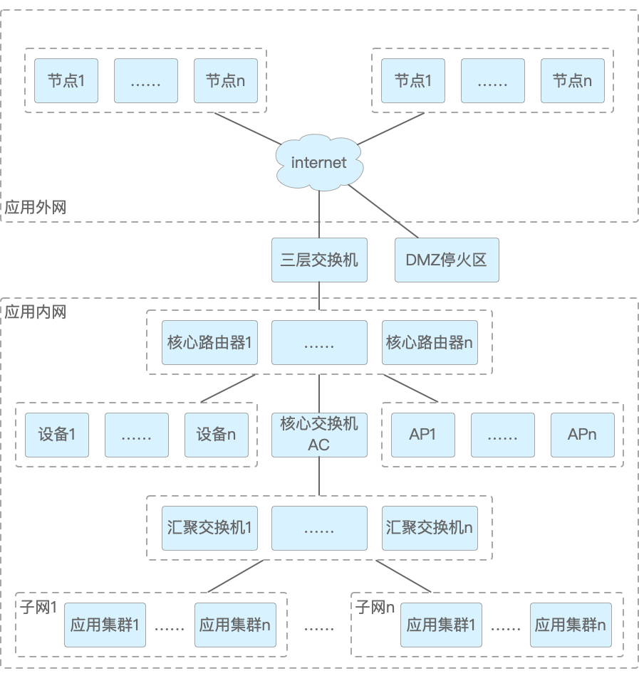

不管是分层型模板（规范辅助型、上下分层型、组件切分型、融合复用型）、纵横交错型模板还是网络拓扑型模板，万变不离其宗，都是多种架构思维方法的排列组合，只有掌握了底层的架构思维方法，才能在画架构设计图时信手拈来。

#### 14.3.3 架构图分类

俗话说“千人千面”，架构图也是如此。按照类别，架构图一般分为下面几类：

1. 业务架构图：是指描述组织或企业业务活动、流程、信息和系统之间关系的图表或图形表示。它通常用于展示组织内部各业务领域的关联和交互，包括业务流程、数据流、信息系统和技术基础设施等方面的内容。通过业务架构图，产品经理、项目经理或工程师们可以更清晰地了解组织的业务结构、运作方式和信息流动路径，有助于组织进行业务规划、流程优化和系统设计。图14-45展示的是一个典型的零售企业所拥有的业务形态和结构，也属于典型的组件切分型架构。

> 图14-45 典型的零售企业业务架构图

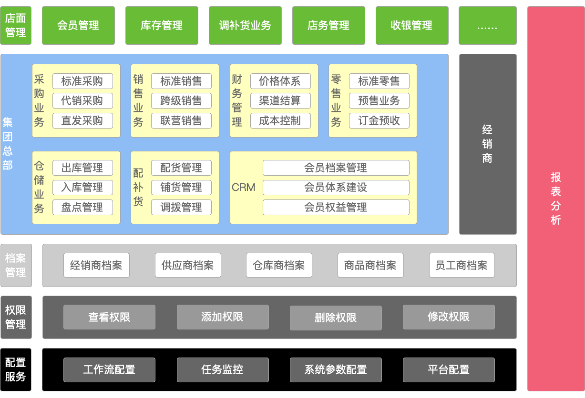

2. 应用架构图：这是比较容易和业务架构图混淆的一类架构图，在概念上它和业务架构图是不同的。它和业务架构图在组织的发展和运营中扮演者不同的角色。如果说业务架构图是企业战略规划的一部分，关注业务流程和信息供给，提高业务执行效率，那么应用架构图则是描绘在构建应用系统时所需遵循的一些原则和方法。它的关注点在于应用程序本身的设计原则、技术选型、通信方式及各组件之间的依赖关系。它的目标是确保系统的稳定性、安全性、可维护性、易用性和可扩展性。不过这两者之间常常会搞混。图14-46展示的就是一个微服务应用架构图，也属于典型的组件切分型架构。

> 图14-46 典型的微服务应用架构图

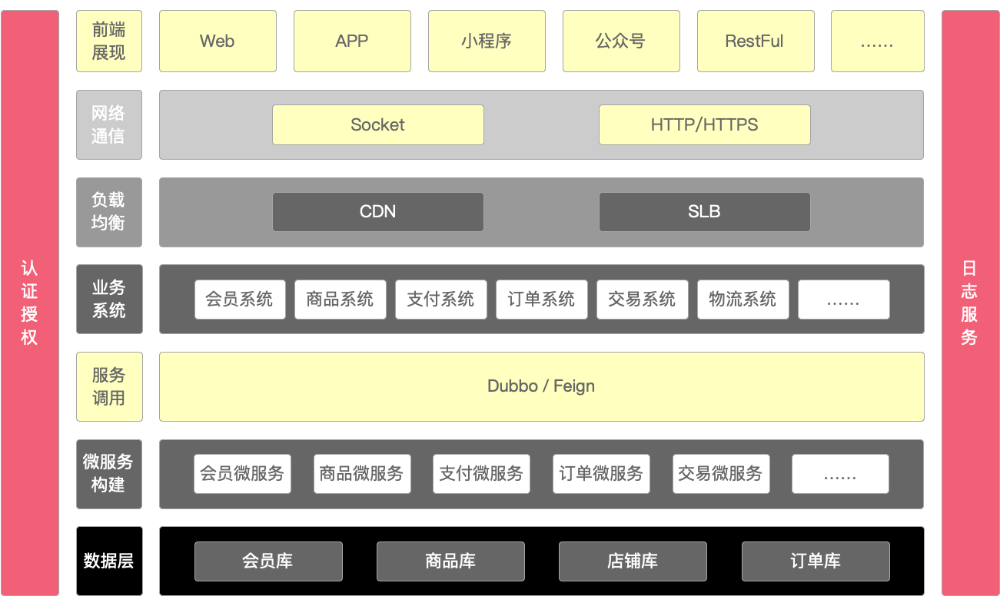

3. 技术架构图：顾名思义，它是描述软件系统或应用程序的技术组件、模块、接口和它们之间关系的图形表示。技术架构图通常用于展示软件系统的整体结构，包括各个模块之间的依赖关系和通信方式。技术架构图可以帮助工程师们更好地理解系统的技术实现细节，指导系统的开发、部署和维护工作。虽然技术架构图和应用架构图都有关于软件系统的依赖关系和通信方式，但它们的内容和侧重点还是不同的：应用架构图侧重于展示软件系统的功能模块、业务流程和业务逻辑，是一种高层次的设计，不关注技术细节；但技术架构图则侧重于描述软件系统的技术实现细节，包括各个模块的部署方式、通信协议、数据传输方式等。图14-47展示的是典型的微服务技术架构图，由于微服务本身就是纵横交错的，所以这里也采用了纵横交错型架构模板。

> 图14-47 典型的微服务技术架构图

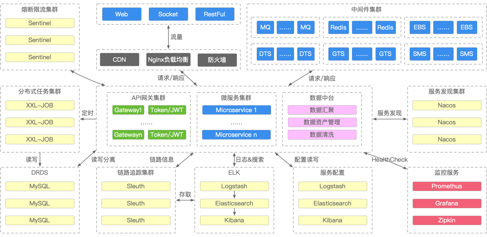

从某种程度上也可以说，如果将应用架构图的粒度缩小，或者技术架构图的粒度放大，那么它们其实就是同一个东西。

4. 数据架构图：在互联网时代，企业中最有价值的资产之一就是数据，这包括业务数据、系统日志、人员信息、消息往来、资讯文档、会议纪要等各种各样的数据，而所谓的数据架构，就是要将这些数据按照架构思维分类、分层整理，让它们流向能够为企业创造价值的地方，同时也为企业的战略规则、设计和决策提供可靠的依据。数据架构并非指的是狭义上的数据系统或数据库设计，而是和企业内全部的IT系统紧密相关，因为它才是企业信息化真正的灵魂，典型的数据架构如图14-48所示。

> 图14-48 典型的数据架构图

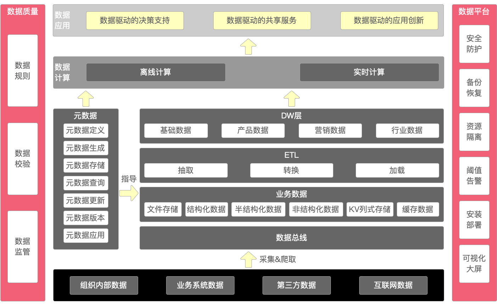

在很多技术文档或博客中出现的架构图，并不能够让人很明确地知道它们归属于以上的某一分类。比如，有些所谓的系统架构图就把这几类不同的架构混淆到一起，使得画出来的架构图看上去既不属于业务架构图，也不属于应用架构图或技术架构图，但它同时又都属于所有这些不同的分类。不过，架构图属于哪一种分类并不重要。重要的是它能否体现出架构设计者的思想方法和思维模式，体现出一个抽象的可落地实施的技术实现，能够让人一看就明白，达到沟通、交流和持续改进的目的，才是关键所在。

### 14.4 其他

在了解并能够熟练地画出UML图、ER图和架构图之后，就已经可以独立地完成架构设计，输出相关的技术文档了——这也是一名合格架构师的日常工作之一。只不过对于架构师来说，技术开发并非工作的全部内容，其间总会伴随着一些任务安排、制定计划、人员协调和进度报告的事项，这些安排、计划、协调和报告如果能以图表的形式呈现，不仅可以节约上级了解详细内容的时间，也能让其对全局一目了然，提升沟通的效率和效果。这一小节就来盘点一下项目规划所涉及到的图表。

#### 14.4.1 甘特图

所有的项目在开始之前，都需要事先定义的清晰的目标和计划。没有这些明确设定的步骤、任务和截止日期，项目将有失控的风险。最终，将宝贵的时间和金钱打水飘。而在项目管理中，最常见的一类图表就是甘特图（Gantt Chart），它以提出者亨利·劳伦斯·甘特（Henry Laurence Gantt）的名字命名。

顺便说一句，甘特也是科学管理运动的先驱者之一，他和弗雷德里克·温斯洛·泰勒（Frederick Winslow Taylor）一样，都非常重视工作环境中人的因素的发挥，并强调对员工进行教育、培训的必要性和重要性。

甘特图不仅仅可以用于项目管理，图14-49展示的是一个较为简单的显示任务、时间与进度的软件项目开发甘特图。

> 图14-49 《XYZ》软件项目开发甘特图

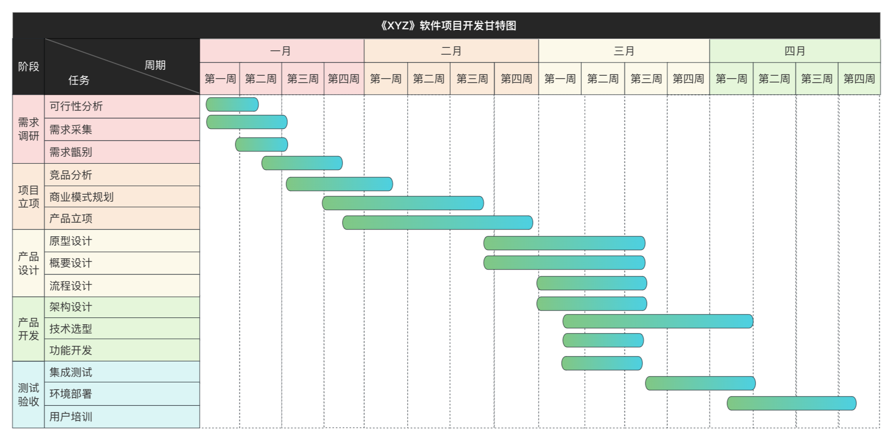

实际上，只要是与时间、进度、成本相关的任务，都可以用甘特图来制定计划。例如，对于个人工作安排来说，也可以通过甘特图来直观地设定，如图14-50所示。

> 图14-50 个人工作计划甘特图

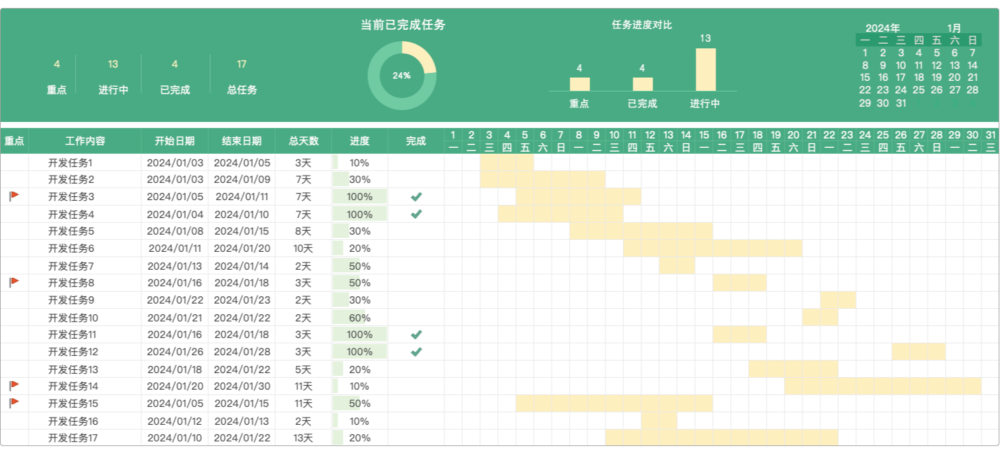

如果想将分解后的工作任务指定给具体的人，并且可以随时观察时间进度，那么甘特图也是最佳选择，如图14-51所示。

> 图14-51 项目人员分工甘特图

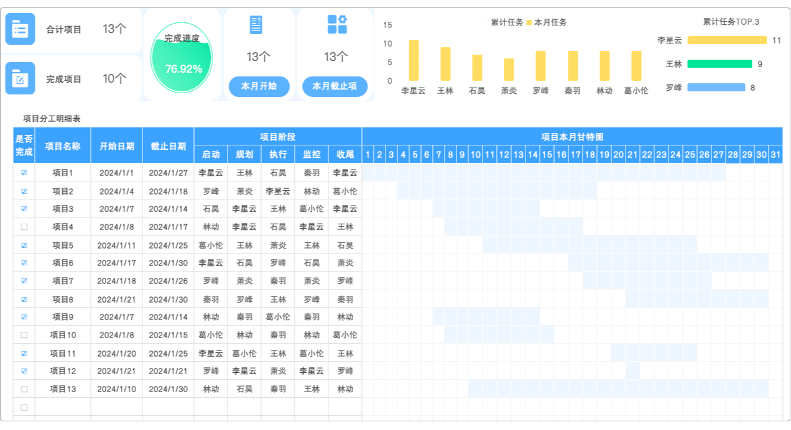

所以，甘特图可以为项目提供非常有效且直观的管控方式，包括但不限于：

1. 项目的目标和为实现目标所需要完成的任务；
2. 每个任务完成的前提条件及各个任务间的先后顺序；
3. 每个任务计划花费多长时间以及实际花费的时间；
4. 为每个任务所投入的资源和成本；
5. 项目执行中可能遇到的风险及控制手段。

画甘特图的工具很多，例如Windows中的Project、Visio、Excel，MacOS中的OmniPlan，以及一些网络应用，如ProcessOn、Ganttable等，可以选择一种自己熟悉的工具软件使用。但工具代替不了思想，只有具备了良好的项目管理思维和能力才能轻松地画出好的甘特图。

以单身一族做饭为例，其周末烹饪午餐的过程可能会是如图14-52所示的那样。

> 图14-52 单身一族做饭甘特图

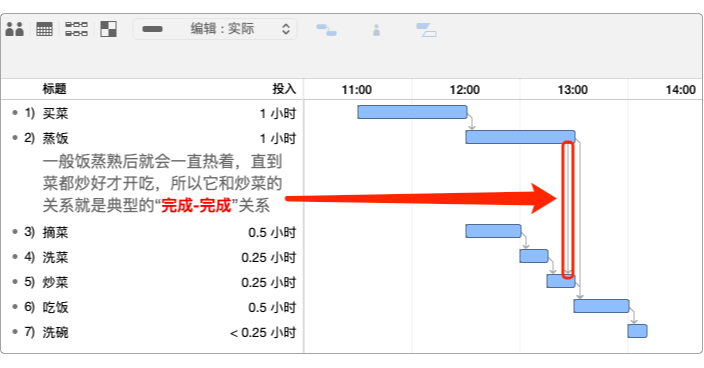

这里没有考虑“煲汤”。所以，“蒸饭”和后续的“摘菜”、“洗菜”和“炒菜”是并行的，这是为了最大程度地节约时间，提高效率，早点填饱饥饿的肚皮，而且实际情况也的确如此。

但是，如果将“做饭”这件事换成一个专业团队来干的话，其“项目”的执行过程就完全不一样了。以笔者对餐饮行业的粗浅了解，通过下图14-53所示的甘特图进行了640×480的低度还原。

> 图14-53 专业团队烹饪甘特图

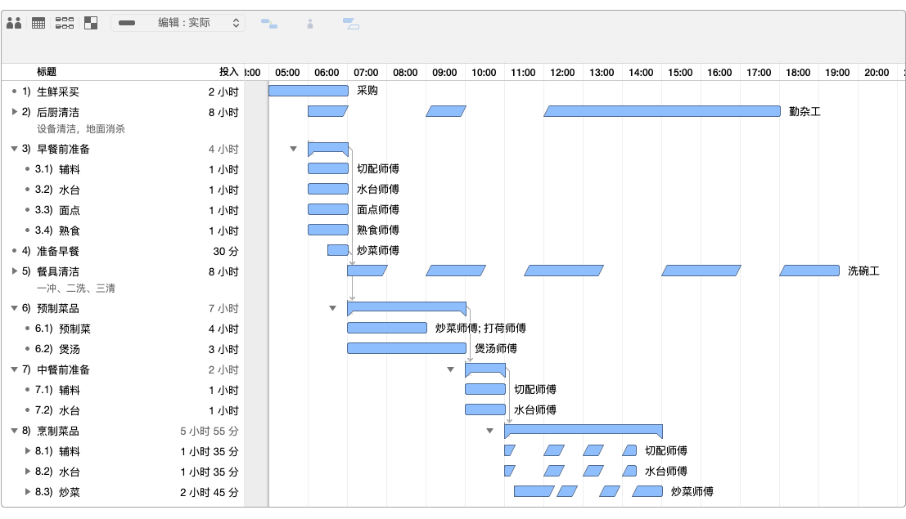

从图中可以看到，无论是做饭内容还是流程都完全不一样了。例如对于勤杂工和洗碗工来说，其工作内容并非连续的，他们不会一直拖地，也不会一直洗碗，而是有需要的时候才拖地洗碗。在制作午餐的烹制菜品时，切配、水台和炒菜等各路师傅的工作也是穿插进行的，不像软件开发中某个功能的开发可以由某位工程师一直持续进行。

另外，甘特图中的关键资源就是切配、水台和炒菜这三个岗位，这也类似于开发团队中的骨干工程师，他们的工作效率可以成为制约项目的瓶颈之一，而且也是项目的关键路径。但就笔者的经验而言，项目的关键路径还有另外一种，即团队中能力最弱的那个。因为项目延期和最坏情况的出现，往往是由能力最差的团队成员所导致的，这也是为什么甘特图的创建者亨利·劳伦斯·甘特一直非常关注项目中人的因素的原因之一。

笔者之前说过，甘特图只是项目管理思想的一种体现，有了成熟的项目管理思想，即使没有画图工具，“甘特图”也会自然而然地出现。以曾经的某个笔者主导项目开发工作为例，如图14-54和图14-44所示。

> 图14-54 任务分配图


> 图14-55 任务进度图


从上面两幅图可以看到，在四周的时间内，赵钱孙李四位开发工程师总共完成了112个开发任务，每个人完成的开发数量和每周总共完成的开发数量也都明确地展示了出来。其中，由于前两周属于技术攻坚阶段，因此每周完成的任务数较少。而第四周由于是收尾，所以完成的任务数不多，更多地是测试和修改BUG的工作。

所以说，即使没有画图工具，哪怕连白板都没有，拿一张A4纸同样可以清晰地记录下这些数据。这两张图中所蕴含的不正是甘特图的精髓吗？因此，笔者才强调工具不重要，真正重要的是项目管理的思维方式和意识，它们才是甘特图的灵魂——记录数据，分析数据，呈现数据，对照改进——这也是整个CMMI软件质量认证体系的精髓所在。

#### 14.4.2 鱼骨图

另一种常见的图形为鱼骨图（Fishbone analysis method），因为画出来的图形像鱼骨而得名。由于鱼骨图是由日本管理大师石川馨发展出来的，所以又叫石川图，它原本是一种非定量的、用户发现问题的“根本原因”的方法，所以也称之为因果图。鱼骨图的结构如图14-56所示。

> 图14-56 鱼骨图的结构

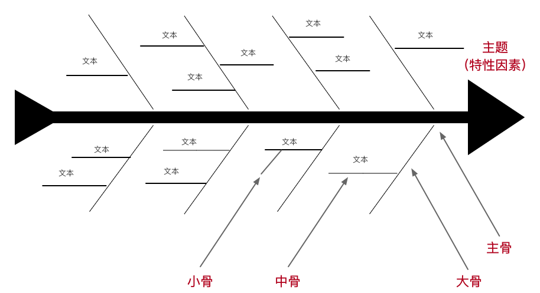

鱼骨图有三种类型，也是用来处理三种类型的问题：

1. 问题型：可以称之为“what”，用于定义问题；
2. 原因型：可以称之为“why”，用于找到产生问题的根本原因；
3. 对策型：可以称之为“how”，即找到如何解决问题的办法。

一般鱼头的位置是需要分析的主题，而把各种原因、对策都划分为所谓大骨、中骨和小骨，也就是将原因、对策层层分解，直至再也无法细分为止。而这几种不同类型的鱼骨图之间也没有绝对的界限，也不用拘泥于这几种类型，只要能够通过鱼骨图实现对问题的正确归因、找到相应的对策以及呈现出必要的事实就行了。例如，图14-57就是以鱼骨图的形式做的一份半年工作总结。

> 图14-57 鱼骨图用于工作总结

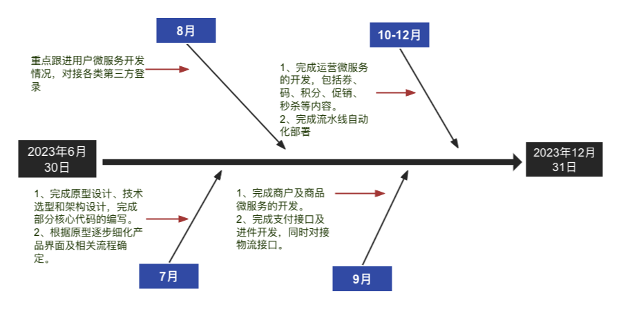

当然，鱼骨图的强项还是在问题定义和寻找对策上，如图14-58所示。

> 图14-58 鱼骨图用于问题定义

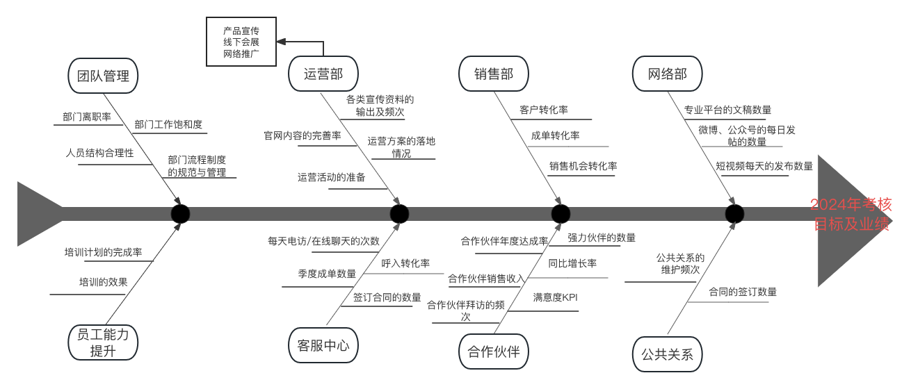

或者是开发计划的归纳上，如图14-59所示。

> 图14-59 鱼骨图用于迭代计划

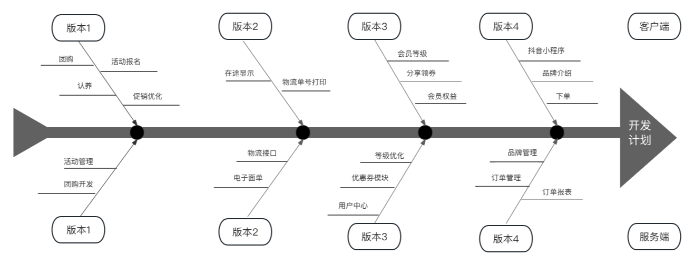

总之，笔者认为掌握鱼骨图的关键词就是“归因”二字。但工具是死的，人是活的，同一种工具在有的人手中可以千变万化，随心所欲。正如同真正的武林高手都没有固定的招式，但却处处都是招式一样。另外，本小节中的图形都是用ProcessON所画。

#### 14.4.3 思维导图

大多数人都知道思维导图这个东西，它又称脑图，是一种表达发散思维的有效图形化工具，它可以用关键词的形式把和同一主题相关的事物都表现出来，加深人们对这一主题的理解和记忆，同时激发人的想像力，训练发散思维。但其实思维导图并非仅仅就是我们平常用Xmind、MindMaster或一些在线工具生成的类似那种从中心点向外发散的图形，如图14-60所示。

> 图14-60 思维导图

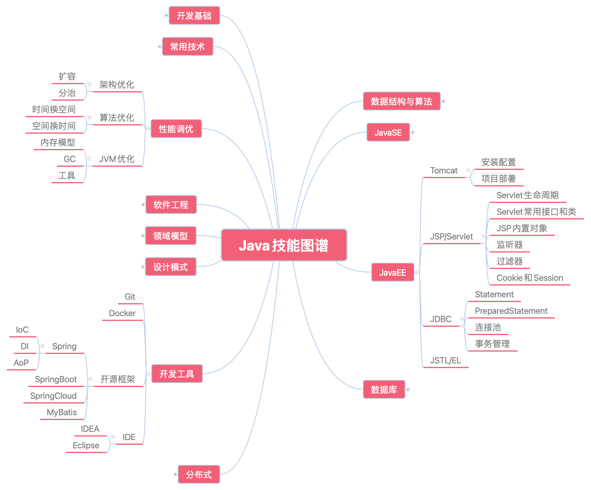

但真正的思维导图并非上图所显示的那样，它分为两种：一种是来自美国教育改革家`David· Hyerle（大卫·海勒）`发明的`Thinking Map`，另一种是`Mind Map`，也就是上图那种发散图，它是由英国的“记忆力之父” `Tony·Buzan（托尼·布赞）`发明的。虽说都可以称之为思维导图或脑图，但它们之间的区别还是挺大的，主要的区别就是`Thinking Map`有八种不同的图示类型，它们分别对应于人在思考时的八种思维过程，而`Mind Map`仅仅只有一种中心点向外发散的图示。

这一小节就主要来介绍一下这个看起来其貌不扬但却极为内敛且有用的`Thinking Map`，对它的描述如图14-61所示。

> 图14-61 Thinking Map

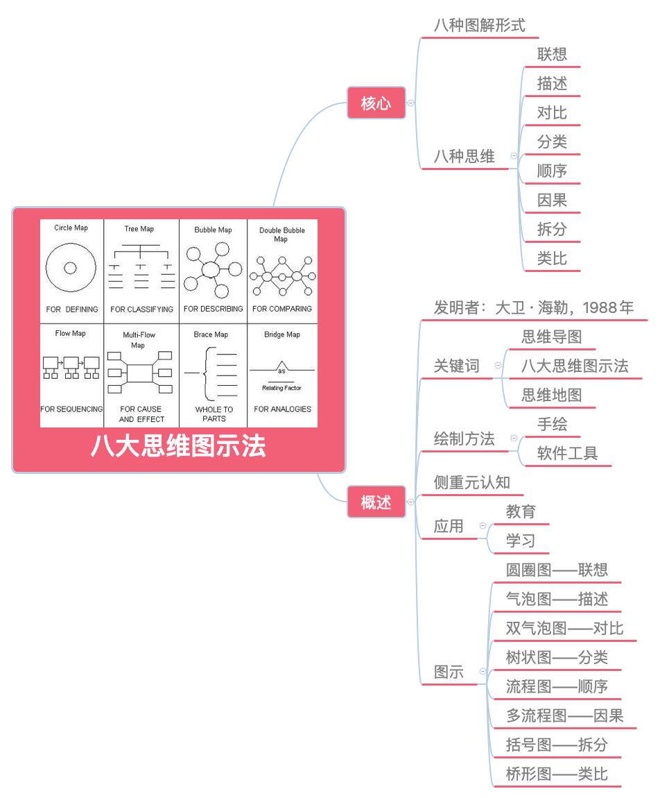

由于流程图已经讲过，而树状图和括号图和Mind Map的差别不大，所以这三类就不再赘述。下面就来看看所谓的圆圈图、气泡图、双气泡图、多流程图和桥形图都代表是什么意思。

圆圈图常用来锻炼想象力，它由一个小圆和一个大圆组成，中心词写在小圆图内，关于中心词的联想写在两圆之间。联想出的词可以是文字，也可以是简单的图片。例如，以一次出国旅游为例，图14-62所示的就是圆圈图。

> 图14-62 Thinking Map圆圈图

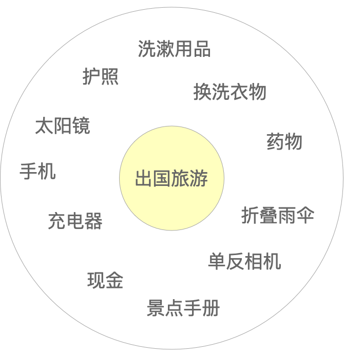

圆圈图之所以可以锻炼想象能力，是因为它可以围绕某个点产生更有创意的想法、拓展思考问题的角度、回忆学过的知识、定义概念等，圆圈图也可以用Mind Map替代。

气泡图与圆圈图有些类似，它中间的大圆內写中心词，中心词周围的小圆圈内都是用来描述中心词的词汇，这些词汇一般都为形容词。图14-63所示的就是气泡图。

> 图14-63 Thinking Map气泡图

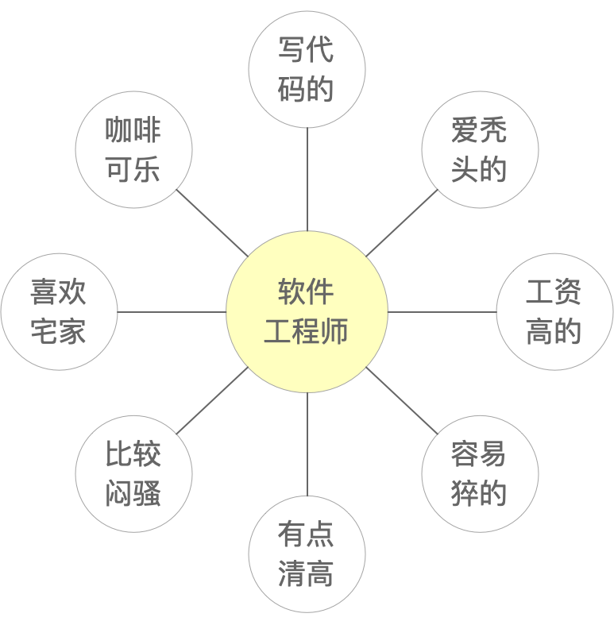

如果说单个气泡图是用来描述和形容某件事物或某个人的话，那么双气泡图则是用来对比两个不同的事物或人。双气泡图由两个气泡图结合而成，它有两个中心词，分别是需比较的两个事物。在两个中心词相交的气泡中是这两种事物的相同点，而在两个中心词另外两侧的气泡中展示则是这两种事物的不同点。图14-64通过双气泡图展示了项目经理与产品经理这两个关键岗位间的不同之处。

> 图14-64 Thinking Map双气泡图

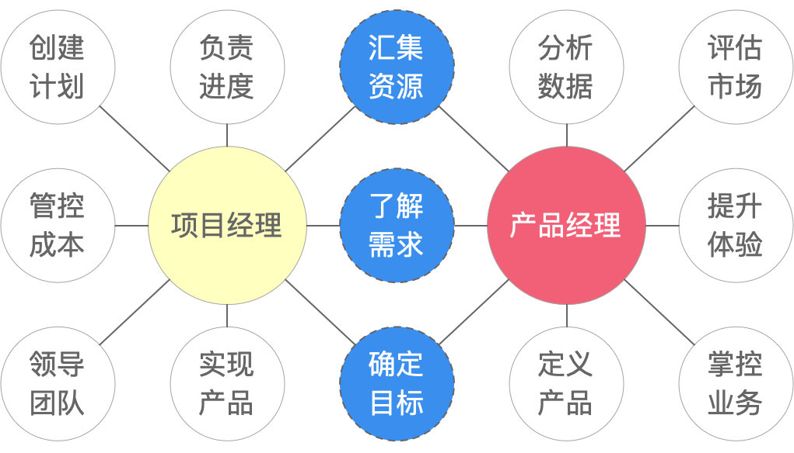

之所以说多流程图可以用来确定一件事的原因和影响，就在于它将原因与结果分列两边，让人们在头脑中自动将因果进行映射。图14-65就通过多流程图展示了关于教育的一些问题。

> 图14-65 Thinking Map多流程图

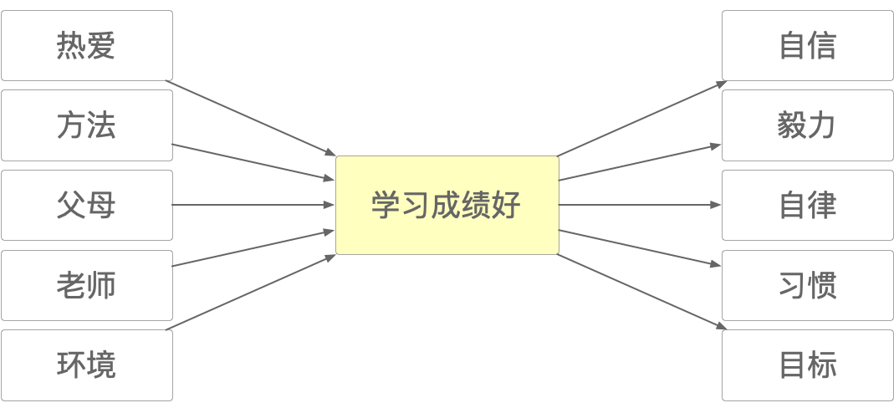

不得不说，多流程图中的“流程”和我们所理解的“流程”是两种完全不同的东西，多流程图更像是因果之间的一种映射关系。所以，多流程图也叫做“因果图”。

桥形图在平常工作中使用的场合并不多，它通过已知的两个事物或概念之间关系，来形容陌生的两个事物之间的关系，达到类比或隐喻的目的，从而将问题简单化，如图14-66所示。

> 图14-66 Thinking Map桥形图

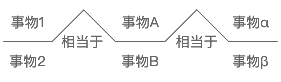

上图要表达的意思是：事物1和事物2之间的关系，“相当于”（或类似于）事物A和事物B之间的关系，“相当于”（或类似于）事物α和事物β之间的关系。举例子来说，就如图14-67和图14-68所示。

> 图14-67 Thinking Map不同角色之间的关系

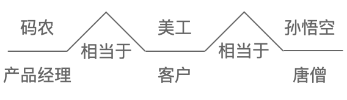

> 图14-68 Thinking Map不同感觉和器官之间的关系

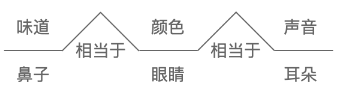

通过桥形图，可以非常直观地让人理解`“原来A和B之间的这种关系，相当于甲和乙之间的那种关系”`了。

所以，当各位读者们如果今后再碰到需要通过思维导图或脑图完成的需求时，可以试着尝试`Thinking Map`了。

至此，笔者已经将开发中所能遇到的且常用到图表介绍完毕，用好并善用这些图表将成为工程师在设计、开发和沟通时的利器，说不定还能收到某些奇效。

### 14.5 本章小节

常言道“一图胜千言”。如果对一个从未见过榴莲的人，通过言语来向他来描述榴莲的样子，恐怕1000个人就会有1000种不同的说法。但如果给他看一张榴莲的照片，他就会立刻明白榴莲的样子了，而不会被言语所“迷惑”。同样，在软件开发的设计、开发和部署等各个阶段，也有诸多可使用的相关图表，用好这些图表，不但能起到事半功倍的作用，而且也能消除歧义、统一思想、节省时间，有效地提高团队协作的效率和效果。

在软件系统的设计、开发、测试和交付阶段，常见且常用的图表包括UML图、ER图、架构图和诸如甘特图、鱼骨图、思维导图等各类图表，它们涵盖了一名软件工程师在其职业生涯中所能遇到的图表的90%左右。

UML作为建模语言，是一套专用于描述系统需求、行为、结构、交互和状态的符号规则。通过UML用例图，需求分析人员、项目经理或产品经理可以用一种更为精炼有效的方式，来告诉开发工程师系统需要完成什么样的功能，有哪些输入和输出，又需要遵循哪些前提条件，尤其是对于不同的角色来说，他们又是如何使用这同一套系统的。类图则为系统的结构和交互铺设了龙骨，描述了系统中的类、接口、关系和属性等元素，将现实世界的各种存在抽象为软件系统的虚拟实体。既反向验证了系统设计是否符合需求，以帮助开发人员及时发现和解决设计上的问题，又可以作为代码生成工具的输入，帮助开发人员自动生成部分代码，提高开发效率。UML中的流程图是在实际工作工作接触最多的图表之一，原因之一就是但凡业务则必有流程，而将流程描述清楚后用系统来实现，则一定会借助流程图工具。而且，通过分析流程图，还可以发现流程中的瓶颈和冗余，进而优化流程，提高效率和质量。现实世界的业务实体往往不止一种状态，而是在不同前提条件下和不同业务环节中，表现出多面性。找到并描述这些不同的业务侧面，就是UML状态图的职责。如果说状态图是从比较“宏观”的角度来看待业务逻辑的转换和交互的话，那么时序图则是从“微观”的层面来描述系统中对象与对象之间、方法与方法之间的交互行为、调用顺序和消息传递。通过时序图，既可以反映对象在交互过程中的状态变化，帮助工程师理解系统的动态行为，也可以理清对象之间的交互和消息传递逻辑。

在数据库设计阶段，最常用的设计图表就是ER图，没有之一。因为ER是着眼于映射为数据库表结构的现实中的实体，而着手于它们之间的关系。通过ER模型，工程师或系统分析员、DBA们可以用于对系统中的数据进行建模，包括实体、属性和关系等，帮助他们理清数据之间的关系、结构和各种约束。ER图中的逻辑模型关注的是实体间的关系，例如一对一、一对多和多对多等关系。而Navicat则提供了六种可选的关系，它们是None、One and Only One、Many、One or Many、Zero or One和Zero or Many。ER图中的物理模型只是比逻辑模型的属性更多而已，但不同的工具在创建不同的模型时会有不同的作用，例如，PowerDesigner就可以依据物理模型逆向创建出SQL脚本。因此有时物理模型会用数据字典来替代。

从工程师成长为架构师，并非是靠画几张漂亮的架构图，而是需要怎整理解并掌握架构思维，它们包括但不限于抽象思维、解构思维、集成思维、分层思维、发散思维、结构化思维、迭代思维、系统思维和模式匹配等。虽说掌握这些思维、模式需要耗费不少的时间浸润，但先从模板开始学着画架构图也是个不错的办法。笔者依据个人多年的工作经验整理了几种常见的架构模板。架构图可以分为业务架构图、应用架构图、技术架构图和数据架构图几类。但在实际工作中，并不会完全照着这些分类来画架构图，而是可能会将诸多类型混杂在一起。例如有些系统架构图，既有业务架构图，又有应用架构图和技术架构图的影子。

在项目管理中经常会用到甘特图，它不仅仅可以用于项目管理，对于制定个人工作计划，它也是完全可以胜任的。甘特图只是项目管理思想的一种体现，只要具备了成熟的项目管理思想，即使是不画甘特图，工程师或项目经理对于项目计划、进度的掌控也会自然而然地出现。鱼骨图是一种类似于鱼骨形状的因果图。通过它可以定义问题、找到产生问题的根本原因和找到如何解决问题的办法。但如何使用它可不仅仅限于寻找“因果循环”，因为工作总结、迭代计划同样可以用鱼骨图来做。常见的思维导图称为Mind Map，但是其实还存在另外一种思维导图，称之为Thinking Map，因为具有八种不同的类型的图示，因此又叫它八大思维图示法。其中的圆圈图、气泡图、双气泡图、多流程图和桥形图虽然使用场合不多，但对于想象、类比、归因等思维方式的训练，却是很好的实践方法。

### 14.6 本章练习

1. 请补全图14-18登录流程，将用户名格式、密码连续错误三次锁定账户、人机验证、是否单点登录等条件加入进去。当然，也可以加入其他可能的业务约束。

2. 请参照图14-18登录流程，画出用户注册流程、验证码登录流程、扫码登录流程和第三方账号登录流程。

3. 请尝试参照图14-20中的流程图，画出平台视角的订单履约状态流转过程，以及订单履约的时序图。

4. 请尝试参照某图书电商，给咚咚图书电商画出其平台业务架构图、应用架构图、技术架构图和数据架构图。

5. 如果让一个7人组成的敏捷开发团队（产品经理1、Java工程师3、前端工程师1、UI设计师1、测试工程师1）来开发这个咚咚图书网，如何通过甘特图排期？
