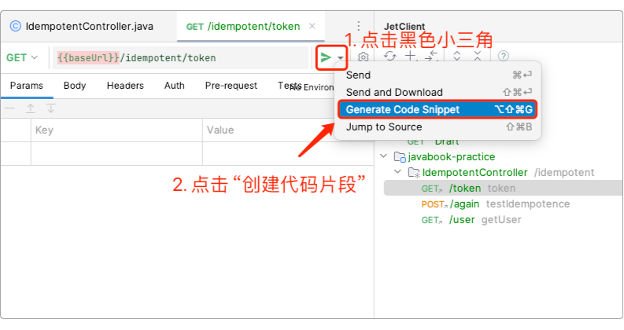

## 第15章 接口、调试与代码检查

定义接口、实现接口、调试接口与修复接口，恐怕是工程师们每天主要最为主要的日常工作，而且应该没有之一。如何编写更优雅的接口、如何更优雅地调试远程服务器上的代码、如何评价并改善代码质量，同样也是每位工程师都非常关心的问题。

本着查漏补缺、力图全面、突出重点的原则，本章就来谈一谈开发中涉及到的接口设计、远程调试、代码走查的实践的方法和技巧。

### 15.1 优雅的接口

在设计接口时，除了实现功能外，往往还有很多需要考虑的其他因素，它们包括但不限于：接口的职责、安全性、可扩展性、稳定性、协议规范、路径规则、响应等。这些功能之外的因素虽然也需耗费许多精力，但一旦搭建好整套“规则体系”，就可以持续享受它们所带来的便利和高效的“红利”。所以，磨刀不误砍柴工，为此多花费点额外的时间来研究一下它们，还是很值得的。

#### 15.1.1 Web的进化

在Web 1.0时代是没有接口这个概念的，因为那时候连“前端”都没有，如图15-1所示。

> 图15-1 Web 1.0时代的应用


但在Web发展到2.0的时候，它更强调页面与用户的交互，偏重于动态内容。而且得益于HTML、CSS和JavaScript等技术的不断进步，“创造内容”的职责也从后端慢慢转移到了前端，这既解放了后端又发展了前端：使得前端专注于分发与展示，而后端专注于存储与制造，就逐步形成了至今如图15-2所示的开发局面。

> 图15-2 Web 2.0时代的应用


最初的接口就是用来在不同的设备和应用之间，甚至是不同的编程语言之间传递消息和数据用的，类似于装修时虽然会采用各种不同品牌的家用电器，但它们都能插上墙上的电源插孔，因为这些插孔的间距都是一样的。所以，接口不仅是一种规范，也是一种能在两个系统之间实现数据交互、输入和输出的方式。

但那时的接口概念刚出现，所以它有点类似于图15-3所示的样子。

> 图15-3 杂乱无章的网络接口


鉴于这种混乱的情况，业界先后出现了出了基于“REST”风格的接口设计RESTful，以及编写RESTful API实现细节的Open API。它们为接口的进化提供了一个可供参考的方向，让业界意识到：原来还能这么玩。如图15-4所示。

> 图15-4 清爽的网络接口


说明：后续内容中，当说到“接口”时，特指的就是Web应用中的功能接口，如果是Java编程语言特性中的接口，则会明确地写为“Java接口”。

#### 15.1.2 规范建议

所谓规范建议，指的是设计接口时需要考虑的若干因素。当然，不考虑这些因素，也完全能够实现所需要的接口功能，但后续运行和维护时可能会有不小的麻烦。具体来说，一个设计良好的接口需要考虑如下几类因素（假设接口均采用HTTP相关协议）：

1. 职责单一：在设计接口时，必须明确接口相应的职责，即接口的功能范围，它需要解决什么样的业务问题。这个问题本质上是属于面向对象设计的范畴，即：一个类只能有一个职责，它只负责一件事情，但它可以继承多个Java接口，完成多个功能。如图15-5所示支付类的设计，它分别实现了职责不同的“支付”和“对账”这两个Java接口。对于接口来说也是一样，并非所做的事越多就越好。

> 图15-5 支付类实现了“支付”和“账单”两个不同的Java接口


2. 规范路径：如同命名一样，好的名字可以让人一眼就知道类/对象、变量或方法的用途，好的接口命名也是如此。例如，`/api/member/register`和`/api/member/info`让人一看就知道这是会员注册和获取会员信息的接口。相反，类似`/api/abc/hao123`这样的接口就显得有些莫名其妙。规范路径同样包括对于域名的规划，例如表15-1所示例的域名分类。

> 表15-1 路径规划中的域名分类示例

| 类别 | 域名 |
|:---:|:---:|
| 主站首页 | www.javabook.com |
| 商品相关 | product.javabook.com |
| 会员相关 | member.javabook.com |
| 订单相关 | order.javabook.com |
| 静态资源 | resource.javabook.com |

3. 请求方式：RESTFul风格已经规定了几种不同的HTTP请求方式的作用，如表15-2所示。

> 表15-2 RESTFul风格的HTTP请求方式

| 请求方式 | 规范路径 | 说明 |
|:---:|:---:|:---:|
| GET | /users | 列出所有用户 |
| POST | /user | 添加用户 |
| PUT | /user/{id} | 根据id更新用户 |
| DELETE | /user/{id} | 根据id删除用户 |

4. 接口版本：如果某个接口已经在线上运行，但由于某些原因需要对它进行修改却无法停止系统，该怎么办？比较好的办法是预先就给接口增加版本标识，这样既不用修改原接口导致系统停止服务，甚至引起BUG，又可以保留接口的修改记录，一举两得。例如，给接口“/api/member/register”添加版本号后变为“/api/member/register/v1.0.0”，甚至还可以加上相应的日期和版本标签：“/api/member/register/v1.0.0_lts_2024”。而如果该接口需要修改，可以直接添加一个新接口“/api/member/register/v1.0.1_lts_2024”，原接口无需任何修改——这样做完全符合开闭原则。

5. 数据过滤：在获取数据的查询接口中，可以添加一些过滤字段，这样不仅能提升性能和改进用户体验，也能更加灵活地控制数据读取，如表15-3所示。

> 表15-3 数据过滤

| 过滤方式 | 说明 |
|:---:|:---:|
| ?limit=100 | 返回100条数据 |
| ?top=10 | 返回前10条数据 |
| ?offset=20&size=10 | 从第20条数据开始，返回10条数据 |
| ?pageNum=10 | 跳转到第10页 |
| ?perpage=50 | 每页显示50条数据 |
| ?sortby=name&order=desc | 按名称降序排序 |
| ?groupby=name | 按名称分组查询 |

6. 统一响应：不同的接口返回的数据是不同的，有的返回的是字符串，有的是对象，有的则是JSON对象或数组。而且，接口也会也不是每次都能得到正确的结果，它也会超时、抛出异常或报错。所以，就需要一个机制能够将这些不同的情况都给包括进入，让调用者知道接口是否正常工作，如果出了问题该如何排查等。以笔者曾经开发过的项目为例，其统一返回的状态码（错误码）如表15-4所示，而返回值则如代码清单15-1所示。这里的返回值也包括统一的异常状态码和异常消息。

> 表15-4 接口状态码（错误码）

| 类别 | 状态码 | 说明 |
|:---:|:---:|:---:|
| 系统 | 0~1000 | 系统预留状态码 |
| 会员 | 1001~2000 | 会员预留状态码 |
| 商品 | 2001~3000 | 商品预留状态码 |
| 订单 | 3001~5000 | 订单预留状态码 |
| 其他 | ... | ... |

> 代码清单15-1 统一返回值

```java
{
    "code":0, // 状态码
    "message":"", // 和状态码对应的说明
    "data":{// 返回的数据
        "content":"", // 返回单个对象或JSON字符串
        "items":{}, // 返回列表或JSON数组
        "extra":""  // 返回一些额外的字符串数据，如备注
    }
}
```

7. 安全机制：为了保证接口不受外部的侵入，稳定运行且能保护用户隐私，必须设置一些防范机制，包括但不限于：
  - 路径加密：例如前端发送的参数为“?username=javabook&password=123456”，经过加密后则会变成类似“d3d3LmJhaWR1LmNvbQ==”这样的字符串。服务端在拿到字符串后以同样的方式解密，这样最大限度保证数据安全；
  - 签名校验：为了防止接口中的数据被篡改，一般前后端都会约定一套加解密算法，然后由前端将请求参数 + 时间戳 + 密钥拼接成一个字符串，通过加密算法生成签名sign，再由服务端用相同的请求参数 + 时间戳 + 密钥拼和算法生成另外一个sign，如果这两个sign值相等，则认为请求有效，否则抛出异常。同时，可以再次将请求参数、时间戳和sign合成Token，这样既能保证安全性也可以提高访问效率；
  - 异步 + Socket/WebSocket：有时候接口中的业务逻辑较为复杂，或需要调用第三方接口，这时候无法保证接口能够实时返回所需结果。比如，调用物流接口的批量生成电子面单时，可能会耗时较长导致接口超时异常。此时就可以考虑将请求通过消息队列MQ + 线程池ThreadPool的方式做异步处理，当有结果返回时，再通过Socket或WebSocket通知调用方；
  - 熔断限流：如果接口的访问量超出事先预计，可能会导致接口直接挂掉。为此需要通过Hystrix或者Sentinel等中间件来实现接口的稳定性。这两种中间件都可以对接口进行限流、降级或直接熔断，待指定时间后逐渐恢复功能，如代码清单15-2所示。

> 代码清单15-2 Sentinel断路器示例

```java
@SentinelResource(value = "hello", blockHandler = "handler", fallback = "fallback")
public String hello(String username) {
    return "hello, " + username;
}
public String handler(String username, BlockException ex) {
    ex.printStackTrace();
    return "hello, " + username;
}
public String fallback(String username) {
    return "hello, " + username;
}
```

  - 数据脱敏：返回给页面或APP的数据需要注意保护用户隐私，例如不要把password字段给返回了。或者返回注册用户手机号时做脱敏处理，例如“132****5678”，这样即使潜在的不法分子拿到这样的手机号也没用。

8. 保持记录：系统中的关键业务代码无论在哪个接口中，都应该有足够的日志保驾护航，尤其是涉及到金钱交易的接口就更应如此。比如：转个大几十万或者上百万，然后转账居然失败了，客户反馈，一检查发现竟然没有日志，那叫个欲哭无泪。

9. 划分界限：所谓的界限，包括：
  - 读写分离：写数据的接口和读数据的接口分别调用的是不同的Dao，也就是说在服务端的物理操作上就要进行接口分流，减小主库访问的压力。但这时候就需要做好从数据库的同步，否则刚写入数据但还未同步到从库时，会造成数据不存在的问题；
  - 动静分离：将读取静态资源的接口和生成动态内容的接口分开，这一点可以反映在接口不同的路径上。例如“res.javabook.com/image=aswqejLmu76==”和“biz.javabook.com?username=......”；
  - 内外分离：所谓内外分离，就是将普通接口调用和管理接口调用分开。例如，将超级管理员的调用接口、某些系统状态监测的接口和业务性接口在路径、参数和保护机制上进行分离。

10. 特殊场景：如果公司业务做得比较大或社会影响面比较大，那么大概率会涉及到政府监管部门或安全部门的干预，这时候就需要单独开发一些特殊的接口，这类接口的路径、签名、响应或返回值可能和之前的都不一样。

11. 编码规范：这应该是很多人都容易忽视的一个地方了。由于拼写错误或其他规范原因所造成的“unix式悲剧：creat”、“umount为什么不是unmount”等之类的问题，虽然成为茶余饭后流传的经典，但却不值得仿效。

以上所有的规范建议都只有一个目的，那就是：保证系统接口在安全、高可用的同时，还具有最大限度的可维护性、可扩展性和良好的系统性能。

#### 15.1.3 幂等性

传统的应用中，接口被调用后系统只有两种状态：成功或失败。但在互联网应用中，由于其超级复杂的业务逻辑及其海量的访问请求，导致它经常会冒出第三种状态：超时timeout。一旦出现超时，也就意味着要“重试”retry，而当整个系统没有防止重复提交的手段时，就出现了数据不一致问题，例如，库存被反复扣减，订单被反复提交。所以，为了防止这种因超时或别的因素所导致的重复调用而出现的不一致问题，就必须让系统能够有幂等性的保证。

幂等（Idempotent）其实是一个数学上的概念，常见于抽象代数中。但在软件开发中，它的作用就是：针对一个操作，不管执行多少次，对资源所造成的影响都是一样的，但是允许它的返回值不同。例如，同一个订单只会被提交一次，订单相关的库存也只会被扣减一次，哪怕系统宕机重启后再提交，也是如此。

这些函数不会影响系统状态，也不用担心重复执行会对系统造成任何改变。因此，无论前端重复提交多少次，后端只应该产生一个不变的结果，消息只应该发送一次，同一笔支付，订单也只应该创建一次，用户也应该只扣一次钱...等。

大多数应用程序对数据的操作离不开增、删、改、查，那什么情况下数据是幂等的呢？

1. 添加操作：
  - 带唯一索引时幂等；
  - 无唯一索引时非幂等。

2. 删除操作：不管是物理操作还是逻辑操作，无论执行多少次，除了返回值不同，对数据造成的效果是一样的，天然就是幂等操作。

3. 更新操作：
  - 条件式为幂等；
  - 计算式为非幂等。

4. 查询操作：
  - 如果不限定日期范围，那么无论查询多少次都不会改变数据本身，天然就是幂等的；
  - 但如果涉及到日期的计算，它就是半幂等的。如new Date()或LocalDate.now()，虽然毫秒数在不断变化，但如果计量单位按“天”来算，那么在一天之内，被认为是幂等的，超过一天就不再幂等了。这类操作在一些统计报表中经常可以见到，查询不同日期时的结果不同。

实现幂等的技术方案有数据操作、锁和API。

通过数据操作实现幂等包括这么几种方法：

1. 在数据表中设置唯一索引，防止新增脏数据。但这种方式不够灵活，因为如果需求改变那么需要更改底层数据表，且后端服务需要重启，显然不合适；
2. token机制，防止页面重复提交。这种方式应用较广，而且通过注解，可以随心所欲地改变需要实施幂等的接口；
3. SELECT + INSERT：对一些流量不太高的后台系统，或者一些任务型应用，为了支持幂等，支持重复执行，最简单的处理方法是就先查询一下关键数据是否已经处理过，然后再进行业务处理；
4. 状态机，即通过状态字段实现数据变更。这种方式较为麻烦，也不够灵活。

如果是用锁来实现幂等，那么也无非就是三种锁：

1. 悲观锁：FOR UPDATE
2. 乐观锁：
  - 给数据表增加版本字段实现：UPDATE tablename SET name=?, version=version+1 WHERE id=? AND version=#version#；
  - 通过条件限制实现：UPDATE tablename SET amount = amount-#sub# WHERE id=? AND amount-#sub# >= 0（要求：amount-#sub# >= 0）。
3. 分布式锁：通过redis或zookeeper实现。

最后，如果是用API来实现幂等，那么一般会通过多个字段做联合查询或索引，实现操作的幂等性，如订单编码 + 支付编码 + token，这样可以保证非常严格的接口幂等。
在javabook-practice项目的cn.javabook.chapter15包中展示了通过token机制来实现幂等，其思路是：

1. 每次请求时先创建一个唯一token存入到redis中；
2. 请求接口时，将此token作为请求参数；
3. 服务端判断是否存在此token；
4. 如果存在，执行业务逻辑后删除，否则为重复请求。

核心代码如下列代码清单所示。

> 代码清单15-3 IdempotentController.java

```java
@RestController
@RequestMapping("/idempotent")
public class IdempotentController extends Thread {
    @Autowired
    private IdempotentService idempotentService;

    @GetMapping("token")
    public ServerResponse token() {
       return idempotentService.createToken();
    }

    @Idempotent
    @PostMapping("again")
    public ServerResponse testIdempotence() {
       return idempotentService.testIdempotence();
    }
}
```

> 代码清单15-4 IdempotentService.java部分源码

```java
@Service
public class IdempotentService {
    ......
    public ServerResponse createToken() {
       ......
    }

    public boolean checkToken(HttpServletRequest request) {
       String authorization = request.getHeader("Authorization");
       if (authorization != null && authorization.startsWith("Bearer")) {
          String[] parts = authorization.trim().split(" ");
          if (parts.length == 2) {
             String token = parts[1];
             if (!jedisUtil.exists(token)) {
                throw new ServiceException("请勿重复操作");
             }
             ......
          }
       }
    }

    public ServerResponse testIdempotence() {
       return ServerResponse.success("幂等验证: 成功");
    }
}
```

> 代码清单15-5 IdempotentInterceptor.java部分源码

```java
public class IdempotentInterceptor implements HandlerInterceptor {
    @Autowired
    private IdempotentService idempotentService;

    @Override
    public boolean preHandle(......) {
       if (!(handler instanceof HandlerMethod)) {
          return true;
       }
       HandlerMethod handlerMethod = (HandlerMethod) handler;
       Method method = handlerMethod.getMethod();
       Idempotent idempotent = method.getAnnotation(Idempotent.class);
       if (idempotent != null) {
          return idempotentService.checkToken(request);
       }
       return true;
    }
    ......
}
```

通过幂等服务IdempotentService和拦截器IdempotentInterceptor来创建token、拦截请求，并在IdempotentController中的接口被重复访问时抛出异常。

#### 15.1.4 接口文档

码农们大多不爱写文档，毕竟，能用代码的，何必还要写字呢？所以就有了各种自动化的文档创建工具，例如Swagger和Smart-Doc。

Swagger的集成比较简单，只需要添加依赖，单独创建一个Swagger2的配置文件，然后在需要添加文档的类或方法上加入@Api或@ApiOperation注解即可，如代码清单15-6所示。

> 代码清单15-6 IdempotentInterceptor.java

```java
@Configuration
@EnableSwagger2
public class Swagger2Config {
    ......
    private ApiInfo frontInfo() {
        return new ApiInfoBuilder()
                .title("前端API文档").description("本文档描述了前端微服务接口定义")
                .version("1.0")
                .contact(new Contact("javabook", "http://www.javabook.cn", "125043411@qq.com"))
                .build();
    }

    private ApiInfo serverInfo() {
        return new ApiInfoBuilder()
                .title("后端API文档").description("本文档描述了后端微服务接口定义")
                .version("1.0")
                .contact(new Contact("javabook", "http://www.javabook.cn", "125043411@qq.com"))
                .build();
    }
}
```

启动服务后，访问`http://localhost:8080/swagger-ui.html`就能看到接口文档了。

虽然Swagger已经很不错了，但爱偷懒的工程师们还是觉得每次都要给类或方法写注解太麻烦了，对代码有一定的侵入性，而且如果忘记写了文档里面就没有。例如，对于代码清单15-7来说，如果是Swagger，就要给每个用户字段都加上@ApiModelProperty注解，如果有几十个类，每个类有几十个字段，工作量显然十分巨大。

> 代码清单15-7 User.java

```java
public class User {
    private String id;
    private String name;
    private String password;
    private String email;
    private String phone;
    ......
}
```

而如果换成Smart-Doc，由于它遵循标准的java-doc规范，所以代码清单15-7不需要再加入任何的注解，这样就已经足够用来生成API文档了。使用Smart-Doc，只需要三步。
第一步：引入依赖插件，如代码清单15-8所示。

> 代码清单15-8 pom.xml

```xml
<plugin>
    <groupId>com.github.shalousun</groupId>
    <artifactId>smart-doc-maven-plugin</artifactId>
    <configuration>
        <configFile>src/main/resources/smart-doc.json</configFile>
        <projectName>${project.artifactId}</projectName>
    </configuration>
</plugin>
```

第二步：编写smart-doc.json文件放到项目的resources目录中，如代码清单15-9所示。

> 代码清单15-9 smart-doc.json部分源码

```json
{
  "serverUrl": "http://127.0.0.1:8080",
  "isStrict": false,
  "allInOne": true,
  "outPath": "src/main/resources/static/doc",
  "coverOld": true,
  "createDebugPage": true,
  "style": "xt256",
  ......
}
```

第三步：打开IDEA的编译插件面板，然后选择自己需要或喜欢的文档风格来生成文档，如图15-6所示。

> 图15-6 用Smart-Doc生成文档


这里生成html风格文档，文档会按照smart-doc.json文件指定的输出路径存放，如"src/main/resources/static/doc"，在该目录下双击生成的“debug-all.html”文件，就可以在浏览器打开了。还可以生成Open API风格的注释，生成后的json文件可以直接导入到诸如Postman或ApiFox之类的接口调试工具中去。

不过这些都是本地文件，是否可以让接口文档成为网络共享的呢？当然可以，只需要配合Torna就能实现。至于Torna的安装和使用，这里就不再赘述。要结合Torna，只需要在smart-doc.json文件中指定openUrl和appToken的值就行了。这两个值可以从Torna里面获取。

设置好之后，只需要在IDEA的插件中双击“smart-doc:torna-rest”即可，生成后的结果如图15-7所示。

> 图15-7 将Smart-Doc生成的文件导入到Torna


至此，一套优雅的接口就基本“养成”了。这套“组合拳”不仅可以保障接口“行得稳，走得远”，而且使用方便，沟通顺畅，实在是居家旅行之必备良方。

### 15.2 调试

在设计了一套优雅的接口之后，接下来就要来看看它是否足够“成熟”了。不过本节内容谈的不仅仅是对接口功能的验证，也包括以更有效的方式来开发应用。例如，大多数开发工程师都会将本地源码上传至服务器，编译后再由测试工程师来完成各项功能的测试。本地可以通过IDE的DEBUG实现断点跟踪，但在远程服务器上却只能通过日志来观察接口的行为，特别不方便。那有没有什么方法可以在远程服务器上实现像在本地一样的断点跟踪，逐行调试呢？——很容易就可以做到。

#### 15.2.1 接口调试

接口调试工具很多，从古老的Postman到专业的JMeter，都可以满足需求。Postman属于大路货，基本上做过后端开发的都知道。JMeter属于较为专业的工具，尤其是测试工程师用它的不少。还有一些是IDE自带的接口调试工具，例如IDEA中的HTTP Client插件。只不过美中不足的是，HTTP Client插件需要IDEA Ultimate旗舰版才能使用，而IDEA Ultimate旗舰版是需要付费购买的。那有没有既能免费使用的接口调试插件，又丝毫不逊色于HTTP Client的接口调试插件呢？有的，那就是Jet Client。

打开IDEA的插件市场，路径为：IntelliJ IDEA -> Settings -> Plugins，然后在其中搜索“Jet Client”。安装完成并重启IDEA后，就可以看到它的界面了，如图15-8所示。

> 图15-8 Jet Client界面


Jet Client插件虽说并不完全免费，但其免费部分的功能一点也不输HTTP Client，HTTP Client可以做的它都能做，某些地方甚至还要强上不少。使用Jet Client有四种方式：

1. 创建一个草稿Draft，也就是类似于Postman中的单一请求；
2. 创建一个合集，可以将多个草稿包含其中，并同时调用它们；
3. 创建一个测试套件来测试接口。这里测试套件的作用和Java中的JUnit类似，通过断言来确认接口是否正常；
4. 或者通过导入其他配置来调试接口，例如同步文件夹、curl命令、Postman导出的JSON数据、SpringBoot项目接口和Open API文档。

笔者认为比较有用的功能是其中合集和导入Spring项目接口。因为可以批量地执行合集中的接口测试方法，而且还可以指定执行的次数。只需要如下几步即可：

1. 创建一个合集；
2. 创建若干草稿，然后将草稿“拖入”合集之中；
3. 鼠标右键单击合集，选择“Run”；
4. 选择需要执行的接口，指定执行次数后运行。

其上过程如图15-9所示。

> 图15-9 运行合集


另外一个就是自动生成SpringBoot项目的接口，这项功能貌似需要付费，而且需要JetBrains账号，但尝尝鲜还是可以的。单击“+”时选择“Import -> Spring”，出现图15-10所示界面。

> 图15-10 创建SpringBoot项目接口


单击“OK”后即可创建完成，如图15-11所示。

> 图15-11 已生成的SpringBoot项目接口


有了接口测试草稿，还可以直接跳转到接口源码，或者修改接口后比较不同版本之间的差异。除了合集和自动生成SpringBoot项目接口这两个外，Jet Clint还有一个比较强悍的地方，就是可以依据接口功能创建用于测试的代码片段，如图15-12和图15-13所示。

> 图15-12 创建代码片段



> 图15-13 创建代码片段


至于诸如环境配置、全局变量和更多的功能，该插件作者在JetBrains的介绍页面中有一段视频讲得比较好，笔者特意将此视频配上了中英文字幕，提供给需要的读者。

#### 15.2.2 远程调试

虽然有时候在本地开发的代码能够运行顺畅，但是很多问题不过不拿到线上环境根本发现不了，例如配置的遗漏、数据库的不一致等。而这些问题有时候仅靠日志来排查的话，一是过于繁琐，二是有可能还发现不了真正的问题。所以，如果能够在云服务器上可以像在本地一样调试代码，不仅能大大提高开发效率，而且也可以避免只能通过日志看系统异常的笨拙方法。这一小节笔者就来介绍一个在本地调试远程代码的方法——VNC技术。

VNC是英文“Virtual Network Computing”的简称，中文名称为虚拟网络计算，它是一种远程桌面协议，它允许用户通过网络远程访问和控制其他计算机的图形桌面，例如QQ远程桌面就是一种VNC技术。而TigerVNC作为一款开源VNC服务器和客户端软件，于2009年开始独立发展，它性能较好且支持多个平台，提供流畅的远程桌面体验。下面笔者就来演示如何通过它实现远程调试。

以笔者所安装的CentOS 7.6虚拟机为例，可将它看作远程的云服务器，如图15-14所示。

> 图15-14 CentOS 7.6虚拟机


首选需要给它以最小化安装的形式安装GNOME环境，如代码清单15-10所示。

> 代码清单15-10 CentOS-7.6最小化安装GNOME脚本

```bash
yum install links -y
systemctl stop firewalld.service
systemctl disable firewalld.service
yum install httpd -y
systemctl enable httpd.service
systemctl restart httpd.service
yum install epel-release -y
yum groupinstall "X Window system" -y
yum install gnome-classic-session gnome-terminal nautilus-open-terminal control-center -y
unlink /etc/systemd/system/default.target
ln -sf /lib/systemd/system/graphical.target /etc/systemd/system/default.target
reboot
```

通过XShell或SecureCRT等SSH工具连接到虚拟机上，执行以上脚本并重启。再来安装VNCServer，如代码清单15-11所示。

> 代码清单15-11 CentOS-7.6安装VNCServer脚本

```bash
yum install tigervnc-server -y
cp /lib/systemd/system/vncserver@.service /etc/systemd/system/vncserver@:1.service
vi /etc/systemd/system/vncserver@:1.service
# 找到下面这一行
ExecStart=/usr/bin/vncserver_wrapper <USER> %i
# 用root替换掉
ExecStart=/usr/bin/vncserver_wrapper root %i
systemctl daemon-reload
vncpasswd
systemctl enable vncserver@:1.service
systemctl start vncserver@:1.service
```

VNCServer安装完成后，在Github上搜索“tigervnc”即可找到TigerVNC Viewer客户端的安装包。下载后通过客户端连接VNC服务，然后就可以进入图形界面了，如图15-15所示。

> 图15-15 通过VNC Viewer进入服务器图形界面


然后接着在此CentOS环境的基础上安装JDK、IDEA等，就可以远程调试代码了，如图15-16所示。

> 图15-16 通过VNC Viewer远程开发SpringBoot项目


从上图可以看出，此时已经完全是在Linux环境下做SpringBoot的项目开发了。不过，使用VNC需要注意几点：

1. vncserver@:1.service中的“1”表示的是“桌面号”，因此启动的端口号是5901，如果再有一个就是2，即5902，以此类推；
2. 如果要使用云服务器，记得要在ECS的安全组中配置590*相关端口的出入安全规则；
3. 这种远程调试方法只适合开发环境，也就是说将云服务器作为一种远程开发环境来调试代码。千万不要试图在生产环境中使用这种方式。在生产环境中还是老老实实用命令行界面，老老实实看日志。因为多暴露一个端口，就会多一分服务器被攻击的危险；
4. 如果出现“centos7 vncserver@:1.service: control process exited, code=exited status=2”错误，是因为异常关机导致临时文件生成错误，执行下面的脚本即可解决。

```bash
ls -la /tmp/.X11-unix
rm -rf /tmp/.X11-unix/X1
systemctl restart vncserver@:1.service
```

### 15.3 代码检查

如同好的诗词文章一样，好的代码阅读起来不仅结构清晰、思路流畅、美感连翩，而且在经过了一系列严格的审视与筛查之后，其运行时也能大大降低出错的概率。作为工程师提交测试前的最后一道兜底屏障，代码检查对于代码质量的保证有着不可忽视的重要作用，尤其是在各互联网大厂都有着严苛和正式的审查制度与流程，更是将编码质量保证提升到了组织层面的高度。

一般来说，代码检查分为“走查”和“审查”两种。走查是一种非正式且相对较为随意的代码检查方式，主要以排除代码中的语法、语义和功能错误为主。而审查则是一种正式的评审活动，它由组织内的高层管理人员来领导，除了复审走查中的错误之外，还要检查代码编写的规范性、注释和文档的完备性，以及编码与设计文档的一致性等其他事项。

#### 15.3.1 代码走查

代码走查也被称为“Code Walkthrough”，指的是或者由工程师自己对所写代码进行检查，或者是由团组其他成员对其代码进行检查，或者是工程师和架构师们集中在一起讨论（例如吸烟室），交换各种关于编码思路和想法的过程。总之，代码走查的目的在于发现并修复系统可能存在的功能BUG，寻找更合适的业务实现方式，进而提高代码质量，提升系统性能。

代码走查通常包括自检（有时也称为桌面检查）、走查和静态分析这几步，不过这些步骤之间通常并没有明确的先后顺序和依赖关系。

所谓自检或桌面检查说的是由工程师独立地对其所编写的代码进行回顾、分析和检查，如果按照测试驱动开发（Test-Driven Development，TDD）的过程，那么必定会不断执行各类测试套件（Test Suite）和单元测试（Unit Test），以验证业务功能的正确性和完备性。即使没有这些测试类的辅助，工程师也可以通过类似白盒测试的方法，逐步追踪业务需求的实现，发现潜在的问题。在这种时候，就非常能够体现出测试驱动开发TDD重要性了。所以，笔者建议，开发软件项目时尽可能采取TDD的方式，在“口说无凭”的时候甚至能起到关键的“救场”作用。

所谓走查，其意义和结对编程较为类似，它是开发工程师之间，或者开发工程师和测试工程师通过阅读代码、运行程序、梳理需求进而发现问题的一种源码检视方法。正是“当局者迷，旁观者清”，通过他人的视角往往能更准确地发现自身的问题，如图15-17所示。

> 图15-17 代码走查“仪式”


代码走查虽然是一种非正式的评审行为，但它要求每位开发工程师都能有意识且能较为全面地检查彼此的代码，而不是随意打哈哈，“你好我好大家好”式地走过场。本着专业且职业化的精神，对同事负责，对团队负责，对客户负责任的态度，不但可以提高工程师们对于需求的理解，加强表达沟通能力，提高心理承受能力，也能帮助评审者和被评审者更好地了解业务需求和系统全貌，统一代码风格，从而提高整个团队的开发能力和代码质量。

在进行代码走查之前，可以事先准备一份便于对照的Checklist，如表15-5所示。

> 表15-5 用于代码走查的Checklist

| 序号 | 检查点 | 说明 | 判断 |
|:---:|:---:|:---|:---:|
| 1 | 是否遵循编程规范 | 按照具体编程语言的编码规范进行检查，包括命名风格、代码格式、OOP规约、语句格式、日期时间、集合处理、并发处理、控制语句、注释规约、JDK新特性等 | 是或否 |
| 2 | 是否遵循面向对象设计原则 | 2.1 类的设计和抽象是否合适<br>2.2 是否恰当地使用了抽象类和接口<br>2.3 是否使用了合适的设计模式 | 是或否 |
| 3 | 是否遵循软件设计原则 | 3.1 是否遵循了单一职责原则<br>3.2 是否遵循了开闭原则<br>3.3 是否遵循了接口隔离原则<br>3.4 是否遵循了里氏代换原则<br>3.5 是否遵循了依赖倒置原则<br>3.6 是否遵循了迪米特法则<br>3.7 是否遵循了KISS原则，即“Keep It Simple, Stupid”，保持简单性，避免过度设计<br>3.8 是否遵循了YAGNI原则，即“You Ain't Gonna Need It”，只设计目前需要的功能，避免过度设计 | 是或否 |
| 4 | 性能方面 | 4.1 队列、表、文件在上传、下载、浏览、分割等方面是否有控制，如分配的内存块大小、队列长度等<br>4.2 是否正确地使用了StringBuffer、HashTable、Vector等线程安全的类<br>4.3 是否采用了池化技术来提高性能<br>4.4 同步锁的粒度是否恰当<br>4.5 是否恰当地使用了异步编程 | 是或否 |
| 5 | 资源释放处理 | 5.1 异常发生时资源是否可以被正确释放，如数据库连接、Socket、文件等<br>5.2 是否会经常大量地产生临时对象<br>5.3 超时设置是否合理，如连接超时、读取超写时等 | 是或否 |
| 6 | 数据库处理 | 6.1 是否有SQL语句涉及大数据量的查询<br>6.2 是否有防注入机制<br>6.3 是否正确封装了数据库访问层<br>6.4 是否采用了合适的事物隔离级别 | 是或否 |
| 7 | 异常处理 | 7.1 是否有统一的异常处理机制，保证状态码与异常描述清晰无歧义<br>7.2 关键异常是否都能记录到日志中<br>7.3 在抛出异常的路径上是否所有的资源和内存都可以被正确释放 | 是或否 |
| 8 | 方法 | 8.1 方法参数是否都做了校验和判空处理<br>8.2 数组、列表类结构是否都有边界校验<br>8.3 变量的初始化是否符合预期 | 是或否 |
| 9 | 安全方面 | 9.1 是否对参数进行了合法性校验<br>9.2 是否使用了合适的加解密算法<br>9.3 接口有无限流措施和防刷机制 | 是或否 |
| 10 | 其他 | 10.1 日志是否都能正常输出、显示和存档<br>10.2 配置信息是否存在硬编码或泄漏可能<br>10.3 是否能自动读取不同环境的配置信息 | 是或否 |

除了这些依靠人工的代码走查方法外，还可以借助诸多软件工具来进行。这些软件工具统称为“静态代码检查工具”，它们同样可以检查出代码是否遵循了编码规范、代码本身的可读性和程序中潜在的不安全、不明确的部分。这些工具包括但不限于PDM、FindBugs、Checkstyle、Emma、Lint4j、Java Coding Guidelines等，它们大同小异，只需要熟练使用其中一、两种工具就足够了。以笔者为例，常用的是FindBugs和Alibaba Java Coding Guidelines这两款检查工具，因为它们界面友好，操作简单，如图15-18所示。

> 图15-18 搜索并安装Alibaba Java Coding Guidelines插件


在IDEA中安装好Alibaba Java Coding Guidelines插件后，只需要简单地在项目上单击鼠标右键，然后再单击“编码规约扫描”即可出现检查结果，如图15-19所示。

> 图15-19 扫描结果


可以非常清晰且直接地通过扫描结果来调整代码。而FindBugs的安装也非常类似，如图15-20所示。

> 图15-20 搜索并安装FindBugs插件


从上图可以看到，因为PMD、Checkstyle和FindBugs都属于同一类的插件，所以IDEA把它们都列了出来，而且FindBugs的下载数明显多于另外两款。单击“Install”后，其使用方式和Alibaba Java Coding Guidelines插件一样简单，如图15-21所示。

> 图15-21 FindBugs代码分析结果


可以通过鼠标逐条单击分析结果，查看关于该条结果的详细说明，并执行相应的修改建议或保持不变。

#### 15.3.2 代码审查

对于许多互联网大厂和IT软件企业来说，除了非正式的代码走查（Code Walkthrough）外，还有正式的、作为软件产品开发生命周期中重要一环的代码审查，其英文名称为“Code Review”。就像出版一本书，当作者完成了内容，那么出版社就会有编辑对其进行校审，以保障书籍在交到读者手中时不会出现质量问题。同样，项目代码在与主干合并前后，或者作为里程碑发布之时，通常也会进行一次有组织、有计划、有目标的内部评审。

当然，在不同的公司或企业，审查时机可能会有不同。例如，有的公司会在代码提交或发布前审查，这叫“提交前”审查；有的倾向于在将代码提交到主干后在进行一次汇总审查，这叫“提交后”审查；还有些公司会采用其他适合自己的审查方法。尽管方式不同，但代码审查总会遵循一些基本步骤：

1. 在软件产品的开发生命周期中事先制定代码评审的计划和目标；
2. 执行代码评审。此时可以采取一些较为流行的质量管理方法，例如“范根检查法”。但范根检查法流程繁琐，成本高昂，需要适当裁剪；也可以参考业界的优秀实践，例如在《谷歌工程实践》中发布的《谷歌代码评审指南》，它可以在Github中搜索“google/eng-practices”查阅；或者运用一些较为正式的代码审查工具，例如SonarQube；
3. 出具检查报告并同意或拒绝更改：检查报告可以是人工编写，也可以是审查工具生成。如果是“提交前”审查，那么对于不符合质量要求的代码，可以拒绝其合入主干。

对于工程师们来说，能用代码解决的，就绝不愿意写文档。在代码审查中，SonarQube就是一款功能强大的重量级代码质量管理工具，它用于持续监测、分析和评估项目源代码的质量：

1. 它可以集成不同的IDE，如IDEA、Eclipse，并使用SonarLint插件在IDE中完成即时分析；
2. 它支持20多种主流编程语言，如C/C++、Java、Python、Javascript、Ruby、Go等；
3. 它可以无缝结合持续集成/部署平台和版本控制系统，如Jenkins、SVN、Git；
4. 它遵循众多的安全编码规范，如CWE（Common Weakness Enumeration，通用缺陷枚举）、CERT（CERT Secure Coding Standard，C语言安全编码规范）等；
5. 支持多维度的代码质量检测，如复杂度分布、重复代码、单元测试统计、代码规则检查、注释率、潜在的BUG、结构与设计等；
6. 通过浏览器展示分析结果，并可让工程师们检视、评论、修复代码问题；
7. 提供API接口提取分析数据。

比较遗憾的一点是，自7.9版本开始，SonarQube就不再支持MySQL。部署SonarQube服务很简单，通过其官网提供的docker-compose.yml示例脚本即可运行起来。

下载docker-compose.yml文件并其在所在的目录中执行“docker-compose up -d”命令后，在浏览器中访问如下地址`http://localhost:9000/`，就可以打开SonarQube的Web UI界面了，它默认的用户名和密码都是“admin”，只是第一次打开时会被强制更改默认密码。

如果要让界面显示中文，有两种方式。一是在Web界面中安装插件，其步骤为：

1. 先用鼠标单击顶部的“Administration”；
2. 接着单击“Administration”中的“Marketplace”；
3. 然后在“Plugins”的搜索框中输入“chinese”；
4. 最后在出现的可用插件列表中选择“Chinese Pack LOCALIZATION”并单击“Install”。

安装完插件后重启SonarQube服务即可。

另外一种方式就是将中文语言包直接拷贝到运行SonarQube容器的插件目录中，然后重启容器即可。可执行下列脚本完成拷贝：

```bash
docker cp sonar-l10n-zh-plugin-10.4.jar <容器ID>:/opt/sonarqube/extensions/plugins/
docker-compose restart
```

再次启动SonarQube服务后，界面已经变成了中文。

要想使用SonarQube完成代码质量分析，有三种方式：

1. 使用Sonar-Scanner执行扫描；
2. 修改项目的pom.xml文件后直接在其同级目录下通过命令扫描；
3. 使用SonarLint插件。

这三种方式如果按麻烦程度来分的话，刚好是从高到低排序：使用Sonar-Scanner最麻烦，执行扫描命令次之，直接使用SonarLint插件最简单。方式虽不同，不过效果却都类似，本质上的差别并不大。

对于第一种方式，简单来说就是需要在SonarQube中创建一个空项目，之后找到这个空项目的Token令牌，再拿着此Token令牌执行如下的docker脚本：

```bash
docker pull sonarsource/sonar-scanner-cli:5.0.1
docker run -it --rm -v /home/work/javabook-practice:/usr/src sonarsource/sonar-scanner-cli:5.0.1 sonar-scanner \
  -Dsonar.projectKey=<这里输入项目名称> \
  -Dsonar.sources=./target \
  -Dsonar.host.url=http://SonarQube服务器IP:9000 \
  -Dsonar.login=<生成的项目Token>
```

需要注意的是，执行“docker run”命令时需要将当前目录切换到被分析项目的根目录下，也就是要和打包后生成的target在同一级目录。

采用第二种方式需要先修改Java项目的pom.xml文件，加入如下代码段：

```xml
<project>
    ......
    <profiles>
        <profile>
            <id>sonar</id>
            <activation>
                <activeByDefault>true</activeByDefault>
            </activation>
            <properties>
                <sonar.login>admin</sonar.login>
                <sonar.password>修改后的admin密码</sonar.password>
                <sonar.host.url>http://SonarQube服务器IP:9000/</sonar.host.url>
            </properties>
        </profile>
    </profiles>
</project>
```

然后在和pom.xml同级的目录中执行“mvn sonar:sonar”命令即可。不过，这样虽然更简单了，但在Java项目中暴露SonarQube服务的用户名和密码却并不是值得推荐的做法，执行后的结果如图15-22所示。

> 图15-22 执行“mvn sonar:sonar”后的结果


使用前两种方式只能分析Java项目编译、打包后的target文件夹中的class文件，所以在使用之前需要先通过IDEA或Maven命令编译项目。

而第三种，则是直接在IDEA的项目名称上通过鼠标右键单击“Analyze with SonarLint”就可以完成代码分析，如图15-23所示。

> 图15-23 Analyze with SonarLint


当然，要使用这种方式，需要事先在IDEA中安装SonarLint插件。

至于SonarQube的使用，笔者就不再继续展开详谈。关于SonarQube的BUG评级、漏洞评级、债务、坏味道、覆盖率和重复度等相关质量评价指标，在其官网和一些技术博客中都有详细的论述，如读者感兴趣可自行深入了解。

### 15.4 本章小结

自前后端分离的开发模式大行其道后，“接口”便已成为系统内外读写、传输和交换数据的“集散地”，优雅的接口不仅使得开发出来的应用更健壮，而且安全性、可维护性和可扩展性都更好。为了达成此目的，业界出现了众多的面向接口编程的规范建议，它们包括但不限于：明确的职责划分、规范的请求路径、与上下文相关的请求方式、版本设置、增加用于数据过滤的字段、统一的异常处理和响应机制、完备的日志记录、多种安全机制保障、区分不同功能边界等。除此之外，在高并发为主的互联网应用开发中，接口还必须具备极为重要的幂等特性，以及在团队间有效共享接口信息的文档机制，例如Swagger和Smart-Doc。

有了接口，在应用开发期间就一定会有针对接口的功能验证需求，这也称为接口调试。在微服务兴起前，对于很多传统单机应用来说，Postman是大多数工程师们用于接口调试的首选工具。但在出现了优秀的IDE工具之后，例如IntelliJ，其自带的接口调试插件已经有逐渐取代它的势头，这些插件既能免费使用，又可以完全平替Postman，满足调试需求。除此之外，调试方式也因为VNC技术的普及而更加便捷。过去那种只能通过日志“猜测”BUG的方式，也由于可以断点跟踪的远程调试出现而得到改观。

代码检查是提交测试前的最后一道“工序”，它包括非正式的代码走查（Code Walkthrough）和代码审查（Code Review）。在不同的公司可能会遵循不同的实践：或者工程师们进行自我检查发现问题，或者工程师之间相互交流以扩展思路，或者是通过正式的组织评审会议来规范质量。总之，实践虽有差别，但对于代码质量的重视和要求却都是一致的。不管是代码走查还是代码审查，都有一些专门的检查工具可供使用，例如Java Coding Guidelines和FindBugs，它们都能满足诸如命名风格、代码格式、OOP规约、语句格式、并发处理、控制语句、注释规约等基本要求，而SonarQube则可以完全覆盖像CWE、CERT这样的专业规范标准所提出的要求。

### 15.5 本章练习

1. 请尝试按照本章规范建议的要求来改进既有项目的接口。

2. 可以检视现有项目中涉及到“增删改查”的数据库操作，看看哪些是幂等的，哪些不是。如果不是幂等的，又该怎么改造才能让它具备幂等性？

3. 尝试安装部署`Torna`服务，并通过`smart-doc:torna-rest`将现有项目的接口推送到`Torna`中去。

4. 尝试按照代码清单15-10和代码清单15-11安装部署`VNC`服务，并通过`VNC Viewer`进行远程调试。

5. `SonarQube`有一些内置的规则标签，它根据标签对扫描结果进行分类，如图15-24所示。

> 图15-24 Sonarqube内置的标签


部分标签及所代表的意义包括：

1. brain-overload：大白话是“代码过于复杂导致大脑超载”；
2. bad-practice：大白话是“能实现功能但方式不友好”；
3. clumsy：大白话是“本来挺简单的却被整麻烦了”；
4. confusing：大白话是“写的很迷糊，让人看不懂”；
5. convention：大白话是“编码规范不合格”；
6. pitfall：大白话是：“当前没问题，但可能给后来者挖坑”；
7. ......

尝试通过`SonarQube`来管理代码质量，看看自己写的代码有多少是可以归属到以上这些类别的。
