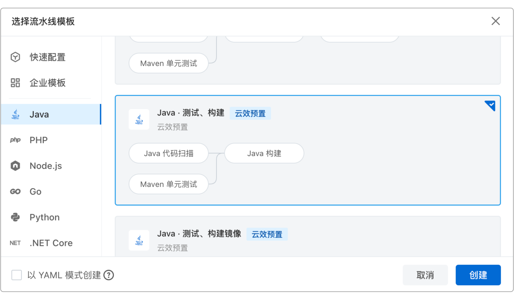

## 第16章 源码管理与流水线

不同于传统产业中的房屋和地皮等有形物品，对于IT企业和互联网公司来说，源代码是比固定资产更为重要的无形资产，也是最核心的资产。因此，如何管好、用好、保护好这些维系公司命脉的源代码，并使之能够源源不断地为组织创造新的价值，就成为软件公司最为核心的关注点之一。
本章包括源代码托管及版本管理策略，编译构建工具的使用，以及流水线的部署方式。

### 16.1 源码托管

在互联网诞生之前，软件工程师们只能把代码文件保存在软盘中，之后或者是通过软盘将这些代码文件拷贝到别的计算机，或者是将它们拷贝到指定的网络服务器上，以达到保管、备份和共享代码的目的，而那些存放源代码的服务器就称为源代码托管服务器。

这种低效、混乱且不安全的源代码托管方式，直到专门的源代码管理软件出现之后才得以彻底改观。

#### 16.1.1 版本控制工具

源代码管理软件又被称为“版本控制系统”，其英文名称是“Version Control System”，简称VCS。VCS作为专门的源代码管理软件，其功能主要包括代码统一管理、解决代码的修改冲突、代码修改权限的管理。VCS的发展历程总体上分为第一代单点式、第二代集中式和第三代分布式。

1. 第一代单点式：以SCCS（Source Code Control System，源代码控制系统）和RCS（Revision Control System，修订控制系统）为代表。在这种方式下，用户通过登录到同一个安装了SCCS或RCS的Unix主机中，实现对单个文件变化的跟踪，但检出的文件一次只能由一个用户在本地进行编辑。当添加文件到SCCS时，会创建一种称为“s文件”或“历史文件”的特殊类型的文件，该文件以“s.”开头的文件名来命名，存储在名为SCCS的子目录中；而当将文件添加到RCS时，则会在当前目录下创建RCS子目录来保存检出的文件，且该文件的后缀为“.v”，如图16-3所示。SCCS或RCS主要实现的功能包括但不限于：跟踪修改文件的历史记录、还原对文件所做的更改、创建分支、变更合并、给修改添加注释等。
2. 第二代集中式：以CVS（Concurrent Versions System，并行版本系统）和SVN（Subversion的缩写）为代表。它们和第一代单点式最大的不同在于：它们是在网络协作的基础上实现版本控制功能的。CVS和SVN均采用了C/S架构体系，在这种架构模式下，代码都被存储在中心服务器上。在由某个创建者将代码提交到服务器后，其他协作者如需修改代码，则需要先从服务器上“签出”文件并将其复制到本地，修改完成后再将内容提交回服务器即可，如图16-4所示。创建者和协作者只是在首次提交代码时有这一角色上的细微差异，除此之外再无任何区别。直到现在，依然有大量的项目源码是通过CVS或SVN实现管理和控制的。
3. 第三代分布式：由于Linux的创始人Linus Torvalds需要管理庞大的Linux内核源码，所以他最初使用了BitKeeper这款CVS工具。但Linus Torvalds那种对开源的执着信念和BitKeeper所属的开发公司BitMover之间产生了冲突，在双方协商无果后，这位天才一怒之下仅用10天就开发出了Git的第一版。图16-1显示的是Git结构和常用命令。

> 图16-01 Git结构和常用命令


第三代分布式版本控制系统Git和第二代集中式版本控制系统CVS或SVN之间最大不同在于，Git并没有类似CVS或SVN的那种中央服务器，取而代之的是本地仓库和远程仓库，这两个仓库都保存着同样的代码，即使远程仓库崩溃，工程师依然可以在本地仓库上控制代码版本的变更，待到网络恢复之时再将代码推送到服务器上即可。而CVS或SVN则将所有的代码都保存在中央服务器上，一旦出现服务器宕机或更严重的磁盘损坏，那么谁都不能再修改、对比、还原或更新代码文件了。

在Git之后，由于开源风潮的兴起，使得一部分热衷于开源的工程师们希望有一个能够充分实现开发协作和代码分享的平台，而且这一平台不仅需要完全保留Git的所有功能，还需要尽可能地多吸纳更多支持开源的工程师们，让他们之间能够畅通无阻地交流，最终形成一个繁荣的开源生态。就这样，Tom Preston-Werner和Chris Wanstrath在2008年创建了Github网站，如图16-2所示。

> 图16-02 Github网站


Github的出现将开源与团队开发完美地结合在了一起：大量的工程师们结成数量可观的非正式组织，群策群力地贡献着自己的力量，他们沉浸在宗教般虔诚且狂热的氛围中，创造出一个又一个既好用还不要钱的软件产品，有些软件产品的性能甚至比商用软件更好——由此而受到的大量“软件修士”们的追捧，着实让那些颇具仙风道骨的“编程老怪”们狠狠地爽了一把。

Github的出现永久性地拓展了软件开发的方式，它使工程师们能够更轻松有效地协作开发，基于简单的社交系统跟踪问题、修复BUG，并且还在此基础上演化出了持续集成/持续部署的功能，所以Github天然就更适合非正式的软件开发团队使用。Github非常适合工程师个人在其上发挥余热，贡献源码。但对于创业团队或商业软件的开发者就不是那么回事了，因为Github默认会把代码公开出去——这也促成了GitLab的诞生。

如果把Github比做游戏公网服务器的话，那么GitLab则是少数工会玩家自己搭建的私服。GitLab非常适合同一个组织内的工程师们共享代码和跟踪问题，它天然就是为商业化的软件团队准备，作为其内部的源代码托管平台来使用的，如图16-3所示。

> 图16-03 Gitlab首页


从第一代的单点式SCCS或RCS，发展到第三代的分布式Git，源代码托管平台日益正规和完善，但工具本身终究代替不了如何使用工具，对于源代码的管理，并不是有了版本控制系统就万事大吉了。

#### 16.1.2 分支管理策略

有了需求，有了工程师，有了源代码托管，就可以愉快地做开发了吗？并不是。因为工程师们会在同一份代码中完成各自不同的功能需求，这些不同的需求都是从业务主流程里所分化出来的枝干，它们共同组成了一颗完整的业务逻辑树。

在版本管理中，为了便于区分，通常将业务核心、基础或初期的版本称之为“主干”代码，而在主干基础之上“生长”（也就是依据主干而创建）出来的代码，则称之为“分支”。主干通常是可稳定运行、测试充分、错误极少且包含全部已实现的业务功能特性的代码库，它是程序代码的基础结构，主要用于构建和开发其他版本。而分支则是从主干中衍生出来的，通常用于修复错误、新功能开发或测试一些实验性、临时性的功能。每个分支都是独立的，既可以也需要单独管理和维护。在开发过程中，主干有可能会逐渐萎缩为分支，而某些庞大的分支，也有成为主干的一天。

随着产品开发的不断推进，业务功能需求会逐步演化成代码库主干和一个个的分支，这些分支和主干之间有着什么样的联系呢？这些联系又会如何变化、何时变化呢？怎么减少或避免它们之中的代码所造成的冲突？又该怎么合理地规划分支？所有这些问题都牵扯到一个共同的主题——分支管理策略（或者分支策略）。从主干中拉出分支不是目的，目的是要选取一种适合业务特点和团队规模的分支模式。按照主干、分支和发布这几者间的组合方式，目前主流的分支策略无外乎这四种：

1. 主干开发，主干发布；
2. 分支开发，主干发布；
3. 主干开发，分支发布；
4. 分支开发，分支发布。

如果在个人开发的项目中用到Git，那么与其说是把它当作版本管理软件，倒不如说是把它作为代码备份工具更恰当。因为此时根本就无需什么分支，所有的代码都可以直接提交到最初的主干或Git默认创建的master分支上就行了，发布的时候也直接将master编译、打包后对外发布。这种没有分支可管理的分支策略就是“主干开发，主干发布”，它也被称为TBD（Trunk-Based Development，基于主干的开发）模式，如图16-4所示。

> 图16-04 “主干开发，主干发布”（TBD）


TBD模式避免了merge代码带来的繁琐，所有的修改一律都在主干上，修改完成后再cherry pick到专用于发布的release分支上。这种release除了发布之外，没有任何其他作用。采用这种分支策略的研发团队，由于每次提交都需要解决合入冲突，所以这就意味着：

1. 需求划分的粒度要合适：太细会频繁触发验证，太粗会导致每次验证时间拉长，影响研发进度；
2. 非常适合持续集成的开展，满足随时可交付的要求；
3. 对于团队能力成熟度和协作成熟度有较高要求，需要成熟的工程配套环境。

但凡事总有例外，如果某些需求特性粒度过粗且无法被切割，那么不仅会严重干扰主干的发布状态，而且还可能导致“半成品”或“残次品”的产品代码发布出去。为了隔离这种不利影响，引入了“分支开发，分支发布”策略，也叫Git-Flow分支策略。在这种分支策略下，当开始一个新特性或新需求的开发工作时，先从主干中拉出一个特性分支，例如支付Payment分支，其后所有与支付相关的特性都在该分支上开发，当完成全部功能开发后，再将此特性分支合并到主干或专用于发布的分支上。

在Git-Flow中一般会存在五种不同的分支：

1. feature：集中某一特性所有功能需求的分支；
2. develop：保存最近未发布版本的分支，对开发的功能进行集成；
3. release：专用于版本发布的分支；
4. hotfix：专门对缺陷进行修复的分支，可以是一个缺陷，也可以是一批缺陷；
5. master：保存最近已发布版本主干基线的分支。

这五种不同的分支其相互关系如图16-5所示。

> 图16-05 “分支开发，分支发布”（Git-Flow）


Git-Flow分支策略的总体流程为：

1. 最开始时，从master中拉出develop分支并在其上推进开发进程；
2. 当出现某个新需求开发任务时，就会据此创建feature分支，并在feature分支上编写和提交代码。当有多个feature分支时，开发者需要在它们之间来回切换（实际上大多数时候，工程师们会沉醉于代码中不自觉地忘记这种切换）；
3. 当某个feature分支测试验证通过后，会被合入（也就是merge）到develop分支中，它保存的都是最近未发布的代码。develop分支其实和master的差异很小，之所以存在，只是作为一道防止污染代码的“防火墙”而已；
4. 当develop中的代码被验证无误后，就会被单独拉出创建release分支进行发布；
5. 如果在项目或产品在运行中出现缺陷或BUG，则会从最近发布的版本中拉出hotfixes分支，专用于缺陷修复；
6. 当缺陷修复完成，再集成到develop分支，通过验证后由release分支发布版本，最后再通过push同步到master。

这种分支策略基本上可以满足大部分应用场景下的开发需求，但是问题同样也很明显：

1. 分支有点多，而且都有特定的用法，在其间切来切去既耗时也特别容易出错；
2. 模式稍显复杂，不适合践行微服务开发的小团队；
3. 如果某个feature分支留存时间过长，合入时潜在的代码冲突是所有工程师的噩梦；
4. develop作为master的影子，存在的意义其实不大，主打一个心理安慰；
5. hotfixes也是一样，完全可以在release上直接修复，不必非得通过hotfixes绕一圈。

分支策略最初的目的就是希望尽可能地提升工程师们的开发效率，但Git-Flow好像有点事与愿违，越搞越复杂了。鉴于这种情况，Github-Flow出现了。

Github-Flow遵循“奥卡姆剃刀”原则，干脆利落地砍掉了多余的develop、hotfixes和release分支，因为它认为：发布应当是一个持续不断的过程，只要有新功能在分支上被开发且测试完成，就应该被立即合入到主干上发布，所以它又叫“分支开发，主干发布”策略，如图16-6所示。

> 图16-06 “分支开发，主干发布”（Github-Flow）


Github-Flow分支策略的总体流程为：

1. master上是可稳定运行、测试充分、错误极少且可立即部署的最新代码；
2. 如果要开发新的功能，就直接从master拉出feature分支，分支以需求特性命名，例如payment；
3. 尽可能地频繁提交变更到feature，当任务完成时立即申请代码评审；
4. 即使在评审过程中，具备其他功能特性的feature分支，例如order分支，仍然可以提交到代码到master；
5. 当payment的代码评审通过，立即合入到master并立即部署。

相比“分支开发、分支发布”的Git-Flow，“分支开发、主干发布”的Github-Flow突出一个“快”字，而且更简单，这也是精益开发和持续集成、部署和交付的精髓。这样一来，开发的问题倒是解决了，但隐患也就此埋下了：master代码直接部署到生产环境，万一出现纰漏，那么给业务造成的损失将无法挽回。为此，在Git-Flow的基础上，改良后的Gitlab-Flow出现了。

Gitlab-Flow在开发过程中和Github-Flow是一样的，都只有master和feature分支。但它最大的不同就是在发布时将master一分为三：master、pre-production和production，所以它既可以是“分支开发，主干发布”，也可以是“分支开发，分支发布”，如图16-7所示。

> 图16-07 “分支开发，主干（或分支）发布”（Gitlab-Flow）


在开发过程中，Gitlab-Flow和Github-Flow之间的差异可以忽略不计，但集成部署时，Gitlab-Flow会先将master合入到pre-production，在pre-production中验证确认无误后，再由pre-production提交到production，这有点把Git-Flow中的develop分支重新启用的味道，只不过这一次是用于部署。

总的来说，这四种分支策略的对比如表16-1所示。

> 表16-1 几种分支策略的对比

| 分支模式 | 优点 | 不足 |
|:---|:---|:---|
| TBD：“主干开发，主干发布”，也可以是分支发布 | 1. 分支少，操作简单<br>2. 小步快跑<br>3. 持续部署、持续交付<br>4. 适合单应用单版本 | 1. 对团队能力和协作要求极高<br>2. 需要良好的配套工程设置<br>3. 不利于并行开发 |
| Git-Flow：“分支开发，分支发布” | 1. 多个功能需求特性可并行开发<br>2. 规则完善、分工明确<br>3. 对复杂应用、大团队协同有很好的支持<br>4. 适合单应用多版本并行 | 1. 过于复杂，分支太多<br>2. 分支周期过长则解决冲突会非常棘手<br>3. 需要专人做版本的配置管理工作 |
| Github-Flow：“分支开发，主干发布” | 1. 多个功能需求特性可并行开发<br>2. 规则明确简单，突出快速<br>3. 持续部署、持续交付<br>4. 适合单应用单版本 | 1. 对团队能力和协作要求极高<br>2. 发布时的分支没有缓冲<br>3. 分支周期过长则解决冲突会非常棘手 |
| Gitlab-Flow：“分支开发，主干发布”，也可以是分支发布 | 1. 多个功能需求特性可并行开发<br>2. 规则明确简单，安全且快<br>3. 持续部署、持续交付<br>4. 同时适合单应用单版本和单应用多版本并行 | 1. 发布分支的增多引入了额外的复杂性<br>2. 仍然是develop分支的变种<br>3. 分支周期过长则解决冲突会非常棘手 |

分支策略没有好坏之分，在了解了它们的不同后，就需要在具体工作中依照不同的业务特色和团队规模来选择适合自己的分支策略。

很明显，对于研发周期长、团队规模大的项目，就非常适合使用Git-Flow分支策略，而短小精悍的创业团队则往往会采用TBD分支策略。如果处于中间位置，周期不长不短，团队不大不小，就可视实际情况选择Github-Flow或Gitlab-Flow了。当然，即使上面的都不合适，诸君尽可博采众长，自创一派。

### 16.2 编译构建

有了版本控制工具和分支管理策略，接下来就要让源代码来实现需求中的那些业务功能了。不过在这之前，还有一个小小的问题，那就是计算机是只认识二进制的，压根不知道什么叫源代码。所以，必须通过某种翻译方式或工具将人能够读懂和编写的源代码转换成计算机可执行的二进制内容。

熟悉Java的工程师们对javac命令并不陌生，它可以把人们编写的Java源文件“编译”成计算机能识别的Class文件，交给计算机执行后再给出结果。不过随着Java语言的不断成熟壮大和其社区生态的日益繁荣，多层级的源代码目录结构、大量需要同时编译的Java源文件、运行时需要的资源文件和引入的第三方依赖等编译、构建需求，让javac束手无策。

#### 16.2.1 ANT构建

为了摆脱Apache Make工具包的复杂性等诸多问题，一位名叫詹姆斯·邓肯·戴维森（James·Duncan·Davidson）的工程师在2000年编写出了Apache ANT的第一个版本1.1。“ANT”并非“蚂蚁”的意思，而是英文“Another Neat Tool”（另一个整洁的工具）的首字母缩写，它开始也并非是为了编译Java应用而存在的，而是伴随着一只名为Tom的猫（Tomcat）出现的。

ANT通过XML来编写Java编译脚本，如果对XML语法比较熟悉的话，那么ANT用起来就非常轻松。在IDEA中创建一个Java项目，并在其根目录下创建一个名为build.xml的文件，如图16-8所示。

> 图16-08 用ANT构建一个Java项目


可以通过IDEA插件分别执行不同的target任务来完成代码的编译构建，也可以在源代码根目录下执行ant命令实现代码的编译构建。

ANT的优点是灵活，但缺点也恰恰是灵活：因为没有强加任何规范性限制，所以工程师不得不自己编写所有的构建步骤，如果项目庞大，这项工作会非常令人生畏，而且由于对项目中所需第三方依赖的支持不佳等种种因素，导致了Maven及其之后Gradle的诞生。

#### 16.2.2 Maven混编

Maven和Gradle的出现解决了ANT中的两个“固疾”：

1. 开发者不再需要关心和编写每一个配置细节，构建效率得以大幅度提升；
2. 通过Maven本地仓库和远程仓库，成功解决了第三方依赖的引用问题。
3. 除此之外，Maven和Gradle还具有如下一些共性：
4. 使用了一套标准的目录结构（包括src、test、resources等）和预置的构建操作，包括clean、compile、test、build、deploy等；
5. 可以灵活地配置多种插件，且所有的工作都由插件完成；
6. 在微服务架构越来越流行的情况下，可以混合多门编程语言完成开发任务。

在笔者看来，这几个共性中最有意思的莫过于混编了。因为在大数据应用中，利用多种编程语言进行开发并不鲜见，有的用于数据采集和清洗，有的用于分析和转换，还有的用于存储和传输。以实现Java和Scala语言的相互调用为例，Maven可以轻而易举地完成。

首先，在javabook-practice项目的pom.xml文件中添加代码清单16-1所示内容。

> 代码清单16-1 pom.xml部分源码

```xml
<project>
    <dependencies>
        <dependency>
            <groupId>org.scala-lang</groupId>
            <artifactId>scala-library</artifactId>
            <version>2.13.13</version>
        </dependency>
    </dependencies>
    <build>
        <finalName>javabook-practice</finalName>
        <plugins>
            <plugin>
                <groupId>net.alchim31.maven</groupId>
                <artifactId>scala-maven-plugin</artifactId>
                <version>4.8.1</version>
                ......
            </plugin>
        </plugins>
    </build>
</project>
```

其次，在src/main目录下创建类似于Java的Scala代码层次结构，结构为src/main/scala。

接着，在cn.javabook.chapter16.controller中创建一个Scala类，如代码清单16-2所示。

> 代码清单16-2 HelloGreet.scala

```scala
package cn.javabook.chapter16.controller
class HelloGreet {
  def greet(name: String, age: Int): Unit = {
    println(s"Hello, my name is $name, I am $age years old.")
  }
}
```

然后，在同一个包中创建HelloWorldController类，如代码清单16-3所示。

> 代码清单16-3 HelloWorldController.java

```java
@RestController
public class HelloWorldController {
    @GetMapping("/")
    public void said(@RequestParam("name") final String name, @RequestParam("age") final int age) {
        HelloGreet hello = new HelloGreet();
        hello.greet(name, age);
    }
}
```

最后，在IDEA中通过GUI执行“package”打包命令打出可执行jar包。如果在IDEA中打包时报错，那么就先在命令行中执行“mvn clean scala:compile compile package”命令，后续再通过IDEA的方式执行“package”打包时就不会报错了。启动打包好的SpringBoot服务，给接口传入name和age参数，就能看到Scala打印出来的结果了——这就是通过Java来调用Scala的方式。

如果反过来用Scala来调用Java呢？也很简单，首先在src/main/scala/cn/javabook中创建一个ScalaMain的对象，其内容如代码清单16-4所示。

> 代码清单16-4 ScalaMain.scala

```scala
package cn.javabook
import cn.javabook.controller.HelloWorldController
object Main extends App {
  val hello = new HelloWorldController();
  hello.said("《JavaBook》", 1);
}
```

然后运行“mvn clean scala:compile compile package”命令进行打包，接着有两种方式可以执行此Scala代码。第一种方式是直接在IDEA中通过单击鼠标右键实现，如图16-9所示。

> 图16-09 第一种执行Scala代码的方式：IDE


第二种方式是将命令行中的当前目录切换到javabook-practice项目的根目录下，然后执行如下命令：

```bash
java -classpath <javabook-practice项目根目录>/target/classes:<.m2_repository存储目录>/org/scala-lang/scala-library/2.13.13/scala-library-2.13.13.jar cn.javabook.Main
```

执行后的结果如图16-10所示。

> 图16-10 第二种执行Scala代码的方式：命令行


#### 16.2.3 Gradle混编

如果将上面Java和Scala互相调用的功能换成Gradle来实现的话则会更简单。首先，在IDEA中创建一个用Gradle构建的SpringBoot项目。然后在IDEA中打开build.gradle构建脚本的编辑界面，其内容如代码清单16-5所示。

> 代码清单16-5 build.gradle部分源码

```gradle
plugins {
    id 'java'
    id 'scala'
    id 'groovy'
    id 'org.springframework.boot' version '3.2.3'
    id 'io.spring.dependency-management' version '1.1.4'
}
......
sourceSets {
    main {
       scala {
          srcDirs = ['src/main/scala', 'src/main/java']
       }
       java {
          srcDirs = []
       }
       groovy {
          srcDirs = ['src/main/groovy']
       }
    }
}
```

接着，在javabook-gradle项目中创建和Maven项目同样的目录结构，如图16-11所示。

> 图16-11 用Gradle构建的SpringBoot项目


说明一下，并不是非要这种项目结构才能运行程序，而是延续之前的结构调试起来更方便些而已。

然后，将之前Maven项目中的代码直接拷贝过来，再双击鼠标左键执行上图中所示的“bootJar”打包命令。最后，同样可以通过前面介绍的方式来执行Java和Scala代码。

虽然目前Maven是业界主流，但Gradle的发展势头也不容忽视。不过笔者认为，它们之间的孰优孰劣无需在意，且编译打包的性能高低丝毫不影响实际代码运行的性能，只要是趁手的，“那便是极好的”。

### 16.3 流水线

现代化工厂的生产线颠覆了传统手工作坊的制造方式，极大地提高了生产效率，原材料从进入生产线开始直到成品出产，会在生产线上经历一系列的阶段和生产过程。软件开发过程也是如此，其周期繁琐复杂，需要多部门、多职能之间共同的参与、协作才能完成，也少不了一些可以提升效能的自动化工具，如图16-12所示。

> 图16-12 软件开发过程


在软件研发生命周期中，有两大领域借助软件工具取得了较为长足的进展，它们就是持续集成（Continuous Integration，简称CI）和持续部署（Continuous Deployment，简称CD）。所谓持CI和CD，是一种软件工程实践。基于这一理念，开发团队通过源代码托管服务，例如Github或Gitlab，频繁地提交工作代码并合入到发布分支，每次合入或集成时都需要完成一系列的构建工作，这些工作包括但不限于：编译、打包、生成镜像、创建容器、自动化测试和发布到线上环境。作为敏捷开发流程的一部分，如果CI/CD能够以自动化的方式运行的话，那么既可以把工程师从繁琐枯燥的部署工作中解放出来，极大地提高他们的开发效率，也将人为出错的可能降到了最小。经过多年的演化和蜕变，CI/CD分为两大类：本地CI/CD和云端CI/CD。

#### 16.3.1 本地CI/CD

所谓本地CI/CD，是相对于（公有）云端而言的企业内部自建的CI/CD系统，它也可以是企业私有化云服务的一部分，但又分为几种不同的实现方式。

在CI/CD发展的早期，大多数都是将代码提交到版本控制服务器，如Github或Gitlab后，再用shell脚本结合构建工具，如Maven编译、打包后就直接发布到测试或生产环境中运行，如图16-13所示。

> 图16-13 脚本式CI/CD


在这之后，有人觉得编写脚本太麻烦，于是在CI/CD界大名鼎鼎的Jenkins也就因此而问世了。Jenkins的主要功能就是可以持续且自动地构建软件项目，它不再需要工程师们手动地去编写在不同环境下的不同Shell构建脚本，而且还能支持几乎所有的构建工具，如ANT、Maven和Gradle等，当工程师提交代码至Git服务器后它将自动地触发构建过程。

这一系列的提交、拉取、编译、打包和部署过程，Jenkins将之称为“Pipeline”，也就是流水线。从此以后，Pipeline成了CI/CD领域中流水线的代名词。

当容器技术崛起后，受到Jenkins的启发，Git们本着“没有中间商赚差价”的精神，自己也另起炉灶搞起了流水线作业的那一套，于是就有了Github Action和Gitlab Runner。

相对于编译和打包插件，借助容器技术，Github或Gitlab可以将源代码拷贝到容器中执行同样的功能，而且还能充分利用容器，来让流水线适应大规模部署的应用场景。

看着Git们通过容器得到了这么多的“造化”，构建工具们也不坐不住了。例如Maven就推出了可以直接将代码打包成镜像的插件。这样一来，只要借助于镜像仓库和K8S（Kubernetes的缩写）这种容器编排工具，就可以跳过集成阶段直接开始部署了，岂不是更让“买家少花钱”？

当然，通过Maven插件构建镜像的工作，也可以通过Git们来触发，效果是一样的，这样也就相当于废掉了Git们的“修为”。

最近几年，在CI/CD领域出现了一个名为Rancher的企业级Kubernetes管理工具，它几乎是专为流水线而生，既可独立完成流水线作业，也可与外部CI/CD集成实现流水线功能。Rancher的内部不仅囊括了K8S，而且还附带一个私有的镜像仓库，能以极其直观的方式看到流水线的作业过程，如图16-14所示。

> 图16-14 Rancher的标准流水线作业过程


而且有了K8S的加持，Rancher基本上是想要什么服务就可以立即部署什么服务，这种“所想即所得”的能力让其他对手完全无法望其项背，如图16-15所示。

> 图16-15 Rancher部署工作负载


以上种种，就是“本地”CI/CD的几种实现方式，笔者在章节附带的资源中提供了相关Docker脚本。尤其是Rancher，几乎可以适用于所有的应用场景，从单个Docker容器，Docker集群，一直到大规模的容器编排它都能搞定。当然，前提是要对K8S有相当的了解。

#### 16.3.2 云端CI/CD

和本地CI/CD不同，云端流水线完全不用自己费力搭建，只需按照服务供应商的规则签出代码、完成服务部署即可。

这里笔者以曾经使用过的云效CI/CD为例来说明，在其中创建代码库后，将本地代码上传至托管服务器，如图16-16所示。

> 图16-16 创建流水线


然后在图16-31的右上角单击“创建流水线”，也可以在侧边栏中选择“流水线”服务。作为示例，笔者创建了一个无需使用ECS主机的流水线模板，如图16-17所示。

> 图16-17 选择流水线模板



单击“创建”后，就会立即出现流水线的流程配置界面，如图16-18所示。

> 图16-18 流水线流程配置


不管是添加新的阶段还是添加串/并行任务，可选择的内容项有：代码扫描、单元测试、代码构建、镜像构建、打包部署、Git代码合并或删除分支、执行某些命令等。

流水线中的每一步都可以根据自己的需要来设置。而且基本上默认的配置就可以满足大部分需求，如果有不清楚的地方，可以通过每一个步骤后面都跟着的“？”来获取相关帮助。
设置好所有的步骤后，就可以用鼠标单击右上角的“保存并运行”，结果如图16-19所示。

> 图16-19 流水线执行结果


从上图可以看到，刚才的流水线已经执行成功，它每一步都会产生相关的日志记录，例如查看“Java代码扫描”的日志则如图16-20所示。

> 图16-20 流水线执行日志


如果需要将代码直接部署到ECS云主机上执行，那么需要添加“主机部署”的相关配置，其实现过程可以按照帮助一步步设置即可，此处就不再赘述。

### 16.4 本章小结

在软件开发行业发展的早期，大多都是工程师们独自开发所需功能，他们总是将源代码保管在工作的计算机磁盘上或软盘中，那时候也不存在多位工程师共享同一份代码的问题。但随着时代的进步、软件行业的兴起，需求日渐复杂，开发团队的规模也日益庞大，由多位工程师组成的软件团队共同开发情况越来越普遍。在此背景下，出现了最早的版本控制系统VCS。作为一种软件工具，它不仅需要实现代码的统一管理，同时还要解决代码修改时所造成的内容冲突，以及代码的修改权限问题。自诞生以来，VCS经历了三次大的变迁：从第一代单点式到第二代集中式再到目前的分布式，其功能和协作能力越来越强，在软件开发中所起的作用也越来越不可替代。在第三代分布式版本控制系统Git之上，诞生了Github这种源代码托管应用，它的出现不但使得VCS又往前迈进了一大步，而且也导致了开源生态的迅猛发展。

不管是C/C++还是Java，它们都是通过自带的编译器把工程师编写的源代码文件“翻译”成计算机能读懂的二进制文件的。但自从有了各类开发框架以后，例如Struts和Spring，Java自带的编译器已然无法处理复杂的源代码层级结构和众多的第三方依赖引用了，为了解决这个问题，ANT出现了。ANT使用XML文件来描述需要编译、输出的源代码文件和Class类文件，并可以区分若干不同的编译步骤，例如“clean”和“compile”。ANT的缺点也正是它的优点：过于灵活，工程师不得不手动编写大量编译脚本，而且它依然没有很好地解决第三方依赖的问题，这就导致了Maven和Gradle的诞生。它们不仅弥补了ANT的缺陷，还把“编译”这项工作重新定义成了“构建”：通过编译、打包、测试等若干步骤将源代码变成可执行的软件包。

源代码托管和编译构建两类工具的迅猛发展、融合，直接催生了一个称之为“CI/CD”的领域。所谓CI/CD指的是持续集成和持续部署：工程师将代码提交到源代码托管服务器，然后以脚本或软件工具的形式触发自动化编译构建，经过事先设定的若干步骤，就把源代码转变成了可执行的软件包或应用网站，而这一切都不需要工程师的人为干预，唯一需要调整的就是步骤和生成方式。在CI/CD领域大名鼎鼎的Jenkins就是这样一个存在，也正是在它的催化下诞生了所谓的“流水线”作业，将软件开发推到了类似于工厂生产线的新高度，这可能也是大型互联网公司为什么叫“大厂”的原因之一吧。大型软件公司一般都会搭建自己的流水线，这样可以更好地管控软件开发的质量和效率，而对于中小型软件公司来说，直接利用云端的流水线则是更为经济实惠的选择。

### 16.5 本章练习

1. 您所在公司的业务和团队规模适合哪一种分支策略？为什么？

2. 笔者在Maven构建和Gradle构建中实现了Java与Scala的互相调用，并且在它们中都留下了Groovy源代码文件夹——猜对了，请试着实现Java和Groovy的互相调用。如果想挑战一下的话，那么可以接着实现Groovy和Scala的相互调用。

3. 实现CI/CD的方式有多种，例如纯Jenkins、Jenkins+Git服务器、脚本 + Maven Docker插件、Rancher等。选择其中的某种方式并搭建起您所在公司的本地CI/CD流水线。

4. 请选择您常用的某个云服务商，然后通过它提供的流水线功能完成代码的CI/CD。
