## 第17章 开发过程与质量管理

在工具、技术与自动化流水线之后，对于软件本身来说，对它影响最大的莫过于研发时所采取的开发过程了，因为不同的软件开发过程不仅直接决定了不同的软件项目管理方式，而且对软件开发团队也会有不同的要求。

在一些互联网大厂或大型软件公司中，相对于“务实”的编码而言，工程师们还需要处理诸如过程管理、质量追踪、项目盘点、头脑风暴等“务虚”性质的工作，本章就来谈一谈所谓的软件“务虚”中那些比较“虚”的东西，包括不同的开发过程管理和对软件能力成熟度模型的介绍。

### 17.1 瀑布模型与RUP

1970年，一位美国计算机科学家，得克萨斯州奧斯汀市洛克希德软件技术中心主任，温斯顿·沃克·罗伊斯（Winston Walker Royce）博士在其发表的论文《管理大型软件系统的开发》中，首次提出了在开发过程中所能采取的几种不同的项目管理模式，这当中就包括了我们目前所熟知的瀑布式、迭代式和敏捷式。由于在温斯顿博士所处的年代，面向过程的软件开发方式仍然为业界主流，且那时的软件项目大多数都属于航空航天、科研制造、军事系统、能源化工等类别，因此软件开发“工程化”的特色极为明显，瀑布模型也就自然而然地模仿了建筑工程中的策划、勘查、设计、施工、验收和交付等诸多阶段。

及至1980年代末，面向对象的软件设计方法已进入鼎盛时期，为了统一业界诸多且混乱的面向对象方法论，James Rumbaugh、Grady Booch和Ivar Jacobson三位计算机科学家决心博采众长，创立一个统一的面向对象设计与开发方法论。最终，在他们的努力推动下，业界逐渐达成一致，并先后产生了`UML（Unified Modeling Language，统一建模语言）`和`RUP（Rational Unified Process，Rational统一过程）`。

#### 17.1.1 瀑布模型

一个软件项目的发生和发展，如同其他事物的发生和发展一样，例如建筑项目，都会经历一系列的变化过程，这种“一系列的变化过程”被称为“软件开发生命周期”（Software Development Life Cycle，SDLC）。在了解瀑布模型之前，必须先知道什么是软件开发生命周期，完整的软件开发生命周期如图17-1所示。

> 图17-01 软件开发生命周期

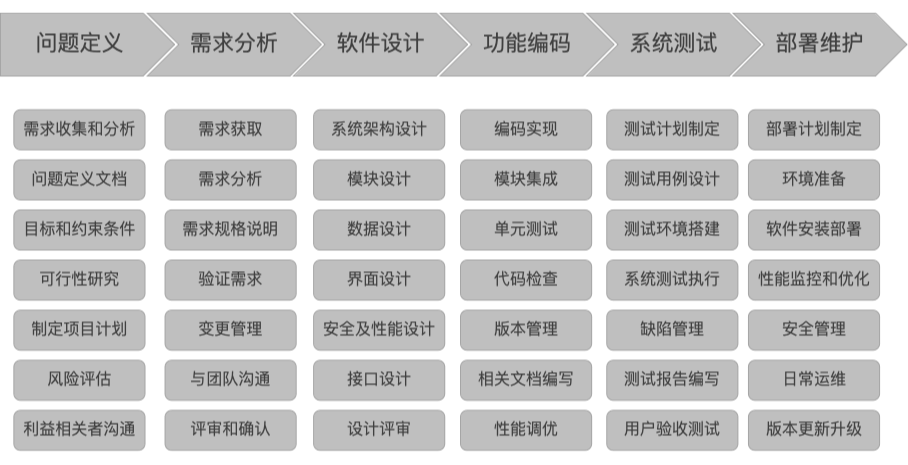

软件开发生命周期通常包括如下几个阶段：

1. 问题定义阶段：这一阶段主要的目的就是明确定义并理解问题的本质，为后续的开发工作奠定基础。这个阶段通常又分为以下几部分工作：需求收集和分析、制定问题定义文档、确定项目目标和约束条件、编写可行性研究报告、制定项目计划、风险评估、与利益相关者沟通等。问题定义阶段的工作对于项目的成功至关重要，它为后续的需求分析、设计、开发和测试工作奠定了基础，有助于确保项目在整个生命周期内按照既定目标和计划顺利进行；

2. 需求分析阶段：它是在问题定义阶段之后进行的，主要目的是进一步细化和完善在问题定义阶段确定的需求，以便为软件设计和开发提供详细的指导。在需求分析阶段，通常会进行以下工作：需求分析、制定需求规格说明书、验证需求、需求变更管理、与团队保持沟通、评审和确认需求等。需求分析阶段的工作结果是需求规格说明文档，它是软件开发的重要文档之一，为软件设计和开发提供了明确的指导，有助于确保软件系统能够按照客户和利益相关者的期望进行开发，并最终满足用户的需求；

3. 软件设计阶段：这一阶段的主要目的是根据需求规格说明文档和其他相关信息，制定软件系统的架构和设计方案，为后续的编码和测试工作提供指导。该阶段通常会进行以下工作：系统架构设计、模块设计、数据设计、界面设计、安全设计、性能设计、接口设计以及对这些设计工作的评审。软件设计阶段的工作结果是软件设计文档，它是软件开发过程中的重要文档之一，为程序编码、系统测试和软件维护提供了指导，有助于确保软件系统能够按照需求规格说明文档的要求进行开发，并最终满足用户的需求；

4. 功能编码阶段：功能编码阶段的主要目的是根据软件设计文档和设计方案，将设计的功能和模块转化为实际的可执行代码。在功能编码阶段，通常会进行以下工作：编码实现、模块集成、单元测试、代码检查、版本管理、相关文档编写和性能调优。这是软件开发过程中的核心阶段，编写高质量的代码对于确保软件系统的稳定性、可靠性和性能至关重要。良好的编码实践和团队协作可以提高代码的质量和效率，有助于项目按计划顺利进行；

5. 系统测试阶段：系统测试阶段是在功能编码阶段之后进行的，主要目的是对整个软件系统进行全面的测试，验证系统是否符合需求规格说明文档的要求，并发现和修复可能存在的缺陷和问题。在系统测试阶段，通常会进行以下工作：测试计划制定、测试用例设计、测试环境搭建、系统测试执行、缺陷管理、测试报告编写、用户验收测试等。通过系统测试可以发现和修复软件系统中的问题和缺陷，提高系统的质量和可靠性。及时有效地进行系统测试可以降低软件发布后出现问题的风险，保证软件系统的正常运行和用户满意度；

6. 部署维护阶段：这是软件开发生命周期的最后一个阶段，它是在系统测试完成并且软件系统准备投入使用之后进行的，主要目的是将软件系统部署到生产环境并进行运维管理，确保系统能够稳定运行并持续满足用户的需求。在部署运维阶段，通常会进行以下工作：部署计划制定、环境准备、软件安装部署、性能监控和优化、安全管理、日常运维、版本更新和升级。部署运维阶段是软件开发生命周期中非常重要的一环，有效的部署和运维管理可以确保软件系统在生产环境中稳定运行，并不断优化和改进系统，满足用户的需求和期望。

有了明确的软件开发生命周期，就可以很清楚地知道各个阶段所要实现的目标、执行的任务和步骤，瀑布模型作为一种软件开发生命周期模型，它完全遵循SDLC中各个阶段的目标、要求和任务，每个阶段的输出作为下一个阶段的输入，依次进行下去，直到最终的软件交付，瀑布模型如图17-2所示。

> 图17-02 瀑布模型

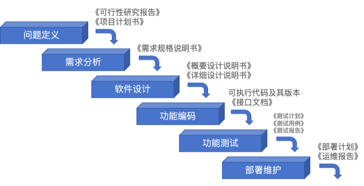

瀑布模型是软件开发生命周期的一种具体实现方式和组织形式，它强调软件开发过程的线性和阶段性，每个阶段都有明确的输入和输出，开发过程是依次逐步进行的，只有完成前一个阶段，才能开始下一个阶段，不存在“跳跃”的可能，就像瀑布中的水流一定是从崖石中一级一级地流过而不可能跳过一样。

瀑布模型是一种传统的开发模型，适用于需求变化较少、项目目标非常明确的情况，在很多大型的系统集成应用中，例如电子政务、智慧城市、智慧交通等，都是严格按照瀑布模型来实施软件开发工作的。因为在大型的软件研发团队中，人员情况往往较为复杂多变，通过瀑布模型则可以制定一个分工明确、时间清晰的工作流程，使得进入团队的新人可以快速了解当前的工作状况，这就大大降低了工作交接的复杂度和项目风险，在前文讲述过的甘特图就是常用于瀑布模型的项目管理工具。但是在需求变化频繁或需求不明确的情况下，瀑布模型也可能会导致开发效率低下和项目风险的增加。而且瀑布模型对软件中存在的致命错误，尤其是需求有偏差的情况不能够很好地纠正，也不允许流程重叠，无法同时进行不同阶段的工作，从而降低了整体开发效率。

#### 17.1.2 RUP

首先要明确的是，RUP（Rational Unified Process）是一套基于UML统一建模语言且面向对象的软件开发过程方法论，它是一种重量级的软件开发过程，比较适合大型软件研发团队的执行和推广。RUP虽然在整体上也遵循瀑布模型，但它更强调通过迭代和增量的方式来开发软件而不是“只顾低头走路”。RUP将软件开发过程划分为四个迭代周期，每个迭代周期中都包括RUP的九个核心流程：业务建模、需求、分析设计、实现、测试、部署、配置和变更管理、项目管理和环境，最终交付可执行的软件系统。如图17-3所示。

> 图17-03 RUP

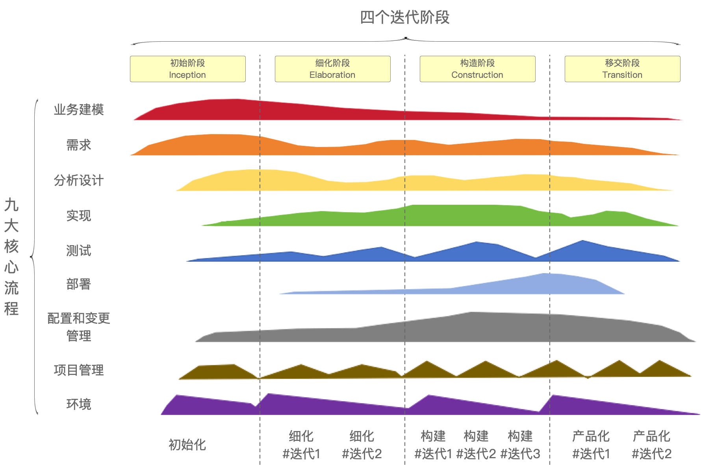

其次，除了以面向对象的设计方法为原则外，RUP还坚持以用例为驱动，以架构为中心的设计方法。因为如果没有客户需求，那么整个应用系统就如同空中楼阁一般无法落地。所以在RUP中，“凡为需求，皆有用例”。从架构设计的层面来完成分析和设计，则让架构师和工程师们可以集中精力优先解决系统整体所面临的主要问题，而不会过早地陷入到部分的细节中去。

最后，RUP在若干原则和方法的“虚”的基础上，定义了一系列的“实”的过程交付件，也就是明确规定了在软件开发过程中“做什么”（WHAT）、“为什么做”（WHY）“谁来做”（WHO）、“什么时候做”（WHEN）、“在哪做”（WHERE）和“怎么做”（HOW）的问题，如图17-4所示。

> 图17-04 RUP的过程交付件

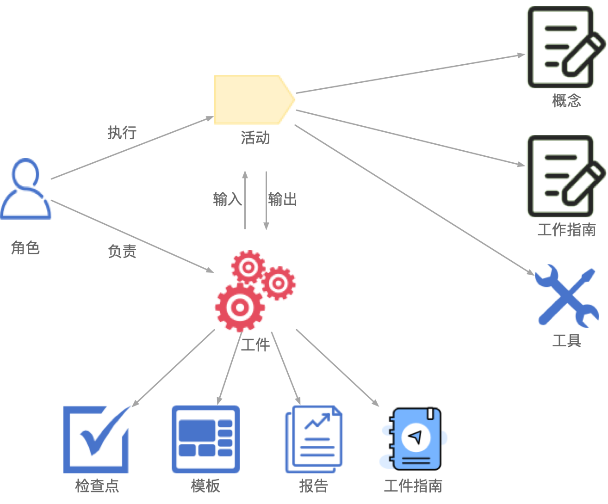

在上图中所涉及的主要的RUP概念包括：

1. 角色：RUP通过一些预先设定的角色，定义了在软件项目开发中个人或团队的工作职能与任务，解决了“WHO”的问题；
2. 活动：是一个有明确功能的独立模块，反映了系统的某个业务功能或工作单元，厘清了“WHAT”、“HOW”和“WHY”的问题；
3. 工件：是由活动生成且在活动进行中产生、创建或修改的项目信息，也是项目开发过程中产生的文档和资料，解决了“WHEN”、“WHERE”和“HOW”的问题。

RUP是一个非常复杂且完备的软件开发过程，类似于一本宝典。宝典虽好，但并不是每一个目标都需要实现，每一个指南都需要遵照，每一个任务都需要完成，而是可以根据实际的项目情况对RUP进行所谓的“裁剪”，也就是“削履适足，入乡随俗”。例如，对于一些规模较小的项目，可能根本就不需要业务建模、配置和变更管理，也不需要什么检查点、指南和模板，而对于那些大型项目，可能还需要加上CI/CD流程。

RUP作为一种曾经“红极一时”的软件开发过程，很多技术博客和资料中都认为它的特点是“迭代模型”、“用例驱动”和“以架构为中心的设计”。但根据笔者的经验，“以架构为中心的设计”比较“虚”，对于初学者来说是一个极为模糊的概念，不但等于没说，而且对学习有一定的误导性。因此，笔者稍稍调整一下说法：RUP最精华的部分且其独创之处就是“UML”、“用例驱动”和“迭代式增量开发”，因为RUP中大量的用例图、设计图和架构图都是通过UML完成的，UML也是最直观的可以被直接掌握和学习的东西。掌握了UML，也就理解了什么叫“用例驱动”，进而掌握所谓的“迭代式增量开发”。

从过程整体的角度来看，瀑布模型偏“静态”，而RUP偏“动态”，因为RUP中的每一个迭代周期中，都会经历一次“瀑布”，而瀑布中的每一个过程，也都要经历初始化、细化、构建和移交这四个迭代周期。所以，瀑布模型和RUP之间的关系可以简单概括为：“你中有我，我中有你”。

在目前互联网应用已经逐渐占据软件开发业务的主流，且“拥抱变化”与“小步快跑”日益深入人心的情况下，RUP已经逐渐被“敏捷开发”过程所取代，但它所创造的UML、迭代式增量的开发理念却被保留下来，得以不断发展壮大。

### 17.2 敏捷开发

在现实世界中，业务需求并不总是一成不变的，软件开发并不总是循规蹈矩的，软件团队也并非一直都是固定的那几个人。除了按“步”就班的“瀑布”和唯“例”是图的RUP这两大重量级的软件开发过程，在20世纪90年代，还有一些“轻量级”的软件开发方法也迅速发展起来。例如，在1991年出现的RAD（Rapid Application Development，快速应用开发）、1994年出现的DSDM（Dynamic Systems Development Method，动态系统开发方法）、1995年出现的SCRUM、1996年出现的XP（Extreme Programming，极限编程）、1997年出现的FDD（Feature-Driven Development，特性驱动开发）和2000年出现的ASD（Adaptive Software Development，自适应系统开发）。这些方法论都强调了业务干系人和开发团队之间的密切合作、频繁沟通和持续交付。

直到2001年，17位软件开发专家聚集在美国犹他州，讨论了他们对于软件开发的各种想法和实践经验，并据此达成了关于价值观和原则的共识，之后共同发布了世界上第一份敏捷软件开发宣言和相应的十二条原则。这17人包括来自于XP、Scrum、DSDM、ASD和FDD的代表们，还包括一些希望替代文档驱动、替代重量级软件开发过程的推动者。下图17-5和图17-6显示了在敏捷宣言网站中共同署名的17位软件大师的名字、《敏捷软件开发宣言》和《敏捷软件的十二条原则》。自此以后，敏捷联盟成立，“敏捷软件开发”的正式英文名称是Agile Software Developemnt。

> 图17-05 敏捷宣言网站的《敏捷软件开发宣言》

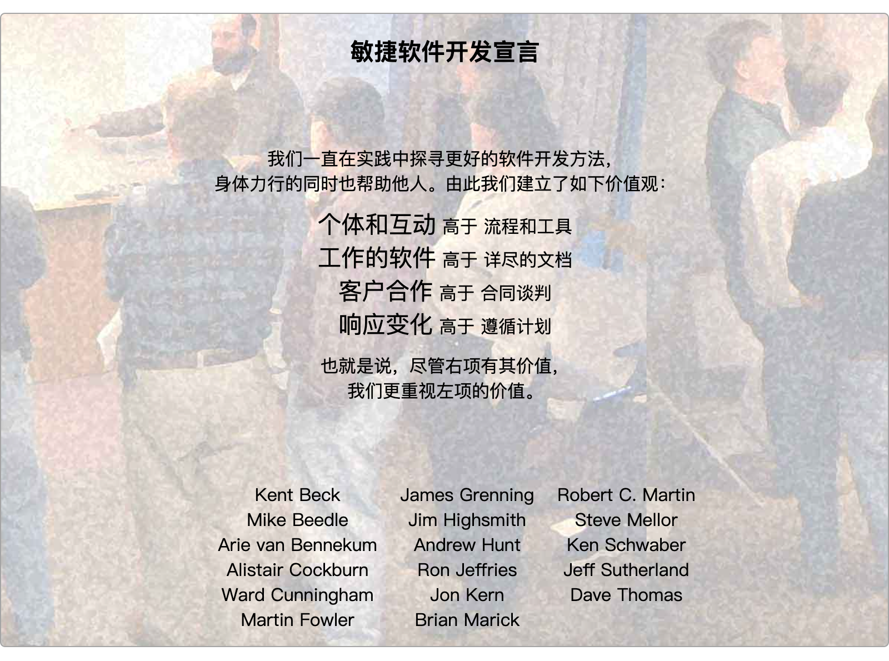

> 图17-06 敏捷宣言网站的《敏捷软件的十二条原则》

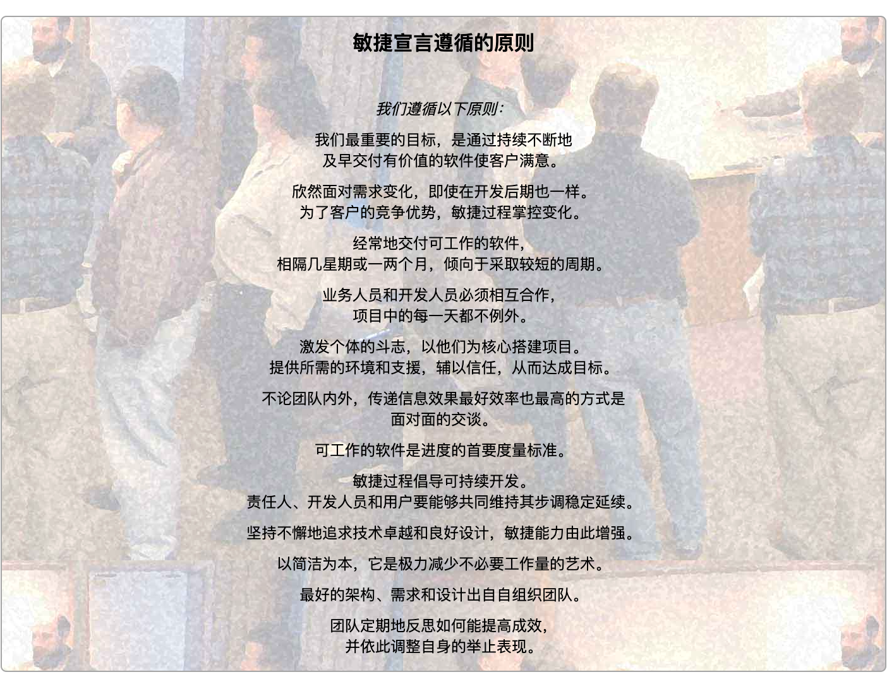

#### 17.2.1 Agile与Scrum

从敏捷宣言的价值观和原则上来看，它是一种旨在通过灵活地应对需求变化、持续给客户交付可用的软件、紧密的协作和持续反馈等方式，更有效地进行开发的一种软件开发方式。敏捷方法吸收了RUP的增量式迭代特点，更强调快速响应变化、团队合作和持续改进。

敏捷软件开发方法的诞生离不开软件行业飞速的变化，当时软件开发界对传统瀑布模型的限制和缺陷开始有所认识。因为瀑布模型要求在项目开始阶段就对需求进行详尽的规划和文档化，然后按照计划一步步进行开发和测试。然而，这种方法往往无法应对需求的频繁变化和客户反馈，导致项目延期、失败和成本暴增。在解决这些问题的过程中，工程师们发现频繁地交付、与客户保持持续沟通、实现自组织跨职能团队可以有效地提高软件质量，减少项目风险，而正是这些理念形成了敏捷软件发开的基础。

敏捷软件开发的核心理念包括如下几个方面：

1. 迭代开发：将软件开发过程分为多个短周期的迭代，每个迭代周期通常持续1到4周。在每个迭代结束时，开发团队将会交付一个可用的、经过测试的软件版本，这有助于快速验证需求、减少风险，并使客户能够及时提出反馈；
2. 快速反馈：鼓励与客户和用户保持紧密沟通，及时获取反馈。这样一来，团队就可以及时调整开发方向，避免无用功，确保软件符合客户需求；
3. 持续改进：通过定期的回顾会议和迭代总结，让工程师们可以发现问题、找到改进的方法和提高软件质量，并在下一个迭代中应用这些改进；
4. 团队合作：鼓励团队内部、团队与客户之间的紧密合作、相互理解支持，以实现项目的成功；
5. 自组织和管理：团队成员应该具有一定的自主权和决策权，避免因外部管理问题而影响开发效率。

需要说明的是：敏捷（Agile）是一种思维方式或开发理念，而Scrum则只是一种实现敏捷的具体方法，且实现敏捷的方式也并非只有Scrum一种，它们之间的关系就类似于微服务和Spring Cloud之间的关系。只是因为Scrum应用较为广泛，所以在某种程度上，Scrum也就替代了Agile的提法。

敏捷核心概念、敏捷方法和敏捷实践之间的关系如图17-7所示。

> 图17-07 敏捷核心概念、敏捷方法和敏捷实践之间的关系

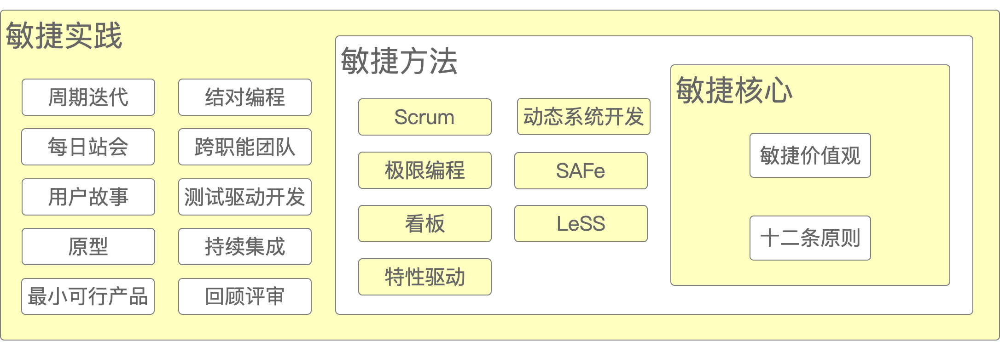

在实践敏捷的具体方法中，Scrum无疑是颇为成功的那一个。Scrum的概念最早来源于精益生产，这是一种曾在日本制造业中极为流行的即时（Just In Time，JIT）生产管理方式。两位日本人竹内弘高（Hirotaka Takeuchi）和野中郁次郎（Ikujiro Nonaka）将产品开发比作橄榄球比赛中球队的集体争球，强调团队需要在短时间内合作才能完成任务。这种灵活的、迭代的方法后来被另外两位美国人Jeff Sutherland和Ken Schwaber进一步发展，并将之引入了软件开发领域，由此形成了现在人们所熟知的Scrum方法。

Scrum包括5种价值观、3大角色、3个工件和5类事件。

1. 5种价值观分别是：承诺、专注、开放、尊重和勇气；
2. 3大角色：产品负责人（Product Owner）、Scrum教练（Scrum Master）和开发人员（Developers）；
3. 3个工件：产品待办清单（Product Backlog）、冲刺清单（Sprint Backlog）和产品增量（Product Increment）；
4. 5类事件：冲刺（Sprint）、冲刺计划会（Sprint Planning）、每日站会（Daily Scrum）、冲刺评审会（Sprint Review）和冲刺回顾/反思会（Sprint Retrospective）。

Scrum的基本原则是将整个开发过程划分为若干短小的时间段，这个时间段被称为“冲刺”（Sprint），它通常为2到4周。在每个冲刺开始之前，Scrum教练（Scrum Master）会制定一个冲刺计划（Sprint Planning），明确冲刺目标和计划如何实现，而产品负责人（Product Owner）则会事先将已确认的需求分解成一份产品待办清单（Product Backlog）。在冲刺期间，开发人员（Developers）会完成一批由产品负责人根据价值排序原则从产品待办清单中列出的用户故事（User Story）清单，这个清单也叫冲刺清单（Sprint Backlog），每个冲刺都以一个可交付的、经过测试的软件产品增量（Product Increment）版本作为结束。开发人员每天进行短暂的站立会议（Daily Stand-up），以便及时沟通、解决卡点问题和互相通报进度，会议时间一般不超过15分钟。Scrum强调团队的自组织管理和持续改进能力，同时也通过定期的评审会议（Sprint Review）和回顾会议（Sprint Retrospective）来总结经验教训，不断改进工作方式。需要注意的是，Scrum教练和产品负责人是两个不同的角色，这两个角色可以是同一个人扮演，也可以不是，依托于Scrum的敏捷开发流程图如图17-8所示。

> 图17-08 敏捷开发流程图

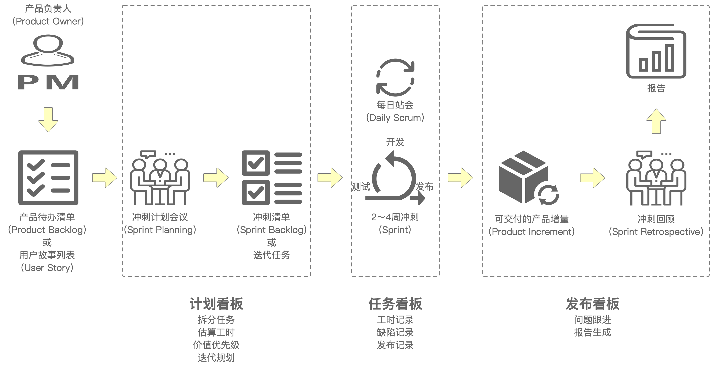

因此，Agile思想和Scrum方法这两者在某种程度上来说，基本上是可以等价替换的。

#### 17.2.2 敏捷方法

除了Scrum外，敏捷软件开发的方法论中还包括另外几种常见的方法：极限编程和敏捷看板。

极限编程（eXtreme Programming，XP）在软件开发中较为知名，因为它最大的特色之一就是开发团队中必须包括一名客户代表，也就是真正了解业务并需要通过软件提高业务效率的那个人。而“极限”一词的意思就是要把好的开发实践运用到极致，因为XP的支持者认为软件需求的不断变化是非常自然而然的现象，而且和传统预先定义好需求再费尽心机去控制或拒绝变化的方法相比，能够在软件开发生命周期的任何阶段去拥抱变化，才是更为现实且明智的态度。XP的特色之二就是所谓的“结对编程”了：由两名工程师在同一台计算机上完成同一个功能，解决同一个问题。不过这一点对于职业素质很强的人或团队来说不是问题，可以互相学习借鉴，互相促进提高，但对于喜欢“摸鱼”的码农来说，可能就会获得一种“监工”式的开发体验或者是一个推卸责任的机会。除了此之外，诸如测试驱动开发、短交付周期、持续集成等手段，都是“基本配置”了，XP的核心理念如图17-9所示。

> 图17-09 XP的核心理念

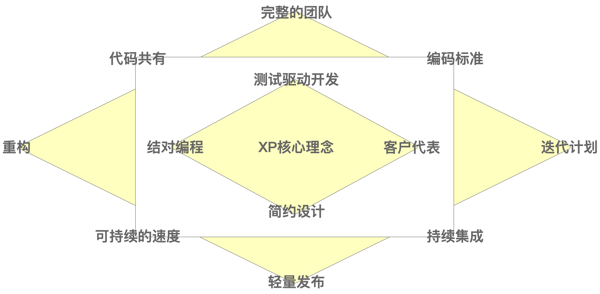

所谓“敏捷看板”（Kanban），其实就是以一种非常直观的方式在现实世界的白板或者计算机软件中展示Sprint冲刺的进度，典型的Kanban如图17-10所示。

> 图17-10 办公室的敏捷看板

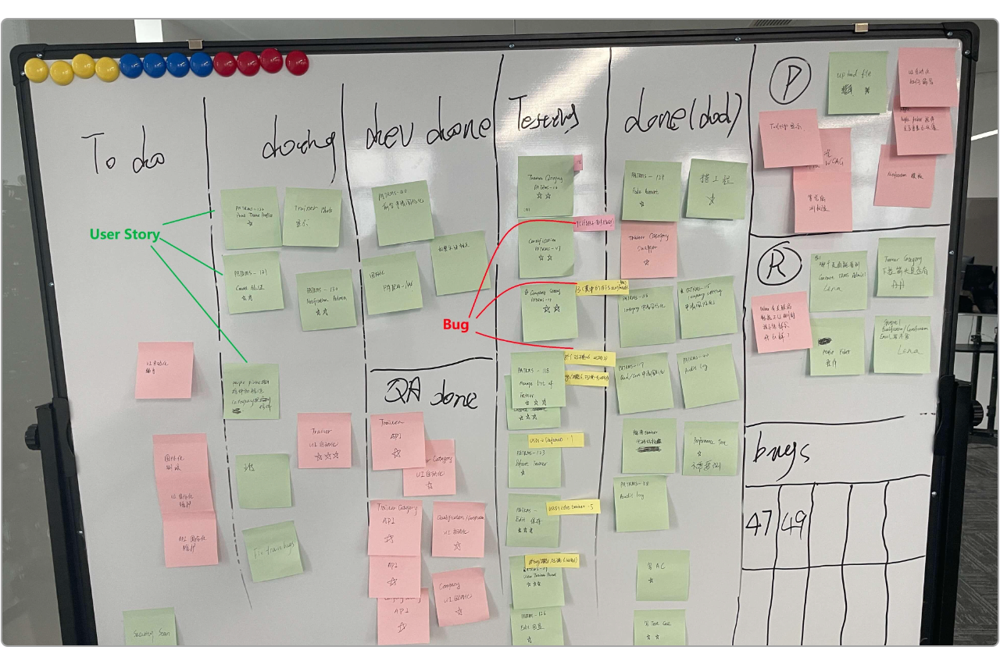

看板中的卡片或便笺可划分为待办、进行中、已完成等多个类别。通过将同一个任务在不同的类别中移动，使得开发团队的工程师们可以清楚地看到当前任务的状态和进度，这有助于团队更好地协调工作、识别潜在的问题并快速调整计划以满足需求变化。

#### 17.2.3 敏捷实践

在掌握了敏捷方法之后，接下来再看看前人们那些有益的敏捷实践经验，它能帮助新手Product Owner、Scrum Master或Developers们更容易地从具体事项开始做起，直至完全掌握敏捷软件开发方法。这些良好的实践包括但不限于用户故事（User Story）、用户故事地图（User Story Roadmap）、最小可行产品（Minimum Viable Product，MVP）、产品原型（Prototype）和测试驱动开发（Test-Driven Development，TDD）等。

敏捷中的用户故事和UML中的用例极为类似，唯一不同的在于用户故事需要加上所谓的商业价值，即“这个功能能给组织带来什么好处？”。例如，“用户通过手机登录网站完成签到可以增加粘性”，这其中“增加粘性”就是非常明显且有意义的商业价值，只不过相对于简单明了的用例来说，用户故事更费脑子了，几乎每个功能都要找个“好由头”。至于用户故事地图则是将用户故事串联起来，形成一条比较完整的业务逻辑流程，如图17-11所示。

> 图17-11 用户故事地图

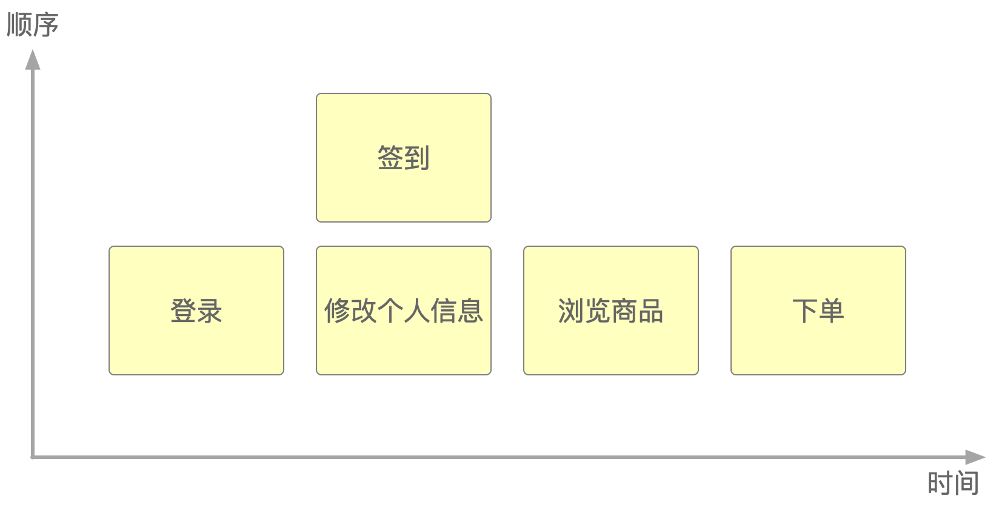

所谓最小可行产品，就是只具备基本必要功能的产品，以最少的时间和资源来满足用户需求，主要是用于早期阶段的市场验证和用户反馈。对于电商网站来说，其最小可行产品就是用户从注册、登录、浏览商品、加入购物车、下单开始直到确认收货这之间的一条完整业务逻辑主线，除了这个主线之外的任何其他业务，例如退换货、评价、分享等都属于“多余”的部分。将用户故事地图和最小可行产品结合起来，就会得到这样一份“地图”，如图17-12所示。

> 图17-12 用户故事地图MVP

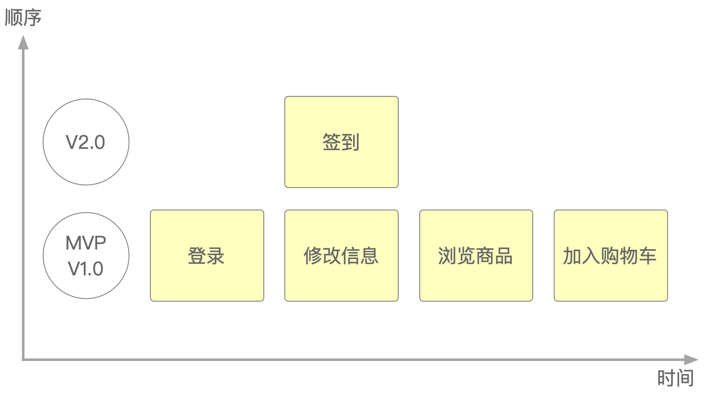

从最小可行产品开始，直至创造出完整的产品，其过程和图17-13类似。

> 图17-13 逐步创造用户体验

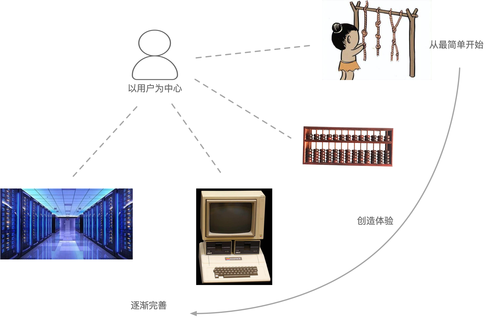

产品原型法由于移动互联网的普及，已经被包括开发工程师在内的所有IT界人士及客户所认识和接受，因此就不再赘述。顺带提一句，原型中的低保真草图的作用其实就类似于MVP在开发过程中的作用。

至于TDD则更为工程师们所熟悉，即使是那些从不写单元测试的工程师也知道TDD的基本思想。TDD通过测试先行的方式，在开发完毕之后紧接着就编写单元测试及测试套件，直至所有测试全部通过，这样可以在第一时间就知道开发的功能是否有问题。不过，鉴于大部分工程师的开发习惯和自负，尤其是自负，TDD的普及在实践中应该是最难的一个。

#### 17.2.4 发布模式

在前一章的源码托管中，笔者故意“遗漏”了一个小小的知识点没讲，那就是根据不同的分支版本所制定的软件发布模式。之所以如此，是因为该内容和敏捷实践有很大的关系，在掌握了敏捷开发过程的相关知识之后就可以来谈谈它了。

对于火车或飞机来说，必须经过周密的计划和安排才能最终得到各种不同的班次售卖给旅客，这种班次非常稳定，即使晚点或提前抵达，也都在可掌控的范围内，不会轻易做大范围的调整。对于一家大型软件公司来说，它发布的各种软件产品也类似于这种火车或飞机的航班图，如何既能使各种软件产品的发布不冲突，还能有计划、有规律地不断发布新的软件产品或软件产品新的版本，就是软件发布模式需要考虑的问题。

由于敏捷开发的主要精神之一就是持续集成支持下的持续交付，而且还要综合考虑开发进度、功能特性和软件质量三个不同的维度，所以就产生了三种不同的软件发布模式：

1. 项目发布模式（Project Release Mode，或大波浪发布模式）；
2. 发布火车模式（Release Train Mode，或迭代发布模式）；
3. 城际快线模式（Intercity Express Mode，或持续交付模式）。

“项目发布模式”是较为常见的一种发布模式，它是指在软件某一个版本的开发中，预先确定该版本所需包含的全部特性集合，只有将特性集合中的特性全部开发完成且满足相应质量要求后，才能发布版本，而该版本从开发到发布之间的时间间隔不固定。这就像海里的大波浪一样，虽然浪头很高，但每次到来的时间都不确定，如图17-14所示。

> 图17-14 项目发布模式

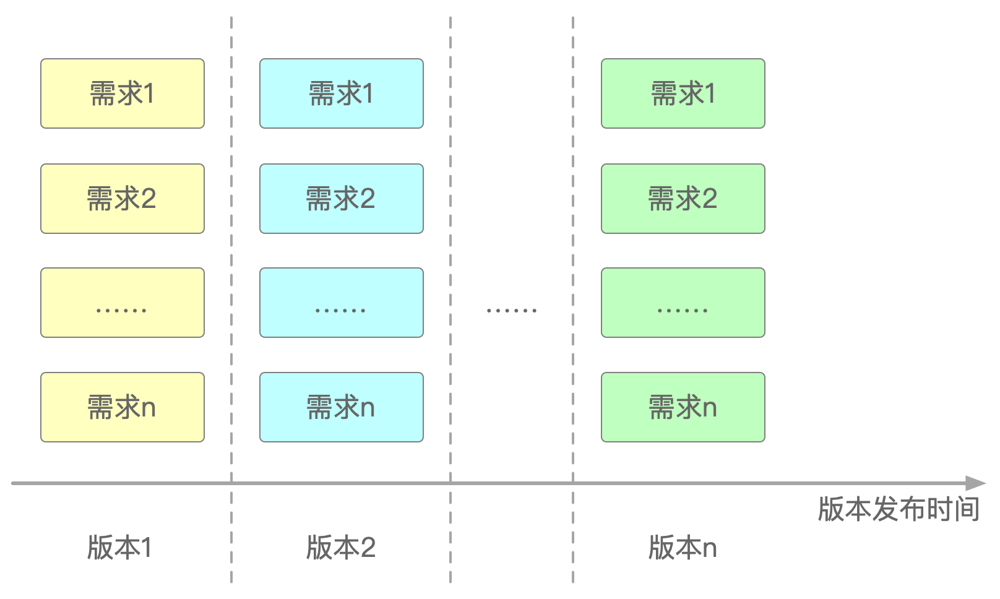

这种版本发布模式比较有利于一些靠收取软件维护和定制费用来挣钱的企业，例如一些开发ERP系统的企业和软件外包公司。只不过这种版本发布模式的交付周期较长，而且可能还没等到交付，需求就发生了变化，非常影响交付时间或质量。

当某个大型软件公司有多条产品线，且各个产品线之间还存在相互依赖关系的时候，为了能够使得这些产品能够协同发布，通常都会以周密的计划为每个产品线制定固定的发布周期。这就像每个班次的列车都有固定的发车时间一样，所以这种版本发布模式又叫“发布火车模式”。这种严格的时间限制是为了对齐所有产品线的各个开发阶段，让它们不至于“撞车”，否则一旦某个产品线的发布计划变更，将会导致所有其他产品线的开发、测试、部署和发布变更，例如，某个大型互联网公司既有电商业务，也有需要配合展示数据大屏系统，还有内部的日志系统需要协同参与统计。为了让这几个业务线能够互相配合工作，就需要事先制定好各自的开发计划，避免因为步调不一致导致无法正常工作，如图17-15所示。

> 图17-15 发布火车模式

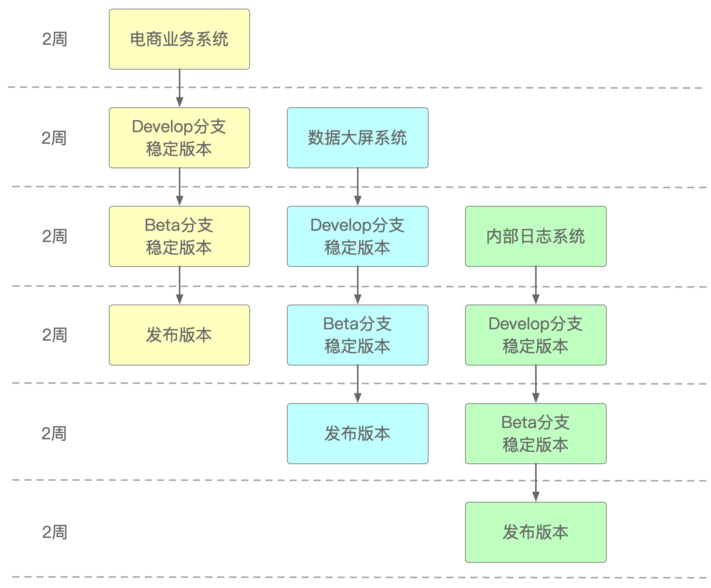

从上图可以看到，每一项业务的发布周期稳定在8周，后续如果有新的业务线需要协同开发，可以继续按照这种方式参与进来，这每一条业务线看起来就像车站中等着按固定时间周期发车的火车，所以发布火车模式由此得名。这种发布模式可以非常清晰地看到多个业务系统组成的事业群全貌，以及它们对应的交付时间点，有利于业务的大规模推广，但不利之处在于制定发布计划是一个非常正式和结构化的过程，无法灵活地响应需求的变化，对团队协同的要求非常高，工程师疲于奔命，哪怕有一个团队出岔子，都会导致整个事业群陷入混乱。

对于某些应用场景来说，其功能特性并不多，且需要能尽快上线，那么这种固定发布周期的火车模式就不太合适了。所以在此种情况下，就出现了火车模式的变种：城际快线模式。这种模式是以开发时间和软件质量为主，而忽略了功能特性，如图17-16所示。

> 图17-16 城际快线模式

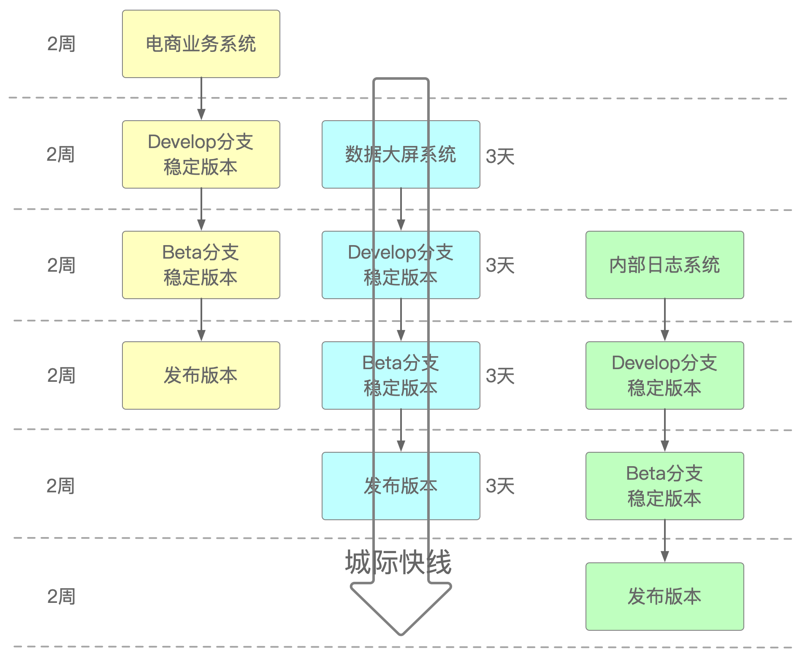

从上图可以看到，对于数据大屏应用来说，它的功能特性如果只是显示数据图表的话，完全不需要8周那么长的时间，而是以12天为发布周期，如果功能特性更少，那么在软件质量有保证的情况下，其发布周期还可以更短，甚至可以做到1天发布1次。这种极其迅速的发布动作几乎对其他发布火车没有什么负面影响，这好像也正应了那句：天下武功，唯快不破。这种发布模式非常适合互联网应用开发，包括一些实验性新特性的发布和测试，如果出错，继续快速发布新版本覆盖就好。当然，既然这种模式是继承自发布火车模式，那么它对团队内部的协同度和团队成员个人能力的要求也不低。

发布模式和分支策略之间并没有直接的关系，采用Git-Flow、Github-Flow或Gitlab-Flow都可以实现这三种模式，至于采取哪种分支策略配合发布模式，可以根据个人习惯、团队规模、业务架构和开发周期等综合因素来决定。

### 17.3 CMMI

1986年，美国国防部（United States Department of Defense，DoD）为了能够有效地评价软件承包商的能力，改进软件开发过程中的管理问题，能够按时且不超预算的开发出高质量的软件，从而发起并委托卡内基-梅隆大学（Carnegie-Mellon University，CMU）所属的软件工程学院（oftware Engineering Institute，SEI）找到这样一种可以有效衡量软件质量的方法，并由此产生了软件能力成熟度模型（Capability Maturity Model For Software，SW-CMM）框架。在SW-CMM诞生后的几十年里，它对全球的软件产业产生了非常深远的影响，并逐渐演变、发展出了现在的CMMI。可以毫不夸张地说，CMMI是目前世界上公认的最好的用于衡量软件能力成熟度集成的标准模型，也是一家软件企业走向成熟、走向正规化和国际化的必由之路。所以，笔者在这里单列一节来谈谈它。

#### 17.3.1 发展历程

自1986年SEI推出了SW-CMM框架之后，接着在1991年就发布了CMM V1.0。CMM V1.0推出后，不仅成为众多大型企业用于评估其软件质量的标准，而且也逐步应用到了产品开发、软件采购和软件工程上，由此形成了除SW-CMM以外的软件工程能力成熟度模型（Capability Maturity Model For Software Engineering，SE-CMM）、集成产品开发能力成熟度模型（Integrated Product Development Capability Maturity Model，IPD-CMM）和人力资源管理能力成熟度模型（Human Resources Management Capability Maturity Model，HRM-CMM）。

在1993年，继CMM V1.0之后，SEI又推出了CMM V1.1。到1997年又发布了CMM V2.0的草案，但该版本未得到广泛应用。在2000年时，SEI为了整合不同CMM版本中的一些优秀实践经验，减少现有CMM模型的重复性，降低实施的复杂性，同时也为了融合多个不同领域的能力成熟度模型，推出了CMMI V1.0，CMM V2.0是它的主要组成部分。与CMM相比，CMMI的覆盖领域更广，它不仅适用于软件领域，还适用于软件工程、软件采购和产品开发等多个领域。在2002年和2006年，SEI又分别发布了CMMI V1.1和CMMI V1.2。

到2011年，当SEI发布CMMI V1.3之后，CMMI研究院于2016年从SEI中剥离出来并入国际信息系统审计协会（ISACA），但继续保持独立运营状态。也正是自CMMI V1.3开始，产生了CMMI-DEV模型，即CMMI开发模型（CMMI for Development, CMMI-DEV）。CMMI-DEV V1.3继承了CMMI V1.3的框架，总的来说，它是CMMI的一个特定版本，类似于一个软件分支，专门针对软件和系统工程领域的开发过程。CMMI-DEV强调了在软件和系统开发生命周期中的最佳实践，旨在帮助组织提高其开发过程的成熟度，从而提高产品质量和开发效率。

2018年，CMMI研究院正式发布了CMMI V2.0版本，在从CMMI V1.3到CMMI V2.0之间的这七年时间内，敏捷过程、极限编程、看板方法、SAFe、LeSS等软件开发方法百花齐放，极大地丰富了CMMI框架中的内容。

表17-1总结了CMMI的发展历史及各版本变迁。

> 表17-1 CMMI的发展历史及各版本变迁

| 时间 | CMM | CMMI | CMMI-DEV |
|:---:|:---:|:---:|:---:|
| 1991 | CMM V1.0 |  |  |
| 1993 | CMM V1.1 |  |  |
| 1997 | CMM V2.0草案 |  |  |
| 2000 |  | CMMI V1.0 |  |
| 2002 |  | CMMI V1.1 |  |
| 2006 |  | CMMI V1.2 |  |
| 2011 |  | CMMI V1.3 | CMMI-DEV V1.3 |
| 2018 |  | CMMI V2.0 | CMMI-DEV V2.0 |

操作过数据库的工程师们对“视图”（View）并不陌生，它是一个虚拟的数据表，其内容由查询语句定义，具有简单、高效、逻辑独立和可定制等特性，而CMMI V2.0则借鉴了视图这一概念，除了演变出CMMI-DEV开发视图（Development View）之外，还有CMMI-SVC服务视图、CMMI-SPM供应商管理视图。

#### 17.3.2 衡量标准

作为一种软件质量衡量模型，CMMI根据不同的级别来评价一个组织的过程质量，只有实现了每个级别所规定的特定目标，通过了该目标所要求的实践过程，才算是达到了相应的等级。在CMMI研究院的官方网站中明确将CMMI的等级区分为两大类：能力等级和成熟度等级，其中能力等级又叫做连续式表示法，它表示组织在实施和控制某一软件过程及改善该过程绩效等方面所具备的能力；而成熟度等级又叫做阶段式表示法，表示的是组织自身的总体过程能力。

所谓能力等级，指的是组织在各个领域的绩效和过程改进成果。在实践域中，实践被划分为0到3级，它们提供了绩效改进的路线图，每个级别都需要满足一些新的功能要求，且构建在前一级别的基础之上，表17-2列出了不同的CMMI能力等级。

> 表17-2 同的CMMI能力等级

| 级别 | 名称 | 说明 |
|:---:|:---:|:---|
| 0 | 未完成级 | 过程不完整，某个实践过程没有得到执行或者只得到部分执行。过程域的一个或多个特定目标没有被实现。 这个级别就是目前大部分初创或管理混乱的软件公司的真实状态，项目延期或失败的风险极高，人浮于事，人员流动率居高不下，不仅缺乏短、中、长期目标，也更没有任何保障目标实现的过程机制。 |
| 1 | 初始级 | 有达成实践域的初步方法，但过程是无序且不可见的，有时甚至是混乱的。软件过程的定义几乎无章可循，类似于弥留之际的病人，时而清醒时而糊涂。软件产品所取得的成功往往依赖于个别人的努力和机遇，也就是靠侥幸成功——成功了不知道为什么成功，失败了也不知为什么失败。 |
| 2 | 已管理级 | 在这一级别上，有能够支持实践域的基础设施，其计划和执行可以按照组织既定的政策来完成，有基本的项目管理过程，权责到人，可以对成本、进度和风险进行跟踪和评估，制定了必要的过程纪律，能重复早先项目所取得的成功经验，这是大多数稍微正规一些的软件公司都可以达到的级别。 |
| 3 | 已定义级 | 在已定义级水平上，企业不仅仅有一整套的项目实施管理措施，保障项目的完成，而且还能够根据自身的特殊情况及标准流程，将这套管理体系与流程予以制度化。所有用于的软件过程均已文档化、标准化，并形成了整个组织所遵循的标准实践过程。 |

至于成熟度等级则代表了组织基于预定义实践域的绩效，以及流程改进工作的分阶段路径。在每个成熟度级别中，预定义的实践域也提供了一条性能改进的途径。每个成熟度级别都通过添加新的功能或严格性建立在以前的成熟度级别之上，表17-3列出了不同的CMMI成熟度等级。

> 表17-3 不同的CMMI成熟度等级

| 级别 | 名称 | 说明 |
|:---:|:---:|:---|
| 0 | 未完成级 | 同能力等级中的“未完成级”。 |
| 1 | 初始级 | 同能力等级中的“初始级”。 |
| 2 | 已管理级 | 同能力等级中的“已管理级”。 |
| 3 | 已定义级 | 同能力等级中的“已定义级”。 |
| 4 | 量化管理级 | 在这一级别上，组织非常重视分析软件过程和产品质量的详细度量数据，对软件过程和产品都有定量的理解与控制。依据客观结论实施管理，能够在定量的范围内预测性能。此时的组织是数据驱动的，具有清晰且具体的量化绩效改进目标，以满足内部和外部利益相关者的需求。 |
| 5 | 优化级 | 在量化管理的基础上，组织专注于持续改进，旨在调整和应对机遇和变化，且组织的稳定也为灵活性和创新提供了一个平台。这时候的组织充分利用量化反馈和先进的新思想、新技术促使过程持续不断改进，企业的项目管理达到了一个很高的水平，不仅能够通过信息手段来实现对项目的管控，而且能够充分利用信息资料，对企业在项目实施的过程中可能出现的次品予以预防。 |

能力等级域成熟度等级的的区别类似于一位武林高手所掌握的武学和他自身武力值高低的区别：如果他所会的某个武学很厉害，那么可以说他掌握的那个武学的“能力等级”很高；而如果他处于武林盟主的地位，那么就可以说他的“成熟度等级”已经到顶了。也就是说，如果组织选择成熟度等级，那么就会考量该组织所有核心项目的成熟度，来证明组织是否足够“成熟”，这属于全面考察；如果选择能力等级，那么就只需要衡量组织对某一个项目或某一类项目的管控能力，这属于局部考察，这也是为什么能力等级只有3级而成熟度等级却有5级的原因。

#### 17.3.3 过程与实践

通过能力等级和成熟度等级的划分，CMMI为评价软件的开发过程提供了一个有序的级别，它既可以让企业管理者清楚地知道当前企业所处的位置，也为组织的改进指明了方向。
除了这些清晰划分的等级，CMMI另一个重要的概念就是过程域（Process Area），所谓过程域就是当企业达到某个等级以后必须要解决的一些问题，或必须实现的目标。除了未完成级和初始级外，每个成熟度等级都有若干个过程域。由于CMMI的等级之间是循序渐进的且不可跳级，所以如果想达到某个等级，例如，如果要达成CMMI 3级，那么除了要满足CMMI 3级的全部过程域之外，还需要满足CMMI 2级的全部过程域。CMMI等级和过程域之间的对应关系如表17-4所示。

> 表17-4 CMMI成熟度等级和过程域的对应关系

| CMMI等级 | 过程域名称 | 过程域英文名称 | 过程类型 |
|:---:|:---:|:---:|:---:|
| 等级2已管理级 | 需求管理 | Requirements Management | 工程管理 |
|  | 项目计划 | Project Planning | 项目管理 |
|  | 项目监控 | Project Monitoring and Control | 项目管理 |
|  | 供应商协议管理 | Supplier Agreement Management | 项目管理 |
|  | 度量分析 | Measurement and Analysis | 支持管理 |
|  | 过程和产品质量保证 | Process and Product Quality Assurance | 支持管理 |
|  | 配置管理 | Configuration Management | 支持管理 |
| 等级3已定义级 | 需求开发 | Requirements Development | 工程管理 |
|  | 技术方案 | Technical Solution | 工程管理 |
|  | 产品集成 | Product Integration | 工程管理 |
|  | 验证 | Verification | 工程管理 |
|  | 确认 | Vaildation | 工程管理 |
|  | 组织过程焦点 | Organizational Process Focus | 组织管理 |
|  | 组织过程定义 | Organizational Process Definition | 组织管理 |
|  | 组织培训 | Organizational Training | 组织管理 |
|  | 集成化项目管理 | Integrated Project Management | 项目管理 |
|  | 风险管理 | Risk Management | 项目管理 |
|  | 决策分析与解决方案 | Decision Analysis and Resolution | 支持管理 |
| 等级4量化管理级 | 组织过程绩效 | Organizational Process Performance | 组织管理 |
|  | 定量项目管理 | Quantitative Project Management | 项目管理 |
| 等级5优化级 | 组织革新与推广 | Organizational Innovation and Deployment | 组织管理 |
|  | 原因分析与解决方案 | Causal Analysis and Resolution | 支持管理 |

在表17-4中一共出现了四种过程域的类型，分别是：

1. 组织过程（Organizational Process）：它关注的是如何建立和维护组织级别的过程，以支持项目和工作的有效执行；
2. 项目管理（Project Management）：它关注的是如何规划、监控和控制项目活动，以确保项目能够按计划、预算和质量要求顺利完成；
3. 工程（Engineering）：它关注的是如何开发和维护产品或服务的技术方面；
4. 支持（Support）：它关注如何为项目和组织提供所需的支持和资源，以确保项目和工作能够顺利进行。

这每一个过程域当中都包含着一系列的最佳实践，用于指导组织在不同的过程中提升其能力成熟度，而每一个实践都描述了一种有效的做法或方法，所以过程域又叫实践域。虽然在CMMI V2.0中已经将过程域改为了实践域，但其简写仍然是PA（Process改为Practice）。

CMMI V1.3中有22个过程域，而到CMMI V2.0则变成了20个实践域。有些实践域保留了原来的名字如CAR、CM、DAR等；有些实践域对名字做了微调，如MC、PLAN、PAD等；有些实践域则是新增或者剥离出来的，如EST、PR、GOV、II等；有些实践域则是由原来的多个PA合并形成，如MPM、RDM、VV等，CMMI V2.0的20个实践域如图17-17所示。

> 图17-17 CMMI V2.0的20个实践域

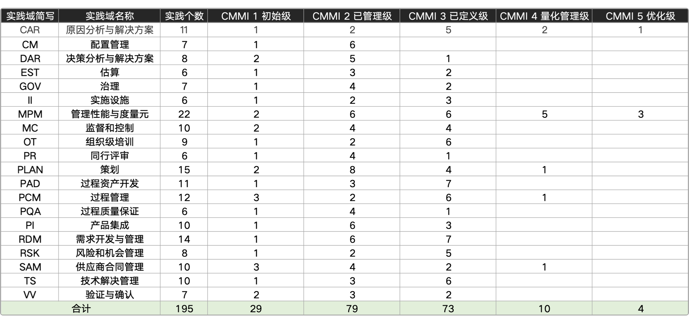

#### 17.3.4 认证流程

CMMI作为业界久负盛名的能力成熟度模型，通过CMMI认证就如同成人礼一样：对内，可以降低开发和维护成本，提高资源利用率，增强员工对组织的信心，提高员工工作积极性和满意度，进而提高组织的过程能力和成熟度，从而改进产品质量和组织绩效；对外，可以增强组织在市场上的竞争力，向客户和合作伙伴展示高水平的过程管理能力和质量保证能力，获得业界的青睐。

虽然通过CMMI认证的好处很多，但也不可能一口气吃个大胖子，例如从0级直接跳到5级。任何企业申请CMMI认证时，一方面要清楚组织现有的质量体系、实施过程、实施效果的运行情况；另一方面，要根据企业规模、公司实力、管理需求等综合要素选择合适的认证级别。一般情况下，企业可以选择从CMMI2开始逐步申请各级认证。图17-18显示了各个不同级别CMMI认证的差别。

> 图17-18 CMMI各级认证之间的差别

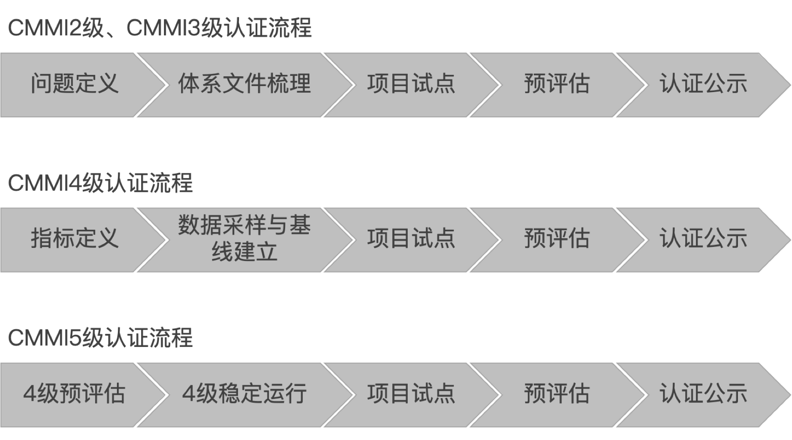

注意：图17-20中所示的流程只是CMMI认证的主体流程，至于具体流程及细节部分则会因为企业所聘请的CMMI实施顾问的不同而不同。

从试点开始，所有级别的CMMI认证过程都一样，差别只在于试点开始前的部分。

对于实施CMMI2级或CMMI3级认证，首先要通过专业的CMMI咨询公司并组建认证评估小组，然后了解企业现阶段的软件开发过程水平和CMMI所要求的过程实践之间的差异，据此找到需要解决的问题并制定相应的改进方案，并在此之上建立符合企业实际需求或企业缺乏的体系文件。在建立起了完善的流程体系及相关输出文档后，再通过某一项目进行试点，拿到具体的流程数据和文档输出，对照是否符合CMMI实践的要求，如符合要求则会在开始公示的同时向CMMI研究院提交认证申请。在笔者的职业生涯里，曾以PPQA（Process and Product Quality Assurance，过程和产品质量保证实践域，CMMI认证中参与执行的角色有些是以过程域或实践域来命名的）的身份有幸参与过一次完整的CMMI3级认证，其中工作量最大的部分就是体系文件的梳理，需要根据企业实际情况进行适当裁剪或修改，然后找所有相关人员以会议、访谈、工作追踪等方式逐一完成。当获得所需的体系文件后再拿到实际项目中进行检验，且所有的文件都需要逻辑自洽，文件之间还要能互为印证，形成一个完整的逻辑闭环才算有效。

对于CMMI4级和CMMI5级认证，除了要具备CMMI3级所有体系文件、流程之外，还需要设定合适的过程指标，如过程绩效指标（流程符合度、成本效益指标等）、产品质量指标（如缺陷率）、项目管理指标（风险管理指标、项目进度指标）和资源管理指标（如资源利用率等），再将这些基线与实际执行情况相对照，据此决定是否通过认证。

CMMI认证要求统一采用标准的SCAMPI（Standard CMMI Appraisal Method for Process Improvement）评估方法，它包括A、B、C三种级别，其严格性从高到低。但不管哪一种方法，认证过程都是大同小异。

### 17.4 本章小结

对于软件工程师来说，个人独立开发和团队协同开发是两个完全不同的概念，除了源代码托管的方式不同外，最重要的就是要选择一种适合团队共同开发过程（或流程），否则只会是“三个和尚没水吃”。

为了能更好更高效地从事大型软件系统的开发，温斯顿·沃克·罗伊斯（Winston Walker Royce）博士首次提出了瀑布模型，以及所能采取的几种不同的项目管理模式。瀑布模型为那些需求极为固定、功能异常复杂且颇具工程化特色的产业作出了巨大的贡献，例如航空航天、化工电子、能源交通和金融保险。它遵循传统的软件开发生命周期，将整个软件开发过程划分为问题定义、需求分析、软件设计、功能编码、系统测试和部署维护等若干阶段，采取分而治之的策略逐一实现。但瀑布模型缺点也很明显，它是线性的，而且对于需求的频繁变更无能为力，只能按照既定的流程往前推进，无法回头。

为了改变瀑布模式这种僵化的过程形态，1998年，由Rational Software公司提出了名称为RUP（Rational Unified Process）的软件研发过程。RUP创造性地将软件开发过程划分为四个迭代周期，在每个迭代周期中都遵循瀑布模型，并涵盖了RUP的九个核心流程：业务建模、需求、分析设计、实现、测试、部署、配置和变更管理、项目管理和环境。RUP以用例为驱动，以软件的架构设计为核心，采取迭代式增量的开发，以渐进的方式实现软件的各种功能。不过即便如此，RUP仍然太重了，无法适应互联网时代“拥抱变化”和“小步快跑”的开发节奏，而且它所要求的诸多交付件也给开发人员造成了一定的拖累。

自瀑布模型和RUP之后，也陆续有很多相对“轻量级”的软件开发方法出现，但最终它们被整合进了2001年诞生的《敏捷软件开发宣言》和《敏捷软件的十二条原则》之中。作为一种集大成的轻量级软件开发过程，敏捷方法追求的是灵活地应对需求变化、持续给客户交付可用的软件、紧密的协作和持续反馈等软件开发方式。敏捷Agile代表的只是一种理念，实现的它具体方法则是Scrum。Scrum通过5种价值观、3大角色、3个工件和5类事件让团队以灵活、高效、更能让客户满意的方式开发出适合于互联网时代的应用。除了Scrum，实践Agile理念的方法还有极限编程、敏捷看板、用户故事、用户故事地图、最小可行产品、产品原型和测试驱动开发等。结合敏捷开发和分支策略，就产生了三种不同的软件发布模式：项目发布模式、发布火车模式和城际快线模式。项目发布模式适合于传统软件企业，发布火车模式则适用于有众多产品线的大型软件公司，而城际快线模式就非常适用于初创公司或新产品的快速开发。

除了软件开发过程，产业界为了提高软件质量，还从软件开发企业这类组织本身着手，制定了软件能力成熟度模型（Capability Maturity Model For Software，SW-CMM）框架。在经过若干版本的演变之后，造就了今天业界最为知名的CMMI。CMMI通过能力等级和成熟度等级分别来衡量组织的项目能力和组织的整体能力，同时为不同的等级划分出了不同的过程域（自CMMI V2.0以后过程域被改名为实践域），每个过程域或实践域又对应着一系列的不同实践，不同的认证等级需要完成不同的实践。CMMI的认证一般从CMMI 2级开始逐级往上，而且不能跳级认证。对于CMMI2级或CMMI3级来说，其主要工作在于定义问题和梳理体系文件，以及这些内容之间的相互印证上。而CMMI4级由于是量化管理，所以需要完成数据采样及基线设置工作，然后再印证组织的各项能力是否满足这些基线指标。

### 17.5 本章练习

1.在您所经历的软件项目中，有哪些是通过RUP过程开发出来的？都有哪些核心流程和工件？

2.您曾经开发或正在开发的项目有用到敏捷开发过程吗？如果有，请用文档描述相关的用户故事、冲刺计划、冲刺、迭代周期及冲刺回顾。

3.您所在公司的软件项目适合哪种版本发布模式？为什么？
