## 第18章 开源知多少

开源软件的诞生可以追溯到20世纪60年代和70年代的计算机发展历史。当时，计算机科学家和爱好者们开始共享他们的软件代码，这种分享和合作的精神逐渐演变成了开源软件的概念。其中，一个具有里程碑意义的事件是1970年代贝尔实验室（Bell Labs）的Unix操作系统。Unix的源代码最初是公开的，这使得许多人都可以查看、修改和分享它，从而促进了软件开发的合作和创新。

在1980年代，自由软件基金会（Free Software Foundation，FSF）成立，由理查德·斯托曼（Richard Stallman）领导，推动了自由软件运动。该运动强调用户对软件的自由使用、研究、修改和分发，这种理念后来成为了开源软件运动的基础。

虽然大多数人都知道开源软件与自由软件，但“开源”与“自由”的区别还是挺大的，本章就开源中所涉及到的开发模式、开放标准与许可证问题展开论述。

### 18.1 什么是开源

开源是一种分散的生产模式，因其源代码设计成可公开访问，所以它允许任何人发布、修改和共享。今天，开源则指的是基于自由信息交换、快速原型设计和协作开发原则的具有更广泛意义的内涵，任何人都可以在开源中贡献新想法，新技术，促进整个生态有机发展。

#### 18.1.1 发展阶段

从自由软件到开源软件再到开源社区，“开源”的发展历史经历了这么几个阶段：

以C语言及其编写的Unix操作系统的诞生为开源软件发展的第一个阶段。在ARPANET问世的1969年，美国电话电报公司（AT&T）所属贝尔实验室的计算机科学家肯·汤普逊（Ken Thompson）借鉴曾参与Multics开发的经验，用汇编语言设计和实现了Unix操作系统。同一年，肯·汤普逊的同事丹尼斯·里奇（Dennis Ritchie）发明了更为高级、可移植性强且简单好用的C语言，在工程师文化和极客精神的驱动下，他俩把原来用汇编语言写的Unix用C语言又写了一遍。新诞生的Unix自然也继承了C语言的优良特性，也助长了黑客文化的流行。于是，在黑客们的推动下，Unix声名鹊起。Unix之所以被认为是开源文化诞生的温床，正是由于它后来的商业化所导致的。这是因为Unix高昂的商业许可费用、对开发者严格的限制让人们不得不遍寻替代品，这就间接促使了开发者社区的自发形成：一些开发者自发地组建志同道合者，共同开发和维护开源的Unix系统，如GUN项目和Linux内核。由于Unix本身就是在开放和合作的精神下诞生的，因此这种精神一经与开发者社区相结合，就立即得到了广大工程师们的鼎力支持，进而推动了开源运动的发展。

从Unix商业化所导致的自由软件的出现，标识着开源文化的发展进入了第二个阶段。当AT&T在1984年宣布解散时，美国麻省理工学院（MIT）人工智能实验室（AI Lab）的理查德·斯托曼（Richard Stallman）认为人们天生就应该可以自由使用各种软件，坚决反对研究成果的商业化，对当时大量软件通过版权而与金钱挂钩的现象深恶痛绝。于是他在同年发起了“自由软件运动计划”，这一计划的核心理念是用户对软件的自由使用、研究、修改和再分发，主张软件应该尊重用户的自由和隐私，不应该限制用户对软件的控制权。自由软件运动计划有三个重要的组成部分，一是GNU项目，这是自由软件运动计划的主要项目，GNU是“GNU'S Not Unix”的首字母的递归缩写，而GUN本身的英文意思是非洲的一种角马或牛羚，如图18-1所示。

> 图18-01 “GNU's Not Unix”只是在声明牛羚不是Unix

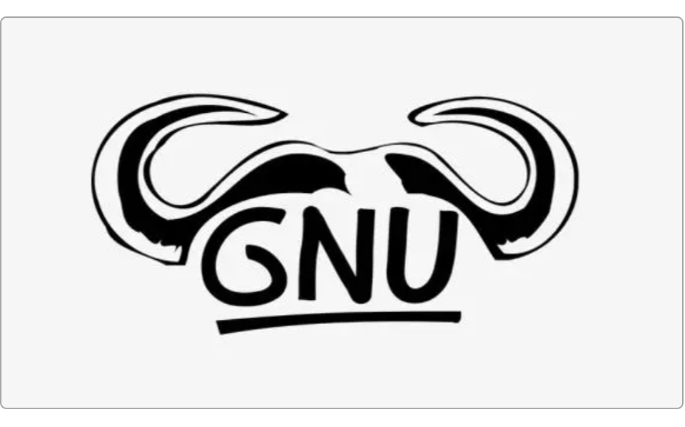

因为GNU的设计类似于Unix，但却不包含具著作权的Unix代码，因此理查德·斯托曼将GNU视为“达成社会目的技术方法”，并给GUN项目一口气编写了GNU Emacs、GNU GCC、GNU GDB和GNU Make四个至今仍在使用的自由软件。在之后的1985年，理查德·斯托曼成立了自由软件基金会，用来筹集资金支持自由软件运动计划，并于同年9月发表了《GNU宣言》（《GNU Manifesto》）向世界宣告自由软件运动计划的正式诞生。而在GNU项目的影响下，自由软件不断涌现，为了保护工程师们的劳动成果，理查德·斯托曼聘请律师Eben Moglen设计了一套自由软件成果的方法，这也就是现在著名的GNU GPL版权协议。GNU GPL创造性地提出了“反版权”和“版权属于”等概念。

到1989年，那时还是大学生的Linus Torvalds借鉴Unix而开发了其新的变种，直到1991年第一个Linux内核版本公开在网上发布，Linus称之为Linux（Linus's Unix）。1992年，Linux宣布遵循GPL规则加入GNU项目，于是Linux就被称作GNU/Linux。从此以后，Linux成为了开源软件迅猛发展的基石，这一点从Linux众多的徒子徒孙们就可以看出来，如图18-2所示。

> 图18-02 基于Linux的发行版本

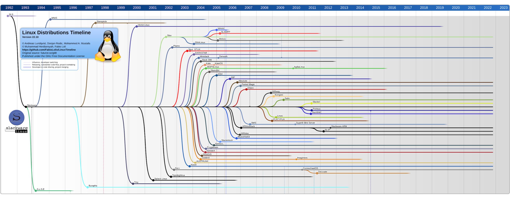

上图中的每一条细线都是一个基于Linux的发行版，而这些“子孙们”仅仅还是只自Linux诞生以来的一小部分。因此Linux的问世也成为开源文化发展的第三个标识性阶段。

与Stallman极其厌恶商业化软件形成对照的是，多数自由软件开发者还是比较温和的，并没有走向那种非此即彼的极端，他们开始聚集在一起探讨如何让自由软件能够更进一步地得到发展。1997年，美国程序员埃里克·史蒂芬·雷蒙（Eric Steven Raymond）写了一本名为《大教堂与市集》（《The Cathedral & the Bazaar》）一书，首次提出了“开放源代码软件”（Open Source Software）这个概念，并专门对这种开源软件的商业模式加以描述和讨论。雷蒙并没有过于强调所谓的自由软件的“道义”，而是觉得自由软件并非要完全替代商业软件，而应该是商业软件的一个很好的补充，它们共同合作可以产生更好的结果。在之后的1988年，布鲁斯·佩伦斯（Bruce Perens）和雷蒙等人为了尽可能的统一开源软件这一概念，发起并设立了“开放源代码首创行动组织”（Open Source Initiative Association, OSIA），同时将“Open Source”注册为了认证商标，这也是至今为止，开源精神发展的第四个阶段。

#### 18.1.2 开发模式

在埃里克·史蒂芬·雷蒙写的《大教堂与市集》一书里，提到过两种不同的软件开发模式，一是“司令官模式”（The Cathedral Model），另一个就是“大教堂模式”（The Bazaar Model）。

所谓“司令官模式”，指的是由少数精英开发人员或团队在相对封闭的环境中进行开发，这种模式计划性和设计性非常强，开发过程中更多的是服从而非参与。软件的发布周期一般都会比较长，且非常注重稳定性和可靠性。这种模式其实指的就是商业软件开发的过程，那些官僚气息很浓的大型软件公司的应用软件开发过程尤为如此，例如Windows操作系统的开发过程正是典型的“司令官模式”，如图18-3所示。

> 图18-03 司令官模式

与司令官模式不同，大教堂模式有点类似于夜市上自由摆摊，其开发过程完全是开放和民主的，许多人参与其中，他们不是以命令和服从为基础，而是以兴趣和责任为纽带，每个人都可以充分地施展能力，只为发现不足、提出建议、贡献代码，让软件变得更好更完美。在这种开发模式下，发布周期不固定，有时较短而有时也很长，它更注重的是软件质量和用户反馈。Linux操作系统的成百上千的衍生版本就是这么产生的，如图18-4所示。

> 图18-04 大教堂模式

这两种模式没有好坏之分，它们分别代表了软件开发中两种不同的哲学和方法论。司令官模式强调中央控制和严格规划，适用于一些大型、复杂且需要投入大量人力物力的软件项目，没有这种集中式的强力管控，那些可以造福国计民生的大型应用系统就不可能出现；而大教堂模式则强调开放、民主和快速迭代，适用于需要快速响应和灵活性的项目，没有这种灵活和开放，软件行业也不可能有如此迅猛的发展势头。

#### 18.1.3 开放标准

开源软件虽然摆脱了商业化的桎梏，但也并不说它就可以为所欲为，完全不受约束。俗话说“人生而自由，却无往不在枷锁之中”——“自律即自由”。例如，开源软件有其专门的版权与许可，如果违反这些软件开发者或团队的禁制，一样会吃官司。反过来，开源软件也会受到公众的监督，例如开放源代码促进会（Open Source Initiative，OSI）就是这样一个全球性的非营利组织，致力于教育和引导全世界所有的开源软件遵守那些需要“自律”的标准。OSI作为一家标准制定机构，它负责管理和维护对于“开源”的定义，也就是使用任何开源软件的“合法”条件，这些条件包括但不限于：免费再分发、可运行的程序必须包含源代码一同发布、源代码必须完整且可构建出同样的执行程序、软件衍生品也必须允许修改、开源许可不得歧视任何个人或群体、不得限制任何人在特定领域使用程序、程序附带的权利无需获得新的额外的许可、许可证不能指定应用于特定的产品、许可证不得限制与许可软件一起分发的其他软件、许可证必须是技术中立的等。

这些就是开源软件需要遵守的开放标准，它是编写特定类型的源代码的规则、指南和规范，而非代码本身，没有它就没有技术的一致性和互操作性。例如，如果没有允许所有类型的计算机连接到所有类型的无线路由器这样的开放标准，那么可以想像上网会有多么地不方便。

同样，既然开源软件如此“自律”，那么它必定也需要使用它的人同样“自律”，这就涉及到了开源软件的版权与许可。

### 18.2 版权与许可

版权（Copyright）也称为著作权，用来表述创作者因其创建的作品而自动享有的权利。版权的取得有两种方式：自动取得和登记取得。按照我国著作权法的规定，作品完成就自动拥有版权。简单来说，版权就是谁创造了作品谁就享有相应的权利，但具体享有哪些权利，需要参照当地当时的法律解释。

而许可（License）则是作者按照自己的想法进一步界定使用者权利的手段，它是建立在版权的基础上的。

#### 18.2.1 版权

以Tomcat为例，在其每一个版本发布的源代码文件中总会包含这样一份NOTICE件，如图18-5所示。

> 图18-05 Tomcat源代码文件中包含的NOTICE

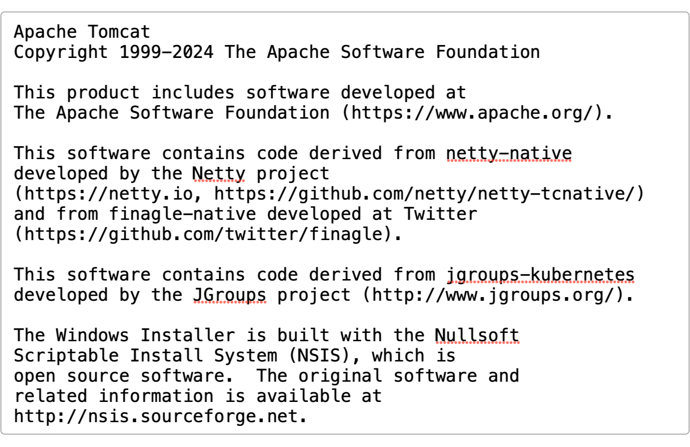

其中的“Copyright 1999-2024 The Apache Software Foundation”就是版权声明，这里指的是Apache软基金会拥有Tomcat文件源码的版权。

版权是指拥有使用、授权、出售著作物等的权利，版权制度的由来与印刷术的发明密切相关。在15世纪中期的欧洲，印刷术的出现导致盗版现象飙升，为了保护印刷商的利益，各个欧洲国家政府开始实行“印刷特许权”制度。例如，在意大利，一些王国最早规定了印刷特许权制度，允许在某个期限内独家印刷某些书籍或发行出版物。随着工业革命的到来，印刷技术逐渐发展，作品的创作和扩散得到了保证，为了保证创作者的权益，各国相继出台了版权法。例如，在1710年，英国通过了世界上第一部版权法，即《安娜法令》，将版权的保护范围从印刷商扩展到了作者，禁止印刷商不经作者同意擅自印刷、出版和发行书籍。同时，该法规定版权的有效保护期为28年。慢慢地，这种对创作者权益的保护也扩展到了软件领域，类似Tomcat这样的版权声明最早是美国的版权法律要求添加的，后来随着《保护文学和艺术作品的伯尔尼公约》的出现，对一切文学、科学和艺术领域内的成果的版权保护体系逐渐完善，它赋予创作者对其作品自动拥有版权，并不需要特别声明，除非创作者向相关机构申请或公开声明放弃自己的权利。

为了让使用者可以方便地与创作者联系，避免侵权事件，在公开发行的文件中添加版权声明是必需的。通常情况下，与“版权声明”一起发布的还有“许可限制协议”和“免责声明”。通过“版权声明”、“许可限制协议”和“免责声明”的组合，就能让使用者知道：

1. 谁拥有版权；
2. 使用者在使用时可以有哪些权利，要受哪些限制；
3. 如果使用后出现问题或者纠纷那么作者概不负责，用不用自己看着办。

在版权的保护措施上，商业化软件和开源软件其实是一样的，只不过不同的是，在以Windows为代表的传统软件中，版权保护的是软件厂商基于封闭源代码而获得的垄断利益；而在以Linux为代表的开源软件中，则是通过通过开放源代码的形式，在软件开发者和用户之间取得利益上的平衡。

#### 18.2.2 许可证

版权属于创作者所有，但当创作者将使用权授予给使用者时，就成为了许可证，这是对使用者权利和义务进行约束的协议。开源软件众多，许可证也就五花八门，所以有必要了解一下它们。例如，有哪些许可证之间是兼容的？哪些许可证之间又是相悖的？采用了开源的源代码后如何避免不必要的官司等。

目前，GNU官方将开源许可证分为三大类：软件许可证、文档许可证和其他作品许可证，如图18-6所示。

> 图18-06 三大类许可证

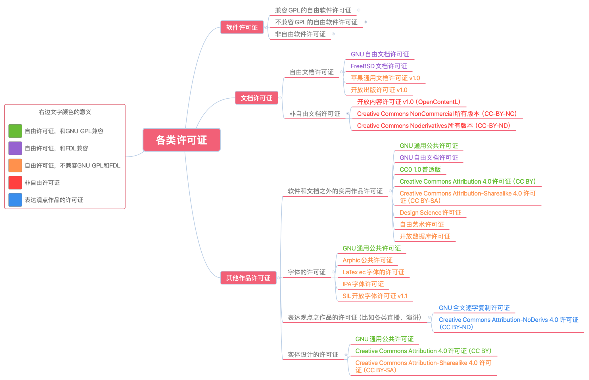

因为各类软件许可证实在太多，不便展开，读者可以在本章所附带的脑图资源中查看。

在这些许可证中，有几类极为常见，例如GPL、LGPL、Apache、BSD、MIT、Mozilla等，因此有必要将它们详细介绍一下。但在了解它们之前，先得搞明白一些与开源许可相关概念的含义。

首先要明白的就是“引用”、“修改”和“衍生品”的含义。所谓“引用”指的是不直接使用源代码中的文件，而是将它作为一个第三方的依赖库来进行引用，这种方式有时也称为“链接”（Link）。例如，Java开发中经常通过Maven引入的第三方依赖就是典型的“引用”。而“修改”则是直接对源代码文件进行修改，修改完后再重新编译打包使用，这其实就是工程师们常干的“二次开发”工作。“衍生品”指的是通过“引用”或“修改”的方式所生成的最终产品。例如，或者通过SpringBoot框架，或者通过AppFuse平台进行二次开发，或者两者兼而有之，李星云开发出了电商网站应用，那么这个电商网站就是一个典型的“衍生品”。

其次是“公共域”（Public Domain）和开源的区别。所谓公共域就是属于所有人共同拥有的软件、文档、设计等作品，这样的软件、文档、设计作品任何人都可以不受任何限制地修改、使用和发布。也就是说，如果某个软件、文档、设计等作品一旦被声明为公共域，那么它就等同于是没有了所有者的“孤儿”，将不会再受到任何法律的保护了，即使是宪法也不行。开源则强调的是修改的自由而并非没有限制的自由，使用者可以拷贝、修改、发布，但也同时要履行享受这些权利时所附带的义务。

再就是Copyright和Copyleft的区别。Copyright即版权，是商业化的知识产权所独有的，之前已经说过了。而Copyleft则是版权归创作者所有，但其他一切权利则归属于使用者，使用者和创作者享有除版权外的全部权利，唯一不许可的就是任何人不能将之据为己有，甚至闭源。例如，李星云下载了SpringBoot的源代码并修改、编译之后重新将它命名为SpringRoot，然后宣布SpringRoot具有了Copyright，这是严重违反开源精神和协议的，这种行为必定会吃官司。

然后就是所谓的“传染性”，它指的是某个开源协议要求基于其开源代码的“引用”或“修改”后的“衍生品”也必须采用该协议发布，开放源代码。开源协议的这个特点很像病毒一样从一个工程师传染到另一工程师，从一个项目传染到另一个项目，所以这种特性也被称为“传染性”。

清楚了以上概念后，就可以接着来了解了解那些常见的开源协议了。

#### 18.2.3 GPL

由FSF（自由软件基金会）发布的GPL（GNU General Public License，GNU通用公共许可证，简称GPL），是目前世界上流行最为广泛的开源许可证之一，它与传统的商业许可证有着本质上的区别：商业许可证允许只用户在其指定的计算机中运行软件的可执行副本（注意，是只提供副本，即拷贝，而非源代码，也绝不会给用户提供源代码，且副本的数量还有限制，典型的例子就是Windows或Oracle），而没有复制、修改和重新发布软件的权利。

而GPL却允许用户自由地复制、修改和发布软件的源代码，这当然也包括通过源代码编译出来的可执行程序。为此，GPL采取两项措施来保证用户的权利：

1. 通过最基础的版权来保护软件不受恣意甚至恶意地复制、修改和发布；
2. 给使用者提供许可证，让其能继续“传染”其他想要复制、修改和发布软件的使用者。

一个完全自由的软件通常都是在不支付任何费用的情况下获得的，这使得软件的开发者并未从其创作上得到哪怕一分钱的好处，如果这些软件的使用者在使用软件时发生一些意外事故或产生连带责任，那么软件创作者也将无力处理（主要是没挣到钱）相关的担保费用。因此，GPL专门声明软件创作者不承担任何担保责任，来借此使软件创作者免于陷入任何麻烦的官司或纠纷。

GPL存在两个维度的“传染”：横向和纵向，如图18-7所示。

> 图18-07 GPL的“传染”方式

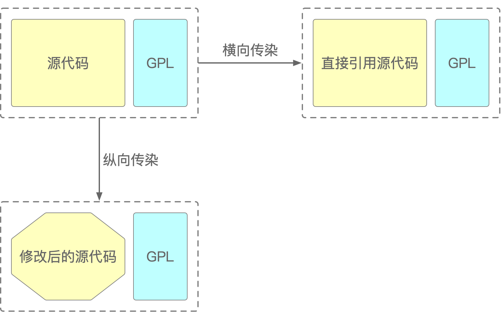

所谓“横向传染”是指直接引用部分或全部源代码而不修改其内容，例如直接引用第三方依赖，而“纵向传染”是指修改了源代码后产生了新的版本。GPL到目前为止发布了三个不同的版本，分别是发布于1989年的GPL v1.0、发布于1991年的GPL v2.0和发布于2007年的GPL v3.0，它们之间的区别如图18-8所示。

> 图18-08 不同的GPL版本间的区别

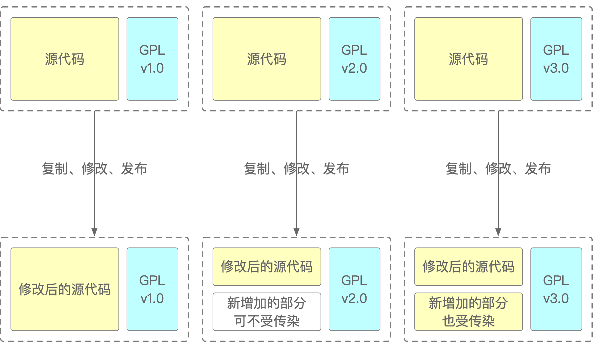

看起来GPL v1.0和GPL v3.0的区别不大，主要是增加了对GPL v2.0中新增独立部分的保护。但其实细看起来差别还是比较大的：

1. 反向兼容性：GPL v3.0不向后兼容GPL v1.0。这意味着使用GPL v1.0许可的代码不能直接与使用GPL v3.0许可的代码混合使用，除非明确允许；但是，使用GPL v3.0许可的代码可以与使用GPL v1.0许可的代码混合，因为GPL v3.0包含了对GPL v1.0的兼容性条款；
2. 专利授权：GPL v3.0包含了专利的授权条款，这些条款旨在确保用户在遵守许可证的同时不会受到软件专利的侵犯，而GPL v1.0没有；
3. 数字版权管理（DRM）：GPL v3.0包含了对数字版权管理系统（DRM）的限制。这意味着使用GPL v3.0许可的软件不能受到限制，以阻止用户复制、修改或重新发布软件，而GPL v1.0没有；
4. 全球适用性：GPL v3.0更加明确地适用于全球范围内的法律体系，而不仅仅是美国法律，而GPL v1.0没有；
5. 附加条款：GPL v3.0包含了一些额外的条款，如对硬件的使用方式有所限制，而GPL v1.0没有。

用一句简单的话来概括GPL的作用就是：如果不太了解开源，也不想花额外精力去了解，那默认选择GPL许可证就好了，它能最大限度保护创作者和开源社区的利益，不用担心某个人靠您的代码赚了大钱却不分享您的代码，因为它就是为干这个事而生的。

#### 18.2.4 LGPL

LGPL是GNU Lesser General Public License的简称，即“GNU宽通用公共许可证”（在GNU官方和很多技术资料中都将它翻译为“宽通用公共许可证”，但“Lesser”的中文意思明显是“次要的，较小的”），它也是由FSF发布的自由软件许可证之一。迄今为止已发布了三个版本，分别是1991年发布的LGPL v2.0、1999年发布的LGPL v2.1和2007年发布的LGPL v3.0。

LGPL第一版的版本号就是2.0，即LGPL v2.0，这是为了和同为1991年发布的GPL v2.0保持一致，而且那时LGPL的第一个字母“L”也不是“Lesser”，而是“Library”，它的出现正是为了弥补GPL灵活性上的不足：LGPL允许将持有LGPL许可证的库（Library）或框架（Framework）链接（Link）到一个没有LGPL许可证的应用程序中，而不需要将该程序的整体代码都以LGPL发布，这就使得开发者可以在某些时候方便地使用LGPL许可的库或框架代码，而不会被要求公开整个应用程序的代码，这在大多数的C/C++语言开发和移动端应用开发中尤其有用，例如，某位Android开发者基于Android底层的Framework开发出了某个受欢迎的应用，但却不想公开其源代码的话，那么就可以在他想开源的时候使用LGPL许可证，防止敏感的代码被公开，如图18-9所示。

> 图18-09 LGPL许可证

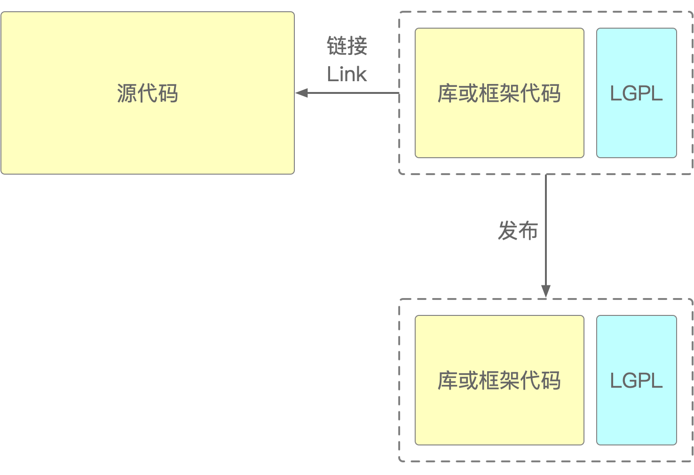

但LGPL也有一个例外情况，那就是如果开发者对某个有LGPL许可证的库做了修改，那么所有这些修改就必须以LGPL或者兼容它的许可证来发布。而且，如果在修改后的库中包含了任何来自原始LGPL库的代码，那么所有修改的代码及其衍生品都必须以LGPL许可证发布，如图18-10所示。

> 图18-10 修改持有LGPL许可证库代码后的情形

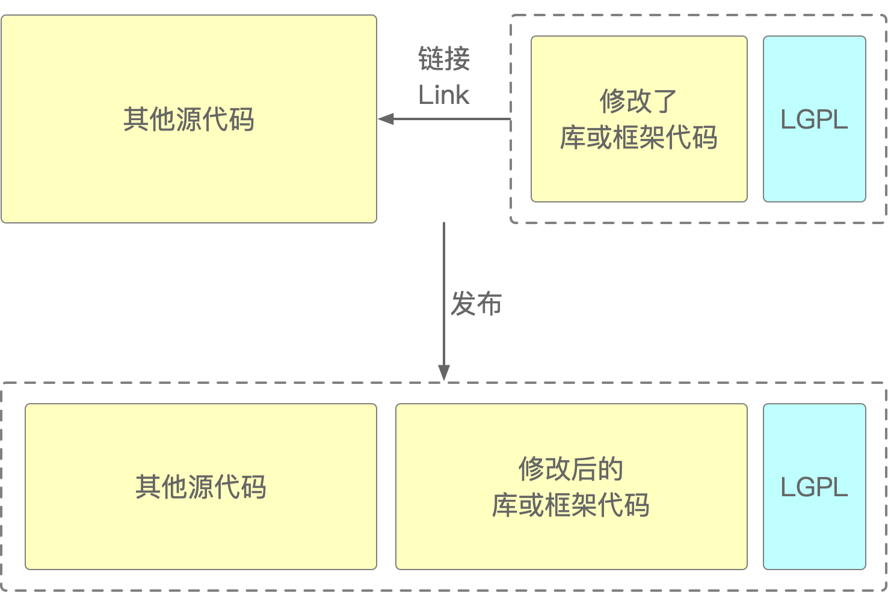

到了LGPL v2.1的时候，首字母“L”就变成了“Lesser”的首字母“L”。这几个版本之间的区别如同GPL不同版本之间的区别一样，高版本的协议涵盖面更广，而且也具有反向兼容性：LGPL v3.0同样不向后兼容LGPL v2.1，这意味着使用LGPL v2.1许可证的代码不能直接与使用LGPL v3.0许可证的代码混合使用，除非明确允许。

从GPL到LGPL不知道算不算开源的进步，但在灵活性上肯定是诚意满满了。

另外吐槽一下，笔者每次看“LGPL”的时候总会先把它看成“太古时期”神话云集的“LGD”（“老干爹”战队，虽然有点莫名其妙，但还是很怀念），最后才认全“LGPL”这四个字母。

#### 18.2.5 MPL

MPL是Mozilla Public License的简称，即Mozilla公共许可证，该许可证由Mozilla基金会而不是FSF开发并维护（所有者和前面两个“PL”不同了）。Mozilla是网景（Netscape）公司的一款浏览器，它完全是一款商业软件，但当微软的Internet Explorer崛起之后，它迅速衰落下去，导致网景公司陷入困境。由于网景公司的律师温妮费德·米切尔·贝克（Winifred Mitchell Baker）受到雷蒙写的《大教堂与市集》一书的启发，希望以一种全新的开放源代码的商业策略与微软的IE进行竞争，干脆就在1998年1月开放了Mozilla的源代码，这就是最初的MPL v1.0版本。

这中间还闹了一个小插曲：网景公司自作聪明，为了提升知名度但又不想公开真正的源代码，他们写了一个后来有争议的公共许可证，叫做Netscape公共许可证（Netscape Public License，NPL），其中有一条是允许使用方的源代码以专有的方式（也就是商业许可）重新用NPL许可出来，但网景公司却只接受可以改变许可方式的第三方源代码。这有点像是变魔术的障眼法一样：在一块黑布上撒了几颗米粒，让大家的关注点都在显眼的米粒上，而真正起作用却是那块意图瞒天过海的黑布，而且这种行为也有利用他人的劳动成果为自己添砖加瓦的嫌疑。所以，NPL发布不久就遭到了开源社区的批评，直到温妮费德·米切尔·贝克发布了MPL之后事态才得以平息。

除了后面会谈到的BSD，Mozilla应该是世界上最早的商业项目开源软件之一，MPL和GPL的不同之处在于，它允许创作者将开放的源代码和其他非开源代码混合，且允许不公开对源代码的修改，这催生了后来诸多优秀的应用软件，例如火狐（Firefox）浏览器和迅雷（Thunderbird）下载软件。

MPL和GPL之间的主要不同在于以下几点：

1. MPL包含了对软件专利的授权条款，但却不允许源代码提供者提供已经受到专利保护的源代码，除非他就是那个持有专利的作者，并且还需要以书面方式宣布源码免费许可。GPL没有明确的专利授权条款，但有一些附加条款旨在避免专利侵权；
2. MPL只适用于Mozilla相关的项目及其衍生品，而GPL适用于所有类型的开源项目；
3. MPL要求对衍生品使用MPL或类似于MPL的许可证，衍生品的源代码必须公开并使用相同或兼容的许可证。而GPL要求任何包含或链接到GPL软件的衍生品都必须以GPL发布，且其源代码必须公开；
4. MPL允许将MPL许可的代码与封闭源代码组合，但要求MPL许可的部分保持开源。而GPL要求任何与GPL许可的代码组合的软件都必须以GPL许可发布，即使是封闭源代码也不例外。

MPL在2012年发布了其2.0版本，这个版本兼容了GPL及Apache许可证。总的说来，MPL允许使用者对于持有MPL许可的源代码进行二次开发，且允许衍生项目中有私有模块的存在。但原属于MPL以及修改的部分，则需要遵循MPL协议，并对修改部分作出说明。这种条款让MPL既不允许衍生品完全转化为私有，也不要求衍生品必须保持开源，走的是中间路线。一句话：MPL通过允许在衍生品中包含私有模块，既保证了核心文件的开源，同时又鼓励了商业及开源社区参与开发核心源代码。

MPL是同时得到FSF和OSI承认的开源软件许可证，融合了BSD和GNU的特性，在专有软件和开源软件之间采取了折衷。

#### 18.2.6 BSD

BSD是Berkeley Software Distribution License的简称，即（加州大学）伯克利（分校）软件发布许可证，它也是开源软件中使用得最为广泛的许可证之一。BSD协议对开源软件的使用者比较友好，限制不多，它让那些开源软件的使用者们可以自由地使用、修改源代码，也可以将修改后的代码作为开源或者商业化软件再次发布，但需要满足以下的几个条件：

1. 如果源代码随同产品一起发布，那么也必须含有之前源代码的BSD协议；
2. 即使发布已经编译过的软件或类库，也需要在软件或类库的文档版权声明中包含原BSD协议；
3. 不能用源代码的作者、机构名称和原产品名称做任何推广活动。

这三条其实都非常容易做到，所以可以看出来，BSD是非常鼓励开源共享的，哪怕是将别人的创作据为己有拿去盈利也没关系，只要遵守条款即可。一般商业软件如果需要开源时，都会首选BSD协议，因为它可以让使用者放心大胆地去做二次开发，更好地为这开源商业软件源代码的公司传播影响力。

最初的BSD协议于1998年发布，但其中的第三条让GNU社区不满，因为该条款要求所有从BSD许可证派生出的软件，都需要一段文字交代源代码的来源，如果参与该源代码项目的人非常多且多次被二次发布时，那“鸣谢”名单将会非常长。而且这种额外的限制与GNU不兼容，导致开源软件的开发者只能在GNU和BSD之间二选一。当GNU的创始人理查德·斯托曼向伯克利技术许可办公室的主管William Hoskins表达了自己的意见后，后者于1999年重新发布了BSD许可证，删除了这“恶心”的第三条。所以，老版本的BSD许可证被称为“BSD-OLD”或“4-Clause BSD”（4句版BSD），而修改过后的BSD许可证则被称为“BSD-NEW”或“3-Clause BSD”（3句版BSD）。

#### 18.2.7 MIT

和BSD许可证一样，MIT许可证也是一个源自大学的开源许可证，MIT的全称是Massachusetts Institute of Technology（麻省理工学院），又称为“X许可协议”或“X11许可协议”，之所以叫“X11”，是因为它最初是为X Window System（X11）而创建的。X Window System是一种用于在Unix系统中显示图形用户界面（GUI）的开源窗口应用，而MIT许可证最初是由麻省理工学院为X Window System开发的。因此，人们有时会将MIT许可证称为"X11许可证"，以表示其最初的用途和历史。MIT的内容与BSD也非常类似，但是其限制更少，权利更多，它的核心内容是：

1. 被授权人有权利使用、复制、修改、合并、出版发行、散布、再授权及贩售软件及软件的副本；
2. 被授权人可根据程序的需要修改授权条款为适当的内容；
3. 在软件和软件的所有副本中都必须包含版权声明和许可声明。

这几条都没有任何限制存在，因为“在软件和软件的所有副本中都必须包含版权声明和许可声明”对任何许可证来说都是最基本的要求，尤其是“可以根据程序的需要修改授权条款”，看起来简直就不像个许可证该有的条款。

正是由于MIT许可证的宽松，导致了很多公司或个人在使用它的时候马虎大意，出现了一些低级错误，例如2021年某音开源的企业级UI应用Semi Design，就是采用的MIT许可证，由于疏忽而导致了代码中出现Ant Design文案但却未标明出处，如图18-11所示。

> 图18-11 Semi Design的标注缺失问题

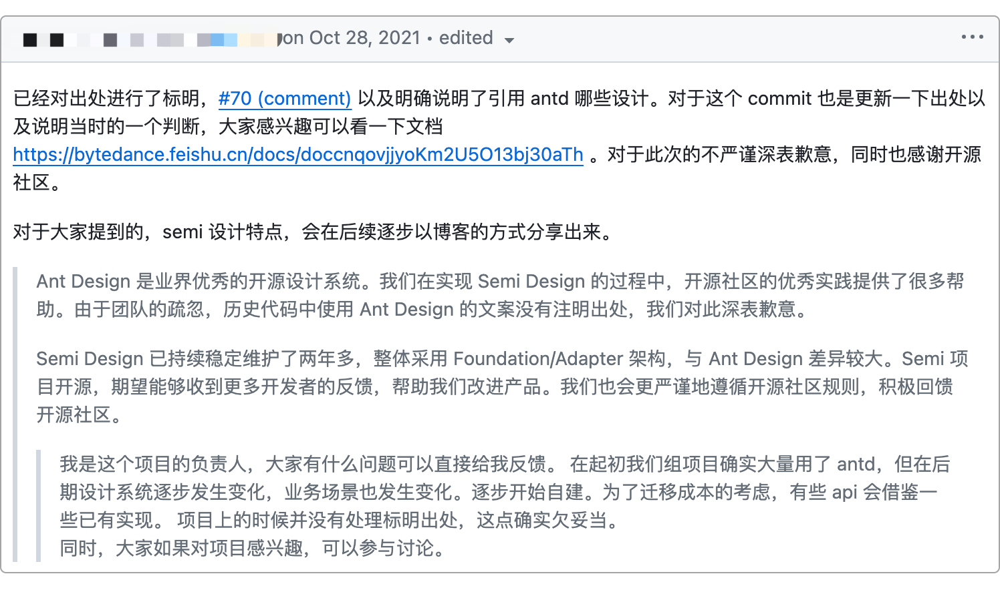

不过由于MIT本身极为宽松，所以即使发生些许“误会”，只要原作者不认真追究的话，基本上使用者公开发个致歉声明就问题不大。

有些使用者自作聪明，将原本应该附带在软件源代码中的MIT许可证以OSI官网链接的形式进行声明，这是使用可证的错误方式。MIT虽然是麻省理工学院发布，但其协议文本并不像其他许可证那样有自己的开源基金会或官方网站维护。自1998年OSI成立后，它便被“托管”在其官方网站中，如图18-12所示。

> 图18-12 MIT许可证协议文本

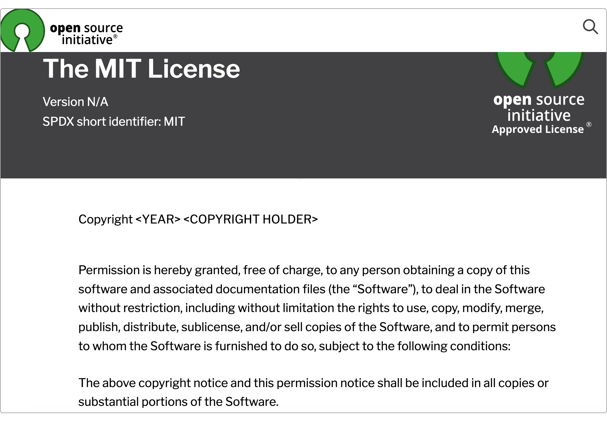

借助于OSI的推广和传播，MIT得到了广泛应用，但自由软件基金会FSF反对使用“MIT许可证”这一术语，因为OSI中托管的MIT协议实际上是MIT-0，而与MIT-0具有同等效力的还有Expat和X11许可证，如果用“MIT许可证”，那么就无法明确地区分这三者。不过，在一般情况下，大多数开源软件的源代码使用的都是OSI网站中的MIT许可证。

#### 18.2.8 Apache

说起Apache，在软件开发业界可谓是无人不知，但凡有一定软件开发经验的工程师，或多或少地知道或用过其旗下的诸多软件项目，如Tomcat、Flink、HBase、Kafka、Maven等中间件无一不是由Apache软件基金会（Apache Sofeware Foundation，ASF）孵化而出。作为业界翘楚，ASF自然也有其自身发布并维护的许可证，它被称之为Apache许可证。

最初的Apache v1.0许可证发布于1995年，之后又于2000年发布了Apache v1.1版，但这两个版本和早前的GPL v1.0和GPL v2.0并不兼容，不兼容的原因主要是Apache许可证包含了一些与GPL冲突的条款。具体来说，Apache v1.0和Apache v1.1版本要求在任何衍生作品的广告宣传中保留原始通知和许可声明。这意味着，如果任何一个开发者基于Apache v1.0或Apache v1.1许可证版本的开源代码创建了一个衍生作品并将其分发，那么就需要在作品的广告宣传中包含原始的Apache许可证通知和许可声明。相比之下，GPL则不要求在广告宣传中保留任何通知或声明。这种差异导致了Apache v1.0和Apache v1.1版本与GPL之间的不兼容性。

直到2004年Apache v2.0许可证发布之后，才和2007年发布的GPL v3.0许可证兼容。目前，Apache v2.0许可证已成为主流，既可以提供给ASF旗下的项目使用，也可以供非ASF软件使用，它的目标是促进开源软件的发展和创新，允许任何人自由使用软件（包括商业软件）而无需支付许可费用，提供一个灵活的许可，给予使用者最大程度的自由。

和MIT等许可证一样，Apache许可证其核心内容无非就两条：

1. 使用者必须在再次分发的源代码中保留之前的原始著作权、专利、商标和归属通知（也就是NOTICE等附带的原始说明文件），但衍生品可以不这么做；
2. 在每个修改过地方都要添加一条说明，告诉后来者到底改了哪里。

总的来说，GPL、LGPL、MPL、BSD、MIT和Apache等这几大常见且常用的开源协议个有自身特点，需要结合自身特点合理选用，既能有利于传播，又要能够合理地维护自身利益，对它们的总结如图18-13所示。

> 图18-13 MIT许可证协议文本

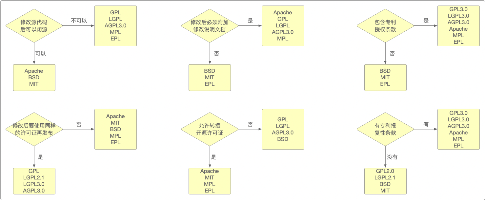

需要说明的是，大部分的许可证的最新版之间还是兼容的，仅有极小一部分会出现排斥性问题。因此，只要在了解之后作出合理规避，就可以放心大胆地使用各类开源软件。

### 18.3 本章小结

作为人类知识巅峰的创造物——计算机软件，自诞生伊使，就离不开合作与分享的精神，而这种合作与分享，也逐渐演变为了今时今日的开源文化。Unix出现以后，在金钱与利益的驱动下，商业软件蓬勃发展，但这个世界总有那么一些人，秉持着“自由”和“进步”的理念，坚守着心中的那份执着，理查德·斯托曼（Richard Stallman）就是这样一位具有传奇色彩的人物，他认为人们天生就应该可以自由使用各种软件，坚决反对研究成果的商业化。在他的倡议下，自由软件基金会（Free Software Foundation，FSF）诞生，并亲自操刀，为FSF旗下的GNU项目贡献出了四个至今仍在运行的免费软件工具：GNU Emacs、GNU GCC、GNU GDB和GNU Make。

从Unix的出现，到GNU项目的发起，Linux的问世，再一直到今天的Github开源社区，整个开源文化运动的发展经历了四个阶段，而伴随着这几个阶段的则是其同步出现的各类商业软件和自由软件的版权风潮。鉴于Copyright，自由软件也搞起了所谓的Copyleft。这是一个用于描述一系列开源许可证策略的术语，其核心理念是要确保软件能得以自由地使用、修改和重新分发。Copyleft通过在软件的派生作品中保留相同的开源许可证，将这种自由传递下去。这种方法的一个主要例子就是GNU通用公共许可证（GNU General Public License，GPL）。

除了自由软件基金会所发布和维护的GPL和LGPL外，还有由Mozilla基金会维护的MPL许可证，由OSI网站“托管”的MIT许可证、由Apache软件基金会维护的Apache许可证和由各个使用者自行维护的BSD等许可证。这些许可证的核心共同点就是需要遵守Copyleft精神，但其中又有一些差别，例如修改后是否可以闭源、是否针对衍生品等条款的不同。只有了解了这些不同的版权、许可证之间的不同，才能更好地融入开源文化之中。
